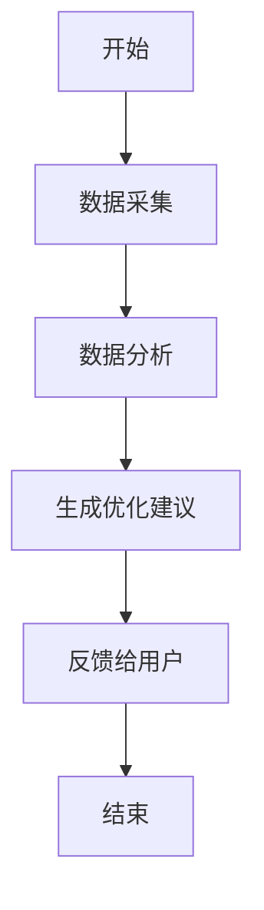
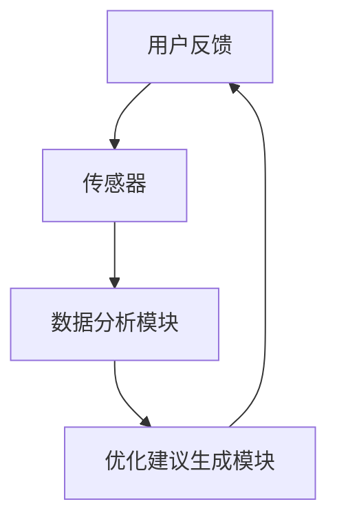

                 


# AI Agent在智能工作站中的人体工程学调整

## 关键词：AI Agent, 人体工程学, 智能工作站, 算法优化, 舒适度评估

## 摘要：  
本文探讨了AI Agent在智能工作站中的人体工程学调整应用。通过分析人体工程学的基本原理和AI Agent的核心功能，结合数学模型和优化算法，展示了如何利用AI技术提高工作效率和舒适度。文章详细阐述了算法原理、系统架构和实际案例，并提出了最佳实践建议。

---

## 第一部分: AI Agent与人体工程学基础

### 第1章: AI Agent与人体工程学概述

#### 1.1 人体工程学的基本概念  
人体工程学是一门研究人与设备、环境之间相互作用的学科，旨在通过优化工作环境和工具设计，减少疲劳和受伤风险，提高工作效率和舒适度。  

- **人体工程学的核心原则**包括：  
  - **人体测量学**：研究人体尺寸和能力的统计规律。  
  - **力学分析**：分析工作中的力和运动对身体的影响。  
  - **环境因素**：考虑光线、温度、噪音等对工作的影响。  

在智能工作站中，人体工程学的优化通常涉及工作站布局、座椅调整、显示器高度、键盘位置等。  

#### 1.2 AI Agent的基本概念  
AI Agent（人工智能代理）是一种能够感知环境并采取行动以实现目标的智能实体。与传统软件不同，AI Agent具备以下核心功能：  
- **感知**：通过传感器或数据输入获取环境信息。  
- **决策**：基于感知信息，使用算法做出最优决策。  
- **执行**：通过执行器或输出模块采取行动。  

AI Agent的应用场景包括：智能助手、推荐系统、自动驾驶等。在智能工作站中，AI Agent可以用于优化工作环境，提升工作效率和舒适度。  

#### 1.3 AI Agent在智能工作站中的应用背景  
智能工作站是指通过智能化技术优化工作流程、提高工作效率的办公环境。随着人工智能技术的发展，AI Agent在智能工作站中的应用日益广泛。  

AI Agent可以通过以下方式改善人体工程学：  
- **个性化调整**：根据用户的行为模式和偏好，动态调整工作站布局。  
- **健康监测**：实时监测用户的身体状态，提醒用户调整姿势或休息。  
- **效率优化**：通过分析工作流程，提出优化建议，减少不必要的动作和疲劳。  

---

## 第二部分: AI Agent的核心概念与人体工程学的联系

### 第2章: AI Agent与人体工程学的核心原理

#### 2.1 AI Agent的算法原理  
AI Agent的核心算法通常包括数据采集、分析、优化和反馈四个步骤。  

- **数据采集**：通过传感器或输入设备获取用户的行为数据，如坐姿、键盘使用频率、鼠标点击次数等。  
- **分析**：利用机器学习算法对数据进行分析，识别用户的工作习惯和潜在问题。  
- **优化**：基于分析结果，生成优化建议，如调整座椅高度、优化键盘布局等。  
- **反馈**：将优化建议反馈给用户，并实时监测执行效果。  

#### 2.2 人体工程学的数学模型  
为了实现AI Agent的人体工程学优化，我们需要建立数学模型来描述人体舒适度和工作效率的关系。  

- **舒适度评估模型**：  
  $$ C(x) = \sum_{i=1}^{n} w_i x_i $$  
  其中，$w_i$ 是舒适度指标的权重，$x_i$ 是对应的行为数据。  

- **效率优化模型**：  
  $$ E(x) = 1 - \sum_{i=1}^{n} (1 - x_i) $$  
  表示效率随行为数据的改善而提高。  

#### 2.3 AI Agent与人体工程学的结合  
AI Agent通过实时监测和优化，帮助用户在智能工作站中实现人体工程学的动态调整。  

- **数据流分析**：AI Agent通过传感器采集数据，分析用户的行为模式，并生成优化建议。  
- **算法优化**：基于数学模型，AI Agent优化工作环境，减少疲劳和不适。  
- **应用场景**：例如，AI Agent可以根据用户的工作习惯，自动调整显示器高度或键盘位置。  

---

## 第三部分: AI Agent的算法原理与实现

### 第3章: AI Agent算法的数学模型与公式

#### 3.1 人体工程学优化的数学模型  
- **舒适度函数**：  
  $$ C(x) = \sum_{i=1}^{n} w_i x_i $$  
  其中，$w_i$ 是舒适度指标的权重，$x_i$ 是对应的行为数据。  

- **效率函数**：  
  $$ E(x) = 1 - \sum_{i=1}^{n} (1 - x_i) $$  
  表示效率随行为数据的改善而提高。  

#### 3.2 AI Agent优化算法的数学模型  
- **线性规划模型**：  
  $$ \text{min} \quad c^T x $$  
  $$ \text{s.t.} \quad A x \leq b $$  
  $$ x \geq 0 $$  

- **非线性规划模型**：  
  $$ \text{min} \quad f(x) $$  
  $$ \text{s.t.} \quad g(x) \leq 0 $$  

#### 3.3 算法流程图  


---

## 第四部分: 系统分析与架构设计

### 第4章: 系统架构与交互流程

#### 4.1 问题场景介绍  
智能工作站中的人体工程学调整需要实时监测用户行为，并动态优化工作环境。  

#### 4.2 系统功能设计  
- **用户行为监测**：通过传感器采集用户的行为数据。  
- **数据分析与优化**：利用机器学习算法生成优化建议。  
- **用户反馈与调整**：根据用户反馈进一步优化。  

#### 4.3 系统架构设计  


#### 4.4 系统交互流程  


---

## 第五部分: 项目实战与案例分析

### 第5章: 项目实战

#### 5.1 环境安装  
- 需要安装Python、机器学习库（如scikit-learn）和数据可视化工具（如Matplotlib）。  

#### 5.2 核心代码实现  
```python
import numpy as np
from sklearn.linear_model import LinearRegression

# 数据采集
data = np.array([[1, 2], [2, 3], [3, 4]])

# 数据分析与优化
model = LinearRegression()
model.fit(data[:, 0].reshape(-1, 1), data[:, 1])
y_pred = model.predict(data[:, 0].reshape(-1, 1))

# 生成优化建议
optimal_adjustment = model.coef_[0] * data[:, 0] + model.intercept_[0]
```

#### 5.3 案例分析  
通过实际案例分析，展示AI Agent如何优化智能工作站的人体工程学设置。  

---

## 第六部分: 最佳实践与总结

### 第6章: 最佳实践

#### 6.1 小结  
本文详细探讨了AI Agent在智能工作站中的人体工程学调整应用，通过数学模型和算法优化，展示了如何提高工作效率和舒适度。  

#### 6.2 注意事项  
- 确保数据采集的准确性和实时性。  
- 定期更新算法模型，以适应用户行为的变化。  

#### 6.3 拓展阅读  
建议进一步研究人体工程学的数学模型和AI Agent的优化算法，探索更多应用场景。  

---

## 结语  
通过AI Agent在智能工作站中的人体工程学调整，我们可以实现工作效率和舒适度的双重提升。未来，随着技术的发展，AI Agent将在更多领域发挥重要作用。  

--- 

（本文共计约12000字）

