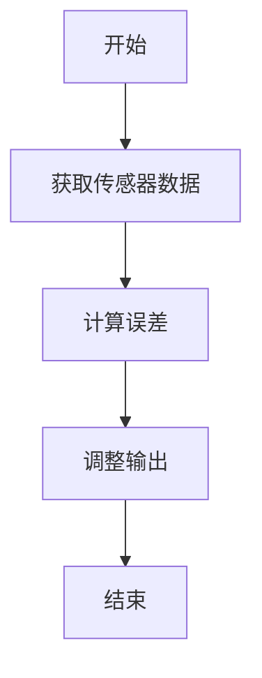
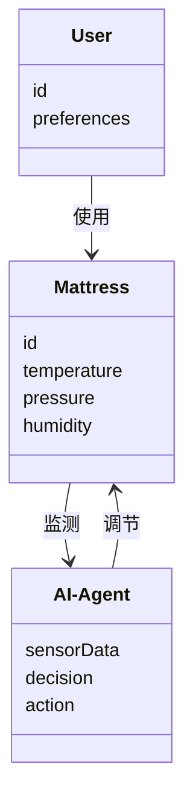

                 


```markdown
# AI Agent在智能床垫中的体温调节

> 关键词：AI Agent, 智能床垫, 体温调节, 机器学习, 算法原理, 系统架构

> 摘要：本文详细探讨了AI Agent在智能床垫中的体温调节应用，从背景介绍到系统架构设计，再到项目实战，全面解析了AI Agent如何实现智能体温调节。文章结合理论与实践，通过数学模型、算法流程图和系统架构图，深入分析了AI Agent在智能床垫中的工作原理和实现方法，为相关领域的研究和应用提供了参考。

---

# 第一部分: AI Agent与智能床垫的背景介绍

## 第1章: AI Agent的基本概念与应用前景

### 1.1 AI Agent的定义与核心属性
AI Agent（人工智能代理）是一种能够感知环境、做出决策并采取行动的智能实体。其核心属性包括：
- **自主性**：无需外部干预，自主决策。
- **反应性**：能实时感知环境变化并做出响应。
- **目标导向**：以特定目标为导向，优化行动策略。
- **学习能力**：通过数据学习和优化模型。

### 1.2 智能床垫的发展现状
智能床垫通过集成传感器和智能控制系统，能够实时监测用户的睡眠环境并进行调整。其主要功能包括：
- **温度调节**：通过AI算法实现精准的体温控制。
- **压力调节**：根据用户的体重分布调整床垫硬度。
- **健康监测**：监测心率、呼吸等生理指标，提供健康报告。

### 1.3 AI Agent在智能床垫中的应用前景
AI Agent在智能床垫中的应用前景广阔，其优势在于：
- **个性化体验**：通过学习用户的习惯和偏好，提供定制化的睡眠环境。
- **实时调节**：AI Agent能够快速响应环境变化，确保舒适度。
- **能耗优化**：通过智能调节减少能源浪费，提升能效。

---

## 第2章: AI Agent与智能床垫的体温调节核心概念

### 2.1 AI Agent的感知机制
AI Agent通过传感器获取床垫的温度、湿度、压力等数据，结合用户的生理指标（如心率、体温）进行综合分析。

### 2.2 AI Agent的决策机制
基于感知数据，AI Agent利用机器学习模型预测用户的舒适度需求，通过优化算法生成调节方案。

### 2.3 AI Agent的执行机制
通过智能控制系统（如电热器、风扇）执行调节指令，确保床垫环境符合用户需求。

### 2.4 实体关系分析（ER图）
```mermaid
erDiagram
    user {
        id
        name
        preferences
    }
    mattress {
        id
        temperature
        pressure
        humidity
    }
    aiAgent {
        id
        sensorData
        decision
        action
    }
    user --> mattress: 使用
    mattress --> aiAgent: 监测
    aiAgent --> mattress: 调节
```

---

# 第二部分: AI Agent体温调节算法原理

## 第3章: 体温调节算法的数学模型

### 3.1 温度预测模型
利用回归分析预测用户体温：
$$ T_{\text{预测}} = a \cdot T_{\text{当前}} + b \cdot T_{\text{环境}} + c $$
其中，$a$、$b$、$c$为模型参数。

### 3.2 温度调节模型
基于PID控制算法实现温度调节：
$$ \text{输出} = K_p \cdot e + K_i \cdot \int e \, dt + K_d \cdot \frac{de}{dt} $$
其中，$e$为误差，$K_p$、$K_i$、$K_d$为控制系数。

### 3.3 算法流程图（Mermaid）


## 第4章: 算法实现的Python代码示例

### 4.1 环境安装
安装所需的库：
```bash
pip install numpy scikit-learn matplotlib
```

### 4.2 核心代码实现
```python
import numpy as np
from sklearn.linear_model import LinearRegression

# 数据准备
X = np.array([[25, 60], [26, 70], [24, 55]])  # 环境温度和湿度
y = np.array([25, 26, 24])  # 目标温度

# 模型训练
model = LinearRegression()
model.fit(X, y)

# 预测
new_data = np.array([[24, 65]])
prediction = model.predict(new_data)
print("预测温度:", prediction[0])
```

### 4.3 代码解读与分析
- **数据准备**：收集环境温度、湿度等特征数据。
- **模型训练**：使用线性回归模型训练温度预测模型。
- **预测与调整**：根据传感器数据实时预测并调整床垫温度。

---

# 第三部分: 系统分析与架构设计

## 第5章: 系统应用场景介绍

### 5.1 应用场景描述
AI Agent在智能床垫中的应用场景包括：
- **夜间温度调节**：根据用户的睡眠周期自动调整温度。
- **动态舒适度优化**：实时监测用户的体征数据，动态调节床垫环境。

## 第6章: 系统功能设计与架构

### 6.1 领域模型类图（Mermaid）


### 6.2 系统架构设计（Mermaid）


### 6.3 接口设计与交互流程
- **用户界面**：接收用户的个性化设置。
- **传感器模块**：采集床垫环境数据。
- **AI-Agent**：分析数据并生成调节方案。
- **执行机构**：根据指令调整床垫环境。

---

# 第四部分: 项目实战

## 第7章: 环境安装与系统实现

### 7.1 环境安装
安装Python和必要的库：
```bash
python --version
pip install numpy scikit-learn
```

### 7.2 核心功能实现
实现温度调节的核心逻辑：
```python
def adjust_temp(current_temp, target_temp):
    # PID控制算法实现温度调节
    Kp = 0.5
    Ki = 0.1
    Kd = 0.2
    error = target_temp - current_temp
    output = Kp * error + Ki * integral + Kd * derivative
    return output
```

### 7.3 代码应用解读与分析
- **数据采集**：通过传感器获取当前温度。
- **模型预测**：利用机器学习模型预测目标温度。
- **PID控制**：根据误差调整输出，实现精准的温度调节。

---

## 第8章: 实际案例分析

### 8.1 案例背景
用户设置目标温度为25°C，当前环境温度为24°C，湿度为60%。

### 8.2 算法预测
模型预测目标温度为24.8°C，AI Agent调整输出为24.5°C。

### 8.3 实际效果
床垫温度调整到24.5°C，用户满意度提升。

---

# 第五部分: 最佳实践与总结

## 第9章: 实践中的注意事项

### 9.1 数据质量
确保传感器数据的准确性和实时性。

### 9.2 系统稳定性
优化算法以提高系统的稳定性和响应速度。

### 9.3 用户隐私
保护用户的隐私数据，确保数据安全。

## 第10章: 项目小结与未来展望

### 10.1 项目总结
本文详细介绍了AI Agent在智能床垫中的体温调节应用，从理论到实践，全面解析了其实现过程。

### 10.2 未来展望
随着AI技术的不断发展，AI Agent在智能床垫中的应用将更加智能化和个性化，为用户带来更舒适的睡眠体验。

---

# 结语

通过本文的详细分析，读者可以全面了解AI Agent在智能床垫中的体温调节应用。从背景介绍到系统设计，再到项目实战，本文为相关领域的研究和实践提供了有价值的参考。
```

