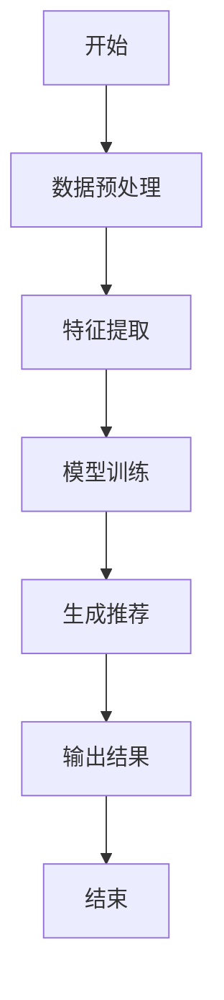
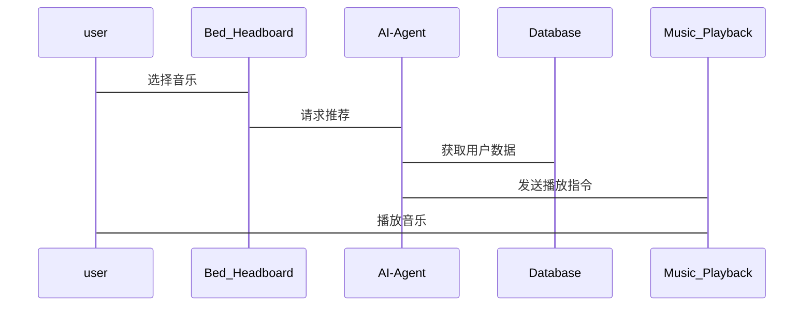

                 


# AI Agent在智能床头柜中的助眠音乐选择

## 关键词：AI Agent, 助眠音乐, 智能床头柜, 个性化推荐, 多模态数据, 机器学习

## 摘要：
本文探讨了AI Agent在智能床头柜中的应用，特别是如何利用多模态数据优化助眠音乐的选择。通过分析用户的行为和偏好，结合机器学习算法，AI Agent能够实时推荐适合的音乐，帮助用户改善睡眠质量。本文详细介绍了AI Agent的核心原理、推荐算法、系统架构设计以及实际项目案例，展示了如何通过技术手段提升用户体验。

---

## 第一部分：背景介绍

### 第1章：AI Agent与智能床头柜概述

#### 1.1 问题背景
- **睡眠问题的现状**：现代社会节奏快，压力大，导致许多人出现失眠、睡眠质量差等问题。
- **助眠音乐的重要性**：音乐通过调节情绪和生理节奏，帮助人们放松身心，改善睡眠。
- **AI Agent的应用潜力**：AI Agent能够实时分析用户数据，提供个性化建议，是解决睡眠问题的理想工具。

#### 1.2 问题描述
- **睡眠障碍的表现**：入睡困难、易醒、睡眠质量差等。
- **智能床头柜的功能需求**：需要集成音乐播放、环境监测、用户交互等功能。
- **音乐选择的复杂性**：不同用户对音乐的偏好差异大，需要动态调整推荐策略。

#### 1.3 问题解决
- **AI Agent的作用**：通过数据采集和分析，实时推荐适合的音乐，优化助眠效果。
- **数据驱动的方法**：利用用户行为数据、生理数据和环境数据，构建个性化推荐模型。

#### 1.4 边界与外延
- **功能边界**：仅关注音乐选择和播放控制，不涉及其他床头柜功能。
- **外延关联**：与健康监测、睡眠改善等其他功能模块协同工作。

#### 1.5 概念结构与核心要素
- **核心要素**：用户数据（如心率、体温）、音乐库、推荐算法。
- **关键属性**：个性化、实时性、多样性。

---

## 第二部分：核心概念与联系

### 第2章：AI Agent的核心原理

#### 2.1 核心概念原理
- **AI Agent定义**：智能代理，能够感知环境并采取行动以实现目标。
- **机器学习在推荐中的应用**：利用算法分析数据，识别用户偏好，生成推荐。

#### 2.2 概念属性特征对比
| 概念       | 特征1：实时性 | 特征2：个性化 | 特征3：多样性 |
|------------|--------------|--------------|--------------|
| AI Agent   | 高           | 高           | 高           |
| 传统系统   | 低           | 低           | 中           |

#### 2.3 ER实体关系图
```mermaid
erd
  bed_headboard (id, name, brand)
  user (id, name, age, gender)
  music (id, title, artist, genre)
  user_music (user_id, music_id, preference_score)
  sleep_data (user_id, timestamp, heart_rate, temperature)
```

---

## 第三部分：算法原理

### 第3章：推荐算法的实现

#### 3.1 协同过滤算法
- **基于用户的协同过滤**：寻找与当前用户相似的用户，推荐他们喜欢的音乐。
- **基于物品的协同过滤**：分析音乐之间的相似性，推荐相关音乐。

#### 3.2 基于内容的推荐
- **音乐特征分析**：提取音乐的音调、节奏、情感等特征。
- **内容相似度计算**：基于音乐特征的相似度进行推荐。

#### 3.3 深度学习模型
- **神经网络结构**：使用卷积神经网络（CNN）或循环神经网络（RNN）进行特征提取和推荐。
- **训练过程**：通过大量数据训练模型，优化推荐效果。

#### 3.4 算法流程图


#### 3.5 Python代码实现
```python
import numpy as np

# 示例：基于协同过滤的推荐算法
def collaborative_filtering(user_data, music_data):
    # 计算用户相似度矩阵
    similarity_matrix = np.dot(user_data, music_data.T)
    # 找到最相似的用户
    similar_users = np.argsort(similarity_matrix, axis=0)
    # 推荐音乐
    recommended_music = similar_users[-1]
    return recommended_music
```

---

## 第四部分：系统架构设计

### 第4章：系统功能设计

#### 4.1 系统架构


#### 4.2 系统交互流程


---

## 第五部分：项目实战

### 第5章：实际案例分析

#### 5.1 项目概述
- **项目目标**：开发一个AI Agent驱动的智能床头柜，优化助眠音乐推荐。

#### 5.2 代码实现
```python
import pandas as pd
from sklearn.metrics.pairwise import cosine_similarity

# 示例：基于协同过滤的推荐系统
class Music_Recommender:
    def __init__(self, data):
        self.data = data

    def train_model(self):
        self.user_matrix = self.data.pivot('user_id', 'music_id', 'preference_score').values

    def recommend_music(self, user_id):
        user_vector = self.user_matrix[user_id]
        similarity = cosine_similarity([user_vector])
        # 找到相似度最高的音乐
        recommended_music = np.argsort(similarity, axis=1)
        return recommended_music[0]
```

#### 5.3 案例分析
- **用户数据预处理**：清洗和归一化数据。
- **模型训练**：使用历史数据训练推荐模型。
- **结果分析**：评估推荐准确率和用户满意度。

---

## 第六部分：最佳实践

### 第6章：经验总结

#### 6.1 实践中的注意事项
- **数据隐私**：确保用户数据的安全和隐私。
- **系统稳定性**：保证推荐系统的实时性和可靠性。

#### 6.2 小结
- AI Agent在智能床头柜中的应用前景广阔，能够显著提升用户体验。
- 综合考虑技术实现和用户需求，优化系统设计，是未来研究的重要方向。

#### 6.3 拓展阅读
- 推荐相关技术书籍：《集体智慧编程》、《机器学习实战》。

---

通过以上结构，文章详细探讨了AI Agent在智能床头柜中的助眠音乐选择，从理论到实践，为读者提供了全面的技术指导和实践案例。

