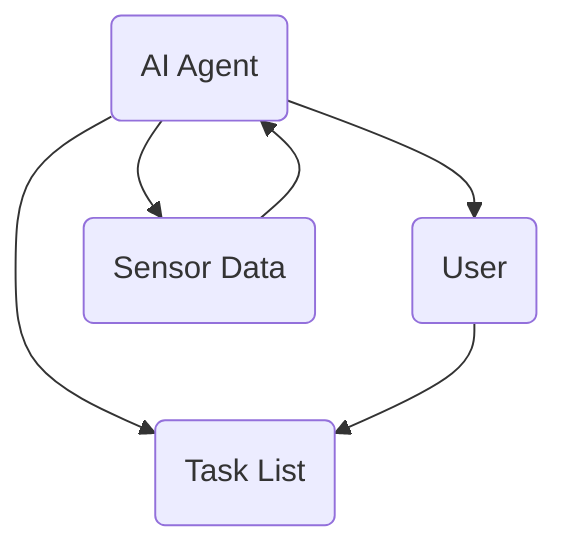

                 


# AI Agent在智能床头柜中的晨间仪式规划

> 关键词：AI Agent, 智能床头柜, 晨间仪式, 算法原理, 系统架构, 项目实战

> 摘要：本文探讨了AI Agent在智能床头柜中的应用，重点分析了晨间仪式规划的核心原理、算法实现、系统架构以及实际项目中的应用。通过详细讲解AI Agent的感知、决策与执行机制，结合具体案例，展示了如何通过技术手段优化用户的晨间体验。

---

## 第一部分：背景介绍

### 第1章：AI Agent与智能床头柜概述

#### 1.1 AI Agent的基本概念
- **什么是AI Agent**  
  AI Agent（人工智能代理）是一种能够感知环境、做出决策并执行动作的智能实体。它通过传感器获取信息，利用算法处理数据，并通过执行器与环境交互。
  
- **AI Agent的核心特征**  
  - 自主性：能够在没有外部干预的情况下运行。  
  - 反应性：能够实时感知环境并做出反应。  
  - 目标导向：基于预设目标进行决策和行动。  

- **AI Agent的应用场景**  
  AI Agent广泛应用于自动驾驶、智能助手、智能家居等领域。本文聚焦于AI Agent在智能床头柜中的应用。

#### 1.2 智能床头柜的现状与发展趋势
- **智能床头柜的功能特点**  
  智能床头柜是一种集成多种智能功能的家具，能够通过物联网技术与用户交互，并连接其他智能家居设备。它通常配备传感器、麦克风、显示屏和执行器。

- **晨间仪式规划的需求分析**  
  晨间仪式是指用户起床后的一系列固定行为，例如关灯、开窗、播放音乐、开启咖啡机等。通过AI Agent的规划，可以实现这些行为的自动化，提升用户体验。

- **AI Agent在智能床头柜中的作用**  
  AI Agent通过分析用户的习惯和偏好，优化晨间仪式的执行流程，例如根据天气调整室温，根据用户的起床时间提前准备早餐等。

#### 1.3 晨间仪式规划的重要性
- **晨间仪式的定义与目标**  
  晨间仪式是指从起床到出门前的所有活动，其目标是让用户以最佳状态开始新的一天。

- **AI Agent在晨间仪式中的作用**  
  AI Agent能够通过学习用户的习惯，自动规划和执行晨间仪式，减少用户的负担。

- **晨间仪式规划的边界与外延**  
  晨间仪式规划的边界通常在起床后的一个小时以内，外延则可能扩展到用户的健康监测、日程安排等领域。

---

## 第二部分：核心概念与联系

### 第2章：AI Agent的核心原理

#### 2.1 AI Agent的感知、决策与执行
- **感知模块**  
  感知模块通过传感器获取环境数据，例如光照强度、温度、湿度等。  
  ```mermaid
  graph TD
      Sensor[传感器] --> Perception[感知模块]
  ```

- **决策模块**  
  决策模块基于感知数据和预设规则生成决策。  
  - 基于规则的决策：例如，如果时间在7:00-8:00，且用户习惯起床，则执行晨间仪式。  
  - 基于模型的决策：例如，使用强化学习模型优化决策流程。  

- **执行模块**  
  执行模块通过执行器将决策转化为具体动作，例如开启咖啡机或调节室温。  

#### 2.2 AI Agent的特征对比
- **基于规则的AI Agent与基于模型的AI Agent对比**  
  | 特性         | 基于规则的AI Agent | 基于模型的AI Agent |
  |--------------|---------------------|---------------------|
  | 决策方式     | 预设规则           | 学习模型           |
  | 灵活性       | 较低               | 较高               |
  | 适用场景     | 简单场景           | 复杂场景           |

- **单智能体与多智能体系统**  
  单智能体系统适用于简单的场景，而多智能体系统能够处理复杂的任务，例如协调多个智能家居设备的协同工作。

- **强化学习与监督学习的区别**  
  - 强化学习：通过试错学习，基于奖励机制优化决策。  
  - 监督学习：基于标注数据进行训练，适用于分类、回归等任务。  

#### 2.3 AI Agent的ER实体关系图


---

## 第三部分：算法原理讲解

### 第3章：AI Agent的算法实现

#### 3.1 状态空间搜索算法
- **宽度优先搜索（BFS）**  
  BFS是一种用于探索状态空间的算法，适用于找到最短路径的问题。  
  ```mermaid
  graph TD
      Start --> IsGoal
      Start --> Queue
      Queue --> Dequeue
      Dequeue --> ForEachNeighbor
      ForEachNeighbor --> Enqueue
  ```

- **深度优先搜索（DFS）**  
  DFS是一种用于遍历树或图的算法，适用于发现路径的问题。  
  ```mermaid
  graph TD
      Start --> IsGoal
      Start --> VisitChildren
      VisitChildren --> VisitChild1
      VisitChild1 --> IsGoal
  ```

- **A*算法**  
  A*算法是一种基于启发式搜索的算法，适用于复杂的路径规划问题。  
  ```mermaid
  graph TD
      Start --> IsGoal
      Start --> Priority Queue
      Priority Queue --> Dequeue
      Dequeue --> ForEachNeighbor
      ForEachNeighbor --> Enqueue
  ```

#### 3.2 强化学习算法
- **Q-learning算法**  
  Q-learning是一种基于值函数的强化学习算法，适用于离散动作空间的问题。  
  ```mermaid
  graph TD
      State --> Action
      Action --> Next State
      Next State --> Reward
      Reward --> Update Q-Table
  ```

- **策略梯度（Policy Gradient）**  
  策略梯度是一种基于策略直接优化的算法，适用于连续动作空间的问题。  
  ```mermaid
  graph TD
      Policy --> Action
      Action --> Next State
      Next State --> Reward
      Reward --> Update Policy
  ```

#### 3.3 算法实现的Python代码示例
```python
import heapq

# A*算法示例
def a_star_search(graph, start, goal):
    open_list = []
    heapq.heappush(open_list, (0, start))
    g_score = {start: 0}
    f_score = {start: 0}
    visited = set()

    while open_list:
        current = heapq.heappop(open_list)
        if current[1] == goal:
            return current[0]
        visited.add(current[1])
        for neighbor, cost in graph[current[1]]:
            tentative_g_score = g_score.get(current[1], 0) + cost
            if neighbor not in g_score or tentative_g_score < g_score[neighbor]:
                g_score[neighbor] = tentative_g_score
                f_score[neighbor] = g_score[neighbor] + heuristic(neighbor, goal)
                heapq.heappush(open_list, (f_score[neighbor], neighbor))
    return None

def heuristic(a, b):
    return abs(a - b)
```

---

## 第四部分：系统分析与架构设计方案

### 第4章：智能床头柜系统架构设计

#### 4.1 问题场景介绍
- 智能床头柜需要协调多个智能家居设备，例如智能灯泡、咖啡机、空调等，完成用户的晨间仪式。

#### 4.2 系统功能设计
- **领域模型**  
  ```mermaid
  classDiagram
      class User {
          id
          preferences
          wake_up_time
      }
      class Sensor {
          temperature
          humidity
          light
      }
      class Task {
          id
          name
          status
      }
      User --> Sensor
      User --> Task
  ```

- **系统架构**  
  ```mermaid
  graph TD
      Agent[A

