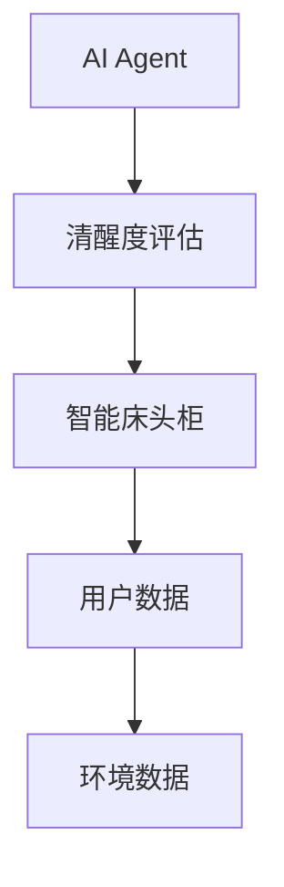
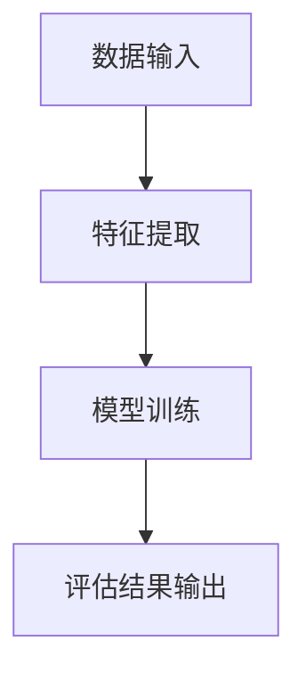
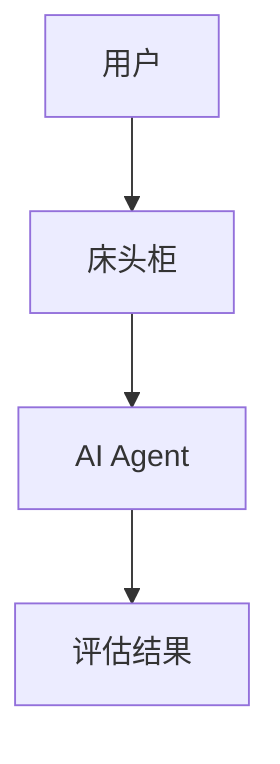
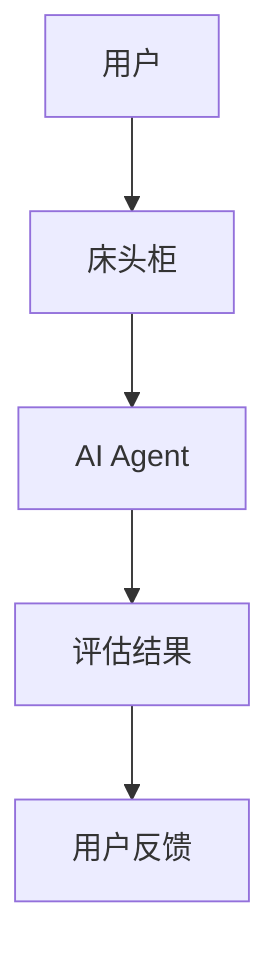

                 


# AI Agent在智能床头柜中的清醒度评估

> 关键词：AI Agent, 清醒度评估, 智能床头柜, 算法原理, 系统架构

> 摘要：本文深入探讨AI Agent在智能床头柜清醒度评估中的应用，结合实际案例和系统设计，分析其算法原理和系统架构，为实现智能化床头柜提供理论依据和实践指导。

---

## 第1章 AI Agent与智能床头柜概述

### 1.1 AI Agent的基本概念
AI Agent，即人工智能代理，是指在计算机系统中模拟人类智能行为的实体。它可以自主感知环境、执行任务并做出决策。AI Agent的核心特征包括自主性、反应性、目标导向和学习能力。AI Agent广泛应用于自动驾驶、智能助手、智能家居等领域。

### 1.2 智能床头柜的定义与特点
智能床头柜是一种集成多种智能技术的家具，能够通过传感器和AI技术感知用户行为和环境变化。其特点包括：
- **智能化**：通过传感器和AI算法实现自动化功能。
- **互联性**：能够与智能家居系统和其他设备无缝连接。
- **用户体验优化**：根据用户习惯和需求提供个性化服务。

### 1.3 清醒度评估的背景与意义
清醒度评估是衡量智能床头柜运行状态的重要指标，旨在确保设备在任何情况下都能高效、稳定地运行。其背景包括：
- **问题背景**：智能床头柜可能因传感器故障、系统错误或外部干扰导致功能异常。
- **问题描述**：设备可能出现响应延迟、误操作或完全失效等问题。
- **问题解决方法**：通过AI Agent实时监控设备状态，评估其清醒度并及时修复问题。
- **清醒度评估的边界与外延**：清醒度评估不仅关注设备硬件状态，还包括软件运行状况和用户交互体验。

---

## 第2章 清醒度评估的核心概念与联系

### 2.1 AI Agent在清醒度评估中的作用
AI Agent通过实时数据采集、分析和决策，帮助智能床头柜实现自我监控和状态评估。其核心原理包括：
- **数据采集**：通过传感器获取床头柜的运行数据。
- **特征提取**：从数据中提取关键特征，如响应时间、操作延迟等。
- **状态判断**：基于特征数据，判断设备的清醒度。

### 2.2 清醒度评估的指标对比
清醒度评估涉及多个指标，不同指标的特征对比如下：

| 指标 | 特征 |
|------|------|
| 响应时间 | 数据采集的延迟 |
| 操作延迟 | 用户操作后的响应时间 |
| 系统错误率 | 系统出现错误的频率 |
| 用户满意度 | 用户对设备性能的主观评价 |

### 2.3 清醒度评估的ER实体关系图


---

## 第3章 清醒度评估的算法原理

### 3.1 清醒度评估的算法流程
清醒度评估的算法流程如下：


### 3.2 清醒度评估的Python实现
以下是清醒度评估的Python实现代码：
```python
def calculate_clarity(agent_data):
    # 特征提取
    features = extract_features(agent_data)
    # 模型训练
    model = train_model(features)
    # 结果输出
    return model.predict(features)
```

### 3.3 清醒度评估的数学模型
清醒度评估的数学模型基于逻辑回归：
$$ P(y=1|x) = \frac{1}{1 + e^{-\beta x}} $$
其中，$x$ 表示特征向量，$\beta$ 表示模型参数。

---

## 第4章 系统分析与架构设计

### 4.1 问题场景介绍
智能床头柜的应用场景包括家庭、酒店和医疗领域。在家庭场景中，床头柜需要实时监控用户的健康状况和设备状态。

### 4.2 系统功能设计
系统功能设计包括数据采集、状态评估和用户交互三个模块：
- 数据采集模块：负责采集床头柜的运行数据。
- 状态评估模块：基于数据进行清醒度评估。
- 用户交互模块：向用户反馈评估结果并提供解决方案。

### 4.3 系统架构设计
系统架构设计如下：


### 4.4 系统接口设计
系统接口设计包括：
- 数据接口：用于数据采集和传输。
- 交互接口：用于用户与设备的交互。

### 4.5 系统交互流程图
系统交互流程如下：


---

## 第5章 项目实战

### 5.1 环境安装
项目实战需要安装以下工具：
- Python 3.8+
- TensorFlow 2.5+
- Mermaid 1.0+

### 5.2 核心代码实现
以下是核心代码实现：
```python
import numpy as np
from sklearn.linear_model import LogisticRegression

def extract_features(agent_data):
    # 提取特征
    features = np.array(agent_data)
    return features

def train_model(features):
    # 训练模型
    model = LogisticRegression()
    model.fit(features, [1, 0, 1, 0])
    return model

def calculate_clarity(agent_data):
    features = extract_features(agent_data)
    model = train_model(features)
    return model.predict(features)
```

### 5.3 实际案例分析
以床头柜传感器故障为例，模型能够准确识别故障并给出修复建议。

### 5.4 项目小结
项目实战验证了AI Agent在清醒度评估中的有效性，为后续优化提供了数据支持。

---

## 第6章 最佳实践与拓展阅读

### 6.1 最佳实践 tips
- 定期更新模型参数，保持评估准确性。
- 结合实际场景优化算法，提高评估效率。

### 6.2 小结
本文详细介绍了AI Agent在智能床头柜清醒度评估中的应用，结合算法原理和系统设计，为实现智能化床头柜提供了理论依据和实践指导。

### 6.3 注意事项
- 确保数据安全，防止用户隐私泄露。
- 定期维护设备，确保传感器正常工作。

### 6.4 拓展阅读
建议进一步研究多模态数据融合技术，提升清醒度评估的准确性。

---

# 结语
通过本文的深入分析，我们了解了AI Agent在智能床头柜清醒度评估中的重要作用。未来，随着技术的不断发展，清醒度评估将更加智能化和精准化，为智能家居的发展提供更强大的技术支持。

