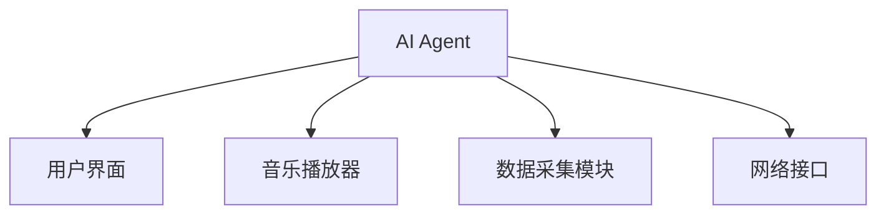

                 


# AI Agent在智能床头柜中的睡眠音乐定制

> 关键词：AI Agent, 智能床头柜, 睡眠音乐, 推荐算法, 系统架构

> 摘要：本文探讨了AI Agent在智能床头柜中的应用，特别是在睡眠音乐定制方面。通过分析睡眠问题的现状，介绍了AI Agent的基本原理及其在智能床头柜中的作用。详细讲解了基于协同过滤和内容推荐的混合算法，设计了系统的架构，并通过项目实战展示了实现过程。最后，总结了最佳实践和未来发展方向。

---

## 第一部分：背景介绍

### 第1章：问题背景与需求分析

#### 1.1 睡眠问题的现状与挑战

睡眠障碍已成为全球性问题，影响人们的生活质量。根据世界卫生组织的数据，全球约有10%的人口受睡眠障碍困扰。传统的解决方法如药物治疗和心理咨询虽然有效，但存在副作用和依赖性问题。因此，寻找一种非侵入性的解决方案变得尤为重要。

#### 1.2 智能床头柜的功能需求

智能床头柜作为智能家居的一部分，具备多种功能，如环境监测、音乐播放和健康数据采集。睡眠音乐定制是其核心功能之一，旨在通过个性化音乐推荐帮助用户改善睡眠质量。

#### 1.3 AI Agent在睡眠音乐定制中的作用

AI Agent是一种智能代理，能够根据用户的行为和数据实时调整系统响应。在智能床头柜中，AI Agent负责收集用户的睡眠数据，分析偏好，并推荐合适的睡眠音乐，从而优化用户的睡眠体验。

---

## 第二部分：核心概念与技术原理

### 第2章：AI Agent与智能床头柜的核心概念

#### 2.1 AI Agent的基本原理

AI Agent通过感知环境、分析数据并采取行动来实现目标。其核心功能包括数据采集、决策制定和系统控制。与传统软件相比，AI Agent能够主动适应用户需求，提供个性化的服务。

#### 2.2 智能床头柜的功能架构

智能床头柜的硬件包括传感器、音乐播放器和网络模块，软件则负责数据处理和用户界面设计。AI Agent在其中扮演中枢角色，协调各部分的工作，确保系统高效运行。

#### 2.3 睡眠音乐定制的核心要素

睡眠音乐的类型、节奏和音调直接影响其效果。AI Agent需要分析用户的生理数据和音乐偏好，推荐适合的音乐，以促进深度睡眠。

---

## 第三部分：算法原理与实现

### 第3章：基于AI Agent的睡眠音乐推荐算法

#### 3.1 睡眠音乐推荐的基本原理

推荐算法通过分析用户数据，预测用户的喜好，从而推荐相关内容。在智能床头柜中，AI Agent使用协同过滤和内容推荐的混合算法，确保推荐的准确性和多样性。

#### 3.2 协同过滤算法

协同过滤通过寻找与用户行为相似的其他用户，推荐他们喜欢的音乐。基于用户的协同过滤（UBCF）和基于物品的协同过滤（IBCF）各有优缺点，通常结合使用以提高推荐效果。

#### 3.3 基于内容的推荐算法

内容推荐分析音乐的特征，如节奏和音调，推荐与用户偏好相似的音乐。这种方法能够捕捉音乐的深层属性，提供更精准的推荐。

#### 3.4 混合推荐算法

混合推荐结合协同过滤和内容推荐，利用两者的优势，提升推荐的准确性和多样性。通过加权融合两种方法的结果，AI Agent能够提供更个性化的睡眠音乐推荐。

---

## 第四部分：系统架构设计

### 第4章：智能床头柜的系统架构

#### 4.1 系统功能设计

智能床头柜的系统功能包括数据采集、音乐播放和用户界面设计。AI Agent负责协调各功能模块，确保系统的高效运行。

#### 4.2 系统架构图

以下是智能床头柜的系统架构图：



该架构图展示了AI Agent如何与系统各部分交互，实现睡眠音乐的定制和播放。

#### 4.3 接口设计与交互流程

系统接口设计包括用户输入接口、音乐播放接口和数据采集接口。交互流程从用户请求开始，经过数据处理和音乐推荐，最终实现音乐播放。

---

## 第五部分：项目实战

### 第5章：AI Agent在智能床头柜中的实现

#### 5.1 环境搭建

项目需要安装Python、TensorFlow和Flask框架。环境搭建步骤包括安装依赖库和配置开发环境。

#### 5.2 核心实现代码

以下是AI Agent的核心推荐算法代码：

```python
import numpy as np
from sklearn.metrics.pairwise import cosine_similarity

# 协同过滤算法
def collaborative_filtering(user_data):
    # 计算用户相似度矩阵
    user_similarity = cosine_similarity(user_data)
    # 预测用户评分
    predicted_ratings = np.dot(user_similarity, user_data)
    return predicted_ratings

# 内容推荐算法
def content_based_recommendation(item_features):
    # 计算音乐相似度
    item_similarity = cosine_similarity(item_features)
    # 预测音乐推荐
    recommendations = np.dot(item_similarity, item_features)
    return recommendations
```

#### 5.3 项目实现与案例分析

通过实际案例分析，展示AI Agent如何根据用户的睡眠数据推荐音乐。案例包括数据采集、算法选择和结果分析。

---

## 第六部分：最佳实践

### 第6章：总结与展望

#### 6.1 小结

本文详细介绍了AI Agent在智能床头柜中的应用，探讨了睡眠音乐定制的核心算法和系统架构设计。通过项目实战，展示了如何实现个性化的睡眠音乐推荐。

#### 6.2 注意事项

在实际应用中，需注意数据隐私和算法优化问题。确保用户数据的安全性，同时不断优化推荐算法，提高用户体验。

#### 6.3 拓展阅读

建议读者进一步阅读关于推荐系统和AI Agent的相关文献，深入了解其在智能家居中的其他应用。

---

通过以上步骤，本文系统地探讨了AI Agent在智能床头柜中的睡眠音乐定制，从理论到实践，为读者提供了全面的指导和参考。

