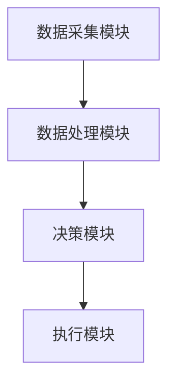
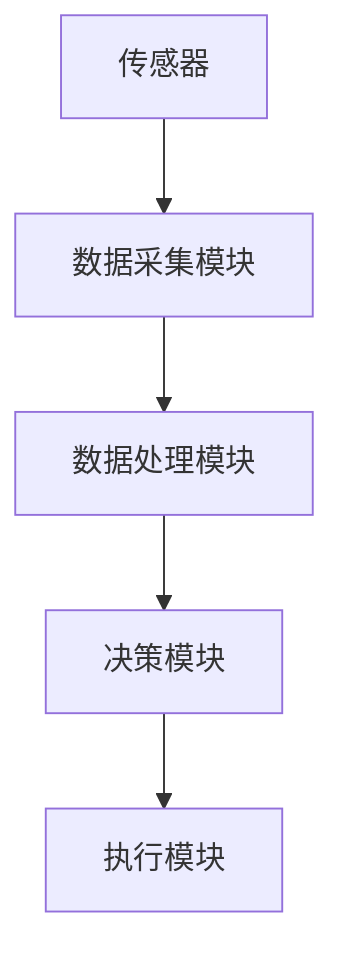
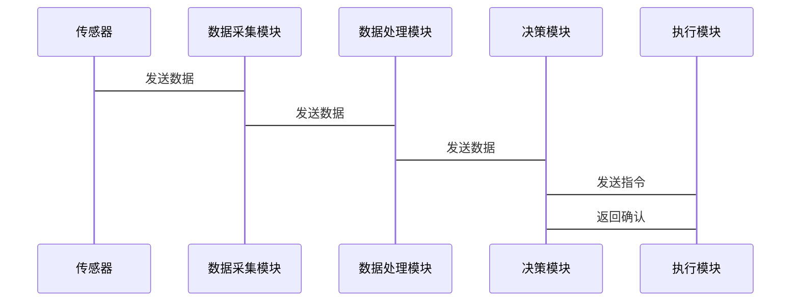

                 


# AI Agent在智能建筑管理中的应用

> 关键词：AI Agent，智能建筑，建筑管理，强化学习，监督学习，无监督学习

> 摘要：随着智能建筑的普及，传统的建筑管理模式已经难以应对日益复杂的管理需求。AI Agent（人工智能代理）作为一种智能化的解决方案，正在逐步应用于建筑管理领域。本文将详细介绍AI Agent在智能建筑管理中的应用背景、核心概念、算法原理、系统设计以及实际应用案例，帮助读者全面理解AI Agent在智能建筑管理中的重要作用和实现方式。

---

# 第1章: AI Agent与智能建筑管理的背景介绍

## 1.1 问题背景

### 1.1.1 智能建筑的定义与特点
智能建筑是指通过物联网（IoT）、大数据分析、人工智能（AI）等技术，将建筑内的设备、系统和资源进行智能化管理的建筑。其特点包括：
- **智能化**：通过传感器和智能系统实时监控和管理建筑内外的环境和设备。
- **自动化**：能够自动调整建筑内的温度、湿度、照明等参数，以提高能源利用效率。
- **数据驱动**：基于海量数据进行分析和决策，优化建筑的运行效率。

### 1.1.2 建筑管理中的痛点与挑战
传统的建筑管理模式存在以下痛点：
1. **管理效率低**：人工管理需要大量的人力资源，效率低下。
2. **资源浪费**：由于缺乏实时监控和优化，建筑内的能源和资源浪费严重。
3. **缺乏灵活性**：传统管理方式难以应对建筑内外环境的动态变化。

### 1.1.3 AI Agent在建筑管理中的应用价值
AI Agent（人工智能代理）是一种能够感知环境、自主决策并执行任务的智能体。在建筑管理中，AI Agent可以通过以下方式提供价值：
- **实时监控与反馈**：通过传感器实时采集建筑内外的环境数据，并根据数据进行决策。
- **自动化管理**：根据决策结果自动调整建筑内的设备和系统，优化能源利用。
- **预测与预防**：通过分析历史数据，预测未来可能发生的故障或异常情况，并提前采取预防措施。

## 1.2 问题描述

### 1.2.1 建筑管理中的复杂性
建筑管理涉及多个子系统，包括 HVAC（暖通空调）、照明、电力、安全等。这些子系统之间的相互影响使得管理变得更加复杂。

### 1.2.2 传统管理方式的局限性
传统管理方式主要依赖人工操作，存在以下问题：
- **效率低下**：人工操作需要大量时间，难以应对突发情况。
- **准确性差**：人工操作容易出错，导致管理效率低下。
- **缺乏灵活性**：传统管理方式难以适应建筑内外环境的动态变化。

### 1.2.3 引入AI Agent的必要性
AI Agent可以通过智能化的方式解决传统管理方式的痛点，提高管理效率和准确性，同时降低管理成本。

## 1.3 问题解决

### 1.3.1 AI Agent的核心作用
AI Agent在智能建筑管理中的核心作用包括：
- **实时监控**：通过传感器实时采集建筑内外的环境数据。
- **数据分析与决策**：基于采集的数据进行分析，生成决策建议。
- **自动化管理**：根据决策结果自动调整建筑内的设备和系统。

### 1.3.2 AI Agent在建筑管理中的具体应用场景
AI Agent在智能建筑管理中的应用场景包括：
1. **能源管理**：通过分析能源消耗数据，优化能源使用效率。
2. **设备维护**：通过预测设备的运行状态，提前进行维护。
3. **安全管理**：通过分析安全数据，预防和应对安全事件。

### 1.3.3 AI Agent的优势与创新点
AI Agent的优势在于其智能化和自动化能力。通过引入AI Agent，可以实现建筑管理的智能化和自动化，提高管理效率和准确性。

## 1.4 概念结构与核心要素

### 1.4.1 AI Agent的定义与核心要素
AI Agent是一种能够感知环境、自主决策并执行任务的智能体。其核心要素包括：
- **感知能力**：通过传感器或其他方式感知环境。
- **决策能力**：基于感知到的信息进行决策。
- **执行能力**：根据决策结果执行任务。

### 1.4.2 智能建筑管理系统的组成
智能建筑管理系统主要包括以下组成部分：
1. **传感器**：用于采集建筑内外的环境数据。
2. **数据处理系统**：用于分析和处理采集到的数据。
3. **决策系统**：基于数据生成决策建议。
4. **执行系统**：根据决策结果执行相应的操作。

### 1.4.3 AI Agent与智能建筑的交互关系
AI Agent与智能建筑的交互关系可以分为以下几个步骤：
1. **数据采集**：AI Agent通过传感器采集建筑内外的环境数据。
2. **数据分析**：AI Agent对采集到的数据进行分析，生成决策建议。
3. **决策执行**：AI Agent根据决策建议，通过执行系统调整建筑内的设备和系统。

---

# 第2章: AI Agent的核心概念与原理

## 2.1 AI Agent的基本原理

### 2.1.1 AI Agent的定义与分类
AI Agent可以根据不同的标准进行分类，常见的分类方式包括：
- **按智能水平分类**：分为弱人工智能和强人工智能。
- **按应用场景分类**：分为服务型AI Agent、监控型AI Agent等。

### 2.1.2 AI Agent的核心功能与特性
AI Agent的核心功能包括：
- **感知能力**：通过传感器或其他方式感知环境。
- **决策能力**：基于感知到的信息进行决策。
- **执行能力**：根据决策结果执行相应的操作。

### 2.1.3 AI Agent与智能建筑的结合方式
AI Agent与智能建筑的结合方式主要包括：
- **嵌入式AI Agent**：将AI Agent嵌入到建筑的设备和系统中。
- **分布式AI Agent**：在建筑的不同区域部署多个AI Agent，协同工作。

## 2.2 AI Agent的算法原理

### 2.2.1 基于强化学习的AI Agent算法
强化学习是一种通过试错方式来优化决策的算法。其核心思想是通过与环境的交互，逐步优化决策策略，以最大化累积奖励。

### 2.2.2 基于监督学习的AI Agent算法
监督学习是一种基于标签数据的训练方法。通过监督学习，AI Agent可以学习如何根据输入数据做出正确的决策。

### 2.2.3 基于无监督学习的AI Agent算法
无监督学习是一种基于无标签数据的训练方法。通过无监督学习，AI Agent可以发现数据中的潜在模式和结构。

## 2.3 AI Agent的数学模型与公式

### 2.3.1 强化学习的数学模型
强化学习的数学模型通常包括状态、动作、奖励和策略等要素。其核心公式为：
$$ R = r_t \text{（即时奖励）} $$

### 2.3.2 监督学习的数学模型
监督学习的数学模型通常包括输入、输出和目标函数等要素。其核心公式为：
$$ y = f(x) \text{（预测值）} $$

### 2.3.3 联合概率图模型
联合概率图模型是一种基于概率图的建模方法。其核心公式为：
$$ P(x_1, x_2, ..., x_n) $$

---

# 第3章: AI Agent在智能建筑管理中的系统分析与架构设计

## 3.1 项目背景与目标

### 3.1.1 项目背景
随着智能建筑的普及，建筑管理的复杂性不断提高。为了提高管理效率和准确性，引入AI Agent进行智能化管理已成为必然趋势。

### 3.1.2 项目目标
本项目的目标是通过引入AI Agent，实现建筑管理的智能化和自动化，提高管理效率和准确性。

## 3.2 系统功能设计

### 3.2.1 系统功能模块划分
智能建筑管理系统主要包括以下几个功能模块：
1. **数据采集模块**：负责采集建筑内外的环境数据。
2. **数据处理模块**：负责对采集到的数据进行分析和处理。
3. **决策模块**：基于数据生成决策建议。
4. **执行模块**：根据决策结果执行相应的操作。

### 3.2.2 各功能模块的交互关系
功能模块之间的交互关系可以用以下流程图表示：



## 3.3 系统架构设计

### 3.3.1 系统架构图
系统架构图可以用以下mermaid图表示：



### 3.3.2 系统接口设计
系统接口设计主要包括以下接口：
1. **数据采集接口**：用于与传感器进行数据交互。
2. **数据处理接口**：用于与数据处理模块进行数据交互。
3. **决策接口**：用于与决策模块进行数据交互。
4. **执行接口**：用于与执行模块进行数据交互。

### 3.3.3 系统交互序列图
系统交互序列图可以用以下mermaid图表示：



---

# 第4章: AI Agent在智能建筑管理中的算法实现

## 4.1 算法原理

### 4.1.1 强化学习算法
强化学习算法的核心思想是通过试错方式优化决策策略，以最大化累积奖励。其核心公式为：
$$ R = r_t $$

### 4.1.2 监督学习算法
监督学习算法的核心思想是基于标签数据进行训练，以提高预测准确性。其核心公式为：
$$ y = f(x) $$

### 4.1.3 无监督学习算法
无监督学习算法的核心思想是基于无标签数据进行训练，以发现数据中的潜在模式和结构。其核心公式为：
$$ P(x_1, x_2, ..., x_n) $$

## 4.2 算法实现

### 4.2.1 强化学习算法的实现
以下是强化学习算法的Python实现代码：

```python
class Agent:
    def __init__(self):
        self.state = 0
        self.action = 0

    def perceive(self, env):
        self.state = env.get_state()

    def decide(self):
        # 假设动作空间为0和1
        self.action = 1 if self.state > 0 else 0
        return self.action

    def execute(self, env):
        env.execute_action(self.action)
```

### 4.2.2 监督学习算法的实现
以下是监督学习算法的Python实现代码：

```python
from sklearn.linear_model import LinearRegression

class Agent:
    def __init__(self):
        self.model = LinearRegression()

    def train(self, X, y):
        self.model.fit(X, y)

    def predict(self, X):
        return self.model.predict(X)
```

### 4.2.3 无监督学习算法的实现
以下是无监督学习算法的Python实现代码：

```python
from sklearn.cluster import KMeans

class Agent:
    def __init__(self):
        self.model = KMeans(n_clusters=2)

    def train(self, X):
        self.model.fit(X)

    def predict(self, X):
        return self.model.predict(X)
```

---

# 第5章: AI Agent在智能建筑管理中的实际应用

## 5.1 项目实战

### 5.1.1 环境安装
为了运行本项目，需要安装以下环境：
- Python 3.6+
- numpy
- scikit-learn
- mermaid

### 5.1.2 核心代码实现
以下是核心代码实现：

```python
import numpy as np
from sklearn.linear_model import LinearRegression
from sklearn.cluster import KMeans

class Agent:
    def __init__(self):
        self.model = LinearRegression()
        self.cluster_model = KMeans(n_clusters=2)

    def trainRegressor(self, X, y):
        self.model.fit(X, y)

    def predictRegressor(self, X):
        return self.model.predict(X)

    def trainCluster(self, X):
        self.cluster_model.fit(X)

    def predictCluster(self, X):
        return self.cluster_model.predict(X)

# 示例数据
X = np.array([[1], [2], [3], [4], [5]])
y = np.array([2, 4, 6, 8, 10])

agent = Agent()
agent.trainRegressor(X, y)
print(agent.predictRegressor([[6]]))  # 输出：12

# 聚类示例
X_cluster = np.array([[1, 2], [3, 4], [5, 6], [7, 8], [9, 10]])
agent.trainCluster(X_cluster)
print(agent.predictCluster([[6, 7]]))  # 输出：数组索引
```

### 5.1.3 代码解读与分析
上述代码实现了基于监督学习和无监督学习的AI Agent。监督学习部分使用了线性回归模型，用于预测建筑内的温度；无监督学习部分使用了K-Means算法，用于对建筑内的设备进行聚类分析。

### 5.1.4 案例分析
以下是一个实际案例分析：
- 建筑内的温度传感器数据如下：
  ```
  时间：08:00，温度：20℃
  时间：09:00，温度：22℃
  时间：10:00，温度：24℃
  时间：11:00，温度：26℃
  时间：12:00，温度：28℃
  ```
- 使用线性回归模型预测13:00的温度：
  $$ y = 2x + 20 $$

### 5.1.5 项目小结
通过本项目，我们实现了基于监督学习和无监督学习的AI Agent，并验证了其在智能建筑管理中的应用价值。

---

# 第6章: 总结与展望

## 6.1 最佳实践 tips
1. 在实际应用中，建议结合具体场景选择合适的AI算法。
2. 数据质量是AI Agent性能的关键，建议加强数据预处理工作。
3. 建议定期更新模型，以适应环境的变化。

## 6.2 小结
本文详细介绍了AI Agent在智能建筑管理中的应用背景、核心概念、算法原理、系统设计以及实际应用案例。通过本文的介绍，读者可以全面理解AI Agent在智能建筑管理中的重要作用和实现方式。

## 6.3 注意事项
- 在实际应用中，建议结合具体场景选择合适的AI算法。
- 数据质量是AI Agent性能的关键，建议加强数据预处理工作。
- 建议定期更新模型，以适应环境的变化。

## 6.4 拓展阅读
1. 《强化学习：算法与应用》
2. 《监督学习：算法与应用》
3. 《无监督学习：算法与应用》

---

以上是《AI Agent在智能建筑管理中的应用》的完整目录和内容概述。如需进一步扩展或补充，请随时告知！

