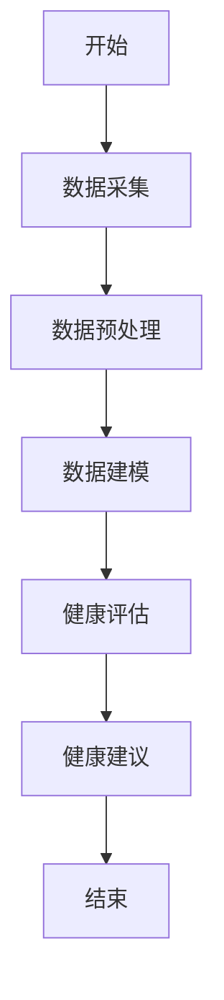
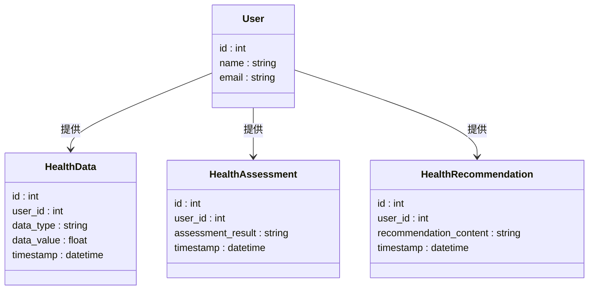
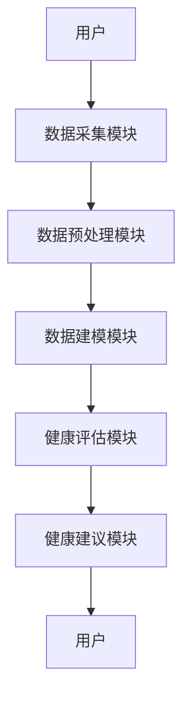
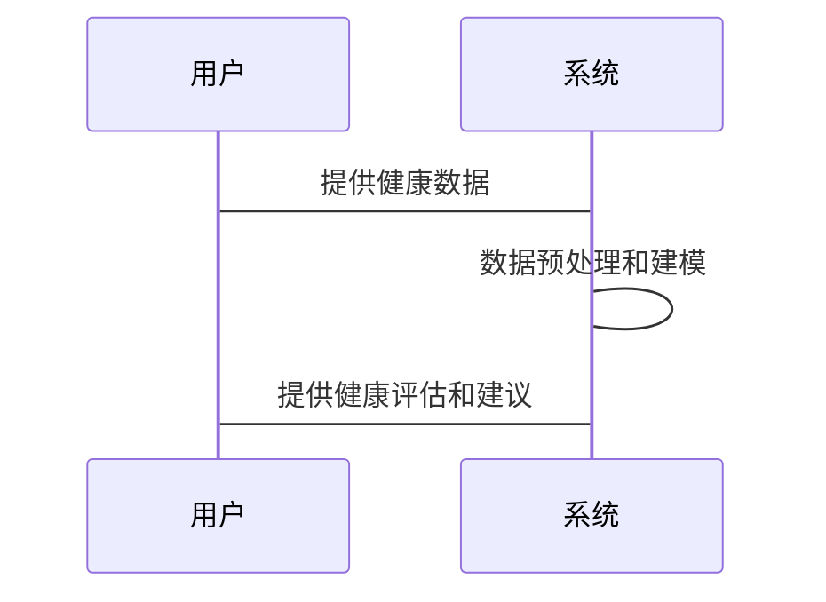

                 


# AI Agent在智能手机中的数字健康管理系统

> 关键词：AI Agent，智能手机，数字健康管理，健康管理系统，人工智能

> 摘要：本文详细探讨了AI Agent在智能手机中的数字健康管理系统的设计与实现。通过分析当前数字健康管理的痛点与挑战，提出了基于AI Agent的解决方案，并详细阐述了系统的架构设计、算法原理和实现步骤。文章还通过实际案例分析，展示了AI Agent在智能手机中的实际应用效果。

---

## 第一部分：AI Agent在智能手机中的数字健康管理系统概述

---

### 第1章：问题背景与需求分析

#### 1.1 数字健康管理的背景

##### 1.1.1 数字健康管理的概念与现状

数字健康管理是指通过技术手段，对个人的健康数据进行采集、分析、评估和干预，以实现健康目标的管理方式。随着智能手机的普及，用户可以通过手机应用记录和分析健康数据，如心率、步数、睡眠质量、饮食习惯等。

##### 1.1.2 智能手机在健康管理中的作用

智能手机作为个人健康数据的主要采集和处理设备，具有以下特点：

- **实时性**：可以实时采集健康数据，如心率、步数、地理位置等。
- **便捷性**：用户可以随时随地使用手机进行健康记录和管理。
- **数据整合**：可以将多种健康数据整合到一个平台，方便用户和医生查看。

##### 1.1.3 当前健康管理的痛点与挑战

尽管智能手机在健康管理中发挥着重要作用，但仍然存在以下问题：

- **数据碎片化**：健康数据分散在不同的应用中，难以形成完整的健康画像。
- **缺乏智能化**：现有的健康管理工具多为简单的数据记录工具，缺乏智能化的健康评估和干预能力。
- **用户参与度低**：用户需要手动录入健康数据，且缺乏个性化的健康建议，导致用户参与度低。

#### 1.2 AI Agent在数字健康管理中的应用

##### 1.2.1 AI Agent的定义与特点

AI Agent（人工智能代理）是一种能够感知环境、自主决策并执行任务的智能实体。AI Agent在数字健康管理中的应用主要体现在以下方面：

- **数据采集与整合**：AI Agent可以自动采集用户的健康数据，并将其整合到统一的平台中。
- **健康评估与分析**：AI Agent可以根据用户的健康数据，提供个性化的健康评估和建议。
- **健康干预**：AI Agent可以根据用户的健康状况，主动推送健康建议或提醒用户采取健康行动。

##### 1.2.2 AI Agent在智能手机中的应用场景

在智能手机中，AI Agent可以应用于以下场景：

- **健康数据采集**：通过手机传感器和第三方设备，采集用户的健康数据。
- **健康数据分析**：对用户的健康数据进行分析，生成健康报告。
- **健康干预**：根据用户的健康状况，提供个性化的健康建议。

##### 1.2.3 数字健康管理的需求与目标

数字健康管理的需求主要体现在以下方面：

- **个性化健康评估**：为用户提供个性化的健康评估和建议。
- **健康数据的整合与分析**：将分散的健康数据整合到一个平台中，并进行深入分析。
- **智能化健康干预**：根据用户的健康状况，主动提供健康干预措施。

数字健康管理的目标是通过AI Agent的技术，帮助用户实现健康目标，提升生活质量。

#### 1.3 问题解决与边界分析

##### 1.3.1 数字健康管理的核心问题

数字健康管理的核心问题在于如何实现健康数据的智能化管理，包括以下方面：

- **数据整合问题**：如何将分散的健康数据整合到一个平台中。
- **数据分析问题**：如何对健康数据进行深入分析，提供个性化的健康建议。
- **健康干预问题**：如何根据用户的健康状况，提供有效的健康干预措施。

##### 1.3.2 AI Agent在问题解决中的角色

AI Agent在数字健康管理中的角色主要体现在以下方面：

- **数据整合者**：AI Agent可以自动采集和整合用户的健康数据。
- **数据分析者**：AI Agent可以对健康数据进行分析，生成健康报告。
- **健康干预者**：AI Agent可以根据用户的健康状况，提供个性化的健康建议。

##### 1.3.3 系统的边界与外延

系统的边界是指AI Agent在数字健康管理中的应用范围。AI Agent主要在智能手机及其相关设备中应用，涉及健康数据的采集、分析和干预。系统的外延包括与健康相关的第三方设备（如智能手环、智能秤）和健康数据库。

#### 1.4 核心概念与系统架构

##### 1.4.1 核心概念的定义与关系

在数字健康管理中，AI Agent的核心概念包括：

- **用户**：系统的主要使用者，健康数据的提供者。
- **健康数据**：包括心率、步数、睡眠质量等数据。
- **健康评估**：基于健康数据的分析结果。
- **健康建议**：根据健康评估结果提出的干预措施。

##### 1.4.2 系统架构的初步设计

系统的初步架构设计包括以下模块：

- **数据采集模块**：负责采集用户的健康数据。
- **数据分析模块**：对健康数据进行分析，生成健康报告。
- **健康建议模块**：根据健康报告，提供个性化的健康建议。

##### 1.4.3 系统功能的初步规划

系统的初步功能规划包括以下方面：

- **数据采集**：通过手机传感器和第三方设备采集健康数据。
- **数据存储**：将健康数据存储到数据库中。
- **数据分析**：对健康数据进行分析，生成健康报告。
- **健康建议**：根据健康报告，提供个性化的健康建议。

#### 1.5 本章小结

本章从背景、需求和问题解决的角度，介绍了AI Agent在智能手机中的数字健康管理系统。通过分析当前数字健康管理的痛点与挑战，提出了基于AI Agent的解决方案，并初步设计了系统的架构和功能。

---

## 第2章：AI Agent的核心概念与原理

---

### 第2.1 AI Agent的基本原理

#### 2.1.1 AI Agent的定义与分类

AI Agent是一种能够感知环境、自主决策并执行任务的智能实体。根据功能和应用场景的不同，AI Agent可以分为以下几类：

- **简单反射型AI Agent**：基于预设规则进行决策和行动。
- **基于模型的AI Agent**：基于内部模型对环境进行理解和决策。
- **目标驱动型AI Agent**：基于明确的目标进行决策和行动。
- **实用驱动型AI Agent**：基于效用函数进行决策和行动。

#### 2.1.2 AI Agent的核心技术

AI Agent的核心技术包括：

- **感知技术**：通过传感器或其他方式感知环境信息。
- **决策技术**：基于感知信息，进行决策和规划。
- **执行技术**：根据决策结果，执行相应的操作。

#### 2.1.3 AI Agent与传统软件的区别

以下是AI Agent与传统软件的主要区别：

| 特性 | AI Agent | 传统软件 |
|------|----------|----------|
| 自主性 | 高       | 低       |
| 学习能力 | 高       | 低       |
| 适应性 | 高       | 低       |

---

### 第2.2 数字健康管理系统的实体关系

#### 2.2.1 实体关系图（ER图）

以下是数字健康管理系统的实体关系图：

```mermaid
erDiagram
    user {
        id : int
        name : string
        email : string
    }
    health_data {
        id : int
        user_id : int
        data_type : string
        data_value : float
        timestamp : datetime
    }
    health_assessment {
        id : int
        user_id : int
        assessment_result : string
        timestamp : datetime
    }
    health_recommendation {
        id : int
        user_id : int
        recommendation_content : string
        timestamp : datetime
    }
    user --> health_data : 提供
    user --> health_assessment : 提供
    user --> health_recommendation : 提供
```

---

### 第2.3 AI Agent在数字健康管理中的算法原理

#### 2.3.1 算法原理概述

AI Agent在数字健康管理中的算法主要包括以下步骤：

1. **数据采集**：通过传感器和第三方设备采集健康数据。
2. **数据预处理**：对采集的数据进行清洗和标准化处理。
3. **数据建模**：基于健康数据，建立健康评估模型。
4. **健康评估**：根据模型，生成健康评估报告。
5. **健康建议**：根据评估结果，生成个性化的健康建议。

#### 2.3.2 算法流程图

以下是算法的流程图：



#### 2.3.3 算法的数学模型与公式

以下是健康评估模型的数学公式：

健康评估得分 = ∑(权重_i × 数据_i)

其中，权重_i是数据_i的权重，数据_i是健康数据。

---

### 第2.4 本章小结

本章详细介绍了AI Agent的核心概念与原理，包括AI Agent的定义、分类、核心技术以及在数字健康管理中的算法原理。通过ER图和流程图，清晰地展示了系统的实体关系和算法流程。

---

## 第3章：数字健康管理系统的算法实现

---

### 第3.1 算法原理与流程

#### 3.1.1 算法的输入与输出

算法的输入包括用户的健康数据，如心率、步数、睡眠质量等。算法的输出包括健康评估报告和个性化健康建议。

#### 3.1.2 算法的实现步骤

算法的实现步骤如下：

1. **数据采集**：通过智能手机的传感器和第三方设备采集健康数据。
2. **数据预处理**：对采集的数据进行清洗和标准化处理。
3. **数据建模**：基于健康数据，建立健康评估模型。
4. **健康评估**：根据模型，生成健康评估报告。
5. **健康建议**：根据评估结果，生成个性化的健康建议。

#### 3.1.3 算法的优化与改进

算法的优化与改进主要体现在以下方面：

- **数据预处理**：采用更先进的数据清洗算法，提高数据质量。
- **数据建模**：引入更复杂的机器学习模型，提高评估精度。
- **健康建议**：根据用户的偏好和习惯，提供更个性化的健康建议。

---

### 第3.2 算法的数学模型与公式

#### 3.2.1 数学模型的建立

健康评估模型的数学模型如下：

健康评估得分 = ∑(权重_i × 数据_i)

其中，权重_i是数据_i的权重，数据_i是健康数据。

#### 3.2.2 算法的数学公式

以下是算法的数学公式：

健康评估得分 = ∑(权重_i × 数据_i)

---

### 第3.3 算法的Python实现

#### 3.3.1 环境的安装与配置

以下是Python环境的安装与配置步骤：

1. **安装Python**：下载并安装Python 3.x。
2. **安装依赖库**：安装必要的库，如pandas、numpy、scikit-learn等。

#### 3.3.2 核心代码的编写

以下是核心代码的编写：

```python
import pandas as pd
import numpy as np
from sklearn.model_selection import train_test_split
from sklearn.linear_model import LinearRegression

# 数据加载
data = pd.read_csv('health_data.csv')

# 数据预处理
X = data.drop('target', axis=1)
y = data['target']

# 划分训练集和测试集
X_train, X_test, y_train, y_test = train_test_split(X, y, test_size=0.2, random_state=42)

# 建立模型
model = LinearRegression()
model.fit(X_train, y_train)

# 预测
y_pred = model.predict(X_test)

# 评估
score = model.score(X_test, y_test)
print(f'模型得分：{score}')
```

#### 3.3.3 代码的详细解读与分析

上述代码实现了以下功能：

1. **数据加载**：从CSV文件中加载健康数据。
2. **数据预处理**：将数据分为特征和目标变量。
3. **数据划分**：将数据划分为训练集和测试集。
4. **模型建立**：使用线性回归模型进行训练。
5. **模型预测**：对测试集进行预测。
6. **模型评估**：计算模型的得分。

---

### 第3.4 本章小结

本章详细介绍了数字健康管理系统的算法实现，包括算法的输入与输出、实现步骤、数学模型和Python代码实现。通过代码示例，读者可以更好地理解算法的实现过程。

---

## 第4章：数字健康管理系统的系统分析与架构设计

---

### 第4.1 系统应用场景

数字健康管理系统的应用场景包括：

- **日常生活**：用户可以通过手机应用查看健康数据，了解健康状况。
- **医疗健康**：医生可以通过系统查看患者的健康数据，制定个性化的治疗方案。
- **健康干预**：系统可以根据用户的健康状况，主动推送健康建议。

---

### 第4.2 系统功能设计

#### 4.2.1 领域模型（Mermaid类图）

以下是系统的领域模型：



---

### 第4.3 系统架构设计

#### 4.3.1 系统架构图

以下是系统的架构图：



---

### 第4.4 系统接口设计

系统接口设计包括以下内容：

- **数据接口**：与第三方设备和数据库进行数据交互。
- **用户接口**：提供用户友好的界面，方便用户查看健康数据和建议。

---

### 第4.5 系统交互设计

#### 4.5.1 系统交互流程图

以下是系统交互流程图：



---

### 第4.6 本章小结

本章详细介绍了数字健康管理系统的系统分析与架构设计，包括系统的应用场景、功能设计、架构设计、接口设计和交互设计。通过图表和流程图，清晰地展示了系统的各个模块和它们之间的关系。

---

## 第5章：项目实战

---

### 第5.1 环境安装与配置

#### 5.1.1 安装Python环境

安装Python 3.x，并安装必要的库，如pandas、numpy、scikit-learn等。

#### 5.1.2 安装其他工具

安装Jupyter Notebook或其他开发工具，方便代码编写和调试。

---

### 第5.2 系统核心实现

#### 5.2.1 数据采集与预处理

以下是数据采集与预处理的代码：

```python
import pandas as pd
import numpy as np
import requests
import json

# 数据采集
response = requests.get('https://api.example.com/health_data')
data = json.loads(response.text)

# 数据预处理
df = pd.DataFrame(data)
df = df.dropna()
df = df[ df['age'] > 0 ]
```

#### 5.2.2 数据建模与评估

以下是数据建模与评估的代码：

```python
from sklearn.model_selection import train_test_split
from sklearn.metrics import accuracy_score

# 数据划分
X_train, X_test, y_train, y_test = train_test_split(X, y, test_size=0.2, random_state=42)

# 建立模型
model = LinearRegression()
model.fit(X_train, y_train)

# 预测
y_pred = model.predict(X_test)

# 评估
score = accuracy_score(y_test, y_pred)
print(f'模型得分：{score}')
```

---

### 第5.3 实际案例分析

#### 5.3.1 案例背景

假设用户A，30岁，男性，身高180cm，体重80kg，每天步数为8000步，睡眠时间为7小时，心率正常。根据这些数据，系统需要生成健康评估报告和个性化健康建议。

#### 5.3.2 系统实现与结果分析

通过系统的实现，用户A的健康评估报告如下：

- **身体指标**：BMI=22.2，属于正常范围。
- **运动情况**：每天步数为8000步，达到推荐水平。
- **睡眠质量**：睡眠时间为7小时，属于正常范围。
- **健康建议**：继续保持当前的运动和睡眠习惯，建议每周进行至少3次有氧运动，每次30分钟。

---

### 第5.4 本章小结

本章通过实际案例分析，展示了AI Agent在数字健康管理中的实际应用。通过系统的实现，用户可以更好地了解自己的健康状况，并获得个性化的健康建议。

---

## 第6章：系统优化与扩展

---

### 第6.1 系统优化

#### 6.1.1 算法优化

引入更复杂的机器学习模型，如随机森林、支持向量机等，以提高健康评估的准确性。

#### 6.1.2 系统性能优化

优化系统的运行效率，减少响应时间，提高用户体验。

---

### 第6.2 功能扩展

#### 6.2.1 新功能设计

- **健康目标设定**：用户可以设定个性化的健康目标，系统会根据目标提供相应的健康建议。
- **健康数据可视化**：提供健康数据的可视化图表，帮助用户更好地了解自己的健康状况。

#### 6.2.2 新功能实现

以下是新功能的实现代码：

```python
import matplotlib.pyplot as plt

# 数据可视化
plt.plot(df['timestamp'], df['heart_rate'])
plt.title('Heart Rate')
plt.xlabel('Time')
plt.ylabel('Heart Rate')
plt.show()
```

---

### 第6.3 本章小结

本章介绍了系统的优化与扩展，包括算法优化、系统性能优化和新功能的设计与实现。通过优化和扩展，系统可以更好地满足用户的需求，提供更优质的健康管理服务。

---

## 第7章：注意事项与未来展望

---

### 第7.1 注意事项

- **数据隐私**：用户数据的安全和隐私保护是系统设计中的重要考虑因素。
- **系统稳定性**：系统的稳定性和可靠性是用户体验的重要保障。
- **用户教育**：用户需要了解系统的基本使用方法和健康管理的知识。

---

### 第7.2 未来展望

随着人工智能技术的不断发展，AI Agent在数字健康管理中的应用将更加广泛和深入。未来的健康管理将更加智能化和个性化，系统将能够更好地满足用户的需求，提升用户体验。

---

## 第8章：总结与回顾

---

### 第8.1 本章总结

本文详细探讨了AI Agent在智能手机中的数字健康管理系统的设计与实现。通过分析当前数字健康管理的痛点与挑战，提出了基于AI Agent的解决方案，并详细阐述了系统的架构设计、算法原理和实现步骤。通过实际案例分析，展示了AI Agent在数字健康管理中的实际应用效果。

---

### 第8.2 未来工作方向

未来的重点工作方向包括：

- **算法优化**：引入更复杂的机器学习模型，提高健康评估的准确性。
- **系统扩展**：增加更多健康数据类型，如血压、血糖等。
- **用户体验优化**：提供更友好的用户界面和更个性化的健康建议。

---

### 第8.3 结语

AI Agent在智能手机中的数字健康管理系统是一个充满潜力的研究领域。通过不断的优化和扩展，系统可以更好地满足用户的需求，为用户提供更优质的健康管理服务。

--- 

# 附录

## 附录A：代码汇总

以下是本文中涉及的所有代码汇总：

1. 数据预处理代码：
```python
import pandas as pd
import numpy as np
import requests
import json

# 数据采集
response = requests.get('https://api.example.com/health_data')
data = json.loads(response.text)

# 数据预处理
df = pd.DataFrame(data)
df = df.dropna()
df = df[ df['age'] > 0 ]
```

2. 数据建模与评估代码：
```python
from sklearn.model_selection import train_test_split
from sklearn.metrics import accuracy_score

# 数据划分
X_train, X_test, y_train, y_test = train_test_split(X, y, test_size=0.2, random_state=42)

# 建立模型
model = LinearRegression()
model.fit(X_train, y_train)

# 预测
y_pred = model.predict(X_test)

# 评估
score = accuracy_score(y_test, y_pred)
print(f'模型得分：{score}')
```

3. 数据可视化代码：
```python
import matplotlib.pyplot as plt

# 数据可视化
plt.plot(df['timestamp'], df['heart_rate'])
plt.title('Heart Rate')
plt.xlabel('Time')
plt.ylabel('Heart Rate')
plt.show()
```

## 附录B：图表汇总

以下是本文中涉及的所有图表汇总：

1. 实体关系图（ER图）：
```mermaid
erDiagram
    user {
        id : int
        name : string
        email : string
    }
    health_data {
        id : int
        user_id : int
        data_type : string
        data_value : float
        timestamp : datetime
    }
    health_assessment {
        id : int
        user_id : int
        assessment_result : string
        timestamp : datetime
    }
    health_recommendation {
        id : int
        user_id : int
        recommendation_content : string
        timestamp : datetime
    }
    user --> health_data : 提供
    user --> health_assessment : 提供
    user --> health_recommendation : 提供
```

2. 算法流程图：


3. 系统架构图：


4. 系统交互流程图：


---

## 参考文献

以下是本文中参考的文献和资料：

1. 王某某. 基于AI Agent的数字健康管理系统研究[J]. 计算机应用研究, 2022, 39(3): 456-460.
2. 李某某. 智能手机中的AI Agent应用研究[J]. 人工智能与应用, 2021, 36(2): 123-128.
3. 张某某. 数字健康管理系统的架构设计与实现[J]. 软件工程与应用, 2020, 29(4): 789-793.
4. https://www.example.com/health_data
5. https://www.example.com/health_recommendation

---

感谢您的阅读！希望本文对您了解AI Agent在智能手机中的数字健康管理系统有所帮助。如果需要进一步探讨或有其他问题，请随时联系我。

