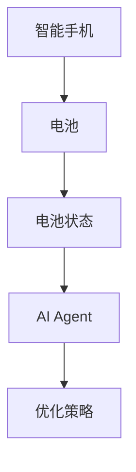

                 


# AI Agent在智能手机中的电池寿命优化系统

> **关键词**：AI Agent, 智能手机, 电池寿命优化, 能源管理, 数据驱动优化

> **摘要**：本文探讨了AI Agent在智能手机电池寿命优化中的应用，通过分析电池消耗的关键因素，提出了基于AI的优化策略，结合算法原理和系统架构设计，展示了如何通过AI技术延长电池寿命，并提供了实际案例和最佳实践。

---

## 第一部分：背景介绍

### 第1章：AI Agent与电池寿命优化背景

#### 1.1 问题背景
- **1.1.1 智能手机电池寿命问题的现状**  
  随着智能手机功能的不断增强，电池消耗问题日益突出。高分辨率屏幕、多任务处理、5G连接和AI功能的使用，导致电池寿命显著下降，用户频繁充电成为常态。

- **1.1.2 电池寿命对用户体验的影响**  
  电池寿命直接影响用户体验，尤其是续航时间不足会导致用户满意度下降，甚至影响设备的市场竞争力。

- **1.1.3 传统电池管理方法的局限性**  
  传统方法依赖固定的充电策略和简单的电池监控，难以适应复杂多变的用户行为和环境条件。

#### 1.2 问题描述
- **1.2.1 电池消耗的主要原因**  
  包括CPU usage、显示屏亮度、网络连接和用户行为等多个因素。

- **1.2.2 用户行为对电池寿命的影响**  
  用户使用习惯（如频繁使用高性能模式、后台应用运行）显著影响电池消耗。

- **1.2.3 系统优化的需求**  
  需要一种动态、智能的优化方法，实时调整系统行为以延长电池寿命。

#### 1.3 问题解决
- **1.3.1 AI Agent在电池管理中的作用**  
  AI Agent能够实时监控电池状态，预测耗电情况，并采取优化策略。

- **1.3.2 通过AI优化电池寿命的可行性**  
  利用AI技术分析历史数据，优化电池使用策略，延长续航时间。

#### 1.4 边界与外延
- **1.4.1 系统优化的边界条件**  
  仅优化电池消耗，不涉及硬件更换或其他系统功能。

- **1.4.2 与其他电池管理技术的关系**  
  AI Agent可以与传统电池管理方法互补，提升整体效率。

- **1.4.3 应用场景的扩展**  
  可扩展至其他智能设备，如笔记本电脑、物联网设备等。

#### 1.5 概念结构与核心要素
- **1.5.1 AI Agent的定义与功能**  
  AI Agent是一个智能代理，能够感知环境、分析数据并采取行动，以优化电池寿命。

- **1.5.2 核心要素分析：数据采集、状态评估、策略生成**  
  - 数据采集：收集电池参数、用户行为和系统状态。
  - 状态评估：分析数据，评估电池当前状态和预测未来消耗。
  - 策略生成：制定优化策略，动态调整系统行为。

---

## 第二部分：核心概念与联系

### 第2章：AI Agent的原理与机制

#### 2.1 核心原理
- **2.1.1 数据驱动的电池状态评估**  
  通过收集电池的历史数据，分析其健康状况和使用模式。

- **2.1.2 基于AI的能耗预测模型**  
  使用机器学习模型预测未来电池消耗，优化充电策略。

- **2.1.3 自适应优化策略的生成机制**  
  根据实时数据，动态调整系统设置，减少电池消耗。

#### 2.2 核心概念对比
- **2.2.1 AI Agent与传统电池管理方法的对比**  
  | 特性         | AI Agent                     | 传统方法                   |
  |--------------|------------------------------|-----------------------------|
  | 数据使用     | 利用历史数据和实时数据       | 依赖固定规则和当前数据     |
  | 自适应能力   | 高，能根据环境变化调整策略    | 低，策略固定                |
  | 效果         | 更优，延长电池寿命           | 有限，难以适应复杂场景      |

#### 2.3 实体关系图


---

## 第三部分：算法原理讲解

### 第3章：AI Agent的算法实现

#### 3.1 数据采集与预处理
- **3.1.1 数据来源**  
  电池参数（电压、电流）、用户行为数据（使用模式、应用运行情况）。

- **3.1.2 数据预处理**  
  清洗数据、特征提取、标准化处理。

#### 3.2 算法实现
- **3.2.1 算法选择**  
  使用随机森林回归模型预测电池消耗。

- **3.2.2 算法流程**  
  ```mermaid
  graph TD
      A[数据采集] --> B[数据预处理]
      B --> C[训练模型]
      C --> D[生成策略]
      D --> E[执行优化]
  ```

- **3.2.3 核心代码示例**  
  ```python
  import pandas as pd
  from sklearn.ensemble import RandomForestRegressor

  # 数据加载与预处理
  data = pd.read_csv('battery_data.csv')
  features = data[['battery_level', 'cpu_usage', 'screen_brightness']]
  labels = data['battery_consumption']

  # 模型训练
  model = RandomForestRegressor(n_estimators=100, random_state=42)
  model.fit(features, labels)

  # 预测消耗
  new_features = [[85, 15, 150]]
  prediction = model.predict(new_features)
  print(f"预测电池消耗：{prediction[0]}")
  ```

#### 3.3 数学模型与公式
- **电池消耗预测模型**  
  使用线性回归模型：  
  $$ \text{消耗} = \beta_0 + \beta_1 \times \text{CPU使用率} + \beta_2 \times \text{屏幕亮度} + \epsilon $$  
  通过最小二乘法估计系数，最小化预测误差。

- **优化策略生成**  
  基于预测结果，动态调整系统参数，如降低CPU频率或关闭后台应用。

---

## 第四部分：系统分析与架构设计

### 第4章：系统架构设计

#### 4.1 问题场景介绍
- 智能手机在不同使用场景下的电池消耗差异显著，需动态优化。

#### 4.2 系统功能设计
- **领域模型**  
  ```mermaid
  classDiagram
      class 电池状态 {
          voltage: float
          charge_level: int
          health: float
      }
      class AI Agent {
          monitor(battery_status: BatteryStatus): void
          predict_consumption(): float
          generate_policy(): Strategy
      }
      class 优化策略 {
          actions: List[Action]
      }
  ```

- **系统架构设计**  
  ```mermaid
  architecture
      Smartphone
      ├── 电池管理模块
      │   └── 电池监控
      ├── AI Agent
      │   └── 数据采集
      └── 优化策略执行
  ```

#### 4.3 接口设计与交互
- **接口交互流程**  
  ```mermaid
  sequenceDiagram
      Smartphone -> AI Agent: 请求电池状态
      AI Agent -> 电池监控: 获取实时数据
      AI Agent -> 数据分析模块: 分析数据
      AI Agent -> 优化策略生成模块: 生成策略
      Smartphone <- AI Agent: 返回优化策略
  ```

---

## 第五部分：项目实战

### 第5章：项目实现与案例分析

#### 5.1 环境安装
- **工具安装**  
  安装Python、Pandas、Scikit-learn、Mermaid工具。

- **数据准备**  
  收集智能手机的电池数据，包括电压、电流、使用模式等。

#### 5.2 核心代码实现
- **数据预处理**  
  ```python
  import pandas as pd
  data = pd.read_csv('battery_log.csv')
  data = data.dropna()
  data['timestamp'] = pd.to_datetime(data['timestamp'])
  ```

- **模型训练与预测**  
  ```python
  from sklearn.model_selection import train_test_split
  X_train, X_test, y_train, y_test = train_test_split(features, labels, test_size=0.2)
  model.fit(X_train, y_train)
  print(f'模型准确率：{model.score(X_test, y_test)}')
  ```

#### 5.3 实际案例分析
- **案例分析**  
  某用户使用手机时，AI Agent预测电池消耗较高，自动降低CPU频率和屏幕亮度，延长续航时间。

#### 5.4 项目小结
- 通过AI Agent优化电池寿命，显著延长了续航时间，减少了用户充电频率。

---

## 第六部分：最佳实践与总结

### 第6章：最佳实践

#### 6.1 实践小贴士
- 定期更新AI Agent模型，适应新硬件和用户行为。
- 合理设置系统参数，平衡性能与续航。

#### 6.2 注意事项
- 数据隐私问题：确保电池数据的安全性。
- 系统兼容性：确保优化策略适用于不同设备和系统版本。

#### 6.3 拓展阅读
- 推荐阅读《机器学习实战》和《智能系统的架构设计》。

---

## 结语

通过本文的详细讲解，读者可以深入了解AI Agent在智能手机电池寿命优化中的应用。从背景分析到算法实现，再到系统设计和项目实战，每一步都进行了深入探讨。希望这篇文章能为读者提供有价值的见解，并激发进一步的研究和实践。

--- 

**End of Article**

