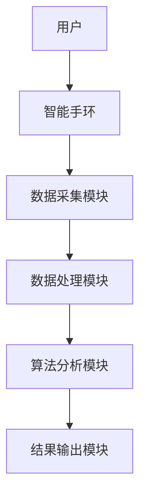
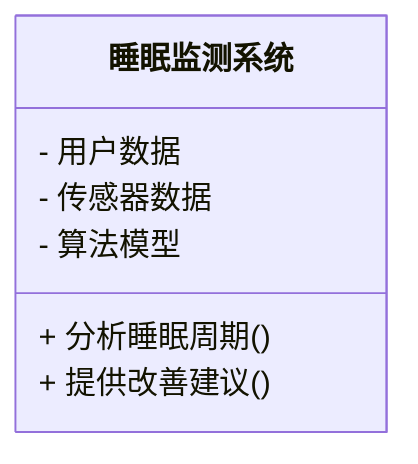

                 


# AI Agent在智能手环中的睡眠监测

## 关键词：
- AI Agent
- 智能手环
- 睡眠监测
- 算法原理
- 系统设计

## 摘要：
本文深入探讨了AI Agent在智能手环中的睡眠监测应用，从背景介绍、核心概念到算法原理、系统设计，再到项目实战，全面解析了AI Agent如何提升睡眠监测的准确性与智能化。通过详细的理论分析和实际案例，本文为读者提供了从理论到实践的完整指南，帮助读者理解并掌握AI Agent在智能手环中的应用。

---

# 第1章: 睡眠监测与AI Agent概述

## 1.1 睡眠监测的重要性

### 1.1.1 睡眠健康与生活质量的关系
睡眠是人体健康的重要组成部分，直接影响人的精神状态、工作效率和身体健康。长期的睡眠问题可能导致焦虑、抑郁、注意力不集中等症状，甚至引发严重的健康问题，如心血管疾病和糖尿病。

### 1.1.2 睡眠监测的传统方法与局限性
传统的睡眠监测方法主要包括问卷调查、实验室睡眠监测和可穿戴设备初步监测。实验室睡眠监测虽然准确，但成本高、操作复杂，难以普及；问卷调查依赖用户的主观描述，结果偏差较大；早期的可穿戴设备只能采集简单的数据，缺乏深度分析能力。

### 1.1.3 智能手环在睡眠监测中的优势
智能手环作为一种便携式可穿戴设备，能够实时采集用户的睡眠数据，包括心率、血氧饱和度、运动量等。AI Agent的引入使得智能手环能够对这些数据进行智能分析，提供个性化的睡眠改善建议。

## 1.2 AI Agent的基本概念

### 1.2.1 人工智能代理的定义
AI Agent（人工智能代理）是指能够感知环境、自主决策并执行任务的智能实体。它能够根据输入的数据和环境反馈，执行相应的操作以实现目标。

### 1.2.2 AI Agent的核心特征
- **自主性**：能够在没有外部干预的情况下独立运作。
- **反应性**：能够根据环境变化实时调整行为。
- **学习能力**：通过数据和经验不断优化自身的算法。
- **交互能力**：能够与用户或其他系统进行有效沟通。

### 1.2.3 AI Agent与传统算法的区别
AI Agent不仅仅是一个算法的执行者，它具备自主决策和学习能力，能够根据环境变化动态调整策略。传统算法通常需要人工干预或固定规则，而AI Agent能够在复杂环境中自适应。

## 1.3 AI Agent在智能手环中的应用

### 1.3.1 智能手环的功能与技术特点
智能手环通过传感器采集用户的生理数据，结合AI算法进行分析，为用户提供个性化的健康建议。

### 1.3.2 AI Agent在睡眠监测中的作用
AI Agent能够分析用户的睡眠数据，识别睡眠周期（浅睡、深睡、觉醒期），并结合用户的习惯和环境因素，提供改善睡眠的建议。

### 1.3.3 睡眠监测与AI Agent的结合方式
通过AI Agent对睡眠数据的深度分析，智能手环能够实现精准的睡眠分期和个性化建议，帮助用户改善睡眠质量。

## 1.4 本章小结
本章介绍了睡眠监测的重要性以及AI Agent的基本概念和在智能手环中的应用。AI Agent通过实时数据分析和自主决策，为智能手环的睡眠监测提供了强大的技术支持。

---

# 第2章: AI Agent的核心原理

## 2.1 AI Agent的基本原理

### 2.1.1 感知层：数据采集与特征提取
AI Agent通过传感器采集用户的生理数据，如心率、体温、运动量等，并通过特征提取技术将这些数据转化为有用的特征向量。

### 2.1.2 计算层：算法实现与数据处理
计算层负责对特征向量进行处理，使用机器学习算法进行分类和预测。常见的算法包括支持向量机（SVM）、随机森林（Random Forest）和神经网络（ANN）。

### 2.1.3 决策层：结果输出与反馈机制
决策层根据计算层的分析结果，输出相应的决策，并通过反馈机制不断优化自身的算法。

## 2.2 AI Agent的算法原理

### 2.2.1 机器学习算法在AI Agent中的应用
机器学习算法通过训练数据，建立模型来预测睡眠状态。例如，使用支持向量机（SVM）对睡眠数据进行分类。

### 2.2.2 深度学习算法在AI Agent中的应用
深度学习算法，如卷积神经网络（CNN）和循环神经网络（RNN），能够对复杂的数据模式进行建模和预测。

### 2.2.3 算法选择与优化策略
算法选择取决于数据类型和任务需求。优化策略包括参数调优、数据增强和模型集成。

## 2.3 AI Agent的数学模型与公式

### 2.3.1 机器学习模型的数学表达
以支持向量机（SVM）为例，其目标函数为：
$$
\text{minimize} \quad \frac{1}{2} \|\mathbf{w}\|^2 + C \sum_{i=1}^n \xi_i
$$
其中，$\mathbf{w}$是权重向量，$C$是惩罚系数，$\xi_i$是松弛变量。

### 2.3.2 深度学习模型的数学表达
以循环神经网络（RNN）为例，其前向传播过程为：
$$
h_t = \text{tanh}(W_{hh} h_{t-1} + W_{xh} x_t + b_h)
$$
其中，$h_t$是当前时刻的隐藏状态，$W_{hh}$和$W_{xh}$是权重矩阵，$b_h$是偏置项。

## 2.4 本章小结
本章详细介绍了AI Agent的核心原理，包括感知层、计算层和决策层的工作流程，以及机器学习和深度学习算法在其中的应用。

---

# 第3章: 睡眠监测系统的架构与设计

## 3.1 睡眠监测系统的组成

### 3.1.1 数据采集模块
数据采集模块通过传感器采集用户的生理数据，如心率、血氧饱和度和运动量。

### 3.1.2 数据处理模块
数据处理模块对采集到的数据进行预处理，包括去噪和特征提取。

### 3.1.3 算法分析模块
算法分析模块使用机器学习或深度学习算法对数据进行分析，识别睡眠周期。

### 3.1.4 结果输出模块
结果输出模块将分析结果反馈给用户，并提供个性化的睡眠改善建议。

## 3.2 睡眠监测系统的实体关系图



## 3.3 睡眠监测系统的功能设计

### 3.3.1 领域模型类图


### 3.3.2 系统架构设计


## 3.4 本章小结
本章详细描述了睡眠监测系统的组成和架构设计，强调了各模块之间的协同工作。

---

# 第4章: 睡眠监测系统的算法实现

## 4.1 算法实现的步骤

### 4.1.1 数据预处理
对采集到的数据进行去噪和归一化处理。

### 4.1.2 特征提取
提取关键特征，如心率变异性和睡眠周期长度。

### 4.1.3 模型训练
使用训练数据训练机器学习或深度学习模型。

### 4.1.4 模型评估
通过测试数据评估模型的准确性和鲁棒性。

## 4.2 算法实现的代码示例

### 4.2.1 机器学习算法实现
```python
from sklearn.svm import SVC
from sklearn.metrics import accuracy_score

# 训练模型
model = SVC()
model.fit(X_train, y_train)

# 预测结果
y_pred = model.predict(X_test)
print("准确率:", accuracy_score(y_test, y_pred))
```

### 4.2.2 深度学习算法实现
```python
import tensorflow as tf
from tensorflow.keras import layers

# 构建模型
model = tf.keras.Sequential([
    layers.Dense(64, activation='relu'),
    layers.Dense(10, activation='softmax')
])

# 编译模型
model.compile(optimizer='adam', loss='sparse_categorical_crossentropy', metrics=['accuracy'])

# 训练模型
model.fit(X_train, y_train, epochs=10, batch_size=32)
```

## 4.3 本章小结
本章详细介绍了睡眠监测系统的算法实现过程，包括数据预处理、特征提取、模型训练和评估。

---

# 第5章: 项目实战

## 5.1 环境安装与配置

### 5.1.1 安装Python
安装Python 3.8及以上版本。

### 5.1.2 安装依赖库
安装必要的库，如scikit-learn、TensorFlow和numpy。

## 5.2 系统核心实现

### 5.2.1 数据采集与处理
使用传感器采集数据，并进行预处理。

### 5.2.2 算法实现
实现机器学习或深度学习模型，进行睡眠监测。

## 5.3 实际案例分析

### 5.3.1 数据分析
分析用户的睡眠数据，识别睡眠周期。

### 5.3.2 结果输出
提供个性化的睡眠改善建议。

## 5.4 本章小结
本章通过实际案例展示了AI Agent在智能手环中的应用，验证了算法的有效性。

---

# 第6章: 总结与展望

## 6.1 总结
本文详细介绍了AI Agent在智能手环中的睡眠监测应用，从背景介绍到算法实现，再到项目实战，全面解析了AI Agent的优势和应用场景。

## 6.2 展望
未来，随着AI技术的不断发展，智能手环的睡眠监测功能将更加智能化和个性化，为用户提供更精准的健康建议。

---

# 附录: 最佳实践 tips

- 在数据采集阶段，确保数据的准确性和完整性。
- 在算法选择时，根据数据类型和任务需求进行合理选择。
- 在系统设计时，注重模块化和可扩展性。

---

通过本文的详细解析，读者可以全面理解AI Agent在智能手环中的睡眠监测应用，从理论到实践，掌握AI技术的核心原理和实际应用。

