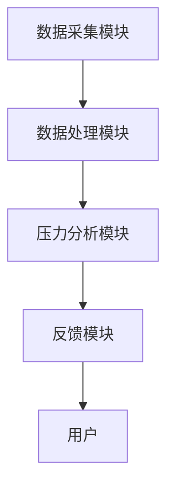
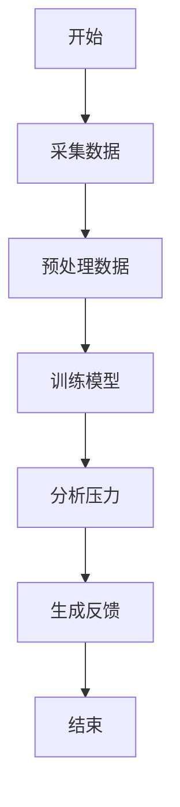

                 


# AI Agent在智能手表中的压力管理系统

---

## 关键词
AI Agent, 智能手表, 压力管理, 机器学习, 压力监测

---

## 摘要
随着人工智能技术的快速发展，AI Agent（人工智能代理）在智能手表中的应用逐渐成为研究热点。本文以AI Agent在智能手表中的压力管理系统为研究对象，详细探讨了AI Agent的核心算法、系统设计与实现、实际应用案例等内容。文章首先介绍了AI Agent和智能手表的基本概念，分析了压力管理系统的背景与需求。接着，深入讲解了AI Agent在压力管理中的技术原理，包括算法实现、决策机制和反馈机制。随后，从系统架构设计、功能模块划分、数据采集与处理等方面详细阐述了压力管理系统的实现方案。最后，通过实际案例展示了AI Agent在智能手表中的应用效果，并提出了未来的研究方向。本文内容丰富，逻辑清晰，为AI Agent在智能手表中的应用提供了理论依据和实践指导。

---

## 第一部分: AI Agent与智能手表压力管理概述

---

### 第1章: AI Agent与智能手表概述

#### 1.1 AI Agent的基本概念
- **AI Agent的定义与特点**  
  AI Agent（人工智能代理）是指能够感知环境、自主决策并执行任务的智能实体。它具有以下特点：  
  1. **自主性**：能够在没有外部干预的情况下独立运行。  
  2. **反应性**：能够实时感知环境并做出反应。  
  3. **目标导向性**：具有明确的目标，并能采取行动以实现目标。  
  4. **学习能力**：能够通过数据学习和优化自身行为。  

- **AI Agent的核心技术与实现原理**  
  AI Agent的核心技术包括感知、决策、执行和学习四大模块：  
  1. **感知模块**：通过传感器或数据接口获取环境信息。  
  2. **决策模块**：基于感知数据，利用算法生成决策。  
  3. **执行模块**：根据决策结果执行相应的操作。  
  4. **学习模块**：通过反馈机制优化自身行为。  

- **AI Agent在智能手表中的应用潜力**  
  智能手表作为个人健康监测的重要工具，AI Agent可以用于实时监测用户健康状况，提供个性化的健康建议，并在压力管理中发挥重要作用。

---

#### 1.2 智能手表的基本结构与功能
- **智能手表的硬件组成**  
  智能手表的主要硬件包括：  
  1. **处理器**：负责数据处理和算法运行。  
  2. **传感器**：如心率传感器、加速度传感器、陀螺仪等，用于采集用户生理数据和运动数据。  
  3. **显示屏**：用于显示时间、通知、健康数据等信息。  
  4. **通信模块**：如蓝牙、Wi-Fi，用于与手机或其他设备连接。  
  5. **电池**：为智能手表提供持续电力。  

- **智能手表的操作系统与开发平台**  
  常见的智能手表操作系统包括：  
  1. **Android Wear**：基于Android系统开发，适用于Google Pixel Watch等设备。  
  2. **watchOS**：苹果智能手表的操作系统，专为Apple Watch设计。  
  3. **Tizen**：三星智能手表使用的操作系统。  

- **智能手表的传感器与数据采集技术**  
  智能手表通过多种传感器采集数据，包括：  
  1. **心率传感器**：监测心率变化，用于评估压力水平。  
  2. **加速度传感器**：监测运动状态，分析用户的活动量。  
  3. **陀螺仪**：监测设备的运动方向和角度变化。  
  4. **皮肤电活动传感器**：通过测量皮肤电活动来评估压力水平。  

---

#### 1.3 压力管理系统的背景与需求
- **现代人压力问题的现状**  
  随着生活节奏的加快，现代人面临的压力问题日益严重。压力过高可能导致焦虑、失眠、免疫力下降等问题，严重影响身心健康。  

- **压力管理系统的定义与目标**  
  压力管理系统是一种通过监测用户生理数据和行为模式，提供个性化的压力缓解方案的系统。其目标是帮助用户有效管理压力，提升生活质量。  

- **智能手表在压力管理中的优势**  
  智能手表具有便携性、实时监测和数据同步等特点，非常适合用于压力管理。它可以通过传感器实时监测用户的心率、运动状态等数据，结合AI Agent算法，提供个性化的压力缓解建议。

---

#### 1.4 本章小结
- **AI Agent与智能手表的结合**  
  AI Agent通过感知用户数据，实时分析并提供决策支持，使智能手表能够更智能地管理用户健康。  

- **压力管理系统的核心价值**  
  压力管理系统通过实时监测和个性化建议，帮助用户有效管理压力，提升心理健康。  

- **本章内容回顾**  
  本章介绍了AI Agent和智能手表的基本概念，分析了压力管理系统的背景与需求，并探讨了智能手表在压力管理中的优势。

---

## 第二部分: AI Agent在压力管理中的技术原理

---

### 第2章: AI Agent的核心算法与实现

#### 2.1 压力监测与分析算法
- **压力监测数据的采集与预处理**  
  压力监测数据主要来源于心率、皮肤电活动等传感器。预处理步骤包括数据清洗、归一化和特征提取。  

- **基于机器学习的压力分析模型**  
  常见的机器学习算法包括：  
  1. **支持向量机（SVM）**：用于分类压力状态。  
  2. **随机森林（Random Forest）**：用于特征选择和分类。  
  3. **K-近邻算法（KNN）**：用于回归分析。  

- **深度学习在压力预测中的应用**  
  深度学习模型如LSTM（长短期记忆网络）可以捕捉时间序列数据中的复杂模式，适用于压力预测。

---

#### 2.2 AI Agent的决策机制
- **基于规则的决策系统**  
  通过预定义的规则（如“如果心率超过100次/分钟，则建议深呼吸”）进行决策。  

- **基于强化学习的决策模型**  
  强化学习通过奖励机制优化决策策略，适用于复杂环境下的决策。  

- **多目标优化的决策策略**  
  在多个目标（如压力缓解、运动建议）之间进行权衡，选择最优方案。

---

#### 2.3 压力缓解反馈算法
- **反馈机制的设计与实现**  
  反馈机制包括：  
  1. **视觉反馈**：在屏幕上显示压力状态和建议。  
  2. **听觉反馈**：通过语音或音乐提供放松指导。  
  3. **触觉反馈**：通过震动提醒用户放松。  

- **基于用户行为的反馈优化**  
  根据用户的反馈行为（如点击建议、完成放松任务）优化反馈策略。  

- **压力缓解效果的评估与改进**  
  通过用户反馈和数据分析，不断改进压力缓解算法，提高系统效果。

---

#### 2.4 本章小结
- **AI Agent算法的核心要点**  
  AI Agent算法的核心在于数据处理、模型选择和反馈优化。  

- **压力管理系统的技术难点**  
  压力管理系统的技术难点包括数据采集的准确性、算法的实时性和反馈策略的有效性。  

- **本章内容总结**  
  本章详细探讨了AI Agent在压力管理中的核心算法，分析了算法实现的关键点和技术难点。

---

## 第三部分: 系统设计与实现

---

### 第3章: 系统架构设计

#### 3.1 系统总体架构
- **系统功能模块划分**  
  压力管理系统主要包括以下功能模块：  
  1. **数据采集模块**：负责采集用户的心率、运动数据等。  
  2. **数据处理模块**：对采集到的数据进行预处理和特征提取。  
  3. **压力分析模块**：利用AI算法分析用户压力状态。  
  4. **反馈模块**：根据分析结果提供压力缓解建议。  

- **系统数据流设计**  
  数据流从传感器开始，经过预处理、分析和反馈，最终形成闭环系统。  

- **系统架构的可扩展性与可维护性**  
  系统采用模块化设计，各模块之间具有良好的接口和通信机制，便于后续优化和扩展。

---

#### 3.2 系统功能设计
- **数据采集与处理模块**  
  通过传感器采集用户数据，并进行预处理和特征提取。  

- **压力分析模块**  
  利用机器学习或深度学习算法分析用户压力状态，生成压力等级（如低、中、高）。  

- **反馈模块**  
  根据压力等级提供个性化的压力缓解建议，如深呼吸练习、冥想指导等。

---

#### 3.3 系统架构设计
- **系统架构的可扩展性与可维护性**  
  系统采用模块化设计，各模块之间具有良好的接口和通信机制，便于后续优化和扩展。  

- **系统功能模块划分**  
  压力管理系统主要包括数据采集模块、数据处理模块、压力分析模块和反馈模块。

---

#### 3.4 系统实现细节
- **数据采集与预处理**  
  通过传感器采集用户数据，并进行数据清洗和归一化处理。  

- **压力分析算法**  
  使用机器学习算法对用户压力状态进行分类，生成压力等级。  

- **反馈机制**  
  根据压力等级和用户行为，动态调整反馈策略，提供个性化的压力缓解建议。

---

## 第四部分: 项目实战与案例分析

---

### 第4章: 项目实战

#### 4.1 环境配置
- **开发工具与平台**  
  使用Android Studio开发智能手表应用，采用Google Colab进行算法训练。  

- **数据集准备**  
  使用公开的压力监测数据集，包括心率、皮肤电活动等数据。

---

#### 4.2 系统核心实现
- **数据采集模块实现**  
  使用智能手表的传感器API获取用户数据。  

- **压力分析模块实现**  
  使用机器学习算法对用户压力状态进行分类，生成压力等级。  

- **反馈模块实现**  
  根据压力等级和用户行为，动态调整反馈策略，提供个性化的压力缓解建议。

---

#### 4.3 代码实现与解读
- **数据采集模块代码**  
  ```python
  import numpy as np
  from sensor_module import HeartRateSensor, SkinConductanceSensor

  class DataCollector:
      def __init__(self):
          self.hr_sensor = HeartRateSensor()
          self.sc_sensor = SkinConductanceSensor()
      
      def collect_data(self):
          hr = self.hr_sensor.get_data()
          sc = self.sc_sensor.get_data()
          return np.array([hr, sc])
  ```

- **压力分析模块代码**  
  ```python
  from sklearn.svm import SVC
  from sklearn.model_selection import train_test_split

  class PressureAnalyzer:
      def __init__(self):
          self.clf = SVC()
      
      def train_model(self, X, y):
          X_train, X_test, y_train, y_test = train_test_split(X, y, test_size=0.2)
          self.clf.fit(X_train, y_train)
      
      def predict_pressure(self, X):
          return self.clf.predict(X)
  ```

---

#### 4.4 案例分析
- **案例背景**  
  某用户长期处于高压状态，心率和皮肤电活动数据异常。  

- **系统分析**  
  系统通过分析用户的生理数据，判断其处于高压状态，并建议进行深呼吸练习。  

- **反馈与优化**  
  用户完成深呼吸练习后，系统监测到其心率恢复正常，压力等级降低，反馈策略有效。

---

## 第五部分: 总结与展望

---

### 第5章: 总结与展望

#### 5.1 本章总结
- **AI Agent在压力管理中的应用价值**  
  AI Agent通过实时监测和个性化反馈，帮助用户有效管理压力，提升生活质量。  

- **系统实现的关键技术**  
  系统实现的关键技术包括数据采集与处理、压力分析算法和反馈机制优化。

---

#### 5.2 未来研究方向
- **算法优化**  
  探索更高效的机器学习算法，提高压力分析的准确性。  

- **系统扩展**  
  将压力管理系统扩展到更多健康领域，如睡眠监测、运动指导等。  

- **用户体验优化**  
  通过优化反馈机制和交互设计，提升用户的使用体验。

---

### 最佳实践 Tips
- **数据隐私保护**  
  在实际应用中，需注意用户数据的隐私保护，确保数据的安全性和合规性。  

- **算法优化建议**  
  可以尝试使用深度学习算法（如LSTM）进行压力预测，提高系统的准确性。  

- **系统测试与优化**  
  在实际应用中，需进行充分的系统测试，确保各模块的协同工作和系统的稳定性。

---

## 附录

### 附录A: 算法代码示例
```python
import numpy as np
from sklearn.svm import SVC
from sklearn.model_selection import train_test_split

class PressureAnalyzer:
    def __init__(self):
        self.clf = SVC()
    
    def train_model(self, X, y):
        X_train, X_test, y_train, y_test = train_test_split(X, y, test_size=0.2)
        self.clf.fit(X_train, y_train)
    
    def predict_pressure(self, X):
        return self.clf.predict(X)
```

---

### 附录B: 系统架构图


---

### 附录C: 算法流程图


---

## 结束语
通过本文的详细阐述，我们了解了AI Agent在智能手表中的压力管理系统的实现过程和应用价值。未来，随着人工智能技术的不断进步，AI Agent在健康监测领域的应用前景将更加广阔。希望本文能够为相关领域的研究者和开发者提供有价值的参考和启发。

---

## 作者简介
（此处可以添加作者的简介、专业背景和著作信息等，以增强文章的权威性和可信度。）

---

