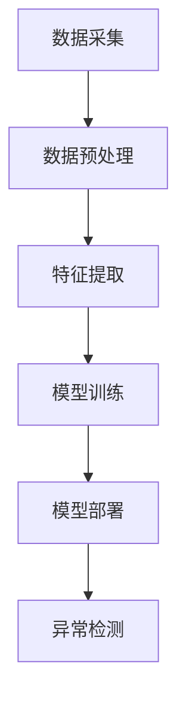
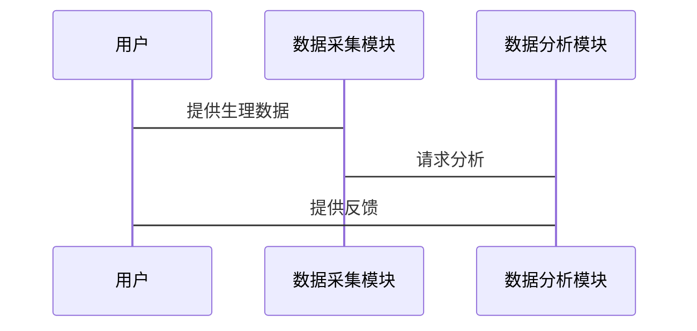

                 


# AI Agent在智能手表中的心理健康监测功能

**关键词**：AI Agent、智能手表、心理健康监测、机器学习、异常检测

**摘要**：  
随着智能手表等可穿戴设备的普及，心理健康监测的重要性日益凸显。AI Agent（人工智能代理）通过实时数据分析和智能决策，为智能手表提供了强大的心理健康监测功能。本文详细探讨了AI Agent在智能手表中的工作原理、核心算法、系统架构以及实际应用，帮助读者全面理解如何利用AI技术实现高效的心理健康监测。

---

# 第一部分: AI Agent与心理健康监测的背景与概念

## 第1章: AI Agent与心理健康监测概述

### 1.1 心理健康监测的背景与意义  
心理健康问题在现代社会日益突出，焦虑、抑郁等心理疾病的影响不容忽视。智能手表作为一种普及的可穿戴设备，具备采集心率、血压、皮肤电活动等生理数据的能力，为心理健康监测提供了硬件基础。然而，如何将这些数据转化为有用的心理健康信息，是当前技术面临的挑战。AI Agent通过实时数据分析和智能决策，能够有效识别用户的心理状态变化，提供个性化的健康建议。

### 1.2 AI Agent的核心概念与特点  
AI Agent是一种能够感知环境、自主决策并执行任务的智能系统。在智能手表中，AI Agent的主要功能包括数据采集、特征提取、模式识别和决策反馈。与传统传感器数据处理方法相比，AI Agent具有以下特点：  
- **智能化**：能够理解上下文并做出智能决策。  
- **实时性**：能够在数据生成的第一时间进行分析和反馈。  
- **自适应性**：能够根据用户行为和数据变化进行自我优化。  

### 1.3 心理健康监测的核心要素  
心理健康监测的关键在于对用户行为和生理数据的综合分析。以下是心理健康监测的核心要素：  
1. **数据采集**：包括心率、皮肤电活动（EDA）、加速度等生理数据。  
2. **特征提取**：从原始数据中提取有用的特征，如心率变异性和EDA波动幅度。  
3. **模式识别**：通过机器学习算法识别用户的心理健康状态。  
4. **决策反馈**：根据识别结果提供个性化建议或触发干预措施。  

---

# 第二部分: AI Agent在智能手表中的核心原理与算法

## 第2章: AI Agent的核心原理

### 2.1 AI Agent的基本原理  
AI Agent在智能手表中的工作流程可以分为以下几个步骤：  
1. **数据采集**：通过智能手表的传感器获取生理数据。  
2. **特征提取**：对采集到的数据进行预处理和特征提取。  
3. **数据分析与模式识别**：利用机器学习算法识别数据中的模式和异常。  
4. **决策与反馈**：根据分析结果生成反馈或触发干预措施。  

### 2.2 心理健康监测的关键算法  
以下是几种常用的算法：  
1. **时间序列分析算法**：用于识别数据中的趋势和周期性变化。  
2. **情绪识别算法**：通过分析生理数据判断用户的情绪状态。  
3. **异常检测算法**：识别数据中的异常点，提示可能的心理健康问题。  

### 2.3 AI Agent的决策模型  
AI Agent的决策模型可以分为基于规则、基于机器学习和基于深度学习三种类型。  
- **基于规则的决策模型**：通过预定义的规则进行决策，适用于简单场景。  
- **基于机器学习的决策模型**：利用训练好的模型进行分类或回归预测。  
- **基于深度学习的决策模型**：通过神经网络等复杂模型进行决策，适用于复杂场景。  

---

## 第3章: 心理健康监测的算法实现

### 3.1 算法原理与流程  
以下是基于时间序列的异常检测算法的流程图：  



### 3.2 基于时间序列的异常检测算法  
以下是一个基于LSTM（长短期记忆网络）的时间序列异常检测算法的Python实现示例：

```python
import numpy as np
from tensorflow.keras.models import Model
from tensorflow.keras.layers import LSTM, Dense, Input

# 定义模型
input_layer = Input(shape=(timesteps, features))
lstm_layer = LSTM(64)(input_layer)
dense_layer = Dense(1, activation='sigmoid')(lstm_layer)
model = Model(inputs=input_layer, outputs=dense_layer)
model.compile(loss='binary_crossentropy', optimizer='adam', metrics=['accuracy'])

# 训练模型
model.fit(X_train, y_train, epochs=10, batch_size=32, validation_split=0.2)
```

### 3.3 数学模型与公式  
以下是LSTM模型的数学公式：  
$$
f(t) = \text{LSTM}(x_t, f(t-1))
$$  
其中，$x_t$ 是输入数据，$f(t-1)$ 是前一时刻的隐藏状态。

---

# 第三部分: 系统分析与架构设计方案

## 第4章: 系统分析与架构设计

### 4.1 问题场景介绍  
智能手表心理健康监测系统需要实时采集和分析用户的生理数据，识别心理健康问题，并提供及时反馈。

### 4.2 系统功能设计  
以下是系统的功能模块图：

```mermaid
classDiagram
    class 用户 {
        + 基础信息
        + 心理健康数据
        + 用户反馈
    }
    class 系统 {
        + 数据采集模块
        + 数据分析模块
        + 决策反馈模块
    }
    user -->> 系统: 提供数据
    系统 --> 用户: 提供反馈
```

### 4.3 系统架构设计  
以下是系统的整体架构图：


### 4.4 系统接口设计  
系统接口包括数据采集接口、数据分析接口和用户反馈接口。

### 4.5 系统交互流程  
以下是系统的交互流程图：



---

# 第四部分: 项目实战

## 第5章: 项目实战

### 5.1 环境安装  
安装Python、TensorFlow和Mermaid等工具。

### 5.2 核心代码实现  
以下是异常检测算法的Python代码实现：

```python
import numpy as np
from sklearn.ensemble import IsolationForest

# 数据预处理
X = np.array(features).reshape(-1, 1)

# 模型训练
model = IsolationForest(n_estimators=100, contamination=0.05)
model.fit(X)

# 异常检测
scores = model.predict_score(X)
threshold = np.percentile(scores, 5)
anomalies = np.where(scores < threshold)[0]
```

### 5.3 实际案例分析  
通过实际案例分析，验证算法的有效性。

### 5.4 项目小结  
总结项目实现的关键点和经验教训。

---

# 第五部分: 最佳实践与总结

## 第6章: 最佳实践与总结

### 6.1 最佳实践  
1. 数据隐私保护：确保用户数据的安全性。  
2. 模型优化：定期更新模型，提高检测准确率。  

### 6.2 小结  
本文详细探讨了AI Agent在智能手表中的心理健康监测功能，从算法原理到系统架构，再到实际应用，为读者提供了全面的技术指导。

### 6.3 注意事项  
- 数据隐私问题需要特别注意。  
- 模型需要定期更新以适应用户行为的变化。  

### 6.4 拓展阅读  
推荐阅读相关领域的最新论文和技术报告，深入了解AI Agent的最新进展。

---

# 结语  
通过本文的探讨，读者可以深入了解AI Agent在智能手表中的心理健康监测功能，掌握其核心原理和实际应用方法。未来，随着技术的进步，AI Agent在心理健康监测中的应用将更加广泛和深入。

