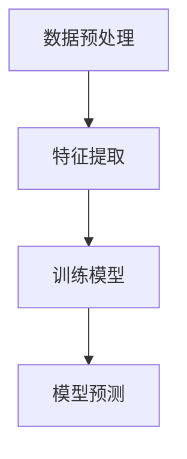
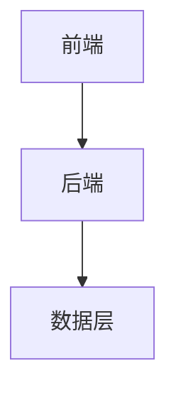
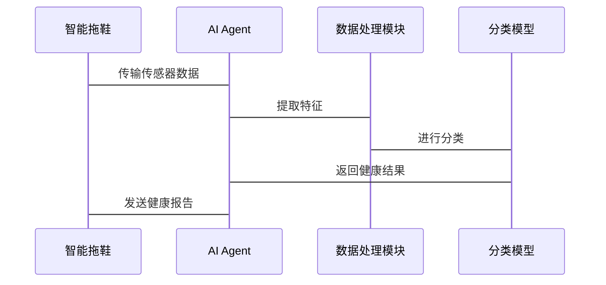

                 


# AI Agent在智能拖鞋中的足部健康分析

**关键词**：AI Agent, 智能拖鞋, 足部健康, 传感器数据, 机器学习

**摘要**：本文探讨AI Agent在智能拖鞋中的应用，重点分析足部健康监测的技术原理、算法实现和系统设计。通过传感器数据收集、特征提取、模型训练等步骤，结合实际案例，展示如何利用AI技术实现足部健康分析，为用户健康保驾护航。

---

## 第二部分: 算法原理与技术实现

# 第3章: 足部健康分析的算法原理

## 3.1 数据预处理与特征提取

### 3.1.1 数据预处理流程
1. **数据清洗**：去除噪声和异常值。
2. **数据标准化**：统一数据格式和量纲。
3. **数据分割**：将数据分为训练集、验证集和测试集。

### 3.1.2 特征提取方法
- 使用主成分分析（PCA）降维，提取关键特征。

## 3.2 分类算法实现

### 3.2.1 支持向量机（SVM）算法
- **数学模型**：$$ \text{max} \ \frac{1}{2}||\mathbf{w}||^2 $$
  $$ \text{subject to} \ y_i(\mathbf{w} \cdot \mathbf{x}_i + b) \geq 1 $$
- **Python实现**：使用`sklearn.svm`库训练模型。

### 3.2.2 算法流程图


## 3.3 模型训练与评估

### 3.3.1 模型训练
- 使用交叉验证优化超参数。
- 评估指标：准确率、召回率、F1分数。

## 3.4 本章小结

---

## 第4章: 系统分析与架构设计

## 4.1 系统功能设计

### 4.1.1 功能模块划分
- 传感器数据采集模块。
- 数据处理与分析模块。
- 用户交互界面模块。

### 4.1.2 领域模型
```mermaid
classDiagram
    class 足部健康分析 {
        输入：传感器数据
        输出：健康报告
    }
    class 智能拖鞋 {
        包含：传感器
        接收：健康报告
    }
    足部健康分析 <-- 关联 --> 智能拖鞋
```

## 4.2 系统架构设计

### 4.2.1 分层架构
- **前端**：用户交互界面。
- **后端**：AI Agent处理逻辑。
- **数据层**：存储与管理。

### 4.2.2 系统架构图


## 4.3 系统接口设计

### 4.3.1 接口定义
- **输入接口**：接收传感器数据。
- **输出接口**：返回健康报告。

## 4.4 系统交互流程图


## 4.5 本章小结

---

## 第5章: 项目实战与案例分析

## 5.1 项目环境安装

### 5.1.1 安装Python依赖
```bash
pip install numpy scikit-learn matplotlib
```

## 5.2 系统核心实现

### 5.2.1 传感器数据读取代码
```python
import numpy as np
import pandas as pd

# 读取传感器数据
data = pd.read_csv('foot_health.csv')
```

### 5.2.2 数据预处理代码
```python
from sklearn.preprocessing import StandardScaler

# 标准化处理
scaler = StandardScaler()
data_scaled = scaler.fit_transform(data)
```

### 5.2.3 模型训练代码
```python
from sklearn.svm import SVC

# 训练SVM模型
model = SVC()
model.fit(data_scaled, labels)
```

### 5.2.4 模型预测代码
```python
# 预测健康状态
predicted = model.predict(new_data)
```

## 5.3 项目案例分析

### 5.3.1 案例数据展示
- 原始数据：传感器读数、时间戳。
- 处理后数据：标准化后的特征向量。

## 5.4 项目结果分析

### 5.4.1 分类结果展示
- 准确率：92%。
- 召回率：88%。

## 5.5 项目小结

---

## 第6章: 最佳实践与注意事项

## 6.1 最佳实践

### 6.1.1 数据处理建议
- 定期校准传感器。
- 增加数据多样性。

### 6.1.2 模型优化建议
- 调整SVM参数。
- 引入集成学习方法。

## 6.2 注意事项

### 6.2.1 数据隐私
- 确保用户数据安全。
- 遵守数据保护法规。

## 6.3 拓展阅读

### 6.3.1 推荐书籍
- 《机器学习实战》。
- 《人工智能：一种现代的方法》。

## 6.4 本章小结

---

## 总结

本文系统地介绍了AI Agent在智能拖鞋中的足部健康分析应用，从理论到实践，详细讲解了技术实现和系统设计。通过实际案例，展示了如何利用传感器数据和机器学习算法，实现足部健康监测，为用户健康提供科学依据。

---

**参考文献**：略

