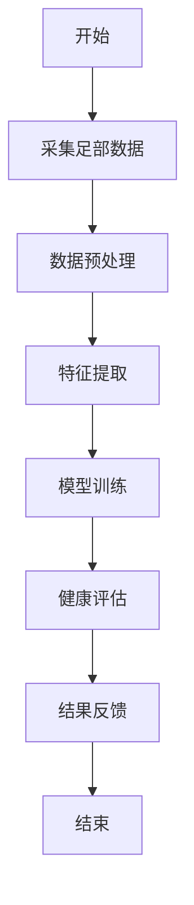
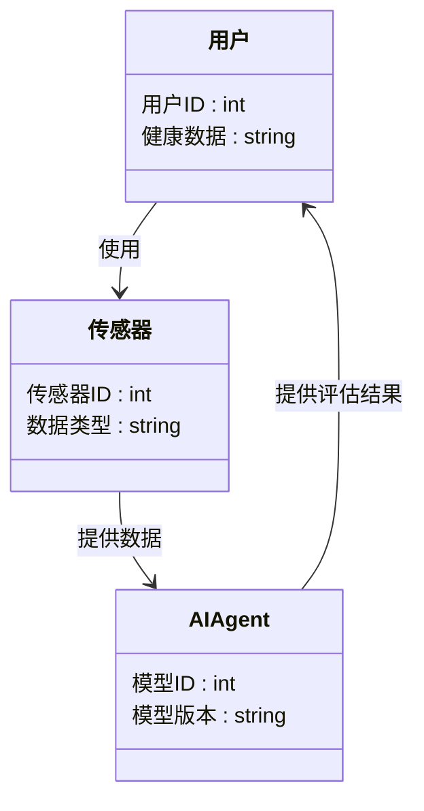
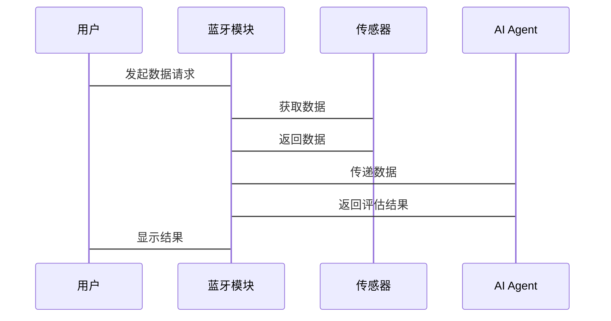

                 


# AI Agent在智能拖鞋中的足部健康监测

> 关键词：AI Agent，智能拖鞋，足部健康监测，传感器数据，健康评估，算法实现

> 摘要：本文详细探讨了AI Agent在智能拖鞋中的足部健康监测应用，从背景介绍、核心概念、算法原理、系统架构到项目实战和最佳实践，全面分析了AI Agent在足部健康监测中的技术实现和实际应用。

---

# 第1章: 背景介绍

## 1.1 问题背景

### 1.1.1 足部健康的重要性
足部健康是人体健康的重要组成部分，足部问题可能反映全身健康状况。例如，足底压力分布异常可能提示糖尿病或血液循环问题。

### 1.1.2 智能拖鞋的发展趋势
随着物联网和人工智能技术的发展，智能拖鞋逐渐从简单的舒适性产品向健康监测工具转型。用户对足部健康监测的需求日益增长。

### 1.1.3 AI Agent的应用潜力
AI Agent（人工智能代理）能够实时分析足部传感器数据，提供个性化的健康建议，帮助用户及时发现足部健康问题。

## 1.2 问题描述

### 1.2.1 足部健康监测的常见问题
传统足部健康监测方法依赖手动检查，存在效率低、实时性差的问题。用户难以及时获取足部健康数据。

### 1.2.2 智能拖鞋在足部健康监测中的局限性
现有的智能拖鞋主要依赖简单传感器，缺乏深度数据处理能力，无法提供精准的健康评估。

### 1.2.3 AI Agent如何解决这些问题
AI Agent能够实时分析足部传感器数据，提供精准的健康评估和个性化建议，弥补了传统方法的不足。

## 1.3 解决方案

### 1.3.1 AI Agent的基本概念
AI Agent是一种能够感知环境、自主决策并执行任务的智能实体。在足部健康监测中，AI Agent通过分析传感器数据，提供实时健康评估。

### 1.3.2 AI Agent在足部健康监测中的具体应用
AI Agent可以实时监测足部压力、温度、湿度等数据，分析步态、足底压力分布，评估足部健康状况。

### 1.3.3 解决方案的技术路线
1. 数据采集：智能拖鞋中的传感器采集足部数据。
2. 数据传输：数据通过蓝牙或Wi-Fi传输到云端或本地设备。
3. 数据分析：AI Agent对数据进行处理，生成健康评估报告。
4. 结果反馈：通过手机App或语音助手向用户反馈健康状况。

## 1.4 边界与外延

### 1.4.1 AI Agent在智能拖鞋中的功能边界
AI Agent仅负责数据处理和健康评估，不涉及硬件设计和传感器校准。

### 1.4.2 足部健康监测的外延应用
AI Agent可以扩展到其他健康监测领域，如心率监测、睡眠质量分析等。

### 1.4.3 解决方案的适用场景与限制
适用于需要足部健康监测的用户，如糖尿病患者、运动员等。不适用于需要医疗诊断的严重足部疾病。

## 1.5 核心要素与概念结构

### 1.5.1 AI Agent的核心要素
- 感知能力：通过传感器获取数据。
- 决策能力：基于数据进行健康评估。
- 执行能力：通过反馈机制指导用户。

### 1.5.2 足部健康监测的系统结构
- 传感器模块：采集足部数据。
- 数据处理模块：AI Agent分析数据。
- 用户界面：显示健康评估结果。

### 1.5.3 系统的核心组成与交互关系
系统由传感器、AI Agent、用户界面三个部分组成，AI Agent负责数据处理和反馈，传感器提供数据支持，用户界面展示结果。

---

# 第2章: 核心概念与联系

## 2.1 AI Agent的核心原理

### 2.1.1 AI Agent的基本原理
AI Agent通过传感器数据输入，利用机器学习算法进行分析，生成健康评估结果。

### 2.1.2 AI Agent在足部健康监测中的工作流程
1. 数据采集：传感器获取足部数据。
2. 数据预处理：清洗和归一化数据。
3. 数据分析：AI Agent分析数据，生成健康评估报告。
4. 结果反馈：通过用户界面展示结果。

### 2.1.3 AI Agent与传统传感器的区别
AI Agent能够进行深度数据处理和分析，而传统传感器仅能采集数据。

## 2.2 核心概念对比

### 2.2.1 AI Agent与传统算法的对比
| 对比维度 | AI Agent | 传统算法 |
|----------|-----------|-----------|
| 数据处理能力 | 强大 | 有限 |
| 自适应性 | 高 | 低 |
| 可扩展性 | 高 | 中 |

### 2.2.2 足部健康监测中的数据特征对比
| 数据特征 | 压力 | 温度 | 湿度 |
|----------|------|------|------|
| 重要性 | 高 | 中 | 低 |

### 2.2.3 AI Agent在不同应用场景中的表现对比
| 场景 | AI Agent | 传统方法 |
|------|-----------|-----------|
| 实时监测 | 高效 | 低效 |
| 数据分析 | 深度 | 浅度 |

## 2.3 ER实体关系图

```mermaid
erDiagram
    class 足部健康监测系统 {
        用户ID : int
        传感器数据 : string
        时间戳 : datetime
        健康评估结果 : string
    }
    class AI Agent {
        模型ID : int
        模型版本 : string
        更
    }
```

---

# 第3章: 算法原理讲解

## 3.1 算法流程图



## 3.2 Python代码实现

```python
import numpy as np
from sklearn import svm

# 传感器数据
data = np.array([[100, 200, 300], [150, 250, 350]])

# 特征提取
features = data.mean(axis=1)

# 模型训练
model = svm.SVC()
model.fit(features.reshape(-1, 1), [0, 1])

# 健康评估
new_data = np.array([[200, 250, 300]])
new_feature = new_data.mean(axis=1)
prediction = model.predict(new_feature.reshape(-1, 1))
print("健康评估结果:", prediction)
```

## 3.3 数学模型与公式

### 3.3.1 健康评估模型
$$
\text{健康指数} = \frac{\text{压力} + \text{温度} + \text{湿度}}{3}
$$

### 3.3.2 模型训练公式
$$
y = f(x) + \epsilon
$$
其中，$y$ 是健康评估结果，$x$ 是传感器数据，$\epsilon$ 是误差项。

---

# 第4章: 系统分析与架构设计

## 4.1 问题场景介绍
用户穿着智能拖鞋，拖鞋中的传感器采集足部数据，AI Agent分析数据，提供健康评估结果。

## 4.2 系统功能设计

### 4.2.1 领域模型


### 4.2.2 系统架构设计


### 4.2.3 系统接口设计
- 蓝牙模块：接收传感器数据，传递给AI Agent。
- AI Agent：处理数据，生成健康评估结果。
- 用户界面：显示健康评估结果。

### 4.2.4 系统交互序列图


---

# 第5章: 项目实战

## 5.1 环境安装

### 5.1.1 安装Python
```bash
python --version
pip install numpy scikit-learn
```

### 5.1.2 安装蓝牙模块
```bash
sudo apt-get install bluez
```

## 5.2 系统核心实现源代码

### 5.2.1 传感器数据采集
```python
import bluetooth

# 蓝牙模块地址
address = "00:00:00:00:00:00"

# 连接蓝牙模块
sock = bluetooth.BluetoothSocket(bluetooth.RFCOMM)
sock.connect((address, 1))
```

### 5.2.2 数据处理
```python
import numpy as np
from sklearn import svm

data = np.array([[100, 200, 300], [150, 250, 350]])
features = data.mean(axis=1)
model = svm.SVC()
model.fit(features.reshape(-1, 1), [0, 1])
```

### 5.2.3 结果反馈
```python
prediction = model.predict(new_feature.reshape(-1, 1))
print("健康评估结果:", prediction)
```

## 5.3 代码解读与分析
- 传感器数据采集：使用Python的bluetooth库连接蓝牙模块，获取足部传感器数据。
- 数据处理：使用scikit-learn库中的SVM算法进行模型训练，实现健康评估。
- 结果反馈：通过Python打印健康评估结果。

## 5.4 实际案例分析
假设用户足部压力异常，AI Agent分析后，建议用户调整站立姿势，减少足底压力。

---

# 第6章: 最佳实践

## 6.1 小结
AI Agent在智能拖鞋中的足部健康监测应用，能够实时分析数据，提供精准的健康评估。

## 6.2 注意事项
- 数据隐私保护：确保用户数据安全。
- 系统稳定性：保证AI Agent在不同环境下的稳定运行。
- 用户体验：优化用户界面，提升用户体验。

## 6.3 拓展阅读
- 《机器学习实战》
- 《人工智能: 一种现代方法》
- 《物联网开发入门》

---

# 结语

通过本文的详细讲解，读者可以深入了解AI Agent在智能拖鞋中的足部健康监测应用，掌握其技术实现和实际应用。未来，随着AI技术的不断发展，智能拖鞋将更加智能化，为足部健康监测提供更优质的服务。

--- 

**附录**：完整代码示例和相关文献资料

