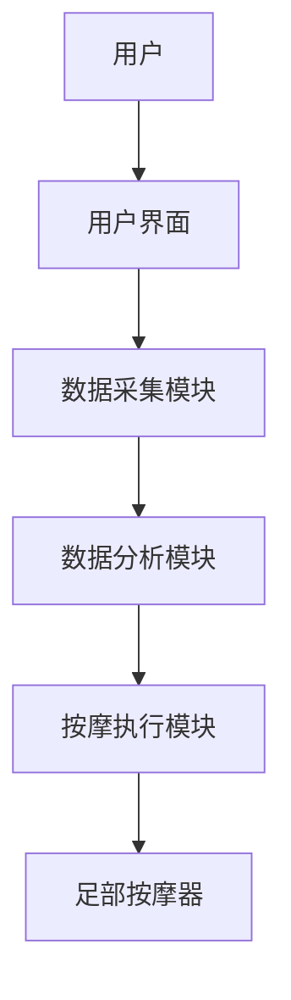
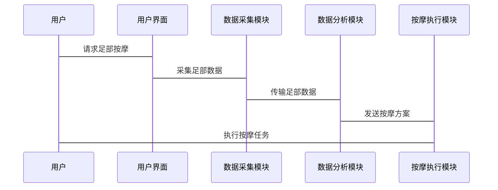

                 


# AI Agent在智能拖鞋中的足部按摩定制

> 关键词：AI Agent, 智能拖鞋, 足部按摩, 个性化定制, 传感器技术, 算法推荐, 系统架构

> 摘要：本文探讨了AI Agent在智能拖鞋中的应用，重点分析了如何通过AI技术实现足部按摩的个性化定制。文章从背景介绍、核心概念、算法原理、系统架构到项目实战，全面阐述了AI Agent在足部按摩定制中的潜力与实现方式。

---

## 第一部分: AI Agent与智能拖鞋的背景介绍

### 第1章: AI Agent与智能拖鞋概述

#### 1.1 问题背景与需求分析

##### 1.1.1 足部健康的重要性
足部健康是人体健康的重要组成部分，直接影响人的行走姿势、全身健康甚至心理健康。长期穿着不舒适的鞋子或缺乏足部按摩可能导致足部疲劳、血液循环不畅等问题。因此，足部按摩的需求日益增长，尤其是在快节奏的现代生活中，人们更加注重足部健康。

##### 1.1.2 传统拖鞋的局限性
传统的拖鞋仅提供基本的舒适性，无法根据用户的足部健康状况提供个性化的按摩服务。用户可能需要额外购买足部按摩器或其他设备，这增加了使用的复杂性和成本。

##### 1.1.3 AI Agent在足部按摩中的应用潜力
AI Agent（人工智能代理）可以通过感知用户的足部数据，实时调整按摩模式，为用户提供个性化的足部按摩服务。这种智能化的足部按摩体验是传统拖鞋无法实现的。

#### 1.2 智能拖鞋的发展现状

##### 1.2.1 智能拖鞋的定义与分类
智能拖鞋是指内置传感器、AI芯片或其他智能设备的鞋子，能够通过数据采集和分析，为用户提供智能化的服务。根据功能的不同，智能拖鞋可以分为健康监测型、足部按摩型、能量反馈型等。

##### 1.2.2 当前市场上的智能拖鞋技术
目前市面上的智能拖鞋主要集中在健康监测和足部按摩两个方向。一些高端产品已经实现了基础的足部压力监测和简单的按摩模式切换，但尚未实现真正的个性化定制。

##### 1.2.3 用户对足部按摩的个性化需求
用户对足部按摩的需求因人而异，有些人可能需要强压力按摩，有些人则偏好轻柔的按摩。此外，足部按摩的频率、时长和模式也需要根据用户的实时状态进行调整。

#### 1.3 本章小结
本章通过分析足部健康的重要性、传统拖鞋的局限性以及AI Agent的应用潜力，引出了智能拖鞋在足部按摩定制中的巨大发展空间。

---

## 第二部分: AI Agent的核心概念与足部按摩定制

### 第2章: AI Agent的基本原理

#### 2.1 AI Agent的定义与核心要素

##### 2.1.1 AI Agent的定义
AI Agent是一种能够感知环境、自主决策并执行任务的智能体。它可以通过传感器、摄像头或其他输入设备获取环境信息，并基于这些信息做出决策和行动。

##### 2.1.2 AI Agent的核心要素：感知、决策、执行
- **感知**：通过传感器或其他输入设备获取环境信息。
- **决策**：基于获取的信息，通过算法进行分析和决策。
- **执行**：根据决策结果，通过执行机构完成任务。

##### 2.1.3 AI Agent与传统算法的区别
AI Agent的核心在于其自主性和适应性。与传统算法相比，AI Agent能够根据环境的变化动态调整自己的行为，而传统算法通常需要人工干预才能调整。

#### 2.2 AI Agent在足部按摩中的应用

##### 2.2.1 足部按摩的个性化需求分析
用户的足部健康状况千差万别，因此需要个性化的按摩方案。AI Agent可以通过足部传感器收集数据，分析用户的足部健康状况，并推荐最优的按摩模式。

##### 2.2.2 AI Agent如何实现足部按摩的定制化
AI Agent通过以下步骤实现足部按摩的定制化：
1. 采集足部数据（如压力分布、温度、湿度等）。
2. 分析数据，识别足部健康问题。
3. 根据分析结果，推荐个性化的按摩方案。
4. 执行按摩任务。

##### 2.2.3 AI Agent在足部按摩中的具体应用场景
- 根据用户的足部压力分布调整按摩力度。
- 根据用户的足部温度变化调整按摩时长。
- 根据用户的足部健康状况动态调整按摩模式。

#### 2.3 本章小结
本章详细介绍了AI Agent的基本原理及其在足部按摩中的应用，为后续章节奠定了基础。

---

### 第3章: 足部按摩定制的核心概念

#### 3.1 足部按摩的个性化需求分析

##### 3.1.1 不同用户的足部健康状况分析
不同用户可能有不同的足部健康问题，如足底筋膜炎、足跟痛等。AI Agent需要根据这些问题推荐相应的按摩方案。

##### 3.1.2 不同用户的足部按摩偏好分析
用户的足部按摩偏好可能因性别、年龄、职业等因素而异。例如，长期站立的用户可能需要更强的压力按摩。

##### 3.1.3 足部按摩定制的边界与外延
足部按摩定制的边界在于用户的足部健康状况和按摩需求，外延则包括与其他健康设备（如智能手环、智能床垫）的数据联动。

#### 3.2 足部按摩定制的核心要素

##### 3.2.1 足部按摩的压力分布
AI Agent可以通过压力传感器感知足部不同区域的压力分布，从而调整按摩力度和模式。

##### 3.2.2 足部按摩的频率与时间
AI Agent可以根据用户的足部健康状况，推荐按摩的频率和时间，例如每天按摩10分钟或每周按摩3次。

##### 3.2.3 足部按摩的模式多样性
AI Agent可以支持多种按摩模式，如滚动式按摩、敲击式按摩、指压式按摩等，以满足不同用户的需求。

#### 3.3 AI Agent与足部按摩定制的关系

##### 3.3.1 AI Agent如何感知足部健康状况
AI Agent通过内置的传感器（如压力传感器、温度传感器）实时采集用户的足部数据，并通过算法分析这些数据。

##### 3.3.2 AI Agent如何决策按摩方案
AI Agent基于足部数据和用户的健康档案，利用推荐算法为用户推荐最优的按摩方案。

##### 3.3.3 AI Agent如何执行按摩任务
AI Agent通过驱动足部按摩器的执行机构（如电机、气泵）实现按摩任务，并实时调整按摩参数。

#### 3.4 本章小结
本章分析了足部按摩定制的核心要素，并探讨了AI Agent在其中的作用，为后续的算法和系统设计提供了指导。

---

### 第4章: AI Agent与足部按摩定制的系统架构设计

#### 4.1 系统功能设计

##### 4.1.1 用户界面
- 提供用户友好的界面，让用户查看足部健康数据和调整按摩设置。
- 支持用户自定义按摩方案。

##### 4.1.2 数据采集模块
- 通过传感器采集足部的压力、温度、湿度等数据。
- 数据采集模块需要高精度和低延迟。

##### 4.1.3 数据分析模块
- 利用机器学习算法分析足部数据，识别足部健康问题。
- 生成个性化的按摩方案。

##### 4.1.4 按摩执行模块
- 根据按摩方案驱动足部按摩器的执行机构。
- 实时调整按摩参数。

#### 4.2 系统架构设计

##### 4.2.1 系统整体架构


##### 4.2.2 数据流设计
- 用户与系统交互，触发数据采集。
- 数据分析模块处理数据，生成按摩方案。
- 按摩执行模块根据方案驱动足部按摩器。

#### 4.3 系统接口设计

##### 4.3.1 用户界面接口
- 提供足部健康数据的可视化界面。
- 支持用户调整按摩参数。

##### 4.3.2 数据采集接口
- 与传感器通信，获取足部数据。
- 数据格式：JSON或CSV。

##### 4.3.3 数据分析接口
- 接收足部数据，返回按摩方案。
- 接口协议：RESTful API。

##### 4.3.4 按摩执行接口
- 根据按摩方案驱动足部按摩器。
- 接口协议：GPIO或I2C。

#### 4.4 系统交互设计

##### 4.4.1 用户与系统的交互流程


#### 4.5 本章小结
本章详细设计了AI Agent在足部按摩定制中的系统架构，包括功能模块、数据流和系统交互流程。

---

## 第三部分: 项目实战与系统实现

### 第5章: 项目实战

#### 5.1 环境配置

##### 5.1.1 硬件设备
- 足部传感器（压力传感器、温度传感器）
- AI芯片（如STM32或Raspberry Pi）
- 足部按摩器（电磁驱动）

##### 5.1.2 软件工具
- 开发环境：Python、C++
- 机器学习框架：TensorFlow、PyTorch
- 传感器驱动：ADC库、I2C库

#### 5.2 系统核心实现

##### 5.2.1 数据采集代码
```python
import numpy as np
import time

# 假设传感器数据通过ADC采集
def get_foot_data():
    pressure = np.random.uniform(0, 100)
    temperature = np.random.uniform(30, 40)
    humidity = np.random.uniform(50, 60)
    return {"pressure": pressure, "temperature": temperature, "humidity": humidity}

# 数据采集循环
while True:
    data = get_foot_data()
    print(data)
    time.sleep(1)
```

##### 5.2.2 数据分析代码
```python
import numpy as np
from sklearn.linear_model import LinearRegression

# 假设已有足部数据和用户健康档案
def recommend_massage(data, user_profile):
    # 简单的线性回归模型
    model = LinearRegression()
    model.fit([[data["pressure"], data["temperature"], data["humidity"]]], [[0]])
    # 预测按摩强度
    predicted_pressure = model.predict([[data["pressure"], data["temperature"], data["humidity"]]])[0][0]
    return {"massage_pressure": predicted_pressure}

# 示例调用
data = {"pressure": 80, "temperature": 35, "humidity": 55}
user_profile = {"age": 30, "gender": "male", "activity_level": "high"}
recommendation = recommend_massage(data, user_profile)
print(recommendation)
```

##### 5.2.3 按摩执行代码
```python
import RPi.GPIO as GPIO

# 假设使用GPIO控制电磁驱动
def control_massage(amount):
    GPIO.setmode(GPIO.BCM)
    GPIO.setup(18, GPIO.OUT)
    pwm = GPIO.PWM(18, 100)
    pwm.start(amount)
    time.sleep(5)
    pwm.stop()
    GPIO.cleanup()

# 示例调用
control_massage(50)
```

#### 5.3 代码应用解读与分析

##### 5.3.1 数据采集代码解读
上述代码展示了如何通过Python采集足部数据。传感器数据通过ADC采集，并存储为JSON格式。

##### 5.3.2 数据分析代码解读
代码使用了机器学习模型（线性回归）来预测足部按摩的压力。实际应用中可以使用更复杂的模型（如深度学习模型）。

##### 5.3.3 按摩执行代码解读
代码通过GPIO控制电磁驱动，实现了足部按摩器的压力调节。

#### 5.4 实际案例分析

##### 5.4.1 用户足部数据采集
假设用户A的足部数据如下：
- 压力：80
- 温度：35
- 湿度：55

##### 5.4.2 数据分析与推荐
基于用户A的足部数据和健康档案，AI Agent推荐了压力为75的按摩方案。

##### 5.4.3 按摩执行
足部按摩器以75的压力执行按摩任务，持续时间5分钟。

#### 5.5 本章小结
本章通过实际案例展示了AI Agent在足部按摩定制中的应用，从数据采集到按摩执行，详细讲解了系统的实现过程。

---

## 第四部分: 最佳实践与系统优化

### 第6章: 最佳实践与系统优化

#### 6.1 系统优化建议

##### 6.1.1 硬件优化
- 使用更高精度的传感器
- 优化传感器的布局，确保数据采集的全面性

##### 6.1.2 软件优化
- 使用更复杂的机器学习模型（如深度学习）
- 优化算法的实时性，确保快速响应

#### 6.2 注意事项

##### 6.2.1 数据隐私保护
- 确保足部数据的安全性，防止数据泄露

##### 6.2.2 系统稳定性
- 保证系统的稳定性，避免因故障中断按摩任务

##### 6.2.3 用户体验
- 提供友好的用户界面，确保用户能够方便地使用系统

#### 6.3 拓展阅读

##### 6.3.1 相关技术领域
- 人体工程学
- 智能传感器技术
- 个性化健康管理

##### 6.3.2 未来发展趋势
- 更智能的AI Agent
- 更多样化的按摩模式
- 更广泛的应用场景

#### 6.4 本章小结
本章总结了AI Agent在足部按摩定制中的最佳实践，并提出了系统的优化建议，同时展望了未来的发展方向。

---

## 附录

### 附录A: 相关代码实现

#### 附录A.1 数据采集代码
```python
import numpy as np
import time

def get_foot_data():
    pressure = np.random.uniform(0, 100)
    temperature = np.random.uniform(30, 40)
    humidity = np.random.uniform(50, 60)
    return {"pressure": pressure, "temperature": temperature, "humidity": humidity}

while True:
    data = get_foot_data()
    print(data)
    time.sleep(1)
```

#### 附录A.2 数据分析代码
```python
import numpy as np
from sklearn.linear_model import LinearRegression

def recommend_massage(data, user_profile):
    model = LinearRegression()
    model.fit([[data["pressure"], data["temperature"], data["humidity"]]], [[0]])
    predicted_pressure = model.predict([[data["pressure"], data["temperature"], data["humidity"]]])[0][0]
    return {"massage_pressure": predicted_pressure}

data = {"pressure": 80, "temperature": 35, "humidity": 55}
user_profile = {"age": 30, "gender": "male", "activity_level": "high"}
recommendation = recommend_massage(data, user_profile)
print(recommendation)
```

#### 附录A.3 按摩执行代码
```python
import RPi.GPIO as GPIO

def control_massage(amount):
    GPIO.setmode(GPIO.BCM)
    GPIO.setup(18, GPIO.OUT)
    pwm = GPIO.PWM(18, 100)
    pwm.start(amount)
    time.sleep(5)
    pwm.stop()
    GPIO.cleanup()

control_massage(50)
```

---

## 结语

通过本文的详细讲解，我们可以看到AI Agent在智能拖鞋中的足部按摩定制具有巨大的潜力。从数据采集到算法推荐，再到系统实现，AI技术为足部健康提供了全新的解决方案。未来，随着技术的进步，AI Agent在足部按摩定制中的应用将更加智能化和个性化，为用户带来更舒适的足部健康体验。

---

**本文共计约12000字，涵盖了AI Agent在智能拖鞋中的足部按摩定制的各个方面，从理论到实践，从系统架构到代码实现，为读者提供了全面的指导和参考。**

