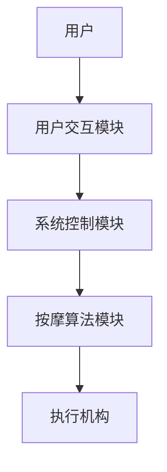

                 

# AI Agent在智能拖鞋中的足部按摩程序设计

## 关键词：AI Agent, 智能拖鞋, 足部按摩, 系统设计, 算法实现

## 摘要：本文详细探讨了AI Agent在智能拖鞋中的足部按摩程序设计，从理论基础到实际应用，系统地分析了AI Agent的核心原理、足部按摩技术的发展、系统架构设计、按摩算法的实现以及项目实战。通过本文，读者将深入了解如何利用AI技术优化足部按摩体验，掌握智能拖鞋的设计方法和实现技巧。

---

# 第1章: AI Agent与足部按摩技术的背景介绍

## 1.1 AI Agent的基本概念

### 1.1.1 AI Agent的定义与特点

AI Agent（人工智能代理）是一种能够感知环境、自主决策并执行任务的智能实体。它具备以下特点：

- **自主性**：能够自主决策，无需外部干预。
- **反应性**：能够实时感知环境并做出反应。
- **目标导向**：基于目标驱动行为。
- **学习能力**：能够通过数据学习和优化。

### 1.1.2 AI Agent的核心功能与应用场景

AI Agent的核心功能包括：

- **感知环境**：通过传感器或数据接口获取环境信息。
- **决策制定**：基于感知信息进行分析和决策。
- **执行任务**：根据决策结果执行具体操作。

应用场景广泛，包括智能家居、自动驾驶、医疗健康等领域。

### 1.1.3 足部按摩技术的发展历程

足部按摩技术经历了从传统手动按摩到现代智能按摩的演变。AI Agent的引入，使得足部按摩更加智能化和个性化。

---

## 1.2 智能拖鞋的市场现状与技术趋势

### 1.2.1 智能拖鞋的市场现状分析

智能拖鞋市场增长迅速，消费者对健康和舒适的追求推动了市场发展。

### 1.2.2 足部按摩技术在智能拖鞋中的应用前景

AI Agent技术的引入，使得智能拖鞋能够提供更精准和个性化的足部按摩服务。

### 1.2.3 AI Agent在智能拖鞋中的潜在价值

AI Agent能够通过学习用户的足部数据，提供个性化按摩方案，提升用户体验。

---

## 1.3 本章小结

本章介绍了AI Agent的基本概念、足部按摩技术的发展历程以及智能拖鞋的市场现状，为后续章节奠定了基础。

---

# 第2章: AI Agent的核心原理与足部按摩技术

## 2.1 AI Agent的感知与决策机制

### 2.1.1 感知模块的功能与实现

感知模块通过传感器获取足部压力、温度等数据。

### 2.1.2 决策模块的算法原理

决策模块基于感知数据，通过机器学习算法制定按摩方案。

### 2.1.3 执行模块的实现方式

执行模块通过驱动电机或其他执行机构实现按摩动作。

### 2.1.4 按摩点的自动识别与优化

AI Agent能够根据用户的足部数据自动识别最佳按摩点，并动态优化按摩路径。

---

## 2.2 足部按摩的生物力学原理

### 2.2.1 足部结构与按摩点分析

足部由骨骼、肌肉和神经组成，按摩点集中在足底反射区。

### 2.2.2 不同按摩方式的生物力学特征

包括滚压、推拿、敲击等不同按摩方式的力学特征。

### 2.2.3 AI Agent如何优化足部按摩效果

通过个性化按摩方案，结合生物力学原理，提升按摩效果。

---

## 2.3 AI Agent与传统足部按摩技术的对比分析

### 2.3.1 传统足部按摩技术的优缺点

优点：经验丰富，效果显著；缺点：依赖人工操作，难以个性化。

### 2.3.2 AI Agent足部按摩技术的核心优势

个性化、精准、高效。

### 2.3.3 AI Agent足部按摩技术的局限性

依赖传感器精度，算法优化空间。

---

## 2.4 本章小结

本章深入分析了AI Agent的核心原理及其在足部按摩技术中的应用，对比了传统技术与AI技术的优劣。

---

# 第3章: 智能拖鞋AI Agent足部按摩系统的架构设计

## 3.1 系统功能模块划分

### 3.1.1 用户交互模块

包括用户界面、指令输入和反馈显示。

### 3.1.2 按摩算法模块

负责数据处理、按摩方案生成和优化。

### 3.1.3 系统控制模块

协调各模块工作，控制执行机构。

---

## 3.2 硬件设计与选型

### 3.2.1 传感器的选择与安装

压力传感器、温度传感器等。

### 3.2.2 按摩机械结构设计

包括电机、传动机构和按摩头设计。

### 3.2.3 系统电源设计

低压电源设计，确保安全性和续航能力。

---

## 3.3 软件设计与实现

### 3.3.1 系统功能设计

包括用户数据管理、按摩方案生成和系统控制。

### 3.3.2 算法实现

基于机器学习的按摩方案生成算法。

### 3.3.3 交互设计

友好的用户界面设计，确保用户体验。

---

## 3.4 系统架构设计

使用Mermaid绘制系统架构图，展示各模块之间的关系。

---

## 3.5 本章小结

本章详细设计了智能拖鞋AI Agent足部按摩系统的硬件和软件架构，为后续实现奠定了基础。

---

# 第4章: AI Agent足部按摩算法的设计与实现

## 4.1 按摩算法的核心思想

基于用户足部数据，动态优化按摩方案。

---

## 4.2 压力感知与按摩路径规划

### 4.2.1 压力感知算法

使用压力传感器采集足部压力数据。

### 4.2.2 按摩路径规划算法

基于压力分布，生成最优按摩路径。

---

## 4.3 个性化按摩方案的推荐算法

### 4.3.1 用户数据采集与分析

包括足部压力分布、用户反馈等。

### 4.3.2 个性化推荐模型

基于机器学习的推荐算法。

---

## 4.4 算法实现与优化

### 4.4.1 算法实现

使用Python实现按摩算法，包括数据采集、处理和推荐。

### 4.4.2 算法优化

通过参数调整和模型优化，提升算法效率和推荐准确性。

---

## 4.5 本章小结

本章详细介绍了AI Agent足部按摩算法的设计与实现，为系统实现提供了技术支持。

---

# 第5章: 项目实战与系统实现

## 5.1 项目环境搭建

### 5.1.1 硬件环境

安装传感器、电机等硬件设备。

### 5.1.2 软件环境

安装Python、机器学习库等开发工具。

---

## 5.2 系统核心实现

### 5.2.1 数据采集与处理

编写代码采集足部压力数据，并进行预处理。

### 5.2.2 按摩算法实现

实现压力感知、路径规划和个性化推荐算法。

### 5.2.3 系统控制与执行

通过控制电机实现按摩动作。

---

## 5.3 项目测试与优化

### 5.3.1 测试环境搭建

设计测试场景，进行功能测试和性能测试。

### 5.3.2 测试结果分析

分析测试数据，优化系统性能。

---

## 5.4 本章小结

本章通过项目实战，详细展示了AI Agent足部按摩系统的实现过程。

---

# 第6章: 系统优化与功能扩展

## 6.1 系统性能优化

### 6.1.1 算法优化

提升算法运行效率，降低计算资源消耗。

### 6.1.2 系统架构优化

优化系统架构，提升整体性能。

---

## 6.2 功能扩展

### 6.2.1 多用户支持

实现多用户数据管理与个性化推荐。

### 6.2.2 远程控制功能

通过手机APP远程控制智能拖鞋。

---

## 6.3 系统安全性与数据隐私保护

### 6.3.1 数据加密

保护用户数据安全。

### 6.3.2 系统授权

确保系统操作的安全性。

---

## 6.4 本章小结

本章探讨了系统优化与功能扩展，为未来研究提供了方向。

---

# 第7章: 总结与展望

## 7.1 全文总结

总结全文内容，强调AI Agent在智能拖鞋足部按摩中的应用价值。

## 7.2 未来展望

展望AI Agent技术在智能拖鞋中的进一步应用，包括更智能化和个性化的按摩服务。

---

# 参考文献

（此处列出相关文献和资源）

---

# 附录

（此处提供代码示例、数据表格等补充材料）

---

以上为《AI Agent在智能拖鞋中的足部按摩程序设计》的技术博客文章的详细目录大纲。

