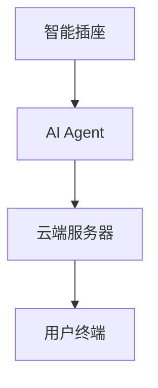
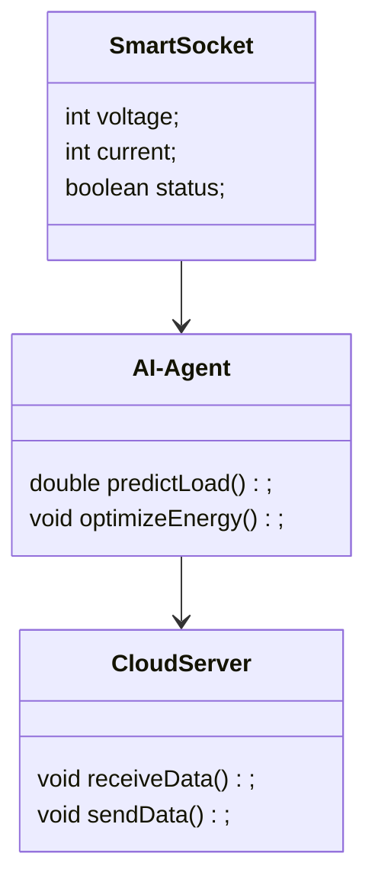
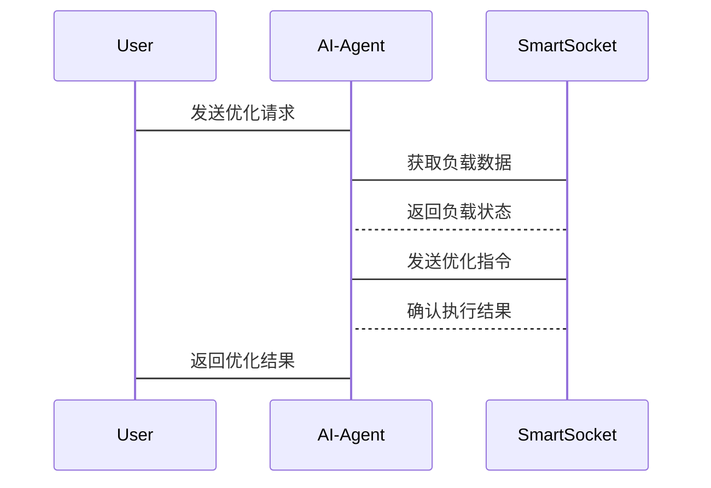

                 


# AI Agent在智能插座中的设备使用优化

> 关键词：AI Agent，智能插座，设备优化，能源管理，智能家居

> 摘要：本文探讨了AI Agent在智能插座中的应用，分析了其优化设备使用的核心原理、技术实现和系统设计。通过实际案例和项目实战，详细阐述了如何利用AI Agent实现智能插座的负载预测、能耗优化和设备管理。文章还总结了AI Agent在智能插座中的优势与挑战，为未来的优化方向提供了参考。

---

## 第一章: AI Agent与智能插座的背景介绍

### 1.1 AI Agent的基本概念

AI Agent（智能代理）是一种能够感知环境、自主决策并执行任务的智能系统。它通过传感器获取信息，利用算法处理数据，并通过执行器与环境交互。AI Agent的核心特征包括自主性、反应性、目标导向性和学习能力。

### 1.2 智能插座的基本概念

智能插座是一种集成物联网技术的电器控制设备，能够通过Wi-Fi或蓝牙连接到智能家居系统。它支持远程控制、定时开关和能耗监测，是智能家居的重要组成部分。

### 1.3 AI Agent在智能插座中的应用背景

随着能源浪费和设备管理复杂性的问题日益突出，利用AI Agent优化智能插座的设备使用成为必然趋势。AI Agent可以通过数据分析和预测，帮助智能插座实现更高效的能源管理和设备调度。

---

## 第二章: AI Agent的核心原理与技术基础

### 2.1 AI Agent的工作原理

AI Agent通过感知环境状态，选择最优动作以实现目标。其工作流程包括状态感知、决策制定和行为执行。

### 2.2 AI Agent的算法基础

- **强化学习算法**：通过奖励机制优化决策策略。
- **监督学习算法**：基于历史数据进行预测和分类。
- **联合学习与分布式计算**：多个AI Agent协同工作，提高系统整体效率。

### 2.3 AI Agent的数学模型与公式

#### 强化学习公式
$$ Q(s,a) = r + \gamma \max Q(s',a') $$
其中，$Q(s,a)$ 表示状态s下动作a的Q值，$r$ 是奖励，$\gamma$ 是折扣因子。

#### 策略网络公式
$$ \pi(a|s) = \text{softmax}(W_{\theta} s + b) $$
其中，$\pi(a|s)$ 表示在状态s下选择动作a的概率。

---

## 第三章: 智能插座的技术基础

### 3.1 智能插座的硬件组成

- **电源管理模块**：负责电力分配和控制。
- **传感器模块**：监测电压、电流和温度。
- **通信模块**：支持Wi-Fi和蓝牙通信。

### 3.2 智能插座的通信协议

- **Wi-Fi**：适用于长距离通信。
- **蓝牙**：适用于短距离通信。
- **ZigBee**：适用于低功耗场景。

---

## 第四章: AI Agent在智能插座中的应用场景

### 4.1 负载预测

AI Agent通过历史数据和实时信息，预测未来负载，优化电力分配。

### 4.2 能耗优化

AI Agent动态调整设备运行状态，减少能源浪费，降低能耗成本。

### 4.3 设备管理

AI Agent协调多个智能插座，优化设备启动和关闭顺序，避免冲突。

---

## 第五章: 系统设计与实现

### 5.1 系统架构设计

使用Mermaid绘制系统架构图，展示各个模块的交互关系。



### 5.2 功能模块设计

#### 领域模型类图



### 5.3 系统交互流程

使用Mermaid序列图展示系统交互流程。



---

## 第六章: 项目实战与代码实现

### 6.1 环境搭建

- **硬件**：智能插座、Raspberry Pi、传感器模块。
- **软件**：Python编程语言，TensorFlow框架，MQTT协议通信。

### 6.2 核心代码实现

```python
# AI Agent算法实现
import numpy as np
from collections import deque

class AI-Agent:
    def __init__(self):
        self.Q = deque()
        self.gamma = 0.9

    def perceive(self, state):
        return self.Q.popleft()

    def learn(self, state, action, reward, next_state):
        target = reward + self.gamma * max(self.Q)
        self.Q.append(target)

    def choose_action(self, state):
        return np.argmax([state[i] + self.Q[i] for i in range(len(self.Q))])
```

### 6.3 实际案例分析

通过具体案例分析AI Agent在智能插座中的优化效果，展示代码实现和优化结果。

---

## 第七章: 优化与展望

### 7.1 当前技术的局限性

- 计算资源限制
- 数据隐私问题
- 多设备协同的复杂性

### 7.2 未来的优化方向

- 提高AI Agent的学习效率
- 优化智能插座的通信协议
- 增强系统的可扩展性和稳定性

### 7.3 最佳实践

- 定期更新AI Agent模型
- 加强数据隐私保护
- 提高用户交互体验

---

## 总结

本文系统地介绍了AI Agent在智能插座中的设备优化应用，从背景介绍到系统设计，再到项目实战，全面分析了其技术实现和优化策略。未来，随着AI技术的进步，AI Agent在智能插座中的应用将更加广泛和深入，为智能家居的发展提供更高效的支持。

---

## 参考文献

1. Russell, S., & Norvig, P. (2010). Artificial Intelligence: A Modern Approach.
2. LeCun, Y., Bengio, Y., & Hinton, G. (2015). Deep learning. Nature, 521(7552), 436-444.

