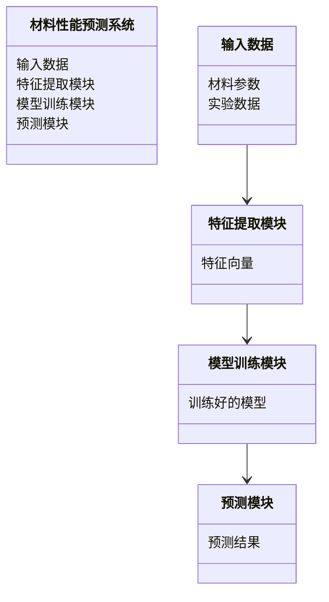
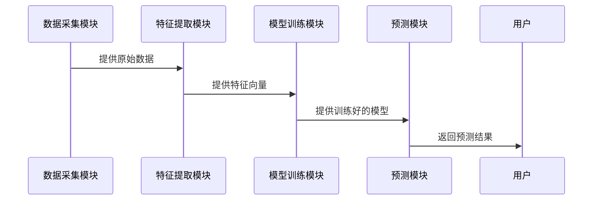

                 


# AI Agent在智能材料性能预测中的角色

## 关键词：
- AI Agent
- 智能材料
- 性能预测
- 机器学习
- 数据分析

## 摘要：
本文探讨了AI Agent在智能材料性能预测中的核心作用，分析了其感知、决策和执行机制，并详细介绍了相关算法和系统架构设计。通过实际案例，展示了AI Agent如何提升材料性能预测的效率和准确性，为未来研究提供了方向和启示。

---

# 第一部分: AI Agent与智能材料性能预测的背景介绍

## 第1章: AI Agent与智能材料的基本概念

### 1.1 AI Agent的定义与核心原理

#### 1.1.1 AI Agent的基本定义
AI Agent是一种能够感知环境、自主决策并采取行动以实现目标的智能系统。它结合了感知、推理、学习和执行能力，能够适应复杂环境的变化。

#### 1.1.2 AI Agent的核心特征
- **自主性**：能够在没有外部干预的情况下运行。
- **反应性**：能够实时感知环境并做出反应。
- **学习能力**：通过数据和经验不断优化性能。
- **社交能力**：能够与其他系统或人类进行交互协作。

#### 1.1.3 AI Agent与传统算法的区别
传统的算法通常需要明确的规则和输入，而AI Agent具有自主决策和学习能力，能够处理复杂和动态的环境。

### 1.2 智能材料的基本概念

#### 1.2.1 智能材料的定义
智能材料是指能够感知外界环境变化（如温度、压力、光照等）并做出相应响应的材料。这些材料通常具有自适应性和智能性，能够在不同条件下表现出不同的性能。

#### 1.2.2 智能材料的主要类型
- **形状记忆合金**：在外力作用下可以恢复原状。
- **压电材料**：能够将机械能转化为电能。
- **热敏材料**：对温度变化敏感，能够改变其物理性质。

#### 1.2.3 智能材料的应用领域
- **制造业**：用于生产过程中的自动化控制。
- **航空航天**：用于结构健康监测和自适应飞行控制。
- **医疗领域**：用于生物传感器和药物递送系统。

### 1.3 智能材料性能预测的背景与意义

#### 1.3.1 材料性能预测的重要性
材料性能预测是设计和优化材料的关键步骤，直接影响产品的性能和成本。

#### 1.3.2 AI Agent在材料性能预测中的作用
AI Agent能够通过数据驱动的方法，快速预测材料的性能，并优化其设计参数。

#### 1.3.3 当前研究的现状与挑战
当前研究主要集中在材料性能的实验测量和物理建模，但随着数据量的增加和计算能力的提升，AI Agent在材料性能预测中的应用越来越受到关注。

## 第2章: AI Agent在智能材料性能预测中的问题背景

### 2.1 材料性能预测的传统方法

#### 2.1.1 实验法的优缺点
- **优点**：结果准确，可靠性高。
- **缺点**：成本高，周期长，难以处理复杂问题。

#### 2.1.2 物理建模法的优缺点
- **优点**：基于物理规律，结果具有理论依据。
- **缺点**：建模复杂，计算量大，难以处理多因素影响。

#### 2.1.3 统计分析法的优缺点
- **优点**：简单易行，适合小样本数据。
- **缺点**：依赖假设，结果可能不够准确。

### 2.2 AI Agent在材料性能预测中的优势

#### 2.2.1 数据驱动的优势
AI Agent能够利用大数据进行建模和预测，提高预测的准确性和效率。

#### 2.2.2 自适应学习的优势
AI Agent能够通过不断学习优化模型，适应环境的变化。

#### 2.2.3 多任务协同的优势
AI Agent可以在多个任务之间协同工作，提高整体效率。

### 2.3 当前研究中的主要挑战

#### 2.3.1 数据质量问题
数据的不完整性和噪声会影响预测的准确性。

#### 2.3.2 模型泛化能力不足
现有的模型在面对新数据时泛化能力不足，难以应对复杂问题。

#### 2.3.3 计算资源限制
复杂的计算任务需要大量计算资源，限制了AI Agent的应用。

---

# 第二部分: AI Agent的核心概念与原理

## 第3章: AI Agent的核心概念与原理

### 3.1 AI Agent的感知机制

#### 3.1.1 数据采集与处理
AI Agent通过传感器采集环境数据，并进行预处理，去除噪声和异常值。

#### 3.1.2 特征提取与降维
通过特征提取和降维技术，将原始数据转换为有意义的特征向量，减少计算复杂度。

#### 3.1.3 感知模型的构建
基于机器学习算法，构建感知模型，识别环境中的关键特征。

### 3.2 AI Agent的决策机制

#### 3.2.1 基于概率的决策模型
利用概率论和贝叶斯网络，计算不同决策的概率，选择最优决策。

#### 3.2.2 基于强化学习的决策模型
通过强化学习算法，学习最优决策策略，提高决策的准确性。

#### 3.2.3 基于知识图谱的决策模型
利用知识图谱和逻辑推理，进行决策推理，提高决策的智能性。

### 3.3 AI Agent的执行机制

#### 3.3.1 行为规划与优化
根据决策结果，制定行动计划，并进行优化，确保行动的高效性。

#### 3.3.2 多目标优化策略
在多目标优化问题中，通过权衡不同目标，找到最优解。

#### 3.3.3 执行结果的反馈机制
将执行结果反馈给感知系统，形成闭环，持续优化系统性能。

## 第4章: AI Agent的核心算法与数学模型

### 4.1 基于概率的模型

#### 4.1.1 贝叶斯网络的构建
贝叶斯网络是一种有向无环图，表示变量之间的概率关系。

#### 4.1.2 马尔可夫链的应用
马尔可夫链用于描述系统状态转移的概率，常用于时间序列分析。

#### 4.1.3 概率分布的计算
通过概率分布模型，计算变量的概率密度函数，为决策提供依据。

### 4.2 基于强化学习的模型

#### 4.2.1 Q-learning算法
Q-learning是一种无模型强化学习算法，通过Q表记录状态-动作的价值，更新策略。

#### 4.2.2 Deep Q-Networks (DQN)算法
DQN结合深度神经网络和Q-learning，能够处理高维状态空间。

#### 4.2.3 政策梯度方法
政策梯度方法通过优化策略的参数，直接最大化奖励函数。

### 4.3 基于知识图谱的模型

#### 4.3.1 知识图谱的构建与表示
知识图谱通过实体和关系的构建，表示领域知识。

#### 4.3.2 知识推理的逻辑框架
通过逻辑推理，在知识图谱上进行推理，支持决策。

#### 4.3.3 知识图谱的动态更新
根据新数据，动态更新知识图谱，保持知识的准确性。

---

# 第三部分: 系统分析与架构设计

## 第5章: 系统分析与架构设计方案

### 5.1 问题场景介绍

#### 5.1.1 项目介绍
以预测高温陶瓷的热导率为案例，展示AI Agent在智能材料性能预测中的应用。

### 5.2 系统功能设计

#### 5.2.1 领域模型设计
使用Mermaid类图，展示系统中的实体和关系。



### 5.3 系统架构设计

#### 5.3.1 系统架构图
展示系统的模块划分和交互关系。


#### 5.3.2 系统交互设计



---

# 第四部分: 项目实战

## 第6章: 项目实战

### 6.1 环境配置

#### 6.1.1 安装Python和相关库
安装Python 3.8及以上版本，安装TensorFlow、Keras、scikit-learn等库。

### 6.2 核心实现

#### 6.2.1 数据预处理代码
```python
import numpy as np
import pandas as pd

# 加载数据
data = pd.read_csv('material_data.csv')

# 数据标准化
from sklearn.preprocessing import StandardScaler
scaler = StandardScaler()
scaled_data = scaler.fit_transform(data)
```

#### 6.2.2 模型训练代码
```python
from tensorflow.keras.models import Sequential
from tensorflow.keras.layers import Dense

# 构建神经网络模型
model = Sequential()
model.add(Dense(64, activation='relu', input_dim=len(scaled_data[0])))
model.add(Dense(1, activation='sigmoid'))

model.compile(optimizer='adam', loss='binary_crossentropy', metrics=['accuracy'])
model.fit(scaled_data, labels, epochs=100, batch_size=32)
```

#### 6.2.3 结果分析代码
```python
# 预测结果
predictions = model.predict(test_data)
# 计算准确率
accuracy = accuracy_score(true_labels, predictions)
print(f'准确率: {accuracy}')
```

### 6.3 案例分析

#### 6.3.1 数据来源与处理
使用高温陶瓷材料的实验数据，包括温度、压力、成分比例等特征。

#### 6.3.2 模型训练与评估
通过训练好的模型，预测材料的热导率，并与实验数据进行对比，评估模型的准确性。

#### 6.3.3 结果分析与优化
分析预测结果与实际值的差异，调整模型参数，优化预测性能。

---

# 第五部分: 总结与展望

## 第7章: 总结与展望

### 7.1 小结
本文详细介绍了AI Agent在智能材料性能预测中的应用，探讨了其核心概念、算法原理和系统架构设计，通过实际案例展示了其在性能预测中的优势。

### 7.2 注意事项
- 数据的质量直接影响预测结果，需注意数据清洗和特征选择。
- 模型的泛化能力需要通过交叉验证和调参优化。
- 系统的设计需考虑可扩展性和可维护性。

### 7.3 拓展阅读
- 《机器学习实战》
- 《深度学习》
- 《知识图谱与智能应用》

---

通过本文的探讨，读者可以全面了解AI Agent在智能材料性能预测中的角色及其应用，为未来的研究和实践提供了重要的参考。

