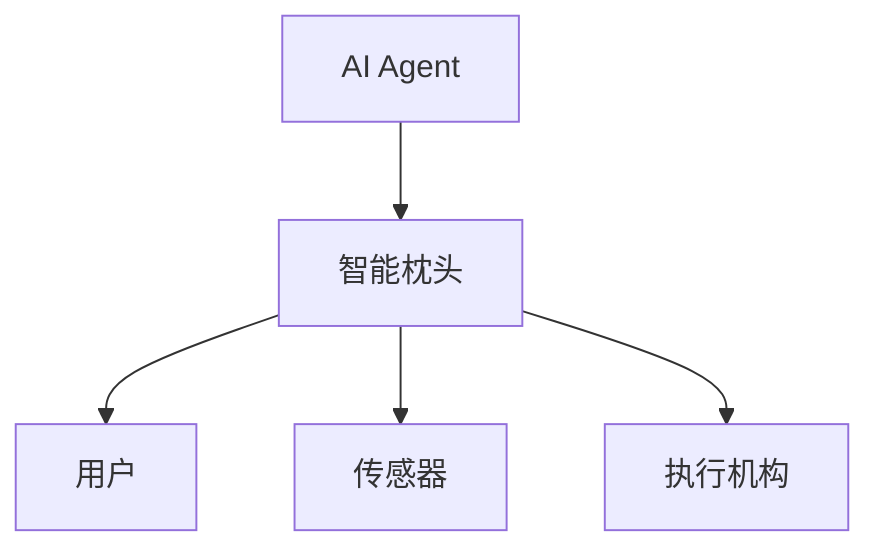

                 


# AI Agent在智能枕头中的颈椎保护

## 关键词：AI Agent, 智能枕头, 颈椎保护, 生物力学模型, 算法实现, 系统架构

## 摘要：
本文探讨了AI Agent在智能枕头中的应用，重点分析了其在颈椎保护方面的潜力和实现方法。通过介绍AI Agent的核心原理、智能枕头的生物力学模型、系统架构设计、算法实现及项目实战，本文展示了如何利用AI技术优化智能枕头的功能，从而有效保护用户的颈椎健康。文章最后总结了系统的优化方向和未来的发展前景。

---

# 第一部分: AI Agent与智能枕头的背景与基础

## 第1章: AI Agent与颈椎保护的背景介绍

### 1.1 颈椎健康问题的现状
#### 1.1.1 颈椎问题的普遍性与危害性
颈椎病是一种常见的健康问题，尤其在现代社会中，长时间低头使用电子设备导致的颈椎问题日益严重。颈椎病不仅影响健康，还可能导致严重的身体功能障碍，如手臂麻木、肩颈疼痛等。

#### 1.1.2 现有颈椎保护方法的局限性
传统的方法，如药物治疗和物理疗法，虽然在一定程度上缓解症状，但难以从根本上解决问题。现有的枕头产品大多只能提供固定的支撑，无法根据用户的动态需求进行调整。

#### 1.1.3 AI技术在健康领域的应用潜力
AI技术的发展为个性化健康解决方案提供了可能。通过AI Agent，智能设备可以实时监测用户的身体状况，并根据数据动态调整参数，提供个性化的保护。

### 1.2 智能枕头的发展现状
#### 1.2.1 智能枕头的概念与分类
智能枕头是一种结合了传感器和智能算法的睡眠辅助产品，能够监测用户的睡眠质量并进行相应的调整。

#### 1.2.2 现有智能枕头的功能与不足
现有智能枕头主要集中在监测睡眠质量和调节枕头高度，但缺乏动态适应能力，无法根据用户的颈椎健康状况实时调整。

#### 1.2.3 AI Agent在智能枕头中的应用前景
AI Agent的引入将使智能枕头能够实时感知用户的身体状态，并通过智能算法优化枕头的支撑和角度，从而提供更有效的颈椎保护。

### 1.3 AI Agent的基本概念与原理
#### 1.3.1 AI Agent的定义与特点
AI Agent是一种能够感知环境、自主决策并执行任务的智能实体。它具有自主性、反应性、目标导向和学习能力等特点。

#### 1.3.2 AI Agent的核心功能与应用场景
AI Agent的核心功能包括感知、决策和执行。在智能枕头中，AI Agent可以感知用户的颈椎压力，决策如何调整枕头的支撑，并执行相应的调整。

#### 1.3.3 AI Agent在智能枕头中的具体应用
AI Agent可以实时监测用户的颈椎压力，动态调整枕头的支撑力和角度，从而有效保护用户的颈椎健康。

### 1.4 本章小结
颈椎健康问题日益严重，现有解决方案存在局限性。AI Agent的应用为智能枕头提供了新的可能性，能够实时监测和调整，为用户提供个性化的颈椎保护。

---

## 第2章: AI Agent与智能枕头的核心概念与联系

### 2.1 AI Agent的核心原理
#### 2.1.1 AI Agent的感知与决策机制
AI Agent通过传感器感知环境数据，利用算法进行分析和决策。例如，AI Agent可以通过压力传感器监测用户的颈椎压力，并根据数据调整枕头的支撑。

#### 2.1.2 AI Agent的执行与反馈机制
AI Agent根据决策结果执行操作，并通过反馈机制不断优化。例如，AI Agent可以根据监测到的颈椎压力调整枕头的支撑力，并根据用户的反馈进一步优化。

#### 2.1.3 AI Agent的自适应学习能力
AI Agent通过机器学习算法不断优化自身的决策模型，提高调整的精准度和效果。

### 2.2 智能枕头的生物力学模型
#### 2.2.1 颈椎力学的基本原理
颈椎力学涉及人体力学平衡和肌肉骨骼的协调。智能枕头需要根据这些力学原理设计支撑和调整策略。

#### 2.2.2 智能枕头的支撑与调节机制
智能枕头通过调整内部填充物或机械结构来改变支撑力和角度。AI Agent可以根据用户的颈椎压力动态调整这些参数。

#### 2.2.3 AI Agent在生物力学模型中的应用
AI Agent通过分析生物力学数据，优化枕头的支撑和角度，从而有效保护用户的颈椎。

### 2.3 AI Agent与智能枕头的实体关系图
```mermaid
entityDiagram
    actor 用户
    actor 环境
    entity 智能枕头
    entity AI Agent
    entity 颈椎健康数据
    entity 调整指令

    用户 --> 智能枕头: 使用
    环境 --> 智能枕头: 所处环境
    智能枕头 --> AI Agent: 提供数据
    AI Agent --> 智能枕头: 发出指令
```

### 2.4 本章小结
AI Agent的核心原理和智能枕头的生物力学模型为后续的设计和实现奠定了基础。通过实体关系图可以看出，AI Agent与智能枕头的交互是实现颈椎保护的关键。

---

## 第3章: AI Agent的算法原理

### 3.1 算法概述
#### 3.1.1 算法的整体流程
AI Agent的算法流程包括数据采集、分析与处理、决策生成和执行反馈四个阶段。

#### 3.1.2 算法的输入与输出
输入包括颈椎压力、角度数据等，输出包括调整指令和反馈信息。

### 3.2 算法实现
#### 3.2.1 算法的数学模型
支撑力调整模型：
$$ F = k \cdot (θ - θ_0) $$
其中，\( F \) 是调整后的支撑力，\( k \) 是比例常数，\( θ \) 是当前角度，\( θ_0 \) 是目标角度。

#### 3.2.2 算法的优化
通过机器学习算法优化决策模型，提高调整的准确性和响应速度。

### 3.3 算法实现的代码示例
```python
import numpy as np

def adjust_support(stress, target_angle):
    # 计算当前角度
    current_angle = np.arctan(stress)
    # 计算调整后的支撑力
    support = k * (current_angle - target_angle)
    return support

# 示例数据
stress = 5
target_angle = np.pi/4
k = 0.1

support = adjust_support(stress, target_angle)
print("调整后的支撑力:", support)
```

### 3.4 算法的优缺点
优点：实时性强，能够动态调整；缺点：需要大量的数据训练和计算资源。

---

## 第4章: 智能枕头系统的架构与设计

### 4.1 系统架构


### 4.2 功能模块设计
- 数据采集模块：负责采集用户的颈椎压力和角度数据。
- 决策模块：基于AI算法生成调整指令。
- 执行模块：根据指令调整枕头的支撑和角度。

### 4.3 接口设计
- 传感器接口：用于采集颈椎压力和角度数据。
- 用户接口：用于显示调整结果和用户反馈。

### 4.4 交互流程
用户使用智能枕头，系统通过传感器采集数据，AI Agent分析数据并生成调整指令，执行机构根据指令调整枕头的支撑和角度。

---

## 第5章: 项目实战

### 5.1 环境配置
安装必要的库和工具，如Python的TensorFlow库。

### 5.2 数据采集与处理
通过传感器采集用户的颈椎压力和角度数据，进行预处理和特征提取。

### 5.3 算法实现
编写Python代码实现AI Agent的算法，训练模型并进行测试。

### 5.4 测试与优化
测试系统的性能和效果，分析结果并优化算法和系统设计。

### 5.5 实际案例分析
通过实际测试案例分析系统的调整效果和用户反馈，进一步优化系统。

---

## 第6章: 系统优化与扩展

### 6.1 性能优化
优化算法的计算速度和准确性，提高系统的响应速度。

### 6.2 用户体验优化
改善用户界面和交互流程，提升用户的使用体验。

### 6.3 市场应用与前景
探讨智能枕头的市场前景和商业价值，分析其在健康科技领域的发展潜力。

---

## 第7章: 总结与展望

### 总结
本文详细介绍了AI Agent在智能枕头中的应用，探讨了其在颈椎保护方面的潜力和实现方法。通过系统的架构设计和算法实现，展示了如何利用AI技术优化智能枕头的功能，为用户提供个性化的颈椎保护。

### 未来展望
未来，随着AI技术的不断发展，智能枕头将具有更强大的功能和更广泛的应用场景。AI Agent将在健康科技领域发挥更大的作用，为用户的健康保驾护航。

---

通过以上内容，我们可以看到，AI Agent在智能枕头中的应用为颈椎保护提供了新的解决方案。结合生物力学模型和智能算法，智能枕头能够实时调整支撑和角度，为用户提供个性化的颈椎保护。未来，随着技术的进一步发展，智能枕头将变得更加智能化和个性化，为用户的健康带来更大的福祉。

