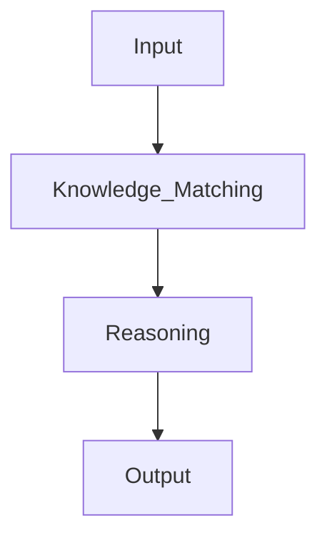

                 


# AI Agent在智能法律咨询系统中的角色

**关键词：AI Agent, 智能法律咨询, 知识图谱, 自然语言处理, 法律推理**

**摘要：**  
随着人工智能技术的快速发展，AI Agent（人工智能代理）在智能法律咨询系统中的应用日益广泛。本文从AI Agent的基本概念出发，详细探讨其在法律咨询系统中的角色定位、技术实现及实际应用场景。通过分析AI Agent的核心算法、系统架构和项目实战，本文旨在揭示AI Agent如何提升法律咨询系统的智能化水平，为用户和开发者提供深入的技术洞见。

---

# 第1章: AI Agent的基本概念与技术原理

## 1.1 AI Agent的定义与核心特征

### 1.1.1 AI Agent的定义  
AI Agent（人工智能代理）是一种能够感知环境、自主决策并执行任务的智能体。它通过传感器获取信息，利用推理引擎进行分析，并通过执行器与外部环境交互。

### 1.1.2 AI Agent的核心特征  
- **自主性**：AI Agent能够在没有外部干预的情况下独立运作。  
- **反应性**：能够实时感知环境并做出响应。  
- **目标导向**：具有明确的目标，并通过规划和推理实现目标。  
- **学习能力**：能够通过经验优化自身的行为。  

### 1.1.3 AI Agent与传统软件的区别  
| 特性            | AI Agent                     | 传统软件               |
|-----------------|------------------------------|-----------------------|
| 自主性          | 高                          | 低                    |
| 学习能力        | 高                          | 无                    |
| 适应性          | 高                          | 低                    |
| 决策能力        | 高                          | 无                    |

---

## 1.2 AI Agent的主要类型

### 1.2.1 知识型AI Agent  
基于知识库进行推理的AI Agent。例如，医疗诊断系统利用医学知识库为患者提供诊断建议。

### 1.2.2 数据驱动型AI Agent  
通过大量数据训练，利用机器学习模型进行预测和决策。例如，推荐系统根据用户行为推荐商品。

### 1.2.3 混合型AI Agent  
结合知识型和数据驱动型AI Agent的优势，既能利用知识库推理，又能通过数据驱动进行优化。

---

## 1.3 AI Agent在法律咨询中的应用潜力

### 1.3.1 法律咨询的基本需求与痛点  
- **需求**：用户需要快速获取法律建议、案例分析和法律文档解读。  
- **痛点**：传统法律咨询耗时长、成本高，且依赖人工经验。

### 1.3.2 AI Agent在法律咨询中的角色定位  
- **辅助工具**：帮助律师快速检索法律条文和案例。  
- **独立服务**：为用户提供初步法律建议，降低咨询成本。  
- **系统集成**：作为法律咨询系统的核心模块，提升整体效率。

### 1.3.3 AI Agent的优势与局限性  
- **优势**：高效、低成本、7x24小时可用。  
- **局限性**：依赖数据质量，难以处理复杂法律问题。

---

# 第2章: 智能法律咨询系统的发展背景

## 2.1 法律咨询系统的演变历程

### 2.1.1 传统法律咨询模式  
- **特点**：人工主导，效率低，成本高。  
- **应用场景**：律师事务所、法律服务机构。

### 2.1.2 网络化法律咨询模式  
- **特点**：通过互联网提供咨询服务，突破地域限制。  
- **应用场景**：线上法律服务平台。

### 2.1.3 智能化法律咨询模式  
- **特点**：结合AI技术，提供智能化、个性化的咨询服务。  
- **应用场景**：智能法律咨询系统、法律机器人。

---

## 2.2 当前法律咨询系统的技术挑战

### 2.2.1 数据获取与处理的难度  
- 法律数据分散，清洗和标注成本高。  
- 数据隐私和合规性问题。

### 2.2.2 知识表示与推理的复杂性  
- 法律知识体系复杂，难以构建统一的知识图谱。  
- 推理过程中需要考虑多种法律条文的关联性。

### 2.2.3 用户需求的理解与匹配  
- 用户需求多样且模糊，难以准确理解。  
- 如何实现精准的意图识别是关键。

---

## 2.3 AI Agent在法律咨询中的角色定位

### 2.3.1 作为辅助工具的角色  
AI Agent帮助律师快速检索法律条文和案例，提高工作效率。

### 2.3.2 作为独立服务的角色  
AI Agent为用户提供初步法律建议，降低咨询成本。

### 2.3.3 作为系统集成的一部分  
AI Agent作为法律咨询系统的核心模块，实现智能化的咨询流程。

---

## 2.4 本章小结  

---

# 第3章: AI Agent与法律咨询系统的结合

## 3.1 AI Agent在法律咨询中的核心功能

### 3.1.1 信息检索与知识匹配  
AI Agent通过自然语言处理技术，快速匹配用户需求与法律知识库中的相关内容。

### 3.1.2 用户意图识别与需求分析  
利用自然语言理解（NLU）技术，准确识别用户的法律需求。

### 3.1.3 法律推理与建议生成  
基于知识图谱和推理算法，生成个性化的法律建议。

---

## 3.2 AI Agent与法律知识库的结合

### 3.2.1 法律知识库的构建与管理  
- **构建**：通过法律专家标注和自然语言处理技术，构建结构化的法律知识库。  
- **管理**：定期更新和维护知识库，确保内容的准确性和时效性。

### 3.2.2 知识图谱的构建与应用  
- **构建**：将法律条文、案例和术语转化为知识图谱。  
- **应用**：通过图谱查询和推理，快速获取相关法律信息。

### 3.2.3 基于知识图谱的推理机制  
- **推理算法**：使用基于规则的推理和基于学习的推理结合的方法。  
- **流程图示**：  
  ```mermaid
  graph TD
    A[用户需求] --> B[知识匹配]
    B --> C[法律推理]
    C --> D[结果生成]
  ```

---

## 3.3 AI Agent在法律咨询系统中的工作流程

### 3.3.1 用户输入与需求分析  
- **输入方式**：用户通过自然语言输入问题。  
- **需求分析**：AI Agent通过NLU技术理解用户意图。

### 3.3.2 知识匹配与推理  
- **知识匹配**：AI Agent从知识库中匹配相关法律条文和案例。  
- **法律推理**：基于知识图谱进行推理，生成初步建议。

### 3.3.3 结果生成与反馈  
- **结果生成**：AI Agent生成个性化法律建议，并提供相关案例支持。  
- **反馈优化**：根据用户反馈优化建议内容。

---

## 3.4 本章小结  

---

# 第4章: AI Agent在法律咨询系统中的技术实现

## 4.1 AI Agent的核心算法与模型

### 4.1.1 基于大语言模型的自然语言处理  
- **模型**：如GPT-3、GPT-4等大语言模型。  
- **流程图示**：  
  ```mermaid
  graph TD
    A[用户输入] --> B[模型处理]
    B --> C[结果生成]
  ```

### 4.1.2 基于知识图谱的推理算法  
- **算法**：基于规则的推理和基于学习的推理结合。  
- **代码示例**：  
  ```python
  def legal_reasoning(knowledge_graph, query):
      result = knowledge_graph.query(query)
      return result
  ```

### 4.1.3 基于强化学习的对话生成  
- **方法**：通过强化学习优化对话生成的流畅性和准确性。  
- **流程图示**：  
  ```mermaid
  graph TD
    A[用户输入] --> B[状态更新]
    B --> C[动作选择]
    C --> D[输出生成]
  ```

---

## 4.2 AI Agent的系统架构设计

### 4.2.1 系统功能模块划分  
- **输入模块**：接收用户输入。  
- **处理模块**：包括知识匹配、推理和生成。  
- **输出模块**：将结果反馈给用户。

### 4.2.2 模块之间的交互关系  


### 4.2.3 系统的扩展性与可维护性  
- **模块化设计**：各模块相对独立，便于维护和扩展。  
- **接口标准化**：模块间通过标准接口通信，确保兼容性。

---

## 4.3 系统接口与数据流设计

### 4.3.1 用户端接口设计  
- **输入接口**：支持文本输入和语音输入。  
- **输出接口**：以文本或语音形式反馈结果。

### 4.3.2 后台服务接口设计  
- **知识库接口**：与法律知识库进行交互。  
- **推理引擎接口**：调用推理算法生成结果。

---

## 4.4 本章小结  

---

# 第5章: 项目实战——构建智能法律咨询系统

## 5.1 环境安装与配置

### 5.1.1 安装Python环境  
```bash
python --version
pip install --upgrade pip
```

### 5.1.2 安装依赖库  
```bash
pip install numpy pandas spacy transformers
```

---

## 5.2 系统核心实现

### 5.2.1 知识库构建  
```python
from spacy.lang.zh import Chinese
import spacy

# 加载中文分词模型
nlp = Chinese()

# 示例文本
text = "合同纠纷 法律责任"
doc = nlp(text)

# 提取关键词
keywords = [token.text for token in doc]
print(keywords)
```

### 5.2.2 推理引擎实现  
```python
def legal_reasoning(knowledge_graph, query):
    # 简单的基于关键词的匹配
    results = []
    for key in knowledge_graph:
        if query in key:
            results.append(knowledge_graph[key])
    return results
```

### 5.2.3 对话生成优化  
```python
import transformers

# 加载预训练模型
model = transformers.AutoModelForCausalLM.from_pretrained("gpt2")
tokenizer = transformers.AutoTokenizer.from_pretrained("gpt2")

# 生成对话
input_text = "请问如何处理合同纠纷？"
input_ids = tokenizer.encode(input_text, return_tensors="pt")
output = model.generate(input_ids, max_length=100)
print(tokenizer.decode(output[0], skip_special_tokens=True))
```

---

## 5.3 实际案例分析

### 5.3.1 案例背景  
用户询问：“如果合同中未约定违约金，该如何处理？”

### 5.3.2 系统处理流程  
1. **输入模块**：接收用户输入。  
2. **知识匹配**：从知识库中匹配相关法律条文。  
3. **推理引擎**：生成初步建议。  
4. **输出模块**：反馈结果给用户。

---

## 5.4 本章小结  

---

# 第6章: 最佳实践与注意事项

## 6.1 最佳实践

### 6.1.1 数据质量管理  
确保法律知识库的准确性和完整性。

### 6.1.2 系统可解释性  
提升AI Agent的可解释性，便于用户理解和信任。

### 6.1.3 安全与隐私保护  
严格遵守数据隐私法规，确保用户信息安全。

---

## 6.2 注意事项

### 6.2.1 数据偏差  
注意法律知识库的偏差问题，确保数据来源的权威性。

### 6.2.2 系统边界  
明确AI Agent的能力边界，避免误导用户。

### 6.2.3 技术更新  
及时跟进AI技术的发展，优化系统性能。

---

## 6.3 拓展阅读

### 6.3.1 推荐书籍  
- 《人工智能：一种现代的方法》  
- 《法律信息学导论》

### 6.3.2 技术博客  
- Medium上的AI与法律技术结合的文章。

---

# 第7章: 小结与展望

## 7.1 本章小结  
本文详细探讨了AI Agent在智能法律咨询系统中的角色定位、技术实现及实际应用。通过结合知识图谱、自然语言处理和强化学习等技术，AI Agent能够显著提升法律咨询系统的智能化水平。

## 7.2 未来展望  
随着AI技术的不断进步，AI Agent在法律咨询中的应用将更加广泛。未来的研究方向包括：  
1. 提升AI Agent的可解释性。  
2. 结合法律专家的知识，优化知识图谱的构建。  
3. 探索AI Agent在法律教育和法律研究中的新应用。  

---

**摘要：**  
本文从AI Agent的基本概念出发，探讨其在智能法律咨询系统中的角色定位、技术实现及实际应用。通过分析AI Agent的核心算法、系统架构和项目实战，本文揭示了AI Agent如何提升法律咨询系统的智能化水平，并为未来的研究方向提供了展望。

