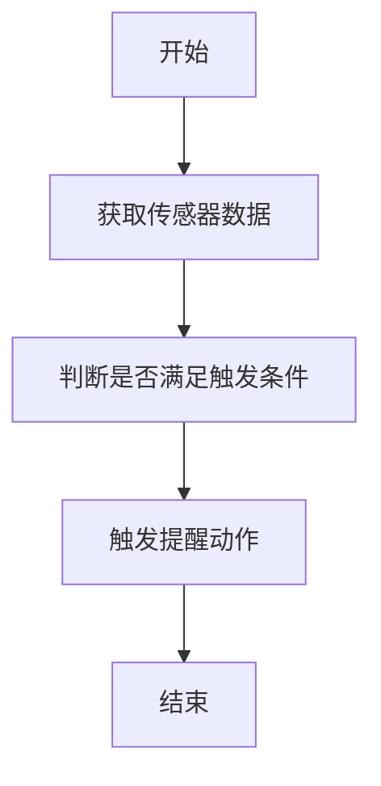
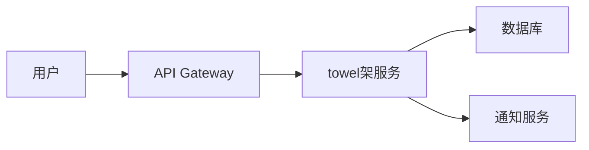

                 


```markdown
# AI Agent在智能浴室毛巾架中的毛巾更换提醒

> 关键词：AI Agent，智能浴室，毛巾架，物联网，智能家居

> 摘要：本文详细探讨了AI Agent在智能浴室毛巾架中的应用，特别是毛巾更换提醒功能的实现。通过结合物联网技术和AI算法，提出了一个智能化的解决方案，旨在提升用户体验和生活便利性。文章从背景、原理、算法、系统设计、项目实战到最佳实践，全面解析了这一创新应用。

---

## 第一部分：背景介绍

### 第1章：问题背景与描述

#### 1.1 问题背景
- **智能浴室 towel架的现状**  
  智能浴室 towel架作为一种智能家居设备，近年来逐渐普及。然而，现有的 towel架大多仅具备基本的存储和悬挂功能，缺乏智能化的管理和提醒功能。
  
- ** towel更换提醒的痛点**  
  用户通常会忘记毛巾的使用时间，导致细菌滋生，影响健康。现有的解决方案多依赖手动检查，效率低下且用户体验较差。

- **AI Agent在智能家居中的应用潜力**  
  AI Agent（智能体）能够通过传感器数据、用户行为分析和机器学习算法，实现智能化的提醒和管理，为智能家居设备赋予更高的智能化水平。

#### 1.2 问题描述
- ** towel更换提醒的需求分析**  
  需要一个能够自动监测毛巾使用情况，并在达到预设条件时提醒用户更换的系统。

- **用户行为与习惯的建模**  
  用户使用毛巾的频率、时间、习惯等数据需要被采集和分析，以便AI Agent能够更精准地触发提醒。

- **系统设计的边界与外延**  
  系统主要关注毛巾的使用状态，但可能延伸至其他智能家居设备的联动，如智能灯、空调等。

---

## 第二部分：核心概念与联系

### 第2章：AI Agent与物联网技术

#### 2.1 AI Agent的基本原理
- **AI Agent的定义与特征**  
  AI Agent是一种能够感知环境、自主决策并执行任务的智能实体，具备自主性、反应性、目标导向性和社交能力。

- **基于规则的触发机制**  
  AI Agent通过预设的规则或机器学习模型，识别特定事件并触发相应的执行动作。

- **多模态数据融合技术**  
  结合传感器数据、用户行为数据和环境数据，提升AI Agent的感知能力和决策精度。

#### 2.2 物联网技术的基础
- **IoT设备的基本组成**  
  包括传感器、通信模块、处理器和存储单元，能够采集数据、传输数据和执行命令。

- **智能 towel架的数据采集**  
  通过湿度传感器、重量传感器等设备，实时监测毛巾的使用状态。

- **无线通信技术的选择**  
  主要采用Wi-Fi、蓝牙或ZigBee等短距离通信技术，确保设备的互联性和实时性。

#### 2.3 核心概念对比表
| 概念 | 特性 | 描述 |
|------|------|------|
| AI Agent | 自主性 | 能够自主决策 |
| IoT设备 | 连通性 | 可以联网传输数据 |
| 用户行为 | 可塑性 | 可以根据反馈调整 |

#### 2.4 ER实体关系图
```mermaid
erd
    User(用户ID, 姓名, 邮箱)
    Device(设备ID, 设备类型, 连接状态)
    Event(事件ID, 事件类型, 发生时间)
    Rule(规则ID, 触发条件, 执行动作)
    Sensor(传感器ID, 传感器类型, 采集数据)
```

---

## 第三部分：算法原理与实现

### 第3章： towel更换提醒的算法设计

#### 3.1 算法原理
- **基于规则的触发机制**  
  通过预设的规则（如毛巾使用天数超过7天）触发提醒。

- **时间序列分析**  
  利用历史数据预测毛巾的使用频率，优化提醒策略。

- **用户行为预测模型**  
  基于用户使用习惯，预测用户最可能的使用时间，提前做好提醒准备。

#### 3.2 算法流程图


#### 3.3 核心算法代码
```python
def trigger_rule(sensor_data, threshold):
    if sensor_data > threshold:
        send_notification()
```

#### 3.4 数学模型与公式
- **时间阈值计算公式**  
  $$ \text{threshold} = \text{avg\_usage\_days} \times \text{frequency} $$

---

## 第四部分：系统分析与架构设计

### 第4章： towel架智能系统架构

#### 4.1 项目场景介绍
- **用户场景**  
  用户希望智能 towel架能够自动监测毛巾使用情况，并在需要更换时及时提醒。

#### 4.2 系统功能设计
- ** towel架管理系统**  
  包括数据采集、状态监测、规则设置和通知推送功能。

#### 4.3 系统架构设计


#### 4.4 接口设计与交互流程
```mermaid
sequenceDiagram
    用户 -> API Gateway: 请求获取 towel状态
    API Gateway -> Service: 转发请求
    Service -> Database: 查询历史数据
    Service -> Notification: 发送提醒通知
    用户 <- API Gateway: 返回状态信息
```

---

## 第五部分：项目实战

### 第5章： towel架智能系统实现

#### 5.1 环境安装
- **开发环境**  
  需要安装Python、AI框架（如TensorFlow）、物联网开发板和相关SDK。

#### 5.2 核心代码实现
```python
import sensor
from notification import push_notification

def main():
    while True:
        data = sensor.get_data()
        if sensor.analyze(data) > threshold:
            push_notification("更换毛巾")
```

#### 5.3 代码解读与分析
- **传感器数据采集**  
  使用湿度和重量传感器，采集 towel的使用状态数据。

- **数据处理与分析**  
  对采集到的数据进行预处理和特征提取，判断是否需要触发提醒。

#### 5.4 实际案例分析
- **案例描述**  
  用户A每天使用同一块毛巾，系统监测到使用天数超过7天后，触发提醒。

#### 5.5 项目小结
- **项目成果**  
  成功实现了基于AI Agent的 towel更换提醒功能，提升了用户体验。

---

## 第六部分：最佳实践

### 第6章： towel架智能化的未来展望

#### 6.1 小结
- **总结与反思**  
  本文提出了一个基于AI Agent和物联网技术的 towel架智能化解决方案，详细讲解了系统设计、算法实现和项目实战。

#### 6.2 注意事项
- **数据隐私**  
  用户数据的安全性必须得到保障，避免数据泄露。

#### 6.3 拓展阅读
- **相关技术**  
  推荐学习AI Agent、物联网、时间序列分析等技术，深入了解智能家居领域的最新进展。

---

## 附录

### 附录A：术语解释
- AI Agent：人工智能代理，能够自主决策并执行任务。
- IoT：物联网，通过互联网连接物理设备，实现数据交换和远程控制。

### 附录B：工具安装指南
- Python安装指南
- 物联网开发板配置教程

### 附录C：代码库地址
- GitHub仓库地址：[https://github.com/...] 

---

## 结语

通过本文的详细讲解，读者可以全面了解AI Agent在智能浴室 towel架中的应用，从理论到实践，掌握 towel更换提醒系统的实现方法。希望本文能为智能家居领域的创新提供一定的参考和启发。
```

