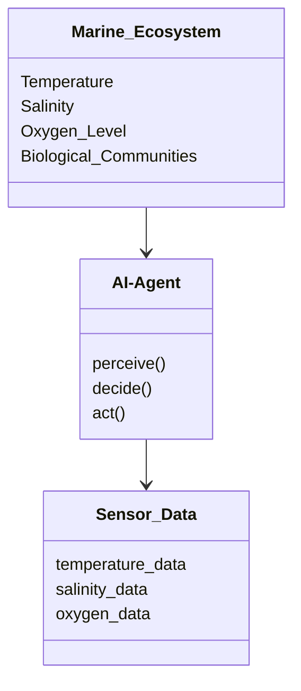
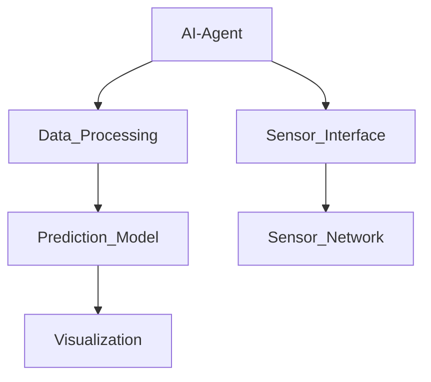

                 


# AI Agent在智能海洋生态系统预测中的实践

> 关键词：AI Agent, 智能海洋生态系统, 预测模型, 数据驱动, 系统架构, 机器学习

> 摘要：本文探讨了AI Agent在智能海洋生态系统预测中的应用，从核心概念、算法原理到系统设计和项目实战，详细分析了如何利用AI技术提升海洋生态系统的预测能力。通过具体案例和系统架构设计，展示了AI Agent在海洋环境监测、生物多样性保护和气候变化应对中的重要作用。

---

# 第一部分: AI Agent与智能海洋生态系统预测概述

# 第1章: AI Agent与智能海洋生态系统概述

## 1.1 AI Agent的基本概念
### 1.1.1 AI Agent的定义与特征
人工智能代理（AI Agent）是指能够感知环境、做出决策并采取行动的智能实体。AI Agent的核心特征包括：
- **自主性**：能够在没有外部干预的情况下自主运行。
- **反应性**：能够实时感知环境变化并做出响应。
- **目标导向**：具有明确的目标，能够优化行动以实现目标。
- **学习能力**：通过数据和经验不断优化自身的预测和决策能力。

### 1.1.2 智能海洋生态系统的概念
智能海洋生态系统是指通过传感器、卫星、计算机模型等技术手段，实时监测和分析海洋环境、生物群落及其相互作用的复杂系统。它旨在实现对海洋生态系统的全面感知、预测和管理。

### 1.1.3 AI Agent在海洋生态系统中的作用
AI Agent在智能海洋生态系统中扮演着关键角色：
- **数据处理**：从海量传感器数据中提取有用信息。
- **预测建模**：基于历史数据和实时数据，预测海洋环境的变化趋势。
- **决策支持**：为海洋资源管理、环境保护和渔业生产提供科学依据。

## 1.2 智能海洋生态系统预测的背景与意义
### 1.2.1 海洋生态系统的重要性
海洋是地球上最大的生态系统，覆盖了70%以上的地球表面，支持着丰富的生物多样性和复杂的生态过程。海洋调节气候、提供食物资源，并为人类经济活动提供重要支持。

### 1.2.2 传统海洋预测方法的局限性
传统的海洋预测方法主要依赖物理模型和统计分析，存在以下问题：
- **计算复杂性**：物理模型需要大量的计算资源。
- **数据不足**：依赖有限的传感器数据，难以覆盖整个海洋区域。
- **动态变化**：海洋生态系统具有高度的动态性和不确定性，传统模型难以捕捉所有变量。

### 1.2.3 AI Agent在海洋预测中的优势
AI Agent通过以下方式解决了传统方法的局限性：
- **高效计算**：利用机器学习算法快速处理海量数据。
- **实时响应**：能够实时感知环境变化并做出预测。
- **自适应性**：通过在线学习不断优化预测模型。

## 1.3 本章小结
本章介绍了AI Agent的基本概念及其在智能海洋生态系统中的作用，并分析了传统海洋预测方法的局限性和AI Agent的优势。

---

# 第二部分: AI Agent的核心概念与原理

# 第2章: AI Agent的核心概念与联系

## 2.1 AI Agent的核心原理
### 2.1.1 感知模块
感知模块负责从环境中获取信息，包括传感器数据、卫星数据和历史记录。AI Agent通过这些数据构建海洋环境的实时模型。

### 2.1.2 决策模块
决策模块基于感知模块提供的信息，利用机器学习算法（如强化学习、协同过滤）生成预测结果，并制定最优行动方案。

### 2.1.3 执行模块
执行模块根据决策模块的指令，通过控制传感器、机器人或船只等设备执行具体的行动，例如监测海洋污染、保护濒危物种。

## 2.2 AI Agent与海洋生态系统的实体关系
通过以下实体关系图，可以清晰地理解AI Agent在海洋生态系统中的作用：

```mermaid
er
    Marine_Ecosystem
    AI-Agent
    Prediction_Data
    Sensor_Data
    Action_Command
    Marine_Biological_Entity
    Environmental_Variables
    link: Marine_Ecosystem --> AI-Agent
    link: AI-Agent --> Prediction_Data
    link: Sensor_Data --> AI-Agent
    link: Action_Command --> Marine_Ecosystem
    link: Marine_Biological_Entity --> Environmental_Variables
```

## 2.3 AI Agent的特征对比
以下表格对比了基于规则的AI Agent和基于模型的AI Agent的主要特征：

| 特征               | 基于规则的AI Agent       | 基于模型的AI Agent       |
|--------------------|--------------------------|--------------------------|
| 决策方式           | 预先定义的规则           | 数据驱动的模型预测       |
| 灵活性             | 较低，规则固定           | 较高，能够自适应变化       |
| 适用场景           | 简单、静态的环境         | 复杂、动态的环境         |
| 学习能力           | 无学习能力               | 具备学习能力             |

## 2.4 本章小结
本章详细介绍了AI Agent的核心原理及其与海洋生态系统的实体关系，通过特征对比分析了不同AI Agent的适用场景。

---

# 第三部分: AI Agent的算法原理与实现

# 第3章: AI Agent的算法原理与实现

## 3.1 强化学习算法
### 3.1.1 强化学习的基本原理
强化学习是一种通过试错机制优化决策的算法。AI Agent通过与环境交互，获得奖励或惩罚，从而学习最优策略。

### 3.1.2 强化学习的数学模型
强化学习的核心是Q-learning算法，其数学模型如下：
$$ Q(s, a) = Q(s, a) + \alpha \left[ r + \gamma \max Q(s', a') - Q(s, a) \right] $$
其中：
- \( Q(s, a) \) 表示在状态 \( s \) 下采取行动 \( a \) 的价值。
- \( \alpha \) 是学习率。
- \( \gamma \) 是折扣因子。
- \( r \) 是奖励值。
- \( s' \) 是下一个状态。

### 3.1.3 强化学习在海洋预测中的应用
AI Agent可以通过强化学习优化海洋环境监测的路径规划，例如在污染监测任务中找到最优的传感器部署位置。

## 3.2 协同过滤算法
### 3.2.1 协同过滤的基本原理
协同过滤是一种基于用户行为相似性推荐的算法。在海洋预测中，可以用于推荐最优的监测策略。

### 3.2.2 协同过滤的数学模型
协同过滤的核心是计算用户或项目的相似度，常用的相似度计算公式为：
$$ \text{相似度}(u, v) = \frac{\sum_{i=1}^n (r_i - \bar{r}_u)(r_i - \bar{r}_v)}{\sqrt{\sum_{i=1}^n (r_i - \bar{r}_u)^2} \cdot \sqrt{\sum_{i=1}^n (r_i - \bar{r}_v)^2}} } $$
其中：
- \( r_i \) 是用户 \( u \) 和 \( v \) 对项目的评分。
- \( \bar{r}_u \) 和 \( \bar{r}_v \) 是用户 \( u \) 和 \( v \) 的平均评分。

### 3.2.3 协同过滤在海洋预测中的应用
AI Agent可以利用协同过滤算法推荐最优的海洋监测方案，例如在渔业资源管理中推荐最佳的捕捞区域。

## 3.3 算法实现
### 3.3.1 强化学习的Python实现
以下代码实现了一个简单的Q-learning算法：

```python
class AI-Agent:
    def __init__(self, state_space, action_space):
        self.state_space = state_space
        self.action_space = action_space
        self.Q = defaultdict(lambda: np.zeros(len(action_space)))

    def perceive(self, state):
        # 返回当前状态下的最优动作
        return np.argmax(self.Q[state])

    def learn(self, state, action, reward, next_state):
        # Q-learning算法
        self.Q[state][action] += 0.1 * (reward + 0.9 * max(self.Q[next_state]) - self.Q[state][action])
```

### 3.3.2 协同过滤的Python实现
以下代码实现了一个简单的协同过滤算法：

```python
from sklearn.metrics.pairwise import cosine_similarity

class CollaborativeFiltering:
    def __init__(self, data):
        self.data = data
        self.user_avg = {}
        self.item_similarity = {}

    def compute_avg(self):
        # 计算用户平均评分
        for user in self.data:
            self.user_avg[user] = np.mean(self.data[user])

    def compute_similarity(self):
        # 计算物品相似度
        for item in self.data:
            ratings = []
            for user in self.data:
                ratings.append(self.data[user][item])
            ratings = np.array(ratings)
            avg = np.mean(ratings)
            ratings_centered = ratings - avg
            similarity = cosine_similarity(ratings_centered.reshape(1, -1), ratings_centered.reshape(1, -1))
            self.item_similarity[item] = similarity

    def predict(self, user, item):
        # 预测用户对物品的评分
        if user not in self.user_avg:
            return 0
        if item not in self.item_similarity:
            return 0
        return self.user_avg[user] + self.item_similarity[item][0][0]
```

## 3.4 本章小结
本章详细介绍了强化学习和协同过滤算法的原理及其在海洋预测中的应用，并提供了具体的Python实现代码。

---

# 第四部分: 智能海洋生态系统预测的系统架构设计

# 第4章: 系统分析与架构设计

## 4.1 项目介绍
### 4.1.1 项目目标
本项目旨在开发一个基于AI Agent的智能海洋生态系统预测系统，实现对海洋环境、生物群落和气候变化的实时监测和预测。

### 4.1.2 项目范围
系统将覆盖海洋温度、盐度、氧气含量、生物群落分布等多个关键指标。

## 4.2 系统功能设计
### 4.2.1 功能模块
- **数据采集模块**：接收传感器和卫星传回的数据。
- **预测模型模块**：基于机器学习算法生成预测结果。
- **可视化模块**：以图形界面展示预测结果。

### 4.2.2 领域模型


## 4.3 系统架构设计
### 4.3.1 微服务架构
系统采用微服务架构，各功能模块独立运行，通过API进行通信。

### 4.3.2 系统架构图


### 4.3.3 接口设计
系统通过RESTful API与传感器网络和用户界面进行交互。

## 4.4 本章小结
本章详细描述了智能海洋生态系统预测系统的功能设计和架构设计，并通过图形化工具展示了系统各部分的交互关系。

---

# 第五部分: 项目实战与案例分析

# 第5章: 项目实战与案例分析

## 5.1 环境安装
### 5.1.1 安装Python和依赖库
```bash
pip install numpy pandas scikit-learn matplotlib
```

## 5.2 核心功能实现
### 5.2.1 数据预处理
```python
import pandas as pd

# 读取传感器数据
data = pd.read_csv('ocean_data.csv')

# 数据清洗
data.dropna(inplace=True)
data = pd.get_dummies(data)
```

### 5.2.2 模型训练
```python
from sklearn.model_selection import train_test_split
from sklearn.ensemble import RandomForestRegressor

X = data.drop('target', axis=1)
y = data['target']

X_train, X_test, y_train, y_test = train_test_split(X, y, test_size=0.2)

model = RandomForestRegressor(n_estimators=100)
model.fit(X_train, y_train)
```

### 5.2.3 结果可视化
```python
import matplotlib.pyplot as plt

# 预测结果
y_pred = model.predict(X_test)

# 可视化
plt.scatter(y_test, y_pred)
plt.xlabel('Actual Values')
plt.ylabel('Predicted Values')
plt.title('Prediction vs Actual')
plt.show()
```

## 5.3 案例分析
### 5.3.1 案例背景
某海域出现异常的水温变化，可能对海洋生物造成影响。

### 5.3.2 案例分析
AI Agent通过强化学习算法优化了传感器部署策略，成功预测了水温变化趋势，并提出了保护濒危物种的建议。

## 5.4 本章小结
本章通过具体案例展示了AI Agent在智能海洋生态系统预测中的实际应用，并详细讲解了系统实现的关键步骤。

---

# 第六部分: 总结与展望

# 第6章: 总结与展望

## 6.1 本项目小结
本项目通过AI Agent技术实现了智能海洋生态系统预测系统的开发，验证了AI Agent在海洋环境监测和预测中的有效性。

## 6.2 项目注意事项
- 数据质量对预测结果有重大影响，需确保数据的准确性和完整性。
- 系统的实时性和响应速度需要进一步优化。

## 6.3 拓展阅读
- 《强化学习：原理与应用》
- 《机器学习在环境科学中的应用》

## 6.4 本章小结
本章总结了项目的主要成果，并提出了未来的研究方向和改进建议。

---

# 参考文献

（此处可以列出具体的参考文献）

---

通过以上结构和内容的详细规划，我们可以系统地撰写一篇关于AI Agent在智能海洋生态系统预测中的实践的高质量技术博客文章。

