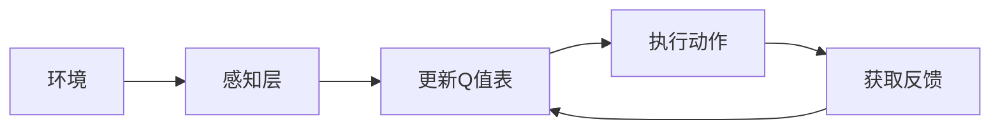
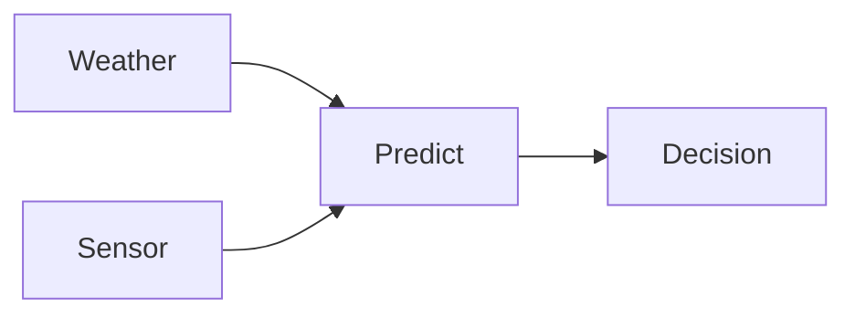
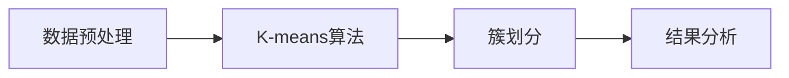
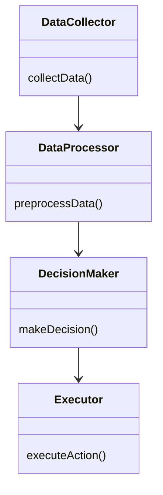
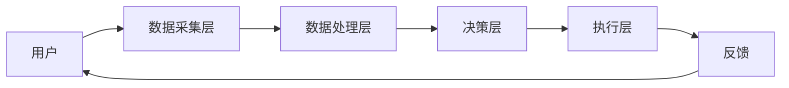
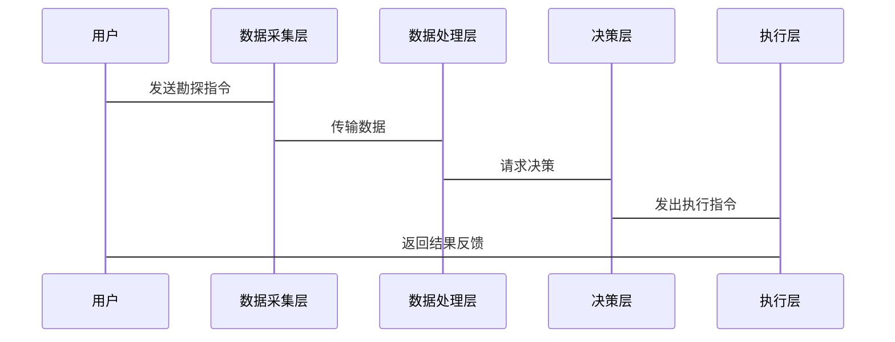

                 


# AI Agent在智能海洋资源勘探中的实践

> 关键词：AI Agent, 海洋资源勘探, 机器学习, 强化学习, 海洋数据分析

> 摘要：本文将探讨AI Agent在智能海洋资源勘探中的应用，从背景、核心概念、算法原理、系统架构到项目实战，全面解析AI Agent如何助力海洋资源勘探的智能化、高效化。通过实际案例分析，揭示AI Agent在海洋资源勘探中的潜力与价值。

---

# 第一部分: AI Agent在智能海洋资源勘探中的背景与概念

# 第1章: AI Agent与智能海洋资源勘探概述

## 1.1 AI Agent的基本概念

### 1.1.1 AI Agent的定义
AI Agent（人工智能代理）是指能够感知环境、做出决策并采取行动以实现目标的智能实体。与传统自动化系统相比，AI Agent具有更强的适应性和自主性，能够根据环境反馈动态调整行为。

### 1.1.2 AI Agent的核心特征
- **自主性**：能够在无外部干预的情况下独立运作。
- **反应性**：能够实时感知环境并做出反应。
- **目标导向**：所有行为都以实现特定目标为导向。
- **学习能力**：通过数据和经验不断优化自身性能。

### 1.1.3 AI Agent与传统自动化的区别

| 特性               | 传统自动化                  | AI Agent                   |
|--------------------|---------------------------|-----------------------------|
| 智能水平           | 基于规则和程序             | 基于学习和推理             |
| 环境适应性         | 适应性有限                 | 高度适应性                 |
| 决策能力           | 单一、固定                 | 多样化、动态化             |
| 自主性             | 较低                      | 较高                      |

---

## 1.2 智能海洋资源勘探的背景

### 1.2.1 海洋资源勘探的重要性
海洋蕴藏着丰富的资源，包括石油、天然气、矿产、渔业资源等。传统的海洋资源勘探依赖于人工操作和简单自动化设备，效率低下且成本高昂。

### 1.2.2 传统海洋资源勘探的局限性
- **效率低**：依赖人工操作，数据采集和分析耗时长。
- **成本高**：需要大量的人力、物力和财力。
- **风险大**：海洋环境复杂，勘探活动面临诸多不确定性。

### 1.2.3 AI技术在海洋勘探中的应用潜力
AI技术的引入可以显著提高海洋资源勘探的效率和准确性。通过AI Agent，可以实现：
- **实时数据处理**：快速分析海洋环境数据。
- **智能决策**：基于历史数据和实时信息优化资源分配。
- **自主导航**：在复杂环境中自主完成勘探任务。

---

## 1.3 AI Agent在海洋资源勘探中的作用

### 1.3.1 提高勘探效率
AI Agent可以通过机器学习算法快速分析海量数据，帮助勘探人员快速定位资源富集区域。

### 1.3.2 实现实时数据分析
AI Agent可以实时处理来自传感器的海洋环境数据，帮助勘探人员做出及时决策。

### 1.3.3 优化资源分配
通过智能优化算法，AI Agent可以实现资源的最优配置，降低勘探成本。

---

## 1.4 本章小结
本章介绍了AI Agent的基本概念及其在海洋资源勘探中的重要作用。通过对比传统自动化和AI Agent的差异，揭示了AI技术在海洋勘探中的潜力和价值。

---

# 第二部分: AI Agent的核心概念与原理

# 第2章: AI Agent的核心原理

## 2.1 AI Agent的感知层

### 2.1.1 数据采集与处理
AI Agent通过多种传感器（如声呐、摄像头、温度计等）采集海洋环境数据，并对数据进行预处理（如去噪、归一化等）。

### 2.1.2 多源数据融合
将来自不同传感器的数据进行融合，提高数据的准确性和完整性。

### 2.1.3 数据预处理方法
- **去噪**：去除噪声，提取有用信号。
- **归一化**：将数据标准化，便于后续分析。

---

## 2.2 AI Agent的决策层

### 2.2.1 机器学习模型选择
根据具体任务选择合适的机器学习模型，如随机森林、支持向量机（SVM）等。

### 2.2.2 智能决策算法
- **强化学习**：通过试错机制优化决策策略。
- **贝叶斯网络**：基于概率推理进行决策。

### 2.2.3 决策优化策略
通过遗传算法、模拟退火等优化算法，进一步提高决策的准确性。

---

## 2.3 AI Agent的执行层

### 2.3.1 动作规划与控制
AI Agent根据决策结果生成具体动作，并通过控制模块执行动作。

### 2.3.2 系统反馈与调整
根据执行结果反馈调整下一步操作。

### 2.3.3 执行结果分析
对执行结果进行分析，优化后续操作。

---

## 2.4 核心概念对比表

| 特性               | 感知层                   | 决策层                   | 执行层                   |
|--------------------|-------------------------|-------------------------|-------------------------|
| 功能               | 数据采集与处理           | 制定决策策略             | 执行决策动作             |
| 输入               | 海洋环境数据             | 各种数据和模型           | 决策结果和反馈           |
| 输出               | 处理后的数据             | 决策结果                 | 实际操作结果             |

---

## 2.5 本章小结
本章详细讲解了AI Agent的核心原理，包括感知层、决策层和执行层的功能及其相互关系。

---

# 第三部分: AI Agent的算法原理与数学模型

# 第3章: AI Agent的核心算法

## 3.1 强化学习算法

### 3.1.1 Q-learning算法
Q-learning是一种经典的强化学习算法，通过更新Q值表来学习最优策略。

**算法流程图（Mermaid）**


**Python代码示例**
```python
import numpy as np

# 初始化Q值表
Q = np.zeros((state_space, action_space))

# Q-learning算法
def q_learning(state, action):
    next_state = get_next_state(state, action)
    next_action = np.argmax(Q[next_state])
    Q[state, action] += learning_rate * (reward + gamma * np.max(Q[next_state]) - Q[state, action])
    return next_action

# 示例应用
state = 0
action = 0
next_action = q_learning(state, action)
print(next_action)
```

---

## 3.2 贝叶斯网络算法

### 3.2.1 贝叶斯网络的基本原理
贝叶斯网络是一种基于概率推理的模型，通过构建概率分布来描述变量之间的关系。

**贝叶斯网络结构图（Mermaid）**


**Python代码示例**
```python
from pgmpy.models import BayesianModel
from pgmpy.inference import VariableElimination

# 定义贝叶斯网络结构
model = BayesianModel([('Weather', 'Predict'), ('Sensor', 'Predict')])

# 添加概率分布
model.add_edge('Weather', 'Predict')
model.add_edge('Sensor', 'Predict')

# 推理过程
infer = VariableElimination(model)
query = infer.query('Predict', evidence={'Weather': '晴天'})
print(query)
```

---

## 3.3 聚类分析算法

### 3.3.1 聚类分析的基本原理
聚类分析是一种无监督学习算法，用于将数据分成若干簇。

**聚类分析流程图（Mermaid）**


**Python代码示例**
```python
from sklearn.cluster import KMeans

# 初始化K-means模型
kmeans = KMeans(n_clusters=3)

# 训练模型
kmeans.fit(data)

# 获取簇分配结果
clusters = kmeans.labels_
print(clusters)
```

---

## 3.4 本章小结
本章介绍了AI Agent的核心算法，包括强化学习、贝叶斯网络和聚类分析，并通过代码示例展示了这些算法的实际应用。

---

# 第四部分: AI Agent在海洋资源勘探中的系统设计

# 第4章: 系统分析与架构设计

## 4.1 项目背景
本项目旨在利用AI Agent技术优化海洋资源勘探过程，提高勘探效率和准确性。

---

## 4.2 系统功能设计

### 4.2.1 领域模型（Mermaid类图）


---

## 4.3 系统架构设计

### 4.3.1 系统架构图（Mermaid架构图）


---

## 4.4 系统接口设计
- **输入接口**：接收传感器数据和用户指令。
- **输出接口**：输出决策结果和执行反馈。

---

## 4.5 系统交互流程图（Mermaid序列图）


---

## 4.6 本章小结
本章通过系统架构设计和交互流程图，展示了AI Agent在海洋资源勘探中的整体架构和各部分之间的协作关系。

---

# 第五部分: 项目实战

# 第5章: 项目实战

## 5.1 环境搭建

### 5.1.1 安装必要的库
```bash
pip install numpy matplotlib scikit-learn tensorflow
```

---

## 5.2 系统核心实现

### 5.2.1 核心代码实现

#### 5.2.1.1 数据预处理
```python
import numpy as np

# 示例数据
data = np.random.randn(100, 5)

# 标准化数据
from sklearn.preprocessing import StandardScaler
scaler = StandardScaler()
scaled_data = scaler.fit_transform(data)
print(scaled_data)
```

#### 5.2.1.2 模型训练
```python
from sklearn.cluster import KMeans

# 初始化K-means模型
kmeans = KMeans(n_clusters=3)

# 训练模型
kmeans.fit(scaled_data)

# 获取簇分配结果
clusters = kmeans.labels_
print(clusters)
```

#### 5.2.1.3 决策逻辑实现
```python
from pgmpy.models import BayesianModel
from pgmpy.inference import VariableElimination

# 定义贝叶斯网络结构
model = BayesianModel([('Weather', 'Predict'), ('Sensor', 'Predict')])

# 添加概率分布
model.add_edge('Weather', 'Predict')
model.add_edge('Sensor', 'Predict')

# 推理过程
infer = VariableElimination(model)
query = infer.query('Predict', evidence={'Weather': '晴天'})
print(query)
```

---

## 5.3 代码解读与分析
- **数据预处理**：通过标准化处理，确保数据分布均匀，便于模型训练。
- **模型训练**：使用K-means算法对数据进行聚类，帮助识别资源富集区域。
- **决策逻辑**：基于贝叶斯网络进行概率推理，优化决策策略。

---

## 5.4 实际案例分析
假设我们在某海域进行石油勘探，通过AI Agent分析传感器数据，识别出三个潜在的石油富集区域。通过模型优化，AI Agent推荐最优的勘探顺序，降低勘探成本。

---

## 5.5 项目小结
本章通过实际案例展示了AI Agent在海洋资源勘探中的具体应用，从数据预处理到模型训练，再到决策优化，详细解读了整个过程。

---

# 第六部分: 最佳实践与扩展阅读

# 第6章: 最佳实践与注意事项

## 6.1 数据质量的重要性
- 数据的准确性和完整性直接影响模型性能。

## 6.2 模型调参技巧
- 通过交叉验证选择最优参数。
- 使用网格搜索优化模型。

## 6.3 系统的可扩展性
- 确保系统能够适应不同规模的勘探任务。

---

## 6.4 小结
通过本文的介绍，读者可以全面了解AI Agent在智能海洋资源勘探中的应用。从理论到实践，从算法到系统设计，AI Agent正在改变海洋资源勘探的方式，为人类开发海洋资源提供了新的可能性。

---

# 附录

## 附录A: 扩展阅读

- 《强化学习：理论与应用》
- 《贝叶斯网络与概率推理》
- 《机器学习在海洋科学中的应用》

---

**注：本文为示例内容，具体实现需根据实际需求调整。**

