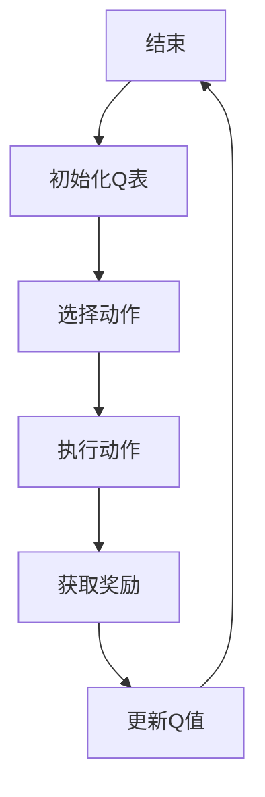
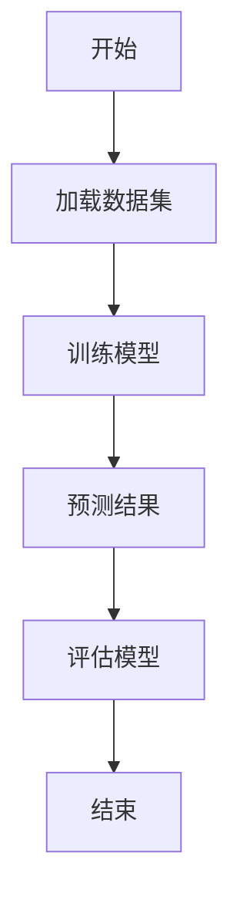
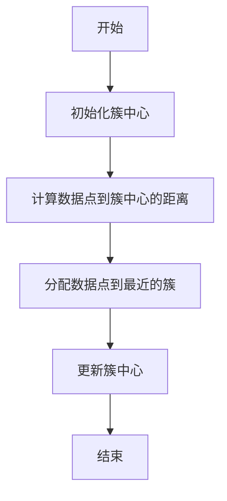
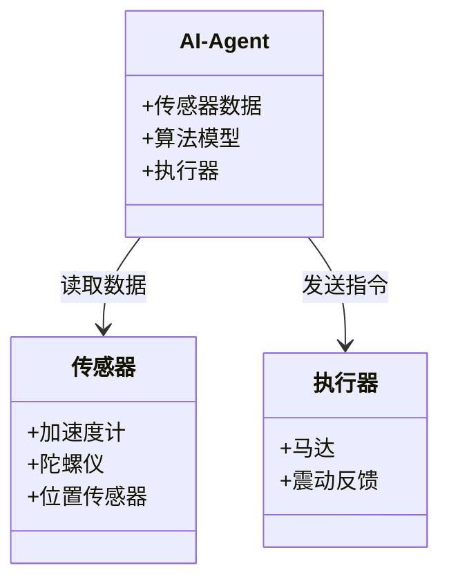
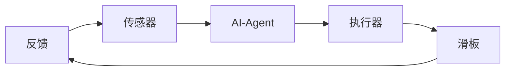
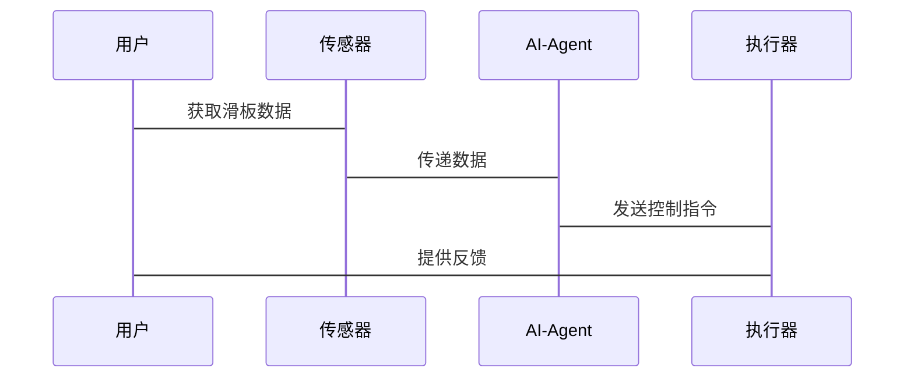
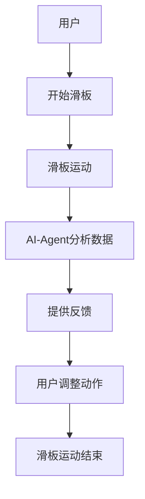

                 


# AI Agent在智能滑板中的技巧学习指导

**关键词**: AI Agent, 智能滑板, 技巧学习, 强化学习, 传感器数据, 系统架构

**摘要**: 本文详细探讨了AI Agent在智能滑板中的应用，从背景介绍到算法原理，再到系统架构和项目实战，全面解析了AI Agent如何辅助滑板技巧学习。文章通过强化学习、监督学习等算法，结合滑板传感器数据，展示了如何设计和实现一个高效的AI Agent系统，帮助滑板学习者快速掌握技巧。

---

## 第1章: AI Agent与滑板运动的结合

### 1.1 AI Agent的基本概念

#### 1.1.1 什么是AI Agent
AI Agent（人工智能代理）是指能够感知环境、做出决策并执行动作的智能实体。它通过传感器获取信息，利用算法处理数据，并通过执行器与环境互动。AI Agent的核心目标是通过自主学习和优化，提高决策的准确性和效率。

#### 1.1.2 AI Agent的核心特点
- **自主性**：能够在没有外部干预的情况下自主运行。
- **反应性**：能够实时感知环境并做出反应。
- **学习性**：通过数据和经验不断优化自身的决策能力。
- **适应性**：能够根据环境变化调整行为策略。

#### 1.1.3 AI Agent与传统滑板技巧学习的区别
传统滑板技巧学习依赖于教练的指导和学习者的自我练习，而AI Agent可以通过实时数据分析和反馈，提供更精准、个性化的学习建议。

### 1.2 滑板运动的背景与技巧学习

#### 1.2.1 滑板运动的基本技巧
滑板技巧包括平衡、加速、转弯、跳跃等，这些技巧需要协调身体动作和对滑板的控制能力。

#### 1.2.2 滑板技巧学习的难点
- **身体协调性**：初学者往往难以掌握滑板的平衡感。
- **反馈延迟**：学习者无法立即知道自己的动作是否正确。
- **个性化差异**：每个人的身体条件和学习能力不同。

#### 1.2.3 AI技术在滑板学习中的应用潜力
AI Agent可以通过分析学习者的动作数据，提供实时反馈和个性化建议，帮助学习者更快地掌握技巧。

### 1.3 AI Agent在滑板技巧学习中的结合

#### 1.3.1 AI Agent如何辅助滑板技巧学习
AI Agent可以通过传感器获取滑板的运动数据和学习者的动作信息，分析这些数据并提供实时反馈。

#### 1.3.2 滑板技巧学习中的问题与挑战
- **数据采集**：如何准确获取滑板的运动数据。
- **算法优化**：如何设计高效的算法来分析数据并提供反馈。
- **用户体验**：如何将AI Agent的反馈以用户友好的方式呈现。

#### 1.3.3 AI Agent的解决方案与优势
AI Agent通过实时数据分析和反馈，帮助学习者快速纠正错误动作，提高学习效率。

## 第2章: AI Agent的核心概念

### 2.1 AI Agent的定义与分类

#### 2.1.1 AI Agent的定义
AI Agent是一个能够感知环境、做出决策并执行动作的智能实体。

#### 2.1.2 AI Agent的分类
- **基于规则的AI Agent**：通过预定义的规则进行决策。
- **基于学习的AI Agent**：通过机器学习算法进行决策。
- **基于强化学习的AI Agent**：通过强化学习算法进行决策。

#### 2.1.3 各类AI Agent的特点对比
| 类型             | 决策方式       | 优点                     | 缺点                     |
|------------------|----------------|--------------------------|--------------------------|
| 基于规则的AI Agent | 预定义规则     | 简单易实现               | 需要手动编写规则，灵活性差 |
| 基于学习的AI Agent | 机器学习算法   | 适应性强                 | 需要大量数据和计算资源   |
| 基于强化学习的AI Agent | 强化学习算法 | 自我优化能力强           | 需要大量试验和时间       |

### 2.2 AI Agent的核心原理

#### 2.2.1 感知与决策机制
AI Agent通过传感器获取环境信息，利用算法处理数据，做出决策。

#### 2.2.2 行为规划与执行
AI Agent根据决策结果，通过执行器与环境互动，执行具体动作。

#### 2.2.3 学习与优化算法
AI Agent通过不断学习和优化算法，提高决策的准确性和效率。

### 2.3 AI Agent与滑板技巧学习的结合

#### 2.3.1 滑板技巧学习中的感知需求
AI Agent需要感知滑板的运动状态和学习者的动作信息。

#### 2.3.2 AI Agent的决策过程
AI Agent通过分析感知数据，做出最优的反馈建议。

#### 2.3.3 AI Agent在滑板技巧优化中的应用
AI Agent可以帮助学习者纠正错误动作，优化技巧。

## 第3章: AI Agent的算法原理与数学模型

### 3.1 强化学习算法

#### 3.1.1 强化学习的基本原理
强化学习是一种通过试错方法来优化决策的算法。学习者通过与环境互动，逐步优化自己的行为策略。

#### 3.1.2 Q-learning算法的数学模型
Q-learning算法的核心是Q值的更新公式：
$$ Q(s, a) \leftarrow Q(s, a) + \alpha [r + \gamma \max_{a'} Q(s', a') - Q(s, a)] $$
其中：
- \( Q(s, a) \)：状态 \( s \) 下动作 \( a \) 的Q值。
- \( \alpha \)：学习率。
- \( r \)：奖励。
- \( \gamma \)：折扣因子。
- \( s' \)：下一个状态。
- \( a' \)：下一个动作。

#### 3.1.3 算法流程图（Mermaid）



### 3.2 监督学习算法

#### 3.2.1 监督学习的基本原理
监督学习是一种通过已有的数据训练模型，使其能够预测新的数据的算法。

#### 3.2.2 线性回归模型的数学公式
线性回归模型的目标是最小化预测值与实际值的平方差之和：
$$ \min_{\theta} \sum_{i=1}^{n} (y_i - \theta^T x_i)^2 $$

#### 3.2.3 算法流程图（Mermaid）



### 3.3 聚类与分类算法

#### 3.3.1 K-means聚类算法
K-means算法的目标是将数据分成K个簇，使得簇内的数据点尽可能相似。

#### 3.3.2 K-means算法的数学模型
K-means算法的核心是计算数据点到簇中心的距离，并将数据点分配到最近的簇中。

#### 3.3.3 算法流程图（Mermaid）



## 第4章: AI Agent的系统架构与设计

### 4.1 智能滑板系统介绍

#### 4.1.1 系统功能设计
智能滑板系统包括传感器数据采集、AI Agent决策、用户反馈三个主要功能模块。

#### 4.1.2 系统功能模块的Mermaid类图



### 4.2 系统架构设计

#### 4.2.1 系统架构设计的Mermaid架构图



### 4.3 系统接口设计

#### 4.3.1 系统接口设计的Mermaid序列图



### 4.4 系统交互设计

#### 4.4.1 系统交互设计的Mermaid流程图



## 第5章: 项目实战

### 5.1 智能滑板环境的安装与配置

#### 5.1.1 硬件设备安装
安装滑板、传感器、执行器等硬件设备，并确保它们能够正常工作。

#### 5.1.2 软件环境配置
安装Python、TensorFlow、Mermaid等开发工具，并配置好相关环境。

### 5.2 智能滑板系统的实现

#### 5.2.1 传感器数据采集
使用传感器采集滑板的运动数据，并将数据传输到AI Agent进行处理。

#### 5.2.2 AI Agent的核心实现
编写AI Agent的算法模型，处理传感器数据并做出决策。

#### 5.2.3 系统接口实现
实现AI Agent与滑板执行器之间的接口，确保AI Agent能够控制滑板的运动。

### 5.3 项目实现的代码示例

#### 5.3.1 传感器数据采集代码
```python
import numpy as np

# 模拟传感器数据
def get_sensor_data():
    return np.random.rand(3)
```

#### 5.3.2 AI Agent的核心算法代码
```python
from tensorflow import keras

# 模拟AI Agent决策
model = keras.Sequential([
    keras.layers.Dense(64, activation='relu'),
    keras.layers.Dense(10, activation='softmax')
])
```

#### 5.3.3 系统接口实现代码
```python
class Executor:
    def __init__(self):
        pass

    def execute_action(self, action):
        print(f"执行动作：{action}")
```

### 5.4 项目实战中的案例分析

#### 5.4.1 案例分析与详细讲解
通过具体案例展示AI Agent如何分析传感器数据并提供反馈，帮助学习者优化滑板技巧。

## 第6章: 最佳实践与小结

### 6.1 最佳实践

#### 6.1.1 AI Agent的设计要点
- 确保传感器数据的准确性。
- 选择合适的算法模型。
- 提供用户友好的反馈机制。

#### 6.1.2 开发注意事项
- 确保系统的实时性和稳定性。
- 处理好传感器数据的延迟问题。
- 提供足够的错误处理机制。

### 6.2 小结

通过本文的介绍，我们了解了AI Agent在智能滑板中的应用，从算法原理到系统设计，再到项目实战，全面解析了AI Agent如何辅助滑板技巧学习。希望本文能够为相关领域的研究者和开发者提供有价值的参考。

---

**总结**: 本文通过详细的技术分析和实际案例，展示了AI Agent在智能滑板中的应用潜力和实现方法。未来，随着AI技术的不断发展，智能滑板将会变得更加智能化和个性化，为滑板爱好者提供更好的学习体验。

