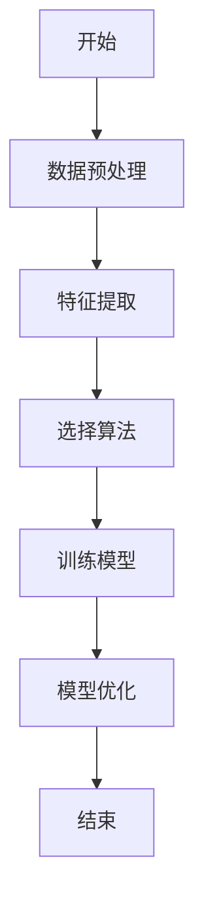
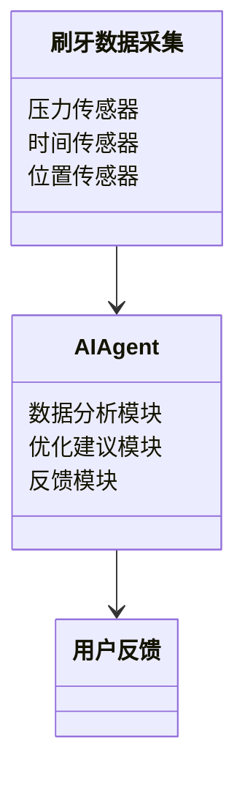
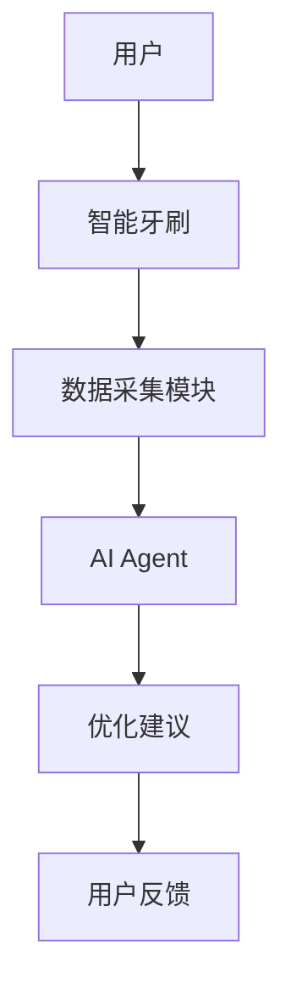
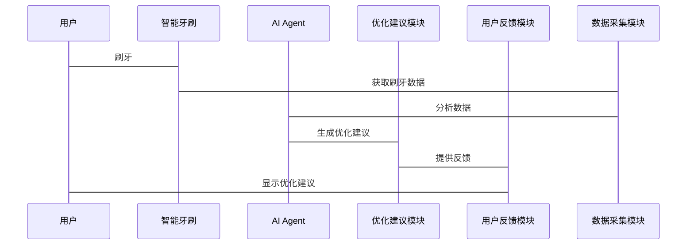

                 


# AI Agent在智能牙刷中的刷牙效果分析

## 关键词
- AI Agent
- 智能牙刷
- 刷牙效果分析
- 机器学习
- 深度学习
- 数据分析
- 系统架构

## 摘要
本文详细探讨了AI Agent在智能牙刷中的应用，重点分析了AI Agent如何通过数据采集、算法优化和实时反馈来提升刷牙效果。文章从背景介绍到算法原理，再到系统架构和项目实战，全面阐述了AI Agent在智能牙刷中的技术实现和实际应用。通过数学模型、mermaid图和代码示例，文章深入分析了刷牙效果优化的具体方法和实现步骤，为智能牙刷的设计和优化提供了理论支持和实践指导。

---

# 第一部分: AI Agent与智能牙刷概述

# 第1章: AI Agent与智能牙刷的背景介绍

## 1.1 AI Agent的基本概念
### 1.1.1 人工智能代理的定义
AI Agent（人工智能代理）是指能够感知环境、自主决策并执行任务的智能体。它可以理解并响应用户的输入，通过数据处理和算法分析，提供个性化的服务和反馈。在智能牙刷中，AI Agent主要负责数据采集、分析和优化建议的生成。

### 1.1.2 AI Agent的核心特征
- **自主性**：AI Agent能够在没有外部干预的情况下自主运行。
- **反应性**：能够实时感知环境变化并做出相应调整。
- **学习能力**：通过机器学习算法不断优化自身的决策能力。
- **交互性**：能够与用户进行自然的交互，提供实时反馈。

### 1.1.3 AI Agent在智能设备中的应用
AI Agent广泛应用于智能家居、自动驾驶和医疗设备等领域。在智能牙刷中，AI Agent主要用于优化用户的刷牙习惯和效果。

## 1.2 智能牙刷的发展历程
### 1.2.1 传统牙刷的功能与局限
传统牙刷仅提供基本的清洁功能，无法记录用户的刷牙数据，也无法提供个性化的建议。用户需要手动调整刷牙的压力和时间，容易导致清洁不彻底或过度清洁的问题。

### 1.2.2 智能牙刷的出现与技术进步
随着物联网和人工智能技术的发展，智能牙刷应运而生。它通过内置传感器和AI算法，能够记录用户的刷牙数据，并通过手机APP提供实时反馈和优化建议。

### 1.2.3 AI技术在智能牙刷中的应用前景
AI技术的引入使得智能牙刷能够更加智能化，不仅能够记录刷牙数据，还能通过分析数据优化用户的刷牙习惯，预防口腔问题的发生。

## 1.3 AI Agent在智能牙刷中的问题背景
### 1.3.1 刷牙效果的定义与挑战
刷牙效果通常指牙齿清洁的彻底程度和用户刷牙的舒适度。然而，不同用户的口腔状况和习惯差异较大，如何通过AI技术实现个性化的优化是一个挑战。

### 1.3.2 用户刷牙习惯的分析需求
用户的刷牙习惯包括刷牙时间、压力、频率等。通过分析这些数据，AI Agent可以识别用户的不良习惯，并提供针对性的建议。

### 1.3.3 AI Agent在刷牙效果优化中的作用
AI Agent能够通过数据分析和机器学习算法，帮助用户优化刷牙习惯，提升刷牙效果。同时，它还可以通过实时反馈机制，帮助用户养成良好的刷牙习惯。

## 1.4 本章小结
### 1.4.1 AI Agent与智能牙刷的核心概念总结
AI Agent是一种能够自主决策和学习的智能体，在智能牙刷中主要用于优化用户的刷牙习惯和效果。

### 1.4.2 刷牙效果分析的必要性与目标
刷牙效果分析的目的是通过AI技术实现个性化的刷牙优化，预防口腔问题的发生，并提升用户体验。

---

# 第二部分: AI Agent在智能牙刷中的核心概念与原理

# 第2章: AI Agent的核心概念与原理

## 2.1 AI Agent的基本原理
### 2.1.1 AI Agent的感知与决策机制
AI Agent通过传感器获取环境数据，利用机器学习算法进行分析和决策，从而实现智能化的优化建议。

### 2.1.2 基于数据的智能分析
AI Agent通过分析用户的刷牙数据，识别不良习惯，并提供个性化的优化建议。

### 2.1.3 AI Agent与用户交互的实现
AI Agent通过手机APP与用户交互，实时反馈刷牙数据和优化建议。

## 2.2 智能牙刷的数据采集与处理
### 2.2.1 刷牙数据的采集方式
智能牙刷通过内置的传感器采集用户的刷牙压力、时间、频率等数据。

### 2.2.2 数据预处理与特征提取
通过数据清洗和特征提取，将原始数据转化为可用于机器学习的特征向量。

### 2.2.3 数据分析与模型训练
利用机器学习算法对特征向量进行分类和回归分析，训练模型以预测最佳的刷牙时间和压力。

## 2.3 AI Agent在刷牙效果分析中的应用
### 2.3.1 刷牙压力与时间的优化
AI Agent通过分析用户的刷牙压力和时间，提供个性化的优化建议。

### 2.3.2 用户习惯的智能识别
通过机器学习算法识别用户的不良刷牙习惯，并提供针对性的反馈。

### 2.3.3 刷牙效果的实时反馈
AI Agent通过实时分析用户的刷牙数据，提供实时的优化建议和效果反馈。

## 2.4 本章小结
### 2.4.1 AI Agent在智能牙刷中的核心功能总结
AI Agent通过数据采集、分析和反馈机制，帮助用户优化刷牙习惯和效果。

### 2.4.2 数据分析与优化策略的实现路径
通过机器学习算法分析用户的刷牙数据，识别不良习惯，并提供个性化的优化建议。

---

# 第三部分: AI Agent的算法原理与数学模型

# 第3章: 刷牙效果分析的算法原理

## 3.1 数据分析与特征提取
### 3.1.1 刷牙数据的特征提取方法
通过统计分析和主成分分析，提取用户的刷牙压力、时间、频率等关键特征。

### 3.1.2 基于机器学习的特征选择
利用随机森林等特征选择算法，识别对刷牙效果影响最大的特征。

### 3.1.3 数据预处理与标准化
对原始数据进行标准化处理，确保不同特征的数据范围一致。

## 3.2 刷牙效果预测的算法选择
### 3.2.1 常见的机器学习算法对比
对比随机森林、支持向量机和神经网络等算法的性能，选择最适合的算法。

### 3.2.2 基于随机森林的分类算法
随机森林是一种基于决策树的集成学习算法，适合用于分类和回归问题。

### 3.2.3 基于神经网络的深度学习模型
深度学习模型通过多层神经网络结构，能够捕捉复杂的刷牙效果影响因素。

## 3.3 刷牙效果分析的数学模型
### 3.3.1 数据分析的数学公式
$$
\text{刷牙效果} = f(\text{压力}, \text{时间}, \text{频率})
$$

### 3.3.2 基于回归分析的数学模型
$$
y = \beta_0 + \beta_1x_1 + \beta_2x_2 + \epsilon
$$

### 3.3.3 基于分类算法的数学模型
$$
\text{类别} = \text{argmax}(P(y|x))
$$

## 3.4 算法实现与优化
### 3.4.1 算法流程图


### 3.4.2 算法实现代码
```python
import numpy as np
from sklearn.ensemble import RandomForestRegressor
from sklearn.metrics import mean_squared_error

# 数据预处理
X = ...  # 特征向量
y = ...  # 目标变量

# 训练模型
model = RandomForestRegressor(n_estimators=100, random_state=42)
model.fit(X, y)

# 模型预测
y_pred = model.predict(X)

# 评估模型
mse = mean_squared_error(y, y_pred)
print(f"均方误差: {mse}")
```

---

# 第四部分: 系统分析与架构设计方案

# 第4章: 智能牙刷系统架构设计

## 4.1 问题场景介绍
智能牙刷系统需要实时采集用户的刷牙数据，并通过AI Agent进行分析和优化，提供实时反馈。

## 4.2 系统功能设计
### 4.2.1 领域模型


### 4.2.2 系统架构设计


## 4.3 系统接口设计
### 4.3.1 系统接口
- 数据采集模块与AI Agent之间的接口
- AI Agent与用户反馈模块之间的接口

## 4.4 系统交互流程


---

# 第五部分: 项目实战

# 第5章: 项目实战

## 5.1 环境安装
- 安装Python和必要的库（如scikit-learn、mermaid、numpy等）
- 安装智能牙刷硬件（传感器、蓝牙模块等）

## 5.2 系统核心实现
### 5.2.1 数据采集模块
```python
import serial

ser = serial.Serial('COM3', 9600)
while True:
    data = ser.readline().decode()
    print(data)
```

### 5.2.2 AI Agent实现
```python
from sklearn.ensemble import RandomForestRegressor

model = RandomForestRegressor(n_estimators=100, random_state=42)
model.fit(X_train, y_train)
y_pred = model.predict(X_test)
```

### 5.2.3 用户反馈模块
```python
import tkinter as tk

root = tk.Tk()
label = tk.Label(root, text="优化建议:")
label.pack()
button = tk.Button(root, text="显示建议", command=show_suggestion)
button.pack()
root.mainloop()
```

## 5.3 案例分析与详细讲解
通过实际案例分析，展示AI Agent如何优化用户的刷牙习惯和效果。

## 5.4 项目小结
### 5.4.1 项目实现总结
AI Agent在智能牙刷中的实现能够显著提升用户的刷牙效果和体验。

### 5.4.2 项目实现的关键点
- 数据采集的准确性
- 算法的选择与优化
- 系统架构的设计与实现

---

# 第六部分: 最佳实践与小结

# 第6章: 最佳实践与小结

## 6.1 最佳实践
- 数据预处理的重要性
- 算法选择的策略
- 系统架构设计的优化

## 6.2 小结
本文详细探讨了AI Agent在智能牙刷中的应用，从背景介绍到算法实现，再到系统架构设计，全面分析了AI Agent如何优化用户的刷牙效果。通过实际案例分析和项目实战，展示了AI技术在智能牙刷中的巨大潜力。

## 6.3 注意事项
- 数据隐私保护
- 系统的稳定性与可靠性
- 用户体验的优化

## 6.4 拓展阅读
推荐相关的技术书籍和论文，供读者深入学习。

---

# 结束语

AI Agent在智能牙刷中的应用是一个充满潜力的领域。通过不断的技术创新和实践优化，AI Agent将为用户的口腔健康保驾护航，提供更加智能化、个性化的刷牙体验。

