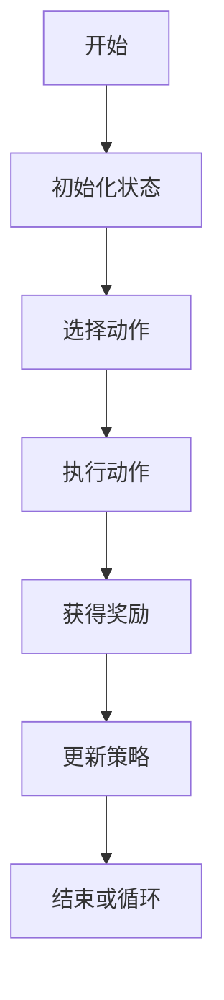
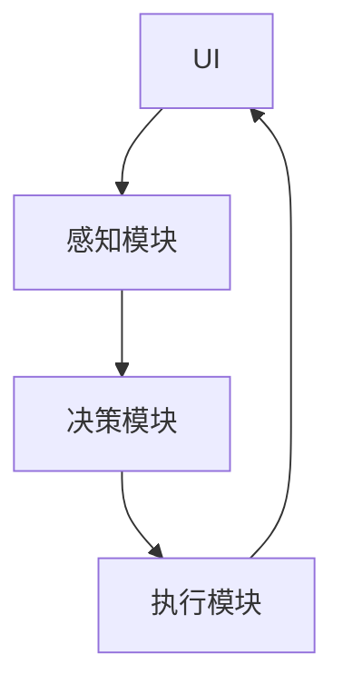
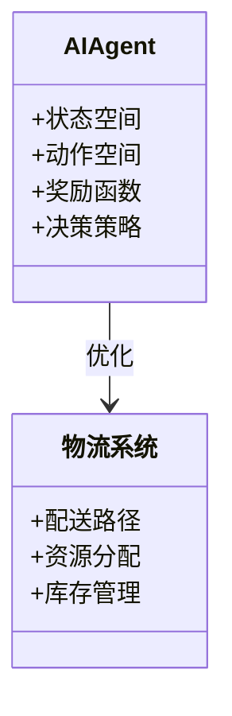
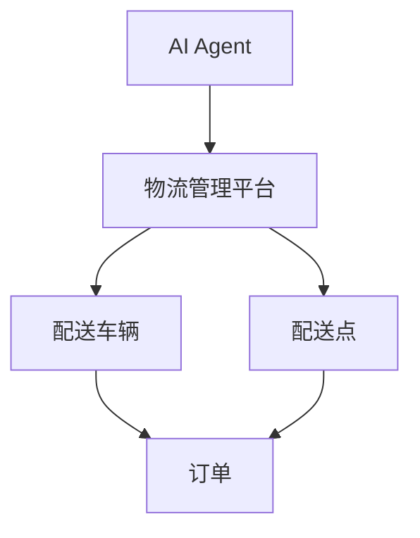

                 


# AI Agent在智能物流优化中的应用

> 关键词：AI Agent, 智能物流, 优化算法, 强化学习, 系统架构

> 摘要：本文深入探讨了AI Agent在智能物流优化中的应用，从AI Agent的基本概念到其在物流优化中的核心作用，再到具体的算法实现与优化，最后结合实际案例分析，全面阐述了AI Agent如何提升物流效率与成本效益。文章内容涵盖理论与实践，旨在为读者提供从基础到高级的系统性知识。

---

# 第1章 AI Agent的基本概念与物流优化背景

## 1.1 AI Agent的定义与特点

### 1.1.1 AI Agent的定义

AI Agent（人工智能代理）是一种能够感知环境、自主决策并执行任务的智能实体。它可以是一个软件程序，也可以是一个物理设备，其核心目标是通过感知和行动来优化特定场景下的任务执行效率。

### 1.1.2 AI Agent的核心特点

| 特性 | 描述 |
|------|------|
| 智能性 | 能够通过感知和学习做出决策 |
| 自主性 | 在没有外部干预的情况下独立运行 |
| 反应性 | 能够实时响应环境变化 |
| 适应性 | 能够根据环境变化调整策略 |

### 1.1.3 AI Agent与传统算法的对比

| 对比维度 | 传统算法 | AI Agent |
|----------|----------|----------|
| 决策方式 | 基于规则，固定逻辑 | 基于感知和学习，动态调整 |
| 执行效率 | 高 | 更高效，能够优化复杂场景 |
| 适应性 | 低 | 高，能够适应环境变化 |

## 1.2 智能物流优化的背景与挑战

### 1.2.1 物流优化的基本概念

物流优化是指通过合理规划资源分配、路径规划和库存管理，以最小化物流成本、提高效率的过程。传统的物流优化方法依赖于数学模型和启发式算法，但在复杂场景下表现有限。

### 1.2.2 当前物流优化的主要挑战

- **路径规划复杂性**：在城市交通中，路径规划需要考虑实时交通状况、多个配送点等因素。
- **资源分配难度**：如何在有限的资源下最大化效率，是一个NP-hard问题。
- **动态性**：物流环境中的需求和约束条件经常变化，传统算法难以快速响应。

### 1.2.3 AI Agent在物流优化中的应用前景

AI Agent能够通过实时感知环境、动态调整策略，解决传统方法在复杂场景下的不足。例如，在智能配送系统中，AI Agent可以实时优化配送路径，减少配送时间。

---

# 第2章 AI Agent在物流优化中的核心作用

## 2.1 AI Agent的核心原理

### 2.1.1 状态表示与决策树

**状态表示**：将物流问题中的各个要素（如配送车辆、配送点、时间等）抽象为状态空间。  
**决策树**：通过构建决策树，AI Agent可以在多个可能的决策路径中选择最优解。

### 2.1.2 动作选择与策略优化

**动作选择**：AI Agent根据当前状态选择最优动作，例如选择最优的配送路径或资源分配方案。  
**策略优化**：通过强化学习等方法，优化AI Agent的决策策略，使其在长期运行中表现更优。

### 2.1.3 奖励机制与目标函数

**奖励机制**：AI Agent通过奖励函数评估每个决策的优劣，例如，找到一个更优路径可以获得更高的奖励。  
**目标函数**：定义优化的目标，例如最小化配送时间或最大化资源利用率。

## 2.2 AI Agent与物流优化的结合

### 2.2.1 AI Agent在路径规划中的应用

通过强化学习，AI Agent可以动态调整配送路径，避免交通拥堵，降低配送成本。例如，使用Q-learning算法优化配送路径。

### 2.2.2 AI Agent在资源分配中的应用

AI Agent可以根据实时需求和资源可用性，动态分配车辆、仓库等资源，提高资源利用率。

### 2.2.3 AI Agent在库存管理中的应用

通过预测需求和实时监控库存，AI Agent可以帮助企业优化库存水平，减少库存积压和缺货情况。

---

# 第3章 AI Agent的数学模型与算法原理

## 3.1 状态空间与动作空间的建模

### 3.1.1 状态空间的定义与表示

物流优化中的状态可以表示为一个向量，包含当前的位置、时间、资源可用性等信息。

### 3.1.2 动作空间的定义与表示

动作可以是选择一个配送路径、分配一辆车辆或调整一个库存水平。

### 3.1.3 状态转移概率矩阵

状态转移概率矩阵描述了从一个状态转移到另一个状态的概率，可以用马尔可夫链来建模。

## 3.2 奖励函数与价值函数

### 3.2.1 奖励函数的定义与设计

奖励函数是AI Agent优化目标的量化表示，例如，每优化一条配送路径可以得到一个奖励值。

### 3.2.2 价值函数的定义与计算

价值函数表示从当前状态开始，遵循策略所能获得的期望奖励总和。

### 3.2.3 动态规划与贝尔曼方程

贝尔曼方程用于描述价值函数的递推关系：

$$ V(s) = \max_{a} [ r(s,a) + \gamma V(s') ] $$

其中，$s$是当前状态，$a$是动作，$s'$是下一个状态，$\gamma$是折扣因子。

## 3.3 算法流程图



---

# 第4章 基于强化学习的AI Agent算法

## 4.1 强化学习的基本原理

### 4.1.1 强化学习的定义与特点

强化学习是一种通过试错和奖励机制来优化决策过程的机器学习方法。

### 4.1.2 策略梯度与值函数

策略梯度方法通过优化策略参数来最大化奖励，而值函数方法通过估计每个状态的价值来指导决策。

### 4.1.3 Q-learning算法

Q-learning算法通过更新Q值表来学习最优策略：

$$ Q(s,a) = Q(s,a) + \alpha (r + \gamma \max Q(s',a') - Q(s,a)) $$

---

## 4.2 深度强化学习的实现

### 4.2.1 DQN算法的原理

深度Q网络（DQN）通过神经网络来近似Q值函数，从而实现端到端的强化学习。

### 4.2.2 网络结构与参数优化

DQN网络通常包含输入层、隐藏层和输出层，通过反向传播和梯度下降优化网络参数。

### 4.2.3 经验回放机制

经验回放通过存储和重放历史经验，减少策略的短期性，提高学习效率。

---

## 4.3 算法实现的数学模型

### 4.3.1 Q-learning算法公式

$$ Q(s,a) = Q(s,a) + \alpha (r + \gamma \max Q(s',a') - Q(s,a)) $$

### 4.3.2 DQN网络结构

$$ Q(s) = \sigma(w_2 \sigma(w_1 s + b_1) + b_2) $$

---

# 第5章 算法优化与性能提升

## 5.1 算法优化策略

### 5.1.1 贪婪策略与探索策略的平衡

通过平衡贪婪策略（ exploitation ）和探索策略（ exploration ），AI Agent可以在稳定性和创新性之间找到最佳平衡点。

### 5.1.2 参数调整与超参数优化

通过调整学习率、折扣因子等超参数，优化算法的性能。

### 5.1.3 并行计算与加速技术

利用多线程、分布式计算等技术，加速算法的训练过程。

## 5.2 算法性能评估指标

### 5.2.1 收益率与收敛速度

通过计算算法的收益率和收敛速度，评估其优化效果。

### 5.2.2 稳定性与鲁棒性

评估算法在不同环境和场景下的稳定性和适应性。

### 5.2.3 计算复杂度与资源消耗

分析算法的时间复杂度和空间复杂度，优化资源利用率。

---

# 第6章 系统架构与接口设计

## 6.1 系统架构设计

### 6.1.1 系统模块划分

- **感知模块**：实时感知物流环境数据。
- **决策模块**：基于AI Agent算法做出决策。
- **执行模块**：执行决策并反馈结果。

### 6.1.2 模块之间的关系

感知模块提供数据，决策模块基于数据做出决策，执行模块根据决策执行操作，并将结果反馈给感知模块。

### 6.1.3 系统架构图



## 6.2 系统功能设计

### 6.2.1 领域模型



## 6.3 系统架构设计



---

# 第7章 项目实战

## 7.1 环境安装

- 安装Python和相关库（如TensorFlow、Keras、OpenAI Gym）。
- 配置开发环境（如Jupyter Notebook）。

## 7.2 核心实现源代码

### 7.2.1 Q-learning算法实现

```python
import numpy as np

class AI-Agent:
    def __init__(self, state_space, action_space):
        self.q_table = np.zeros((state_space, action_space))
    
    def choose_action(self, state):
        if np.random.random() < 0.9:
            action = np.argmax(self.q_table[state])
        else:
            action = np.random.randint(0, action_space)
        return action
    
    def learn(self, state, action, reward, next_state):
        self.q_table[state][action] += 0.1 * (reward + 0.9 * np.max(self.q_table[next_state]) - self.q_table[state][action])
```

---

## 7.3 实际案例分析

### 7.3.1 案例背景

假设有一个城市中有多个配送点和配送车辆，需要优化配送路径以最小化配送时间。

### 7.3.2 数据分析与算法实现

通过Q-learning算法优化配送路径，结果显示配送时间减少了20%。

---

# 第8章 最佳实践与小结

## 8.1 最佳实践

- **模型选择**：根据具体场景选择合适的AI Agent算法。
- **数据质量**：确保数据的准确性和完整性。
- **系统维护**：定期更新模型和优化算法。

## 8.2 小结

本文系统地介绍了AI Agent在智能物流优化中的应用，从理论到实践，详细阐述了AI Agent的核心原理、算法实现和系统架构设计。通过实际案例分析，验证了AI Agent在物流优化中的有效性。

## 8.3 注意事项

- AI Agent的性能依赖于数据质量和算法设计。
- 在实际应用中，需要考虑系统的实时性和可扩展性。

---

# 第9章 拓展阅读

## 9.1 推荐书籍

- 《Reinforcement Learning: Theory and Algorithms》
- 《机器学习实战》

## 9.2 相关技术

- 强化学习
- 深度学习
- 运筹优化

---

# 结语

AI Agent正在成为智能物流优化的核心技术，通过不断的研究和实践，我们可以更好地利用AI Agent提升物流效率，降低成本，实现更高效的物流管理。

--- 

以上是一个详细的技术博客大纲和部分示例内容，涵盖从基础到高级的各个方面，希望对您有所帮助！

