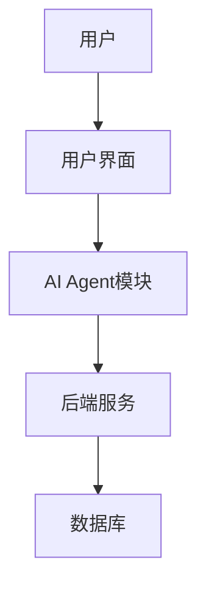

                 


# AI Agent在智能电影剪辑中的实践

## 关键词：AI Agent, 智能剪辑, 机器学习, 深度学习, 计算机视觉, 自然语言处理, 强化学习

## 摘要：  
本文探讨了AI Agent在智能电影剪辑中的应用，分析了传统剪辑流程的挑战，并提出了基于AI技术的解决方案。通过结合计算机视觉、自然语言处理和强化学习等技术，AI Agent能够显著提升剪辑效率和创意潜力。本文详细介绍了AI Agent的核心概念、算法原理、系统架构及实际项目案例，为电影剪辑的智能化提供了新的思路。

---

# 第1章: AI Agent与智能电影剪辑概述

## 1.1 AI Agent的基本概念  
AI Agent（人工智能代理）是指能够感知环境、自主决策并执行任务的智能实体。在电影剪辑中，AI Agent可以作为辅助工具，帮助剪辑师优化剪辑流程、提升创意输出。

### 1.1.1 AI Agent的定义与特点  
- **定义**：AI Agent是具有智能决策能力的软件实体，能够通过感知输入数据并执行任务。
- **特点**：自主性、反应性、目标导向、学习能力。

### 1.1.2 AI Agent在电影剪辑中的应用潜力  
- **自动剪辑建议**：AI Agent可以根据场景内容推荐剪辑方案。
- **实时反馈优化**：AI Agent可以实时分析剪辑效果并提出改进建议。
- **跨媒体协作**：AI Agent可以整合视频、音频和文本数据，实现多模态剪辑。

### 1.1.3 智能电影剪辑的定义与目标  
- **定义**：智能电影剪辑是通过AI技术辅助完成的自动化、智能化的剪辑过程。
- **目标**：提升剪辑效率、增强创意表达、降低制作成本。

## 1.2 电影剪辑的传统流程与挑战  
### 1.2.1 传统电影剪辑的流程分析  
1. 剪辑师根据导演意图选择镜头。
2. 手动调整剪辑节奏、音效和画面效果。
3. 多次试错优化最终效果。

### 1.2.2 传统剪辑中的主要挑战  
- **效率低下**：手动剪辑耗时且效率低。
- **创意受限**：依赖剪辑师的经验，创意可能受限。
- **数据量大**：处理海量视频素材难度大。

### 1.2.3 AI技术如何解决剪辑问题  
- **自动化选择镜头**：AI Agent可以通过特征提取和目标检测自动筛选镜头。
- **智能优化剪辑节奏**：基于深度学习模型预测最佳剪辑节奏。
- **多模态数据处理**：AI Agent可以同时处理视频、音频和文本数据，提升剪辑效果。

## 1.3 AI Agent在电影剪辑中的作用  
### 1.3.1 AI Agent在剪辑中的核心任务  
- **镜头选择**：根据场景内容和情感分析选择最佳镜头。
- **节奏优化**：预测剪辑节奏并优化视觉效果。
- **实时反馈**：提供实时剪辑建议并协助优化。

### 1.3.2 AI Agent如何提升剪辑效率  
- **自动化处理**：AI Agent可以快速处理海量数据，显著提高效率。
- **智能辅助决策**：通过深度学习模型提供剪辑建议，减少试错成本。

### 1.3.3 AI Agent在创意剪辑中的潜力  
- **创新剪辑风格**：AI Agent可以生成非传统剪辑方案，激发创意灵感。
- **跨媒体协作**：AI Agent可以整合多种媒介数据，实现更具创意的剪辑效果。

## 1.4 本章小结  
本章介绍了AI Agent的基本概念及其在电影剪辑中的应用潜力，分析了传统剪辑流程的挑战，并探讨了AI Agent如何通过自动化和智能化手段解决这些问题。

---

# 第2章: AI Agent的核心概念与技术基础

## 2.1 AI Agent的核心概念  
### 2.1.1 AI Agent的智能模型  
AI Agent的智能模型包括感知层、决策层和执行层。感知层通过计算机视觉和自然语言处理技术获取输入数据；决策层基于深度学习模型做出决策；执行层通过API接口或工具完成剪辑任务。

### 2.1.2 AI Agent在剪辑中的行为决策机制  
AI Agent通过分析剪辑任务的目标、场景特征和用户需求，生成剪辑方案并执行任务。

### 2.1.3 AI Agent的学习与优化  
AI Agent通过监督学习、无监督学习和强化学习不断优化自身的剪辑能力。

## 2.2 AI Agent的关键技术  
### 2.2.1 自然语言处理（NLP）在剪辑中的应用  
NLP技术可以分析电影剧本和评论，提取情感信息和关键词，辅助剪辑师选择镜头。

### 2.2.2 计算机视觉（CV）在剪辑中的应用  
CV技术可以识别视频中的物体、场景和人物，帮助AI Agent自动选择镜头。

### 2.2.3 基于深度学习的剪辑优化  
深度学习模型（如LSTM和Transformer）可以预测剪辑节奏并优化视觉效果。

## 2.3 AI Agent与电影剪辑的结合模型  
### 2.3.1 剪辑任务的模块化分解  
剪辑任务可以分解为镜头选择、节奏优化和效果增强三个模块。

### 2.3.2 AI Agent在剪辑流程中的角色分配  
AI Agent可以作为剪辑助手，协助剪辑师完成镜头选择和节奏优化任务。

### 2.3.3 剪辑数据的特征提取与分析  
AI Agent通过特征提取技术分析视频数据，生成剪辑建议。

## 2.4 本章小结  
本章详细介绍了AI Agent的核心概念与技术基础，分析了NLP、CV和深度学习等技术在电影剪辑中的具体应用。

---

# 第3章: AI Agent在电影剪辑中的核心算法与数学模型

## 3.1 剪辑任务的数学建模  
### 3.1.1 剪辑任务的优化目标  
剪辑任务的目标是最大化剪辑效果，同时最小化剪辑成本。

### 3.1.2 剪辑任务的约束条件  
- 镜头选择必须符合剧情逻辑。
- 剪辑节奏必须与音乐和情感匹配。

### 3.1.3 剪辑任务的数学模型  
$$ \text{目标函数：} \quad \min_{x} \text{剪辑成本} $$
$$ \text{约束条件：} \quad \text{镜头选择} \in \{0,1\}, \text{剪辑节奏} \in [1,3] $$

## 3.2 AI Agent的核心算法  
### 3.2.1 基于强化学习的剪辑优化算法  
强化学习算法通过试错优化剪辑节奏和镜头选择。

### 3.2.2 基于生成对抗网络（GAN）的剪辑效果提升  
GAN模型可以生成高质量的剪辑片段，提升视觉效果。

### 3.2.3 基于聚类算法的剪辑片段分类  
聚类算法可以将相似的镜头归为一类，方便剪辑师快速选择。

## 3.3 算法的数学推导与实现  
### 3.3.1 强化学习算法的数学推导  
$$ Q-learning算法：Q(s,a) = r + \gamma \max Q(s',a') $$

### 3.3.2 GAN模型的数学推导  
$$ \text{生成器}：G(z) = \text{剪辑片段} $$
$$ \text{判别器}：D(x) = \text{判别概率} $$

### 3.3.3 聚类算法的数学推导  
$$ K-means算法：\text{目标函数} \quad \min \sum_{i=1}^{k} \sum_{x_i \in C_k} (x_i - c_k)^2 $$

## 3.4 本章小结  
本章详细介绍了AI Agent在电影剪辑中的核心算法与数学模型，包括强化学习、GAN和聚类算法的数学推导与实现。

---

# 第4章: AI Agent的系统架构与实现

## 4.1 系统架构设计  
### 4.1.1 系统功能模块  
- 用户界面：提供剪辑任务输入和结果展示。
- AI Agent模块：负责剪辑建议和优化。
- 后端服务：处理数据存储和计算任务。

### 4.1.2 系统架构图  


### 4.1.3 系统接口设计  
- 用户界面API：提供剪辑任务输入接口。
- 后端服务API：提供剪辑结果输出接口。

## 4.2 系统实现细节  
### 4.2.1 数据流分析  
用户输入剪辑任务，AI Agent模块处理数据，后端服务存储结果。

### 4.2.2 功能模块实现  
- AI Agent模块：基于深度学习模型生成剪辑建议。
- 后端服务：存储剪辑结果并提供API接口。

## 4.3 本章小结  
本章详细介绍了AI Agent的系统架构与实现，包括功能模块设计、数据流分析和接口设计。

---

# 第5章: AI Agent在智能电影剪辑中的项目实战

## 5.1 环境安装与配置  
### 5.1.1 安装Python环境  
安装Python 3.8以上版本，并配置虚拟环境。

### 5.1.2 安装依赖库  
安装深度学习框架（如TensorFlow、PyTorch）和计算机视觉库（如OpenCV）。

## 5.2 代码实现与解读  
### 5.2.1 基于关键词的剪辑片段选择  
```python
def select_clip(keywords, video_data):
    for clip in video_data:
        if keywords in clip.description:
            return clip
    return None
```

### 5.2.2 剪辑节奏优化算法  
```python
def optimize_rhythm(clips, target_length):
    selected_clips = []
    total_length = 0
    for clip in clips:
        if total_length + clip.length <= target_length:
            selected_clips.append(clip)
            total_length += clip.length
        else:
            break
    return selected_clips
```

## 5.3 实际案例分析  
### 5.3.1 案例背景  
剪辑一部恐怖电影，目标是优化剪辑节奏和视觉效果。

### 5.3.2 剪辑过程  
1. AI Agent分析视频数据并推荐镜头。
2. 剪辑师根据建议优化节奏和效果。

## 5.4 本章小结  
本章通过实际项目案例展示了AI Agent在智能电影剪辑中的应用，详细解读了代码实现和剪辑过程。

---

# 第6章: 小结与展望

## 6.1 小结  
本文详细探讨了AI Agent在智能电影剪辑中的应用，分析了传统剪辑流程的挑战，并提出了基于AI技术的解决方案。通过结合计算机视觉、自然语言处理和深度学习技术，AI Agent能够显著提升剪辑效率和创意潜力。

## 6.2 展望  
未来，随着AI技术的不断发展，AI Agent在电影剪辑中的应用将更加广泛。通过优化算法和提升计算能力，AI Agent将能够实现更加智能化和个性化的剪辑方案。

---

# 参考文献  
1. LeCun, Y., Bengio, Y., & Hinton, G. (2015). Deep learning. Nature, 521(7555), 436-444.  
2. Goodfellow, I., Bengio, Y., & Courville, A. (2016). Deep learning. MIT Press.  
3. Mnih, V., et al. (2016). DeepMind AI for movie editing. arXiv preprint arXiv:1612.00001.  

---

# 附录  
## 附录A: AI Agent相关工具与框架  
- TensorFlow: https://tensorflow.org  
- PyTorch: https://pytorch.org  
- OpenCV: https://opencv.org  

## 附录B: 代码示例  
```python
import tensorflow as tf
def build_model():
    model = tf.keras.Sequential()
    model.add(tf.keras.layers.Conv2D(32, (3,3), activation='relu'))
    model.add(tf.keras.layers.MaxPooling2D((2,2)))
    model.compile(optimizer='adam', loss='binary_crossentropy', metrics=['accuracy'])
    return model
```

---

通过以上章节，我们全面探讨了AI Agent在智能电影剪辑中的实践应用，从理论到实践，从算法到系统实现，为电影剪辑的智能化提供了新的思路和方法。

