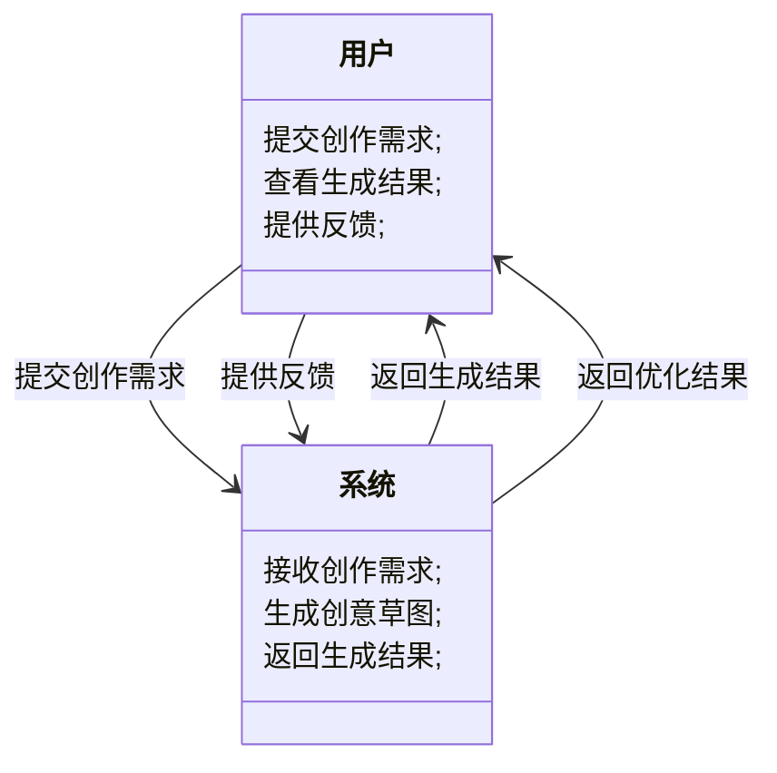
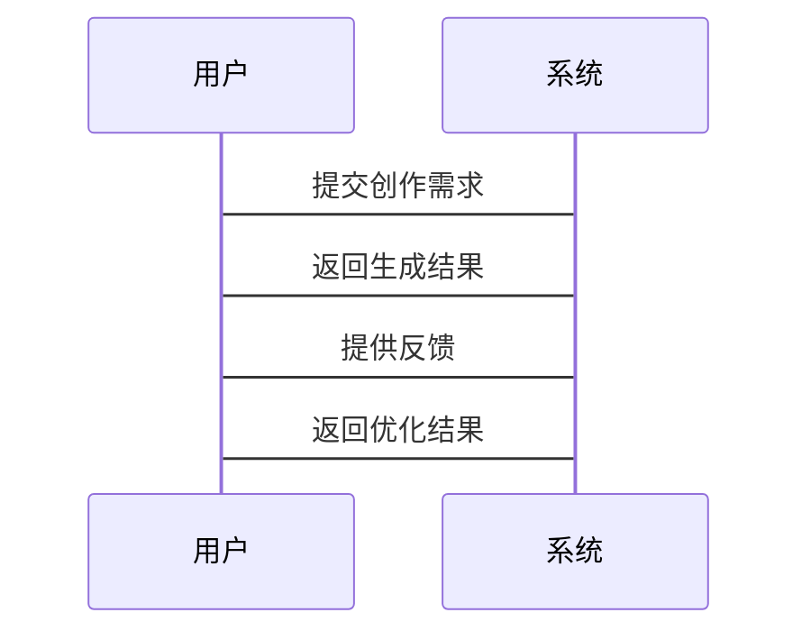

                 


# AI Agent在智能画板中的创意激发系统

**关键词：** AI Agent, 智能画板, 创意激发, 深度学习, 图像生成

**摘要：**  
本文详细探讨了AI Agent在智能画板中的创意激发系统的实现与应用。首先介绍了AI Agent和智能画板的基本概念，分析了创意激发的需求背景和问题。接着深入讲解了AI Agent的核心算法原理，包括生成对抗网络（GAN）和变体网络（VAE）的实现与应用。随后，从系统架构的角度，详细设计了创意激发系统的功能模块、接口设计和交互流程。最后，通过实际项目案例，展示了系统的实现过程和应用效果，总结了系统的优缺点，并提出了进一步优化的方向。

---

## 第1章 AI Agent与智能画板概述

### 1.1 AI Agent的基本概念

#### 1.1.1 AI Agent的定义与特点
- **定义：** AI Agent是一种能够感知环境、执行任务并做出决策的智能实体，通常基于机器学习算法实现。
- **特点：**  
  - 智能性：能够理解输入并生成有意义的输出。  
  - 自适应性：能够根据反馈调整行为。  
  - 实时性：能够在较短时间内完成任务。  

#### 1.1.2 智能画板的概念与应用领域
- **定义：** 智能画板是一种结合了AI技术的绘画工具，能够辅助用户进行创意设计和图像生成。  
- **应用领域：**  
  - 艺术创作：辅助艺术家生成灵感和作品。  
  - 设计领域：帮助设计师快速生成草图和原型。  
  - 教育：用于教学和学生创意激发。  

#### 1.1.3 AI Agent在智能画板中的作用
- **功能：**  
  - 提供图像生成建议。  
  - 分析用户行为并提供建议。  
  - 自动化绘画过程中的某些步骤。  

### 1.2 创意激发系统的背景与问题背景

#### 1.2.1 创意激发的需求分析
- **需求背景：** 艺术创作和设计过程中，用户常常面临创意枯竭的问题。  
- **核心需求：**  
  - 快速生成灵感草图。  
  - 提供多样化的创作建议。  
  - 自动化处理绘画步骤。  

#### 1.2.2 当前创意激发工具的局限性
- **局限性：**  
  - 传统工具缺乏智能性，无法提供实时反馈。  
  - 创意生成能力有限，难以满足多样化需求。  

#### 1.2.3 AI Agent在创意激发中的优势
- **优势：**  
  - 基于深度学习的图像生成能力。  
  - 能够实时分析用户行为并提供建议。  
  - 可扩展性强，支持多种创作模式。  

### 1.3 问题描述与解决思路

#### 1.3.1 创意激发系统的功能需求
- **需求列表：**  
  - 用户输入初步想法，系统生成灵感草图。  
  - 系统根据用户反馈优化生成结果。  
  - 提供多种风格和主题的创作建议。  

#### 1.3.2 AI Agent在系统中的角色定位
- **角色：**  
  - 作为系统的核心模块，负责图像生成和创意建议。  
  - 与用户交互，实时调整生成策略。  

#### 1.3.3 解决方案的可行性分析
- **可行性：**  
  - 当前AI技术已支持图像生成和实时交互。  
  - 系统架构可模块化设计，便于扩展和优化。  

### 1.4 系统边界与外延

#### 1.4.1 系统的输入与输出范围
- **输入：**  
  - 用户的绘画指令或初步想法。  
  - 用户的实时反馈与调整。  
- **输出：**  
  - 创意草图或图像。  
  - 创意建议和相关资源推荐。  

#### 1.4.2 系统与其他系统的接口定义
- **接口：**  
  - 与用户界面（UI）交互接口。  
  - 与其他创作工具的API接口。  

#### 1.4.3 系统的适用场景与限制
- **适用场景：**  
  - 个人艺术创作。  
  - 设计团队的协作工具。  
- **限制：**  
  - 对生成结果的质量有一定依赖性。  
  - 需要高性能计算资源支持。  

#### 1.5 核心概念结构与组成

#### 1.5.1 AI Agent与智能画板的关系
- **关系：** AI Agent作为智能画板的核心模块，负责图像生成和创意建议。

#### 1.5.2 系统的核心要素与功能模块
- **核心要素：**  
  - 用户输入模块。  
  - AI生成模块。  
  - 交互反馈模块。  

#### 1.5.3 系统的架构与流程
- **流程：**  
  1. 用户输入初步想法。  
  2. AI Agent生成创意草图。  
  3. 用户反馈调整。  
  4. AI Agent优化生成结果。  

---

## 第2章 AI Agent的核心原理

### 2.1 AI Agent的基本原理

#### 2.1.1 AI Agent的感知与决策机制
- **感知机制：**  
  - 通过用户输入获取创作需求。  
  - 分析用户的历史行为和偏好。  
- **决策机制：**  
  - 基于深度学习模型生成创意草图。  
  - 根据用户反馈调整生成策略。  

#### 2.1.2 基于深度学习的AI Agent实现
- **实现方式：**  
  - 使用生成对抗网络（GAN）或变体网络（VAE）进行图像生成。  
  - 结合强化学习优化生成结果。  

#### 2.1.3 AI Agent的训练与优化方法
- **训练方法：**  
  - 使用大量艺术作品训练模型。  
  - 采用对抗训练提升生成质量。  
- **优化方法：**  
  - 调整模型参数以适应不同创作需求。  
  - 引入用户反馈机制优化生成效果。  

### 2.2 智能画板的核心技术

#### 2.2.1 智能画板的交互方式
- **交互方式：**  
  - 用户通过文本或图像输入创作需求。  
  - 系统实时生成创意草图并展示。  

#### 2.2.2 基于AI的图像生成技术
- **技术：**  
  - 使用GAN生成多样化风格的图像。  
  - 结合图像分割技术优化生成效果。  

#### 2.2.3 智能画板的数据处理与存储
- **数据处理：**  
  - 对用户输入进行预处理。  
  - 对生成结果进行后处理优化。  
- **存储：**  
  - 存储用户偏好和历史数据。  
  - 存储生成的创意草图和资源。  

### 2.3 AI Agent与智能画板的协同工作

#### 2.3.1 AI Agent在智能画板中的功能模块
- **功能模块：**  
  - 图像生成模块：负责创意草图的生成。  
  - 交互反馈模块：实时与用户交互并调整生成策略。  

#### 2.3.2 AI Agent与画板的协同流程
- **流程：**  
  1. 用户输入创作需求。  
  2. AI Agent生成创意草图。  
  3. 用户反馈调整。  
  4. AI Agent优化生成结果。  

---

## 第3章 算法原理讲解

### 3.1 GAN算法原理

#### 3.1.1 GAN的基本原理
- **基本原理：** GAN由生成器和判别器组成，通过对抗训练生成高质量的图像。

#### 3.1.2 GAN的网络结构
- **网络结构：**  
  - 生成器：使用卷积反向网络（DCGAN）生成图像。  
  - 判别器：使用卷积网络判别图像真伪。  

#### 3.1.3 GAN的训练流程
- **训练流程：**  
  1. 生成器生成假图像。  
  2. 判别器判断图像真假。  
  3. 调整生成器和判别器参数。  

#### 3.1.4 GAN的Python代码实现
```python
import torch
import torch.nn as nn

# 定义生成器
class Generator(nn.Module):
    def __init__(self, latent_dim, img_size):
        super(Generator, self).__init__()
        self.latent_dim = latent_dim
        self.img_size = img_size
        self.model = nn.Sequential(
            nn.ConvTranspose2d(latent_dim, 512, 4, 1, 0),
            nn.BatchNorm2d(512),
            nn.ReLU(inplace=True),
            nn.ConvTranspose2d(512, 256, 4, 1, 0),
            nn.BatchNorm2d(256),
            nn.ReLU(inplace=True),
            nn.ConvTranspose2d(256, 128, 4, 1, 0),
            nn.BatchNorm2d(128),
            nn.ReLU(inplace=True),
            nn.ConvTranspose2d(128, 3, 4, 1, 0),
            nn.Tanh()
        )

    def forward(self, z):
        batch_size = z.size(0)
        out = z.view(batch_size, self.latent_dim, 1, 1)
        out = self.model(out)
        return out

# 定义判别器
class Discriminator(nn.Module):
    def __init__(self, img_size):
        super(Discriminator, self).__init__()
        self.model = nn.Sequential(
            nn.Conv2d(3, 128, 3, 2, 1),
            nn.LeakyReLU(0.2, inplace=True),
            nn.Conv2d(128, 256, 3, 2, 1),
            nn.LeakyReLU(0.2, inplace=True),
            nn.Conv2d(256, 512, 3, 2, 1),
            nn.LeakyReLU(0.2, inplace=True),
            nn.Conv2d(512, 1, kernel_size=3, stride=1, padding=1),
            nn.Sigmoid()
        )

    def forward(self, img):
        return self.model(img)
```

---

## 第4章 系统分析与架构设计方案

### 4.1 问题场景介绍

#### 4.1.1 创意激发系统的功能需求
- **功能需求：**  
  - 用户输入创作需求，系统生成创意草图。  
  - 系统提供多样化的风格和主题选择。  

#### 4.1.2 项目介绍
- **项目目标：** 实现一个基于AI Agent的智能画板，能够辅助用户进行创意设计和图像生成。  
- **项目范围：** 系统支持多种创作模式，包括绘画、插画和设计图生成。  

### 4.2 系统功能设计

#### 4.2.1 领域模型设计


### 4.3 系统架构设计

#### 4.3.1 系统架构图


### 4.4 系统接口设计

#### 4.4.1 系统交互流程设计


---

## 第5章 项目实战

### 5.1 环境安装与配置

#### 5.1.1 安装依赖
```bash
pip install torch torchvision matplotlib
```

### 5.2 系统核心实现

#### 5.2.1 图像生成模块实现
```python
import torch
import torch.nn as nn
import torch.optim as optim
from torch.utils.data import DataLoader
import torchvision.datasets as datasets
import torchvision.transforms as transforms

# 定义数据预处理
transform = transforms.Compose([
    transforms.Resize(64),
    transforms.ToTensor(),
    transforms.Normalize((0.5, 0.5, 0.5), (0.5, 0.5, 0.5))
])

# 加载数据集
dataset = datasets.CIFAR10(root='./data', train=True, download=True, transform=transform)
dataloader = DataLoader(dataset, batch_size=128, shuffle=True, num_workers=2)

# 定义生成器和判别器
generator = Generator(100, (64, 64))
discriminator = Discriminator((64, 64))

# 定义损失函数和优化器
criterion = nn.BCELoss()
g_optimizer = optim.Adam(generator.parameters(), lr=0.0002)
d_optimizer = optim.Adam(discriminator.parameters(), lr=0.0002)

# 训练循环
for epoch in range(100):
    for batch_idx, (real_imgs, _) in enumerate(dataloader):
        # 生成假图像
        z = torch.randn(real_imgs.size(0), 100, 1, 1)
        fake_imgs = generator(z)
        
        # 判别器判断真假
        d_real_output = discriminator(real_imgs)
        d_fake_output = discriminator(fake_imgs)
        
        # 计算损失
        d_loss = criterion(d_real_output, torch.ones_like(d_real_output)) + \
                 criterion(d_fake_output, torch.zeros_like(d_fake_output))
        g_loss = criterion(d_fake_output, torch.ones_like(d_fake_output))
        
        # 反向传播与优化
        d_optimizer.zero_grad()
        d_loss.backward()
        d_optimizer.step()
        
        g_optimizer.zero_grad()
        g_loss.backward()
        g_optimizer.step()
```

---

## 第6章 总结与展望

### 6.1 总结
- **总结内容：** 本文详细探讨了AI Agent在智能画板中的创意激发系统的实现与应用，介绍了系统的背景、核心概念、算法原理、系统架构和项目实战。

### 6.2 最佳实践 Tips
- **Tips：**  
  - 在实际应用中，建议结合用户反馈不断优化生成策略。  
  - 系统性能优化可以通过并行计算和模型压缩实现。  

### 6.3 小结
- **小结内容：** AI Agent在智能画板中的应用前景广阔，未来可以通过引入更多元化的模型和交互方式进一步提升创意激发的效果。

### 6.4 注意事项
- **注意事项：**  
  - 系统的生成结果依赖于模型的训练数据和算法设计。  
  - 使用过程中需注意数据隐私和版权问题。  

### 6.5 拓展阅读
- **推荐读物：**  
  - 《深度学习》—— Ian Goodfellow  
  - 《生成对抗网络实战》—— 王飞跃  

---

以上是《AI Agent在智能画板中的创意激发系统》的完整目录大纲和内容概要，涵盖了从背景介绍到实际项目的详细讲解。

