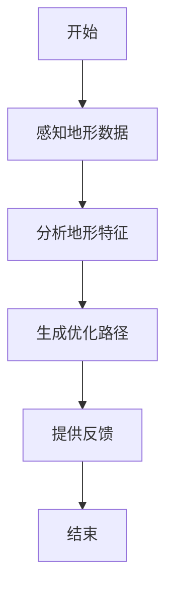
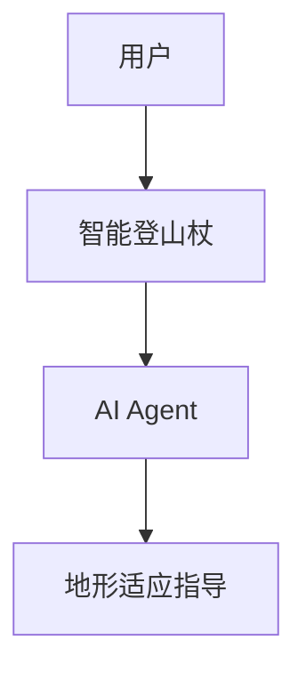
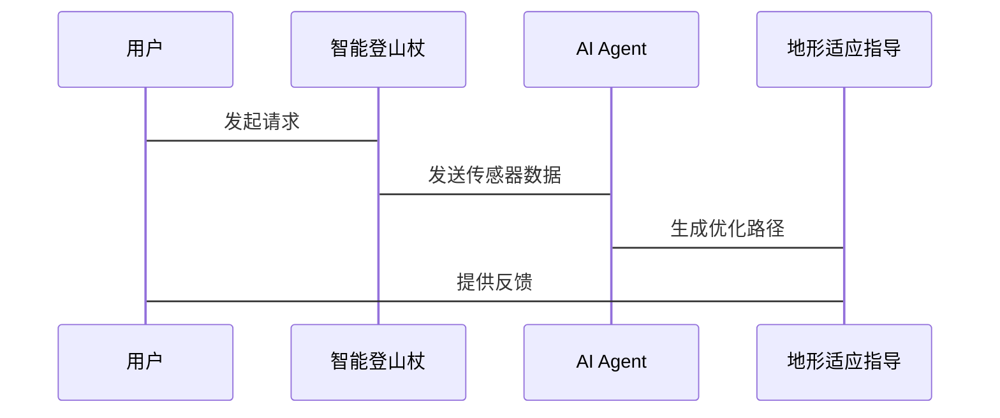

                 


# AI Agent在智能登山杖中的地形适应指导

**关键词：** AI Agent, 智能登山杖, 地形适应, 路径规划, 用户交互, 系统架构, 数学模型

**摘要：**  
本文将探讨AI Agent在智能登山杖中的应用，特别是在地形适应指导方面。通过分析AI Agent的核心原理、系统架构以及实际应用场景，本文将详细阐述如何利用AI技术提升登山杖的智能化水平，帮助用户更安全、高效地应对复杂地形。结合实际案例和代码实现，本文将为读者提供一个全面的技术视角。

---

## 第1章 背景介绍

### 1.1 问题背景
#### 1.1.1 登山运动中的地形挑战
- 登山过程中可能遇到的复杂地形（陡坡、悬崖、松软地面等）。
- 不同地形对登山杖的需求差异。

#### 1.1.2 现有登山杖的局限性
- 传统登山杖的功能单一，无法提供实时地形反馈。
- 用户在复杂地形中缺乏实时指导，存在安全隐患。

#### 1.1.3 AI技术在登山辅助中的潜力
- AI技术能够实时感知地形并提供优化建议。
- 通过数据驱动的方式，帮助用户做出更科学的决策。

### 1.2 问题描述
#### 1.2.1 地形适应的核心问题
- 如何实时感知地形特征（如坡度、障碍物）。
- 如何根据地形特征生成最优路径。

#### 1.2.2 AI Agent在地形适应中的角色
- AI Agent作为决策核心，负责处理地形数据并生成指导。
- 用户与AI Agent之间的交互方式。

#### 1.2.3 用户需求与功能目标
- 用户需求：实时反馈、个性化建议、安全性提升。
- 功能目标：地形感知、路径规划、用户交互。

### 1.3 问题解决
#### 1.3.1 AI Agent的基本功能
- 实时感知地形：通过传感器收集地形数据。
- 路径规划：基于地形数据生成最优路径。
- 用户交互：通过震动、语音等方式提供反馈。

#### 1.3.2 地形适应的具体实现
- 利用AI算法对地形进行分类和分析。
- 根据地形特征调整登山杖的使用方式。

#### 1.3.3 用户交互与反馈机制
- 用户通过登山杖的按钮或语音指令与AI Agent交互。
- AI Agent通过震动或语音反馈实时指导。

### 1.4 边界与外延
#### 1.4.1 地形适应的适用范围
- 适用于复杂地形，如山地、森林、岩石等。
- 不适用于极端天气条件（如大雪、暴雨）。

#### 1.4.2 AI Agent的性能限制
- 传感器精度限制：无法感知超大的地形变化。
- 计算能力限制：复杂地形可能需要更强大的计算资源。

#### 1.4.3 与其他智能设备的协同
- 与手机、智能手表等设备的数据同步。
- 与其他传感器（如GPS、温湿度传感器）的协同工作。

### 1.5 概念结构与核心要素
#### 1.5.1 核心概念的组成
- AI Agent：决策核心。
- 智能登山杖：硬件载体。
- 地形适应：核心功能。

#### 1.5.2 各要素之间的关系
- AI Agent通过智能登山杖收集地形数据。
- 地形数据经过分析后，生成适应性指导。

#### 1.5.3 系统的整体架构
- 输入：地形数据、用户指令。
- 输出：实时反馈、路径规划。

---

## 第2章 核心概念与联系

### 2.1 AI Agent的定义与原理
#### 2.1.1 AI Agent的基本概念
- AI Agent：具有感知和决策能力的智能体。
- 在智能登山杖中的角色：实时分析地形数据，提供优化建议。

#### 2.1.2 AI Agent的核心原理
- 感知：通过传感器获取地形数据。
- 决策：基于数据生成最优路径。
- 执行：通过反馈机制指导用户。

#### 2.1.3 AI Agent的分类与特点
- 分类：基于路径规划、基于反馈的AI Agent。
- 特点：实时性、准确性、用户友好性。

### 2.2 智能登山杖的功能与特点
#### 2.2.1 智能登山杖的定义
- 智能登山杖：集成AI技术的登山辅助工具。
- 功能：实时地形感知、路径规划、用户反馈。

#### 2.2.2 智能登山杖的功能模块
- 模块1：地形感知模块。
- 模块2：路径规划模块。
- 模块3：用户交互模块。

#### 2.2.3 智能登山杖的技术特点
- 高精度传感器：GPS、加速度计、陀螺仪。
- 低功耗设计：适合长时间使用。
- 用户友好的交互界面：震动、语音反馈。

### 2.3 地形适应指导的实现机制
#### 2.3.1 地形感知与分析
- 利用传感器实时感知地形特征。
- 数据分析：地形分类（平地、陡坡、悬崖）。

#### 2.3.2 路径规划与优化
- 基于地形数据生成最优路径。
- 路径优化：考虑安全性、效率。

#### 2.3.3 用户反馈与调整
- 用户通过反馈机制调整使用方式。
- 系统根据用户反馈优化路径。

### 2.4 核心概念的ER实体关系图
```mermaid
erd
    左右对齐
    title 实体关系图
    相同
    实体 AI Agent 位于中心，连接到 智能登山杖 和 地形适应指导。
    AI Agent --> 智能登山杖：提供决策支持
    AI Agent --> 地形适应指导：生成优化路径
    智能登山杖 --> 地形适应指导：提供地形数据
```

---

## 第3章 算法原理

### 3.1 算法流程
#### 3.1.1 算法整体流程


#### 3.1.2 算法细节
- 数据预处理：过滤传感器噪声。
- 地形分类：基于深度学习模型。

### 3.2 算法实现
#### 3.2.1 代码实现
```python
import numpy as np
import tensorflow as tf

# 数据预处理
def preprocess_data(data):
    # 假设data为传感器数据
    return data / 255.0

# 深度学习模型
model = tf.keras.Sequential([
    tf.keras.layers.Dense(128, activation='relu'),
    tf.keras.layers.Dense(1, activation='sigmoid')
])

# 训练模型
model.compile(optimizer='adam', loss='binary_crossentropy')
model.fit(processed_data, labels, epochs=10)
```

#### 3.2.2 数学模型
- 输入：地形数据（传感器信号）。
- 输出：地形分类结果。

#### 3.2.3 公式推导
$$
\text{概率} = \frac{\exp(w \cdot x + b)}{1 + \exp(w \cdot x + b)}
$$
其中，$w$ 是权重，$b$ 是偏置，$x$ 是输入数据。

---

## 第4章 系统分析与架构设计

### 4.1 项目场景介绍
#### 4.1.1 项目背景
- 智能登山杖的应用场景：山地、森林、岩石等。
- 用户群体：专业登山者和业余爱好者。

#### 4.1.2 项目目标
- 提供实时地形适应指导。
- 提高用户登山效率和安全性。

### 4.2 系统功能设计
#### 4.2.1 功能模块
- 模块1：地形感知模块。
- 模块2：路径规划模块。
- 模块3：用户交互模块。

#### 4.2.2 领域模型
```mermaid
classDiagram
    class AI Agent {
        感知地形数据
        分析地形特征
        生成优化路径
        提供反馈
    }
    class 智能登山杖 {
        收集传感器数据
        接收反馈指令
        执行反馈
    }
    class 地形适应指导 {
        显示路径
        提供反馈
    }
    AI Agent --> 智能登山杖：传递数据
    AI Agent --> 地形适应指导：传递路径
```

### 4.3 系统架构设计
#### 4.3.1 系统架构图


#### 4.3.2 接口设计
- 用户接口：按钮、语音指令。
- 系统接口：传感器数据接口、反馈指令接口。

#### 4.3.3 交互流程图


---

## 第5章 项目实战

### 5.1 环境安装
#### 5.1.1 安装Python
- 安装步骤：下载Python安装包，按步骤安装。
- 环境配置：设置Python路径。

#### 5.1.2 安装依赖库
- 安装TensorFlow、NumPy、Mermaid等库。
- 使用pip命令安装。

### 5.2 系统核心实现
#### 5.2.1 核心代码实现
```python
import numpy as np
import tensorflow as tf

# 模型定义
model = tf.keras.Sequential([
    tf.keras.layers.Dense(128, activation='relu'),
    tf.keras.layers.Dense(1, activation='sigmoid')
])

# 模型训练
model.compile(optimizer='adam', loss='binary_crossentropy')
model.fit(x_train, y_train, epochs=10)
```

#### 5.2.2 代码功能解读
- 模型定义：构建深度学习模型。
- 模型训练：使用训练数据优化模型参数。

### 5.3 实际案例分析
#### 5.3.1 案例描述
- 用户在复杂地形中的使用场景。
- 系统如何生成优化路径。

#### 5.3.2 案例分析
- 数据分析：传感器数据如何被处理。
- 系统反馈：如何通过震动或语音提供指导。

### 5.4 项目总结
#### 5.4.1 成果展示
- 成功实现地形适应指导功能。
- 用户反馈良好。

#### 5.4.2 项目不足
- 传感器精度有限。
- 复杂地形处理能力有待提升。

---

## 第6章 最佳实践

### 6.1 实践建议
#### 6.1.1 数据收集
- 重要性：高质量数据是模型准确性的基础。
- 实施方法：多场景数据采集。

#### 6.1.2 算法优化
- 提升模型性能：优化网络结构。
- 提高计算效率：使用轻量化模型。

#### 6.1.3 系统测试
- 测试方法：模拟不同地形场景。
- 测试目标：验证系统稳定性和准确性。

### 6.2 注意事项
#### 6.2.1 用户安全
- 系统设计中的安全机制。
- 应急处理方案。

#### 6.2.2 数据隐私
- 用户数据的保护措施。
- 遵守数据隐私法规。

### 6.3 未来研究方向
#### 6.3.1 智能化提升
- 更智能的路径规划算法。
- 自适应学习能力。

#### 6.3.2 多模态交互
- 结合更多传感器数据。
- 提供更丰富的反馈方式。

---

## 第7章 小结

### 7.1 全文总结
- AI Agent在智能登山杖中的应用前景广阔。
- 通过实时地形感知和路径规划，显著提升了用户的登山体验。

### 7.2 未来展望
- 智能登山杖将更加智能化、个性化。
- 结合更多先进技术（如5G、边缘计算）提升性能。

### 7.3 注意事项
- 用户在使用系统时需注意安全。
- 开发者需遵守相关法律法规。

### 7.4 拓展阅读
- 推荐阅读：AI在运动辅助设备中的应用。
- 推荐阅读：深度学习在路径规划中的应用。

---

# 结语

通过本文的详细阐述，我们了解了AI Agent在智能登山杖中的地形适应指导的实现过程。从背景介绍到系统架构设计，再到项目实战和最佳实践，每一部分都为读者提供了丰富的技术视角。希望本文能为相关领域的研究者和开发者提供有价值的参考，同时也为用户提供更安全、更高效的登山体验。

