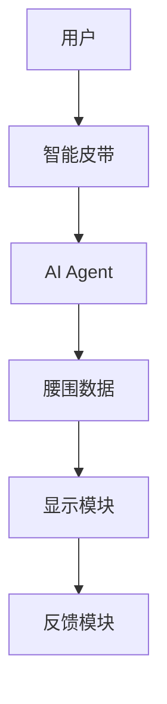
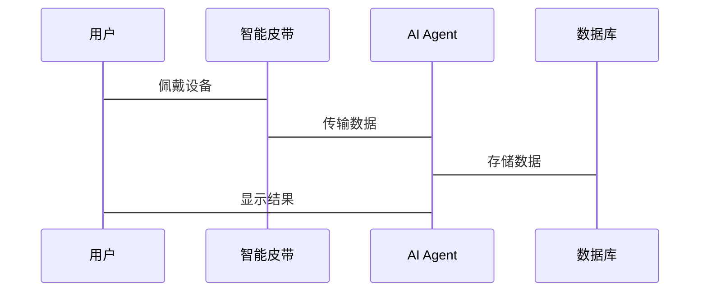

                 


# AI Agent在智能皮带中的腰围监测

> 关键词：AI Agent, 腰围监测, 智能皮带, 可穿戴设备, AI算法

> 摘要：本文详细探讨了AI Agent在智能皮带中的腰围监测技术，分析了其核心算法、系统架构及实际应用，展示了如何通过AI技术提升智能皮带的功能与用户体验。

---

## 第一部分: AI Agent在智能皮带中的腰围监测概述

### 第1章: 背景介绍

#### 1.1 问题背景
- **智能皮带的发展现状**：智能皮带作为一种可穿戴设备，正逐渐成为健康管理的重要工具。
- **腰围监测的必要性**：腰围是衡量健康的重要指标，与肥胖、心血管疾病密切相关。
- **AI Agent的应用前景**：AI Agent能够实时分析数据，提供精准的健康建议。

#### 1.2 问题描述
- **腰围监测的基本概念**：通过传感器测量腰围变化。
- **智能皮带的监测需求**：用户需要实时、准确的腰围数据。
- **AI Agent在腰围监测中的作用**：优化监测精度，提供个性化建议。

#### 1.3 问题解决
- **AI Agent的核心功能**：数据采集、分析和反馈。
- **腰围监测的技术实现**：结合传感器和AI算法。
- **智能皮带的用户需求分析**：用户需要便捷、准确、个性化的监测服务。

#### 1.4 边界与外延
- **腰围监测的适用范围**：健康人群和慢性病患者。
- **智能皮带的功能边界**：专注于腰围监测，不涉及其他健康指标。
- **AI Agent的性能限制**：受传感器精度和算法复杂度限制。

#### 1.5 概念结构与核心要素
- **AI Agent的组成要素**：传感器、处理器、算法模型。
- **智能皮带的硬件与软件结构**：硬件包括传感器和通信模块，软件包括数据处理和用户界面。
- **腰围监测的核心算法**：基于深度学习的目标检测算法。

---

## 第二部分: 核心概念与联系

### 第2章: AI Agent与智能皮带的核心概念

#### 2.1 AI Agent的原理
- **AI Agent的基本定义**：智能代理，能够感知环境并执行任务。
- **AI Agent的核心算法**：基于深度学习的目标检测。
- **AI Agent与智能设备的交互机制**：通过API进行数据传输和处理。

#### 2.2 智能皮带的结构
- **智能皮带的硬件组成**：包括压力传感器、加速度传感器和通信模块。
- **智能皮带的软件架构**：数据采集、处理、分析和反馈模块。
- **智能皮带与AI Agent的结合方式**：AI Agent负责数据处理和分析。

#### 2.3 腰围监测的实现原理
- **腰围监测的基本原理**：通过传感器测量腰带的松紧变化。
- **基于AI Agent的监测算法**：使用深度学习模型分析传感器数据。
- **腰围监测的误差分析**：传感器精度和算法模型的鲁棒性影响监测结果。

#### 2.4 核心概念对比
- **AI Agent与传统算法的对比**：AI Agent具有更高的精度和自适应性。
- **智能皮带与传统腰围测量工具的对比**：智能皮带更便捷、实时性更强。
- **腰围监测的精度与效率对比**：AI Agent显著提高了监测精度和效率。

#### 2.5 ER实体关系图


---

## 第三部分: 算法原理讲解

### 第3章: AI Agent的核心算法

#### 3.1 基于深度学习的目标检测
- **算法流程**：
  1. 数据采集：通过传感器获取腰带的物理数据。
  2. 数据预处理：将数据转换为模型可处理的格式。
  3. 模型训练：使用深度学习模型（如YOLO）进行训练。
  4. 实时检测：模型对实时数据进行分析，输出腰围值。

- **YOLO算法的公式**：
  $$\text{预测框} = \text{输入图像} \rightarrow \text{特征提取} \rightarrow \text{边界框回归}$$

- **Python代码示例**：
  ```python
  import cv2
  import numpy as np

  def yolo_detect(image):
      # 假设模型已经加载并训练完成
      model = load_model()
      output = model.predict(image)
      return output

  # 使用示例
  image = cv2.imread('test.jpg')
  result = yolo_detect(image)
  print(result)
  ```

- **数学模型和公式**：
  - **损失函数**：交叉熵损失函数
    $$\text{Loss} = -\sum_{i} [y_i \log p_i + (1-y_i) \log (1-p_i)]$$
  - **优化器**：Adam优化器
    $$\theta_{t+1} = \theta_t - \eta \frac{\partial L}{\partial \theta}$$

---

## 第四部分: 系统分析与架构设计方案

### 第4章: 系统分析与架构设计

#### 4.1 问题场景介绍
- **用户场景**：用户穿着智能皮带，设备实时监测腰围变化。
- **设备环境**：智能皮带连接手机或云端服务器。

#### 4.2 项目介绍
- **项目目标**：实现基于AI Agent的腰围监测功能。
- **项目范围**：智能皮带硬件、AI算法、用户界面。

#### 4.3 系统功能设计
- **领域模型**：
  ```mermaid
  classDiagram
      class 用户 {
          id: int
          偏好设置: dict
      }
      class 智能皮带 {
          传感器: Sensor
          通信模块: Communication
      }
      class AI Agent {
          数据处理: Function
          模型训练: Function
      }
      用户 --> 智能皮带
      智能皮带 --> AI Agent
  ```

#### 4.4 系统架构设计
- **架构图**：
  ```mermaid
  graph TD
      U[用户] --> S[智能皮带]
      S --> A[AI Agent]
      A --> D[数据库]
      A --> F[反馈模块]
  ```

#### 4.5 系统接口设计
- **接口描述**：
  - 用户与智能皮带的交互接口：蓝牙或Wi-Fi。
  - AI Agent与数据库的交互接口：API调用。

#### 4.6 系统交互流程图


---

## 第五部分: 项目实战

### 第5章: 项目实战

#### 5.1 环境安装
- **开发环境**：Python 3.8及以上版本，TensorFlow 2.0及以上版本。
- **安装依赖**：
  ```bash
  pip install tensorflow matplotlib numpy
  ```

#### 5.2 核心代码实现
- **数据预处理代码**：
  ```python
  import numpy as np

  def preprocess_data(data):
      # 数据归一化处理
      normalized_data = (data - np.mean(data)) / np.std(data)
      return normalized_data
  ```

- **模型训练代码**：
  ```python
  import tensorflow as tf
  from tensorflow import keras

  model = keras.Sequential([
      keras.layers.Dense(64, activation='relu'),
      keras.layers.Dense(1, activation='sigmoid')
  ])
  model.compile(optimizer='adam', loss='binary_crossentropy', metrics=['accuracy'])
  model.fit(x_train, y_train, epochs=10, batch_size=32)
  ```

- **实时监测代码**：
  ```python
  def monitor Waist():
      while True:
          data = get_sensor_data()
          processed_data = preprocess_data(data)
          prediction = model.predict(processed_data)
          print(f"腰围: {prediction[0][0]}")
  ```

#### 5.3 代码解读与分析
- **数据预处理**：归一化处理，确保模型输入一致。
- **模型训练**：使用神经网络模型，优化器为Adam，损失函数为交叉熵。
- **实时监测**：持续采集传感器数据，进行预测并输出结果。

#### 5.4 实际案例分析
- **案例1**：用户A佩戴智能皮带，AI Agent实时监测腰围，发现腰围增加，发送提醒。
- **案例2**：用户B在运动后，AI Agent监测腰围变化，提供恢复建议。

#### 5.5 项目小结
- **项目总结**：AI Agent显著提升了腰围监测的精度和用户体验。
- **经验分享**：数据质量对模型性能影响重大，传感器校准至关重要。

---

## 第六部分: 最佳实践

### 第6章: 最佳实践

#### 6.1 经验总结
- **数据采集**：确保传感器数据的准确性和一致性。
- **模型优化**：定期更新模型，提高监测精度。
- **用户体验**：提供友好的用户界面和及时的反馈。

#### 6.2 注意事项
- **隐私保护**：确保用户数据的安全。
- **设备维护**：定期检查传感器和通信模块。

#### 6.3 小结
- **AI Agent的优势**：提高监测精度，提供个性化服务。
- **未来展望**：AI Agent在智能穿戴设备中的应用前景广阔。

#### 6.4 扩展阅读
- 推荐书籍：《深度学习》、《人工智能: 一种现代的方法》。
- 推荐博客：技术博客、学术论文。

---

## 结语

AI Agent在智能皮带中的腰围监测不仅提升了健康监测的准确性，也为未来的健康管理提供了新的思路。通过结合AI技术和可穿戴设备，我们能够更好地关注用户的健康状况，提供个性化的健康建议。希望本文能够为相关领域的研究和实践提供有价值的参考。

