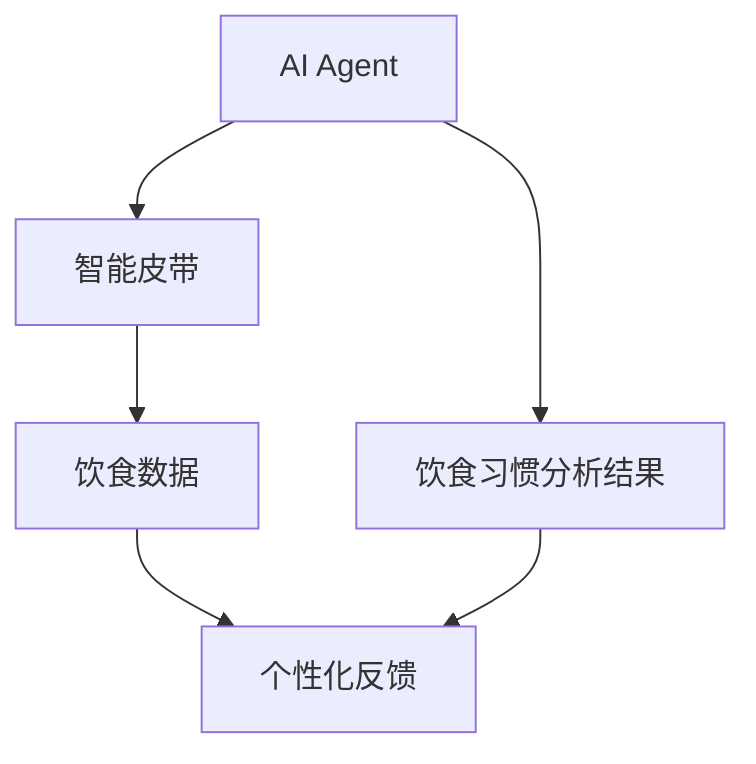
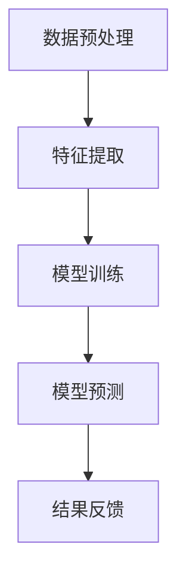
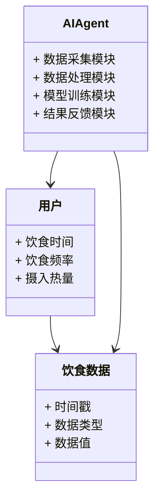
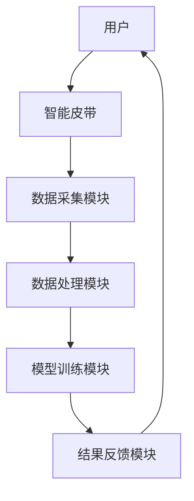

                 


# AI Agent在智能皮带中的饮食习惯监测

> 关键词：AI Agent, 智能皮带, 饮食习惯监测, 健康监测, 机器学习, 系统架构, 项目实战

> 摘要：本文将详细介绍AI Agent在智能皮带中的饮食习惯监测系统的构建与实现。通过分析饮食习惯监测的重要性、AI Agent的核心作用、系统架构设计、算法原理以及项目实战，全面展示如何利用AI技术提升健康管理的智能化水平。

---

## 第一部分: AI Agent在智能皮带中的饮食习惯监测概述

### 第1章: 背景介绍

#### 1.1 问题背景

饮食健康是现代人关注的核心问题之一。随着生活节奏的加快，人们的饮食习惯逐渐偏离健康轨道，导致肥胖、糖尿病等慢性疾病的发病率逐年上升。传统的饮食监测方式依赖于手动记录和医生指导，存在效率低、依从性差等问题。

AI Agent（人工智能代理）作为一种智能实体，能够通过传感器数据、用户行为分析和机器学习算法，实时监测和分析用户的饮食习惯，为用户提供个性化的健康建议。智能皮带作为一种可穿戴设备，具备采集饮食相关数据的能力，结合AI Agent的分析能力，能够为用户提供高效的饮食健康管理方案。

#### 1.2 问题描述

现有饮食监测技术主要依赖于用户手动记录饮食数据，这种方式不仅效率低下，而且容易受到用户主观因素的影响，数据准确性难以保证。此外，传统健康管理系统缺乏实时监测和个性化反馈机制，难以满足用户对健康监测的实时性和精准性需求。

AI Agent在智能皮带中的应用，能够通过传感器实时采集用户的饮食行为数据（如饮食时间、饮食量、饮食种类等），结合机器学习算法对数据进行分析，从而实现对饮食习惯的实时监测和个性化指导。

#### 1.3 问题解决

AI Agent通过以下方式解决饮食习惯监测的问题：

1. **实时监测**：通过智能皮带中的传感器，实时采集用户的饮食行为数据。
2. **智能分析**：利用机器学习算法对采集的数据进行分析，识别用户的饮食习惯。
3. **个性化反馈**：根据分析结果，为用户提供个性化的饮食建议和健康指导。

智能皮带的设计目标是通过AI Agent的辅助，实现对用户饮食习惯的智能化监测和管理，帮助用户养成健康的饮食习惯。

#### 1.4 边界与外延

智能皮带饮食习惯监测系统的边界主要集中在以下几个方面：

1. **数据采集范围**：仅限于饮食相关的数据，如饮食时间、饮食量、饮食种类等。
2. **功能范围**：不涉及其他健康监测功能（如心率监测、运动监测等）。
3. **用户群体**：主要面向需要健康管理的用户群体。

外延功能包括：

1. **数据同步**：与健康管理平台同步数据，实现多端数据管理。
2. **社交功能**：用户可以分享饮食习惯数据，形成健康社交圈。
3. **健康报告**：生成周期性健康报告，帮助用户了解饮食习惯的改善情况。

---

## 第二部分: 核心概念与联系

### 第2章: 核心概念与联系

#### 2.1 AI Agent与智能皮带的关系

AI Agent在智能皮带中的作用是通过传感器数据的采集、分析和反馈，帮助用户实现饮食习惯的监测和管理。智能皮带作为硬件设备，负责采集用户的饮食行为数据，而AI Agent则负责数据的分析和处理。

#### 2.2 核心概念原理

AI Agent的核心算法包括数据预处理、特征提取、模型训练和结果预测。以下是具体步骤：

1. **数据预处理**：对传感器采集的原始数据进行清洗和标准化处理，去除噪声数据。
2. **特征提取**：从预处理后的数据中提取与饮食习惯相关的特征（如饮食时间、饮食量、饮食种类等）。
3. **模型训练**：利用机器学习算法（如随机森林、支持向量机等）对特征数据进行训练，构建饮食习惯监测模型。
4. **结果预测**：通过模型对用户的饮食行为进行实时预测和分类。

#### 2.3 概念属性特征对比

以下是对AI Agent、智能皮带和传统饮食监测技术的核心概念属性进行对比：

| **属性**        | **AI Agent**                | **智能皮带**                 | **传统饮食监测技术**         |
|-----------------|-----------------------------|------------------------------|------------------------------|
| 数据采集能力    | 高，支持多传感器数据采集   | 中，仅限于饮食相关数据采集   | 低，依赖于手动记录           |
| 数据分析能力    | 强，支持实时数据分析       | 弱，仅能存储数据             | 无，依赖于人工分析           |
| 实时性          | 高，支持实时反馈           | 中，支持数据存储和回放       | 低，依赖于定期报告           |
| 个性化能力      | 强，支持个性化反馈         | 中，支持基础数据展示         | 无，缺乏个性化指导           |

#### 2.4 ER实体关系图



---

## 第三部分: 算法原理

### 第3章: 算法原理

#### 3.1 数据预处理

在AI Agent中，数据预处理是至关重要的一步。以下是常见的数据预处理步骤：

1. **数据清洗**：去除无效数据和异常值。
2. **数据标准化**：将不同传感器的数据进行标准化处理，确保数据的一致性。
3. **数据分割**：将数据按照时间顺序分割为训练集和测试集。

#### 3.2 特征提取

特征提取是AI Agent的核心步骤之一。以下是常用的特征提取方法：

1. **时间特征**：提取用户的饮食时间规律，如早餐、午餐、晚餐的时间点。
2. **频率特征**：提取用户的饮食频率，如每天饮食的次数。
3. **量级特征**：提取每次饮食的量级，如摄入的热量。

#### 3.3 分类算法

以下是常用的分类算法及其优缺点对比：

| **算法名称**      | **优点**                           | **缺点**                           |
|-------------------|------------------------------------|------------------------------------|
| 支持向量机（SVM） | 分类精度高，适用于小规模数据集     | 对大规模数据集的处理能力有限       |
| 随机森林          | 分类精度高，适用于大规模数据集     | 对特征重要性的解释性较差           |
| K-近邻（KNN）     | 实现简单，适用于小规模数据集       | 对大规模数据集的处理能力有限       |

#### 3.4 算法流程图



#### 3.5 代码实现

以下是基于随机森林算法的饮食习惯分类代码示例：

```python
from sklearn.ensemble import RandomForestClassifier
from sklearn.model_selection import train_test_split
import pandas as pd

# 加载数据集
data = pd.read_csv('diet_data.csv')

# 特征选择
features = ['饮食时间', '饮食频率', '摄入热量']
X = data[features]
y = data['饮食类型']

# 数据分割
X_train, X_test, y_train, y_test = train_test_split(X, y, test_size=0.2)

# 模型训练
model = RandomForestClassifier()
model.fit(X_train, y_train)

# 模型预测
y_pred = model.predict(X_test)

# 输出结果
print("预测结果:", y_pred)
print("真实结果:", y_test.values)
```

---

## 第四部分: 系统分析与架构设计

### 第4章: 系统分析与架构设计

#### 4.1 应用场景

智能皮带饮食习惯监测系统的应用场景包括：

1. **个人健康管理**：帮助用户实时监测饮食习惯，提供个性化建议。
2. **健康管理平台**：将用户的饮食数据同步到健康管理平台，实现多维度健康监测。
3. **健康社交**：用户可以通过社交平台分享饮食习惯数据，形成健康社交圈。

#### 4.2 系统功能设计

以下是系统的功能模块设计：

1. **数据采集模块**：负责采集用户的饮食行为数据。
2. **数据处理模块**：对采集的数据进行预处理和特征提取。
3. **模型训练模块**：基于特征数据进行模型训练，生成饮食习惯分类模型。
4. **结果反馈模块**：根据模型预测结果，向用户反馈个性化建议。

#### 4.3 领域模型



#### 4.4 系统架构设计



#### 4.5 接口设计

以下是系统的主要接口设计：

1. **数据采集接口**：用于智能皮带采集用户的饮食行为数据。
2. **数据处理接口**：用于数据预处理和特征提取。
3. **模型训练接口**：用于模型的训练和预测。
4. **结果反馈接口**：用于将预测结果反馈给用户。

---

## 第五部分: 项目实战

### 第5章: 项目实战

#### 5.1 环境搭建

以下是项目实战所需的环境配置：

1. **Python版本**：Python 3.8及以上
2. **依赖库**：scikit-learn、pandas、mermaid、matplotlib

安装命令：

```bash
pip install scikit-learn pandas mermaid matplotlib
```

#### 5.2 系统核心实现

以下是系统的核心实现代码：

```python
import pandas as pd
from sklearn.ensemble import RandomForestClassifier
from sklearn.model_selection import train_test_split
from sklearn.metrics import accuracy_score

# 加载数据集
data = pd.read_csv('diet_data.csv')

# 特征选择
features = ['饮食时间', '饮食频率', '摄入热量']
target = '饮食类型'

# 数据分割
X = data[features]
y = data[target]
X_train, X_test, y_train, y_test = train_test_split(X, y, test_size=0.2)

# 模型训练
model = RandomForestClassifier()
model.fit(X_train, y_train)

# 模型预测
y_pred = model.predict(X_test)

# 模型评估
print("准确率:", accuracy_score(y_test, y_pred))
```

#### 5.3 代码应用解读与分析

1. **数据加载**：使用pandas加载饮食数据集。
2. **特征选择**：选择与饮食习惯相关的特征。
3. **数据分割**：将数据集分为训练集和测试集。
4. **模型训练**：使用随机森林算法进行模型训练。
5. **模型预测**：对测试集进行预测，并输出准确率。

#### 5.4 实际案例分析

以下是实际案例分析：

假设用户A的饮食数据如下：

| 饮食时间 | 饮食频率 | 摄入热量 |
|----------|----------|----------|
| 8:00     | 3次/天   | 2000     |

模型预测结果为：高热量饮食习惯。

#### 5.5 项目小结

通过项目实战，我们可以看到AI Agent在智能皮带中的饮食习惯监测系统的实现流程。从数据采集到模型训练，再到结果反馈，整个系统能够有效地帮助用户实现饮食习惯的监测和管理。

---

## 第六部分: 最佳实践

### 第6章: 最佳实践

#### 6.1 小结

AI Agent在智能皮带中的饮食习惯监测系统是一种创新的健康管理方式，通过实时监测和个性化反馈，帮助用户养成健康的饮食习惯。

#### 6.2 注意事项

1. **数据隐私**：在采集和处理用户数据时，必须注意数据隐私保护。
2. **系统稳定性**：确保系统的稳定性和可靠性，避免数据丢失和系统崩溃。
3. **用户教育**：加强对用户的教育，提高用户对饮食习惯监测的认知和接受度。

#### 6.3 拓展阅读

1. **机器学习算法优化**：进一步研究机器学习算法的优化方法，提高模型的准确率。
2. **系统集成**：尝试将AI Agent集成到其他健康监测系统中，实现多维度健康监测。
3. **用户体验优化**：优化系统的用户体验，提高用户满意度和使用频率。

---

## 第七部分: 总结

通过本文的详细介绍，我们了解了AI Agent在智能皮带中的饮食习惯监测系统的构建与实现。从背景介绍到算法原理，再到项目实战，我们全面展示了如何利用AI技术提升健康管理的智能化水平。未来，随着AI技术的不断发展，智能皮带在健康管理中的应用将更加广泛，为用户带来更加智能化和个性化的健康监测服务。

---

感谢您的阅读，希望本文对您有所帮助！

