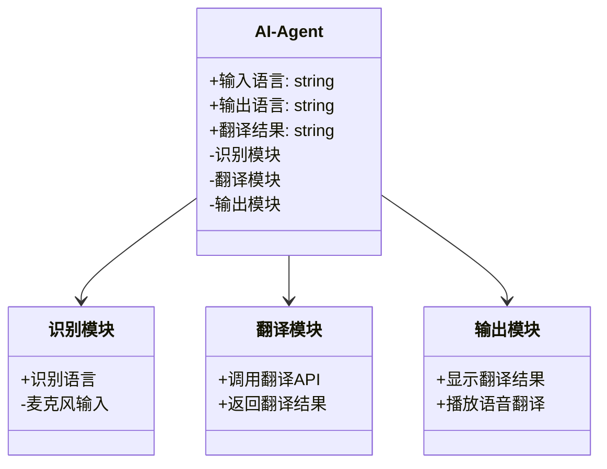
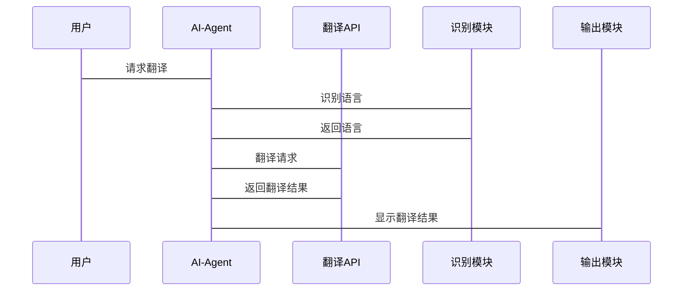

                 


# AI Agent在智能眼镜中的实时翻译功能

> 关键词：AI Agent，智能眼镜，实时翻译，自然语言处理，机器学习

> 摘要：本文探讨了AI Agent在智能眼镜中的实时翻译功能，分析了其实现的技术原理、系统架构及应用场景。通过详细阐述翻译算法、系统设计和项目实战，展示了如何利用AI技术提升智能眼镜的用户体验。

---

# 第一部分: AI Agent与智能眼镜的背景介绍

# 第1章: AI Agent与智能眼镜概述

## 1.1 AI Agent的基本概念

### 1.1.1 AI Agent的定义与特点
AI Agent（人工智能代理）是一种智能实体，能够感知环境、自主决策并执行任务。其特点包括：
- **自主性**：无需外部干预，自主完成任务。
- **反应性**：能实时感知环境变化并做出反应。
- **学习能力**：通过数据不断优化性能。
- **社交能力**：能与其他系统或用户进行交互。

### 1.1.2 AI Agent在智能眼镜中的应用场景
智能眼镜作为便携式设备，AI Agent可以实现多种功能，如语音助手、实时翻译、环境感知等。

### 1.1.3 实时翻译功能的必要性与技术挑战
实时翻译在跨语言交流中至关重要，但实现该功能面临数据处理速度、计算资源限制和用户隐私保护等挑战。

---

## 1.2 智能眼镜的发展与现状

### 1.2.1 智能眼镜的历史发展
智能眼镜起源于2010年Google Glass，近年来随着AI技术的发展，功能不断增强。

### 1.2.2 当前智能眼镜的主要功能与技术特点
- 基本功能：语音控制、拍照、视频通话。
- 技术特点：采用AI算法优化用户体验。

### 1.2.3 AI Agent在智能眼镜中的发展趋势
未来，AI Agent将更加智能化，实现更复杂的任务。

---

## 1.3 实时翻译功能的核心价值

### 1.3.1 实时翻译在智能眼镜中的应用场景
- 跨语言交流：帮助用户在跨国会议中实时翻译。
- 旅游助手：实时翻译景点信息。

### 1.3.2 用户需求与技术实现的平衡
用户需求包括准确性、实时性和易用性，技术实现需要平衡性能和资源消耗。

### 1.3.3 实时翻译对智能眼镜用户体验的提升
提升用户体验，增强设备的实用性和竞争力。

---

# 第2章: AI Agent与实时翻译的结合

## 2.1 AI Agent的基本原理

### 2.1.1 AI Agent的感知模块
感知环境，识别语言输入。

### 2.1.2 AI Agent的决策模块
根据输入做出翻译决策。

### 2.1.3 AI Agent的执行模块
将翻译结果输出给用户。

## 2.2 智能眼镜中的实时翻译实现

### 2.2.1 实时翻译的核心流程
- 语言识别：检测输入语言。
- 翻译处理：调用翻译API。
- 结果输出：显示或播放翻译结果。

### 2.2.2 翻译技术的分类与对比

| 翻译技术 | 特点 | 优缺点 |
|---------|------|--------|
| 基于规则的翻译 | 精确 | 速度慢 |
| 统计机器翻译 | 速度快 | 准确率低 |
| 神经机器翻译 | 准确率高 | 需大量计算资源 |

### 2.2.3 翻译质量的评估标准
BLEU、ROUGE等指标用于评估翻译质量。

## 2.3 AI Agent与实时翻译的结合

### 2.3.1 AI Agent在翻译中的角色
作为中间件，协调翻译过程。

### 2.3.2 翻译功能对AI Agent性能的要求
快速响应、低资源消耗。

### 2.3.3 实时翻译对智能眼镜硬件的要求
高性能芯片、低功耗设计。

---

# 第3章: 神经机器翻译模型

## 3.1 神经机器翻译的基本原理

### 3.1.1 神经机器翻译的定义
基于深度学习的翻译技术。

### 3.1.2 神经机器翻译的核心算法
- 编码器-解码器架构。
- 注意力机制。

### 3.1.3 神经机器翻译的数学模型
$$ \text{编码器} = \text{输入} \rightarrow \text{隐藏层} $$
$$ \text{解码器} = \text{隐藏层} \rightarrow \text{输出} $$

## 3.2 神经机器翻译的训练过程

### 3.2.1 数据预处理
- 分词、对齐。
- 训练数据生成。

### 3.2.2 模型训练
- 选择优化器（Adam）。
- 调整超参数。

### 3.2.3 模型评估
- 使用测试集验证准确率。

---

# 第4章: AI Agent实时翻译的系统架构

## 4.1 系统功能设计

### 4.1.1 系统模块划分
- 语言识别模块。
- 翻译模块。
- 输出模块。

### 4.1.2 领域模型类图



---

## 4.2 系统架构设计

### 4.2.1 系统架构图


### 4.2.2 接口设计
- 接收语言识别请求。
- 返回翻译结果。

### 4.2.3 系统交互流程



---

# 第5章: 项目实战

## 5.1 环境配置

### 5.1.1 开发工具安装
- 安装Python、PyTorch、TensorFlow。

### 5.1.2 依赖库安装
- pip install transformers

## 5.2 核心代码实现

### 5.2.1 翻译API调用

```python
from googletrans import Translator

def translate_text(text, src, dest):
    translator = Translator()
    result = translator.translate(text, src=src, dest=dest)
    return result.text
```

### 5.2.2 实时翻译流程

```python
import speech_recognition as sr
from googletrans import Translator

def main():
    r = sr.Recognizer()
    microphone = sr.AudioFile("input.wav")
    with microphone as source:
        audio = r.listen(source)
    text = r.recognize_google(audio)
    translated = translate_text(text, 'en', 'zh')
    print(translated)

if __name__ == "__main__":
    main()
```

---

## 5.3 案例分析与实现解读

### 5.3.1 案例分析
- 用户输入中文，翻译成英文。
- 翻译结果通过屏幕显示。

### 5.3.2 代码实现解读
- 使用语音识别库`speech_recognition`识别输入。
- 调用翻译API进行翻译。
- 输出翻译结果。

---

## 5.4 项目总结

### 5.4.1 实现的关键技术
- 语音识别。
- 神经机器翻译。

### 5.4.2 实际案例分析
- 通过案例展示AI Agent在智能眼镜中的实际应用。

### 5.4.3 项目成果
- 成功实现实时翻译功能。

---

# 第6章: 最佳实践与注意事项

## 6.1 最佳实践

### 6.1.1 开发建议
- 选择合适的翻译API。
- 优化语音识别模型。

### 6.1.2 测试建议
- 多语言测试。
- 压力测试。

## 6.2 注意事项

### 6.2.1 隐私保护
- 确保用户数据安全。

### 6.2.2 资源优化
- 优化计算资源使用。

## 6.3 小结

---

# 附录

## 附录A: 翻译API的选择与对比

| API | 特点 | 优缺点 |
|-----|------|--------|
| Google Translate | 支持多种语言 | 免费额度有限 |
| Microsoft Translator | 准确率高 | 付费 |

---

## 附录B: 开源工具推荐

### 语言识别工具
- `langdetect`。

### 翻译框架
- `transformers`。

---

# 结束语

通过本文的详细讲解，读者可以全面了解AI Agent在智能眼镜中的实时翻译功能，并掌握其实现的关键技术。希望本文能为相关领域的开发者和研究者提供有价值的参考。

