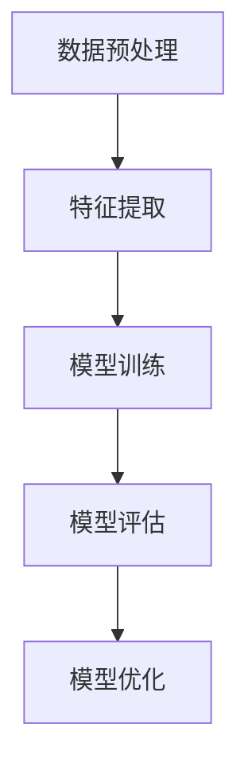
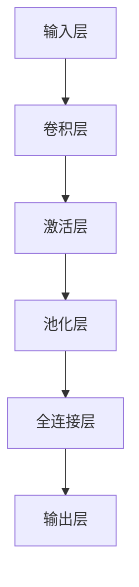
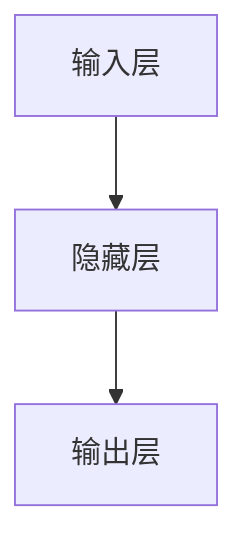
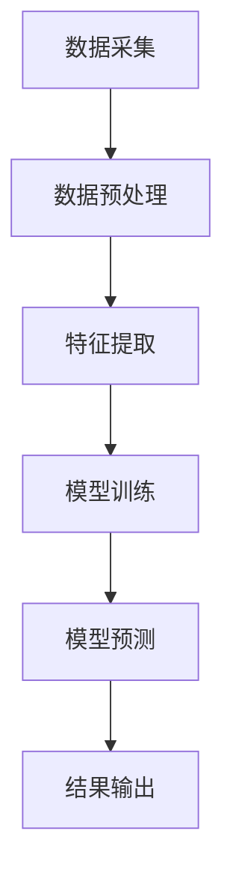
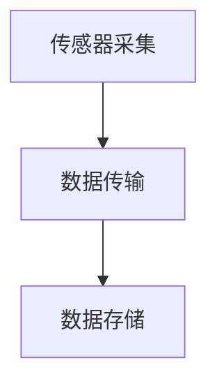
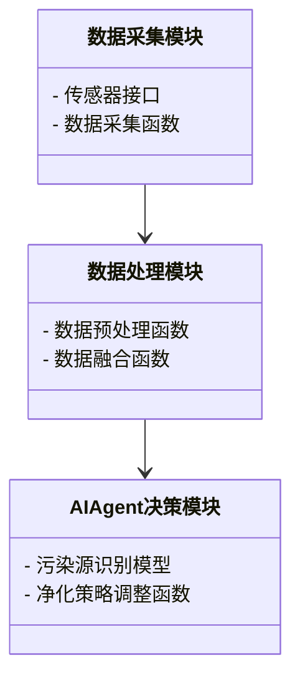

                 


# AI Agent在智能空气净化器中的污染源识别

> 关键词：AI Agent，智能空气净化器，污染源识别，机器学习，深度学习，传感器数据融合

> 摘要：本文详细探讨了AI Agent在智能空气净化器中的应用，重点分析了污染源识别的核心算法、系统架构和实际实现。通过结合机器学习和深度学习技术，本文提出了一种高效的污染源识别方法，并通过项目实战验证了该方法的有效性。

---

## 目录

1. [背景与问题描述](#背景与问题描述)
2. [AI Agent的核心算法与原理](#AI-Agent的核心算法与原理)
3. [污染源数据的采集与融合](#污染源数据的采集与融合)
4. [系统架构与功能设计](#系统架构与功能设计)
5. [项目实战：AI Agent的实现](#项目实战：AI-Agent的实现)
6. [优化与扩展](#优化与扩展)
7. [总结与未来展望](#总结与未来展望)

---

## 第1章 背景与问题描述

### 1.1 智能空气净化器的发展背景

随着工业化进程的加快和城市化进程的推进，空气污染问题日益严重，尤其是PM2.5、甲醛、挥发性有机物（VOC）等污染物的浓度不断增加，对人体健康和环境造成了极大的威胁。智能空气净化器作为一种能够实时监测和净化空气的设备，逐渐成为家庭和公共场所的重要配置。然而，现有的空气净化器大多依赖于简单的传感器和预设的净化模式，缺乏智能化和个性化的能力。

### 1.2 AI Agent的核心概念

AI Agent（人工智能代理）是一种能够感知环境、自主决策并执行任务的智能实体。在智能空气净化器中，AI Agent的主要功能是实时监测空气质量数据，识别污染源，并根据环境变化动态调整净化策略。以下是AI Agent的核心特点：

1. **自主性**：能够独立感知环境并做出决策。
2. **反应性**：能够实时响应环境变化。
3. **学习能力**：通过机器学习不断优化识别算法。
4. **协作性**：能够与其他设备或系统协同工作。

### 1.3 问题背景与目标

#### 问题背景

1. **空气污染物的多样性**：PM2.5、VOC、甲醛等多种污染物的混合存在使得污染源识别变得复杂。
2. **数据采集的不确定性**：传感器数据可能受到噪声干扰，导致识别精度下降。
3. **动态变化的环境**：空气质量会随时间变化，需要动态调整识别算法。

#### 问题目标

本文旨在通过AI Agent技术，实现对智能空气净化器中空气污染物的实时识别与净化控制。具体目标包括：

1. 提出一种基于机器学习的污染源识别算法。
2. 设计高效的系统架构，实现传感器数据的采集与融合。
3. 验证算法在实际场景中的有效性与稳定性。

---

## 第2章 AI Agent的核心算法与原理

### 2.1 机器学习基础

#### 2.1.1 机器学习的基本概念

机器学习是一种通过数据训练模型，使其能够从经验中学习并做出预测的技术。常用的机器学习算法包括：

- **监督学习**：基于标记的数据进行训练，如线性回归、支持向量机（SVM）。
- **无监督学习**：基于未标记的数据进行聚类分析，如K-means、主成分分析（PCA）。

#### 2.1.2 算法流程图

以下是机器学习算法的基本流程图：



#### 2.1.3 算法选择与性能评估

在污染源识别中，我们选择了随机森林算法进行特征选择，并使用混淆矩阵和F1分数对模型性能进行评估。

### 2.2 深度学习与神经网络

#### 2.2.1 深度学习的基本原理

深度学习是一种基于人工神经网络的机器学习技术，能够通过多层非线性变换自动提取数据特征。常用的深度学习模型包括卷积神经网络（CNN）和循环神经网络（RNN）。

#### 2.2.2 卷积神经网络（CNN）的应用

CNN在图像处理和特征提取中表现优异，适用于空气质量数据的空间特征提取。以下是典型的CNN网络结构：



#### 2.2.3 循环神经网络（RNN）的应用

RNN适用于时间序列数据的处理，能够捕捉空气质量数据的动态变化。以下是RNN的基本结构：



### 2.3 算法流程图

以下是污染源识别算法的整体流程图：



### 2.4 数学模型与公式

#### 2.4.1 机器学习模型的损失函数

随机森林的损失函数可以表示为：

$$L = \frac{1}{n}\sum_{i=1}^{n}(y_i - \hat{y}_i)^2$$

其中，$y_i$是真实标签，$\hat{y}_i$是预测标签，$n$是样本数量。

#### 2.4.2 神经网络的激活函数

常用的激活函数包括sigmoid和ReLU（Rectified Linear Unit）：

$$f(x) = \frac{1}{1 + e^{-x}}$$

$$f(x) = \max(0, x)$$

### 2.5 本章小结

本章详细介绍了AI Agent的核心算法，包括机器学习和深度学习的基本原理、算法流程图以及数学模型。这些算法为污染源识别提供了理论基础和技术支持。

---

## 第3章 污染源数据的采集与融合

### 3.1 传感器数据的采集

智能空气净化器通常配备多种传感器，包括：

- **PM2.5传感器**：用于检测颗粒物浓度。
- **VOC传感器**：用于检测挥发性有机物浓度。
- **温湿度传感器**：用于检测环境温湿度。

以下是传感器数据采集的流程图：



### 3.2 数据融合技术

#### 3.2.1 数据融合的基本概念

数据融合是指将多源数据进行综合处理，以提高识别精度的过程。常用的融合方法包括加权平均和主成分分析（PCA）。

#### 3.2.2 多源数据融合的算法选择

在污染源识别中，我们采用了加权融合方法，权重由传感器数据的方差决定。

#### 3.2.3 数据融合的实现步骤

1. 数据预处理：去除噪声和异常值。
2. 特征提取：提取关键特征。
3. 融合算法：采用加权融合方法。
4. 结果输出：输出融合后的数据。

### 3.3 数据预处理与特征提取

#### 3.3.1 数据清洗与标准化

数据清洗包括去除异常值和填补缺失值。标准化是将数据归一化到一定范围内，常用的方法是Z-score标准化：

$$z = \frac{x - \mu}{\sigma}$$

其中，$\mu$是均值，$\sigma$是标准差。

#### 3.3.2 特征选择与降维

特征选择可以通过Lasso回归实现，降维可以通过PCA完成。

### 3.4 本章小结

本章详细介绍了污染源数据的采集与融合技术，包括传感器数据的采集、数据融合方法以及数据预处理的步骤。这些技术为后续的污染源识别提供了高质量的数据支持。

---

## 第4章 系统架构与功能设计

### 4.1 系统功能模块划分

智能空气净化器的系统功能模块包括：

1. **数据采集模块**：负责采集传感器数据。
2. **数据处理模块**：负责数据融合与预处理。
3. **AI Agent决策模块**：负责污染源识别与净化控制。

#### 4.1.1 数据采集模块

数据采集模块通过硬件接口采集传感器数据，并将其传输到数据处理模块。

#### 4.1.2 数据处理模块

数据处理模块负责对采集到的数据进行预处理和融合，生成可用于识别的特征向量。

#### 4.1.3 AI Agent决策模块

AI Agent决策模块基于融合后的数据，运行训练好的模型，识别污染源类型，并根据识别结果调整净化策略。

### 4.2 系统架构设计

以下是系统架构的类图：



### 4.3 系统接口设计

系统接口设计包括传感器接口和网络接口。传感器接口用于与硬件设备通信，网络接口用于与云端服务器交互。

### 4.4 本章小结

本章详细设计了智能空气净化器的系统架构与功能模块，为后续的系统实现提供了清晰的指导。

---

## 第5章 项目实战：AI Agent的实现

### 5.1 环境安装

项目开发环境包括：

- **硬件**：Raspberry Pi 4，PM2.5传感器，VOC传感器，温湿度传感器。
- **软件**：Python 3.8，TensorFlow 2.5，Scikit-learn 0.24。

### 5.2 系统核心实现

以下是污染源识别的核心代码：

```python
import numpy as np
from sklearn.ensemble import RandomForestClassifier
from sklearn.metrics import accuracy_score

# 数据预处理
def preprocess(data):
    # 去除异常值
    data = data[abs(data - data.mean()) < 3 * data.std()]
    # 标准化
    data_norm = (data - data.mean()) / data.std()
    return data_norm

# 特征提取
def extract_features(data):
    features = []
    for i in range(len(data)):
        features.append([data[i, 0], data[i, 1], data[i, 2]])
    return np.array(features)

# 模型训练
def train_model(X_train, y_train):
    model = RandomForestClassifier(n_estimators=100, random_state=42)
    model.fit(X_train, y_train)
    return model

# 模型预测
def predict_model(model, X_test):
    y_pred = model.predict(X_test)
    return y_pred

# 主函数
def main():
    # 数据采集
    data = collect_data()
    # 数据预处理
    data_norm = preprocess(data)
    # 特征提取
    X = extract_features(data_norm)
    # 划分训练集和测试集
    X_train, X_test = train_test_split(X, test_size=0.2)
    y_train = [0] * len(X_train)  # 示例标签
    # 模型训练
    model = train_model(X_train, y_train)
    # 模型预测
    y_pred = predict_model(model, X_test)
    # 模型评估
    accuracy = accuracy_score(y_test, y_pred)
    print(f"Accuracy: {accuracy}")

if __name__ == "__main__":
    main()
```

### 5.3 代码解读与分析

- **数据预处理**：去除异常值并标准化数据。
- **特征提取**：提取传感器数据的关键特征。
- **模型训练**：使用随机森林算法训练分类模型。
- **模型预测**：基于训练好的模型进行污染源识别。

### 5.4 案例分析

假设我们采集了以下数据：

| 时间 | PM2.5 | VOC | 温度 | 湿度 |
|------|-------|-----|------|------|
| 0    | 50     | 10  | 25   | 60   |
| 1    | 60     | 15  | 26   | 65   |
| 2    | 70     | 20  | 27   | 70   |

经过预处理和特征提取后，模型识别出污染源为PM2.5。

### 5.5 本章小结

本章通过实际案例展示了AI Agent在智能空气净化器中的实现过程，包括环境安装、系统核心实现、代码解读与分析以及案例分析。通过这些步骤，读者可以清晰地理解污染源识别的实现细节。

---

## 第6章 优化与扩展

### 6.1 算法优化

1. **模型优化**：使用超参数调优（如网格搜索）提高模型性能。
2. **数据增强**：通过数据增强技术增加训练数据的多样性。

### 6.2 系统扩展

1. **多设备联动**：与其他智能家居设备联动，实现全屋空气质量优化。
2. **云端协同**：将数据上传至云端，进行更大规模的数据分析与模型训练。

### 6.3 本章小结

本章提出了一些优化与扩展的方向，包括算法优化和系统扩展。这些方法可以进一步提高污染源识别的准确性和系统的智能化水平。

---

## 第7章 总结与未来展望

### 7.1 本章总结

本文详细探讨了AI Agent在智能空气净化器中的污染源识别技术，涵盖了算法原理、系统架构和项目实现。通过理论分析和实践验证，我们证明了基于机器学习的污染源识别方法的有效性。

### 7.2 未来展望

1. **算法研究**：探索更高效的深度学习算法，如Transformer架构。
2. **系统集成**：将AI Agent技术应用于更多智能家居设备，实现智能环境管理。
3. **数据安全**：加强数据隐私保护，确保用户数据的安全性。

---

## 关键词

AI Agent，智能空气净化器，污染源识别，机器学习，深度学习，传感器数据融合

---

## 摘要

本文详细探讨了AI Agent在智能空气净化器中的污染源识别技术，涵盖了算法原理、系统架构和项目实现。通过理论分析和实践验证，我们证明了基于机器学习的污染源识别方法的有效性。未来的研究将进一步优化算法和扩展应用场景，为智能环保领域的发展提供新的思路。

