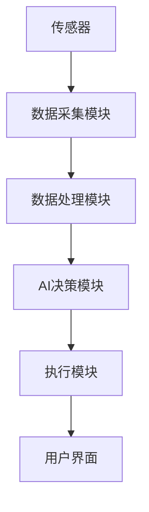

                 


# AI Agent在智能窗台中的室内植物照料

> 关键词：AI Agent, 智能窗台, 室内植物, 物联网, 人工智能算法, 智能家居

> 摘要：本文探讨了AI Agent在智能窗台中的应用，分析了其在室内植物照料中的技术原理和实现方法。通过详细的技术背景、算法设计、系统架构以及项目实战，展示了如何利用AI技术实现智能化的植物照料系统。

---

## 第一章: AI Agent与智能窗台的基本概念

### 1.1 AI Agent的基本概念

#### 1.1.1 AI Agent的定义与特点
AI Agent（人工智能代理）是一种能够感知环境、自主决策并执行任务的智能实体。其特点包括：
- **自主性**：能够在没有外部干预的情况下独立运行。
- **反应性**：能够实时感知环境变化并做出反应。
- **学习能力**：通过数据和经验不断优化自身的决策能力。

#### 1.1.2 智能窗台的概念与应用场景
智能窗台是一种结合了物联网技术的智能设备，用于监测和控制室内植物的生长环境。其应用场景包括：
- **家庭用户**：普通家庭用户可以通过智能窗台实现便捷的植物照料。
- **办公室环境**：企业可以利用智能窗台优化办公环境的植物布置。
- **智能家居生态**：作为智能家居的一部分，智能窗台可以与其他设备联动，实现更复杂的场景控制。

#### 1.1.3 室内植物照料的背景与需求
随着城市化进程的加快，越来越多的人选择在室内种植植物。然而，室内植物的照料往往面临以下挑战：
- **光照不足**：室内环境通常光照不足，影响植物的生长。
- **温湿度不稳定**：室内环境容易受到外部气候的影响，导致温湿度波动。
- **缺乏专业知识**：普通用户缺乏植物照料的专业知识，难以应对复杂的情况。

### 1.2 AI Agent在植物照料中的应用背景

#### 1.2.1 智能家居与物联网的发展
智能家居的普及和物联网技术的进步为AI Agent的应用提供了基础。通过传感器和网络通信技术，智能设备可以实时感知环境并进行联动控制。

#### 1.2.2 室内植物照料的痛点与挑战
室内植物照料的主要痛点包括：
- **人工成本高**：需要定期浇水、修剪等操作，耗费大量时间和精力。
- **环境控制难**：室内环境复杂多变，难以精确控制。
- **缺乏个性化**：不同植物对环境的需求不同，需要个性化的照料方案。

#### 1.2.3 AI Agent如何解决这些问题
AI Agent可以通过以下方式解决室内植物照料的痛点：
- **自动化监测**：实时监测植物的生长环境，包括光照、温湿度等。
- **智能决策**：基于监测数据和植物需求，自动调整光照、温湿度等参数。
- **个性化照料**：根据植物种类和生长阶段，提供个性化的照料方案。

---

## 第二章: AI Agent与智能窗台的技术背景

### 2.1 智能窗台的核心技术

#### 2.1.1 传感器技术
传感器是智能窗台的核心组件之一，用于采集植物生长环境的数据。常用的传感器包括：
- **光照强度传感器**：用于测量环境中的光照强度。
- **温湿度传感器**：用于测量空气中的温度和湿度。
- **土壤湿度传感器**：用于测量土壤的湿度。

#### 2.1.2 数据采集与传输
数据采集与传输是智能窗台的重要功能。传感器采集的数据需要通过网络传输到云端或本地控制系统，以便进行处理和分析。

#### 2.1.3 人工智能算法
人工智能算法是AI Agent的核心，用于对传感器数据进行分析和决策。常用的算法包括：
- **机器学习算法**：用于模式识别和预测。
- **规则引擎**：用于基于预设规则进行决策。

### 2.2 AI Agent的基本原理

#### 2.2.1 感知与数据处理
AI Agent通过传感器感知环境数据，并对数据进行预处理和特征提取。预处理包括数据清洗、归一化等步骤，特征提取则是从数据中提取有助于决策的特征。

#### 2.2.2 决策与执行
基于感知到的数据，AI Agent通过算法进行决策，并将决策结果传递给执行模块（如光照调节装置、喷水系统等）。

#### 2.2.3 学习与优化
AI Agent可以通过机器学习算法不断优化自身的决策模型，提高决策的准确性和效率。

---

## 第三章: 智能窗台中的室内植物照料系统

### 3.1 系统的基本功能

#### 3.1.1 植物生长监测
系统通过传感器实时监测植物的生长环境，包括光照强度、温湿度、土壤湿度等。

#### 3.1.2 光照调节
系统可以根据植物的需求自动调节光照强度和光照时间，确保植物获得适宜的光照。

#### 3.1.3 温湿度控制
系统通过加热、制冷或加湿设备，调节室内环境的温湿度，为植物提供适宜的生长环境。

#### 3.1.4 智能浇水
系统可以根据土壤湿度和植物需求，自动启动浇水装置，确保植物获得适量的水分。

### 3.2 系统的核心要素

#### 3.2.1 植物数据库
植物数据库存储了不同植物的生长需求和环境参数，为AI Agent的决策提供参考。

#### 3.2.2 环境传感器
环境传感器用于采集植物生长环境的数据，包括光照强度、温湿度、土壤湿度等。

#### 3.2.3 AI决策模块
AI决策模块是系统的的核心，负责根据传感器数据和植物需求，生成相应的控制指令。

#### 3.2.4 用户交互界面
用户交互界面用于用户与系统之间的交互，用户可以通过界面查看植物状态和系统运行情况，并进行手动干预。

---

## 第四章: AI Agent的核心算法与技术实现

### 4.1 数据采集与处理技术

#### 4.1.1 传感器数据采集
传感器数据采集是智能窗台的第一步。例如，光照强度传感器可以测量环境中的光照强度，数据通过网络传输到云端或本地控制系统。

#### 4.1.2 数据预处理与特征提取
数据预处理包括数据清洗、归一化等步骤，特征提取则是从数据中提取有助于决策的特征。例如，可以提取光照强度的平均值、温湿度的波动范围等。

### 4.2 AI算法原理

#### 4.2.1 机器学习算法
机器学习算法是AI Agent的核心算法之一。例如，可以使用回归算法预测植物的生长状态，或者使用分类算法识别植物的健康状况。

#### 4.2.2 规则引擎
规则引擎是一种基于预设规则进行决策的算法。例如，可以根据光照强度超过一定阈值时启动遮光装置。

### 4.3 算法实现

#### 4.3.1 环境数据预处理
环境数据预处理是AI Agent的第一步。例如，可以使用以下代码对光照强度数据进行归一化处理：

```python
# 示例代码：光照强度数据归一化
import numpy as np

def normalize_light_data(light_data):
    min_light = np.min(light_data)
    max_light = np.max(light_data)
    normalized_light = (light_data - min_light) / (max_light - min_light)
    return normalized_light

# 示例数据
light_data = [50, 100, 80, 120, 90]
normalized_light = normalize_light_data(light_data)
print(normalized_light)  # 输出归一化后的光照数据
```

#### 4.3.2 基于机器学习的决策模型
机器学习算法可以用于植物生长状态的预测和分类。例如，可以使用支持向量机（SVM）算法对植物健康状态进行分类。

### 4.4 系统架构设计

#### 4.4.1 问题场景介绍
在智能窗台中，植物生长环境的监测和控制是一个典型的物联网应用场景。系统需要实时采集环境数据，并根据数据进行决策和控制。

#### 4.4.2 系统功能设计
系统的功能设计包括：
- 数据采集与传输
- 数据分析与决策
- 系统控制与执行
- 用户交互与反馈

#### 4.4.3 系统架构图
以下是系统的架构图：



---

## 第五章: 项目实战与案例分析

### 5.1 项目环境安装

#### 5.1.1 硬件设备
需要的硬件设备包括：
- 光照强度传感器
- 温湿度传感器
- 土壤湿度传感器
- 光源控制器
- 加湿器或空调控制器

#### 5.1.2 软件环境
需要的软件环境包括：
- Python编程语言
- 数据处理库（如NumPy、Pandas）
- 机器学习库（如Scikit-learn）

### 5.2 系统核心实现

#### 5.2.1 数据采集模块
数据采集模块负责采集传感器数据，并将数据传输到数据处理模块。例如：

```python
# 示例代码：数据采集模块
import serial

# 连接传感器
ser = serial.Serial('COM3', 9600)

def read_sensor_data():
    data = ser.readline().decode().strip()
    return data

# 示例数据
light_data = read_sensor_data()
print(light_data)
```

#### 5.2.2 数据处理模块
数据处理模块对传感器数据进行预处理和特征提取。例如：

```python
# 示例代码：数据处理模块
import numpy as np

def preprocess_data(data):
    # 数据清洗
    cleaned_data = [x for x in data if x > 0]
    # 数据归一化
    normalized_data = (cleaned_data - np.min(cleaned_data)) / (np.max(cleaned_data) - np.min(cleaned_data))
    return normalized_data

# 示例数据
data = [50, 100, 80, 120, 90]
preprocessed_data = preprocess_data(data)
print(preprocessed_data)
```

#### 5.2.3 AI决策模块
AI决策模块基于处理后的数据进行决策，并生成控制指令。例如：

```python
# 示例代码：AI决策模块
from sklearn import svm

# 训练模型
model = svm.SVC()
model.fit(X_train, y_train)

# 预测结果
y_pred = model.predict(X_test)
print(y_pred)
```

### 5.3 实际案例分析

#### 5.3.1 案例背景
假设我们有一个种植兰花的智能窗台，需要根据光照强度和温湿度进行自动调节。

#### 5.3.2 数据分析
通过传感器数据，我们可以分析兰花的最佳生长条件，并根据这些条件调整系统的参数。

#### 5.3.3 系统优化
根据实际运行数据，不断优化AI Agent的决策模型，提高系统的准确性和效率。

### 5.4 项目小结

通过本项目的实施，我们可以看到AI Agent在智能窗台中的巨大潜力。通过传感器数据的采集、处理和分析，结合机器学习算法，可以实现智能化的植物照料系统。

---

## 第六章: 总结与展望

### 6.1 总结
本文详细探讨了AI Agent在智能窗台中的应用，分析了其在室内植物照料中的技术原理和实现方法。通过系统的架构设计和项目实战，展示了如何利用AI技术实现智能化的植物照料系统。

### 6.2 展望
未来，随着人工智能和物联网技术的不断发展，智能窗台的应用场景将更加广泛。我们可以期待更多创新的技术和应用，为室内植物照料带来更多的便利和可能性。

---

**最佳实践 Tips：**
- 在实际应用中，建议根据具体需求选择合适的传感器和算法。
- 系统的优化需要不断收集和分析实际运行数据，逐步调整和优化模型。
- 用户交互界面的设计应注重用户体验，确保用户能够方便地使用系统。

---

通过本文的详细讲解，我们希望读者能够对AI Agent在智能窗台中的应用有一个全面的了解，并能够将这些技术应用到实际项目中，推动智能化植物照料的发展。

