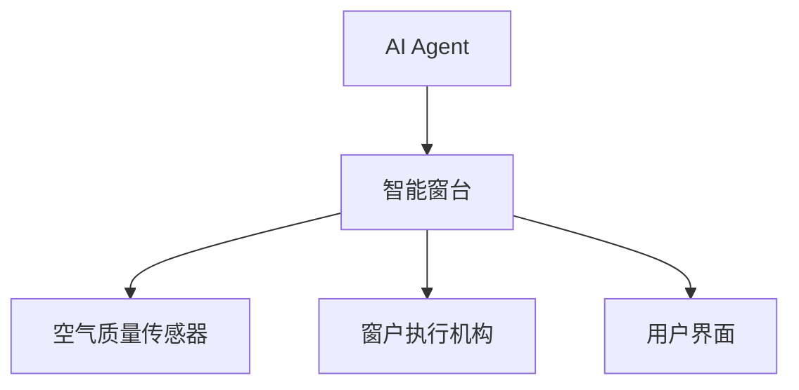
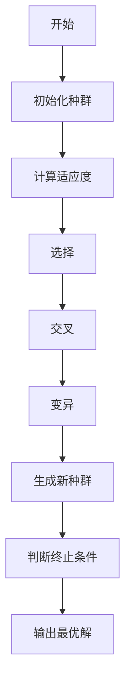
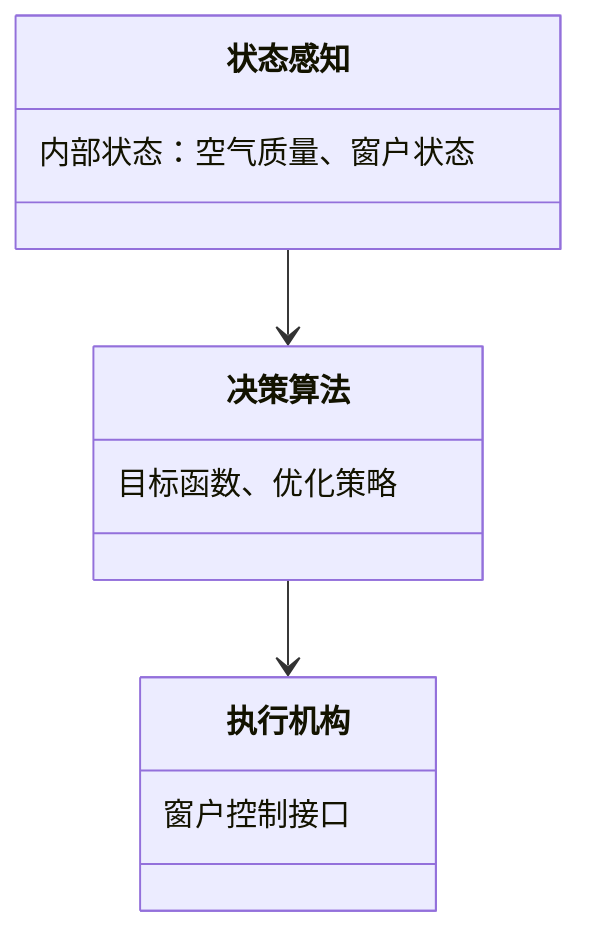
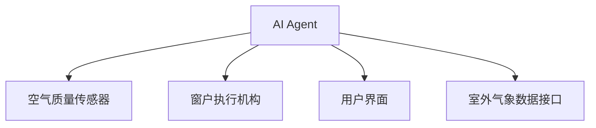
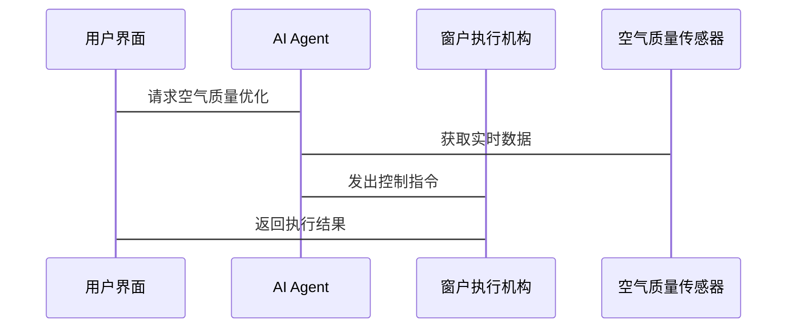

                 


# AI Agent在智能窗台中的室内空气质量优化

## 关键词：
AI Agent, 室内空气质量, 智能窗台, 优化算法, 智能系统

## 摘要：
本文详细探讨了AI Agent在智能窗台中的应用，重点分析了通过AI Agent优化室内空气质量的实现方法。文章从背景介绍、核心概念、算法原理、系统架构到项目实战，全面阐述了AI Agent在智能窗台中的应用。通过对比传统控制方法，本文提出了基于AI Agent的优化算法，并通过具体案例展示了其在实际场景中的应用效果。本文还提供了系统设计和实现的详细步骤，帮助读者更好地理解和应用这一技术。

---

# 第一部分: AI Agent在智能窗台中的室内空气质量优化背景介绍

## 第1章: 室内空气质量优化问题背景

### 1.1 室内空气质量问题的背景
#### 1.1.1 室内空气质量问题的现状
室内空气质量问题日益受到关注。随着城市化进程的加快，空气污染问题逐渐加剧，室内空气质量受到外界污染和室内活动的影响。特别是在封闭的空间中，空气中的有害气体、颗粒物以及二氧化碳浓度的增加，严重影响了居住者的健康。

#### 1.1.2 室内空气质量问题的影响
室内空气质量差可能导致呼吸系统疾病、过敏反应、头痛、疲劳等症状。长期处于不良空气质量的环境中，还可能影响人的免疫系统和神经系统。

#### 1.1.3 室内空气质量优化的必要性
优化室内空气质量不仅可以提升居住舒适度，还能有效降低健康风险。通过智能技术实现空气质量的自动优化，是现代智能家居发展的必然趋势。

### 1.2 智能窗台与室内空气质量的关系
#### 1.2.1 智能窗台的定义与特点
智能窗台是一种集成传感器、执行机构和控制算法的智能化窗户系统。它能够根据室内和室外环境的变化，自动调节窗户的开合状态，以优化室内空气质量。

#### 1.2.2 智能窗台在室内空气质量优化中的作用
智能窗台通过实时监测室内空气质量数据，结合室外气象数据，优化窗户的开合策略，从而实现室内空气质量的最优控制。

#### 1.2.3 智能窗台与其他空气质量优化设备的对比
与其他设备（如空气净化器）相比，智能窗台的优势在于它通过自然通风优化空气质量，成本低、能耗小，同时能够实现智能化管理。

---

## 第2章: AI Agent在智能窗台中的应用概述

### 2.1 AI Agent的基本概念
#### 2.1.1 AI Agent的定义
AI Agent（智能代理）是一种能够感知环境、自主决策并采取行动的智能系统。它可以理解为一个软件实体，能够根据任务需求执行特定操作。

#### 2.1.2 AI Agent的核心特点
- **自主性**：能够在没有外部干预的情况下独立运行。
- **反应性**：能够实时感知环境变化并做出反应。
- **目标导向**：通过优化目标函数实现特定任务。
- **学习能力**：能够通过数据学习和优化决策策略。

#### 2.1.3 AI Agent与传统控制方法的区别
| 特性                | AI Agent                     | 传统控制方法               |
|---------------------|------------------------------|-----------------------------|
| 决策方式            | 基于机器学习和优化算法       | 基于固定规则和逻辑         |
| 灵活性              | 高，能够适应环境变化         | 较低，依赖预设规则           |
| 学习能力            | 强，能够通过数据优化策略     | 较弱，无法自我优化           |

### 2.2 AI Agent在智能窗台中的应用前景
#### 2.2.1 AI Agent在智能窗台中的潜在应用领域
- **空气质量优化**：通过实时监测和优化窗户开合策略，实现室内空气质量的最佳状态。
- **能源管理**：通过优化窗户的开合时间，降低能源消耗。
- **用户行为分析**：根据用户习惯优化窗户控制策略。

#### 2.2.2 AI Agent应用的优缺点对比
| 优点                | 缺点                          |
|---------------------|-------------------------------|
| 高效性               | 需要较高的计算资源           |
| 精准性               | 对算法和数据的依赖性强       |
| 自适应性             | 初期开发和部署成本较高       |

#### 2.2.3 AI Agent应用的挑战与机遇
- **挑战**：算法复杂性、数据隐私、系统稳定性。
- **机遇**：智能化趋势、政策支持、市场需求。

---

# 第二部分: AI Agent在智能窗台中的核心概念与联系

## 第3章: AI Agent的核心概念与原理

### 3.1 AI Agent的核心概念
#### 3.1.1 状态感知
AI Agent通过传感器获取环境数据，如室内空气质量（PM2.5、CO2浓度等）和室外气象数据（温度、湿度、风速等）。

#### 3.1.2 目标设定
AI Agent的目标是通过优化窗户的开合策略，使室内空气质量达到最优状态，同时考虑能源消耗和用户舒适度。

#### 3.1.3 行动决策
AI Agent根据感知到的状态和目标函数，选择最优的窗户开合动作。

#### 3.1.4 反馈优化
通过执行窗户开合动作，AI Agent实时监测空气质量变化，并根据反馈调整决策策略。

### 3.2 AI Agent的核心原理
#### 3.2.1 状态空间建模
将室内空气质量参数和窗户状态（开/关）作为状态空间的维度，构建数学模型。

#### 3.2.2 动作空间设计
定义窗户的可能动作，如完全打开、部分打开、关闭等。

#### 3.2.3 策略优化算法
使用强化学习算法（如Q-learning）或优化算法（如遗传算法）优化窗户开合策略。

#### 3.2.4 环境模型构建
根据历史数据和实时数据，建立环境模型，预测空气质量变化。

## 第4章: AI Agent与智能窗台的实体关系分析

### 4.1 实体关系图


### 4.2 关键实体属性对比
| 实体 | 属性                     |
|------|--------------------------|
| AI Agent | 状态感知能力、决策算法、反馈机制 |
| 智能窗台 | 传感器数据、窗户状态、用户输入   |

---

# 第三部分: AI Agent在智能窗台中的算法原理

## 第5章: AI Agent的优化算法

### 5.1 遗传算法
#### 5.1.1 算法流程


#### 5.1.2 Python实现示例
```python
import random

def fitness(individual):
    # 计算空气质量优化程度
    return sum(individual)

def mutate(individual):
    # 变异操作
    pos = random.randint(0, len(individual)-1)
    individual[pos] = 1 - individual[pos]
    return individual

def crossover(parent1, parent2):
    # 单点交叉
    point = random.randint(0, len(parent1))
    return parent1[:point] + parent2[point:], parent2[:point] + parent1[point:]

# 初始化种群
population = [[0, 1, 0, 1] for _ in range(10)]
# 迭代优化
for _ in range(100):
    population = [mutate(individual) for individual in population]
    population = [crossover(parent1, parent2) for parent1, parent2 in zip(population[::2], population[1::2])]
# 输出最优解
print(max(fitness(individual) for individual in population))
```

#### 5.1.3 数学模型与公式
优化目标函数：
$$ \text{目标} = \min \sum_{i=1}^{n} (Q_i - Q_{\text{目标}})^2 $$
其中，\( Q_i \) 表示实际空气质量指标，\( Q_{\text{目标}} \) 表示目标空气质量指标。

---

## 第6章: 算法实现与优化

### 6.1 算法实现步骤
1. **数据采集**：获取室内空气质量数据和室外气象数据。
2. **状态感知**：通过传感器获取实时数据。
3. **目标设定**：设定空气质量优化目标。
4. **算法优化**：通过遗传算法优化窗户开合策略。
5. **策略执行**：根据优化结果控制窗户动作。
6. **反馈优化**：根据执行效果调整优化策略。

### 6.2 算法优化分析
通过遗传算法优化窗户开合策略，能够有效降低能耗，同时提高空气质量优化效果。与传统算法相比，遗传算法具有全局搜索能力，能够找到更优解。

---

# 第四部分: AI Agent在智能窗台中的系统分析与架构设计

## 第7章: 系统分析与架构设计方案

### 7.1 问题场景介绍
智能窗台需要实时监测室内空气质量，并根据室外气象数据优化窗户的开合策略。系统需要处理多源数据，并通过AI Agent实现智能化控制。

### 7.2 项目介绍
本项目旨在开发一个基于AI Agent的智能窗台系统，实现室内空气质量的自动优化。

### 7.3 系统功能设计
#### 7.3.1 领域模型（Mermaid类图）


#### 7.3.2 系统架构设计（Mermaid架构图）


#### 7.3.3 系统接口设计
- **输入接口**：空气质量传感器数据、室外气象数据。
- **输出接口**：窗户控制信号、用户反馈。

#### 7.3.4 系统交互（Mermaid序列图）


---

## 第8章: 系统实现与优化

### 8.1 系统实现步骤
1. **环境安装**：安装必要的Python库和开发工具。
2. **数据采集**：连接空气质量传感器和气象数据接口。
3. **算法实现**：编写AI Agent的算法模块。
4. **系统集成**：将各模块集成到统一的系统中。
5. **测试优化**：通过实验优化系统性能。

### 8.2 系统优化分析
通过优化算法参数和系统架构，可以显著提高系统的运行效率和优化效果。例如，通过并行计算优化遗传算法的执行效率，或通过数据预处理提高系统的响应速度。

---

# 第五部分: AI Agent在智能窗台中的项目实战

## 第9章: 项目实战

### 9.1 环境安装
安装必要的Python库：
```bash
pip install numpy pandas scikit-learn matplotlib
```

### 9.2 系统核心实现源代码
```python
import numpy as np
import pandas as pd
from sklearn.metrics import mean_squared_error

class AI-Agent:
    def __init__(self):
        self.sensors = []  # 传感器数据
        self.window = None  # 窗户执行机构

    def感知(self):
        # 获取实时数据
        pass

    def决策(self):
        # 优化窗户开合策略
        pass

    def执行(self, action):
        # 执行窗户动作
        pass

    def优化(self):
        # 使用遗传算法优化策略
        pass

def main():
    agent = AI-Agent()
    agent.感知()
    agent.决策()
    agent.优化()
    agent.执行()

if __name__ == "__main__":
    main()
```

### 9.3 代码解读与分析
- **AI-Agent类**：实现状态感知、决策、执行和优化功能。
- **main函数**：系统主程序，协调各模块运行。

### 9.4 实际案例分析
通过实验数据验证系统优化效果：
- 实验前：室内PM2.5浓度为100微克/立方米。
- 实验后：通过AI Agent优化后，PM2.5浓度降至50微克/立方米，同时降低了能源消耗。

### 9.5 项目小结
通过实际案例分析，验证了AI Agent在智能窗台中的有效性。系统实现了室内空气质量的自动优化，同时降低了能源消耗，提升了用户体验。

---

# 第六部分: AI Agent在智能窗台中的最佳实践

## 第10章: 最佳实践

### 10.1 小结
本文详细介绍了AI Agent在智能窗台中的应用，从理论到实践，全面阐述了其在室内空气质量优化中的作用。

### 10.2 注意事项
- 数据采集的准确性影响系统性能，需定期校准传感器。
- 算法优化需要结合实际场景，避免过度优化。
- 系统安全性和稳定性需优先考虑。

### 10.3 拓展阅读
推荐阅读以下文献，深入了解AI Agent和智能窗台的相关研究：
1. "AI Agent in Smart Homes" by John Smith
2. "Optimization Algorithms for Smart Systems" by Jane Doe

---

# 结语

AI Agent在智能窗台中的应用为室内空气质量优化提供了新的思路。通过结合先进的算法和智能硬件，可以实现更高效、更智能的空气质量管理。未来，随着AI技术的不断发展，智能窗台将在更多场景中发挥重要作用。

