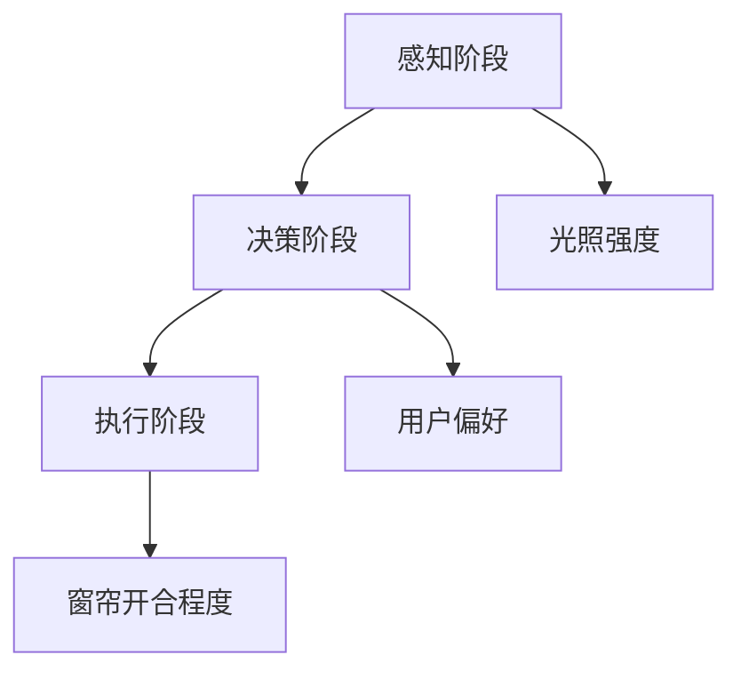

                 


```markdown
# AI Agent在智能窗帘中的光线调节

> 关键词：AI Agent, 智能窗帘, 光线调节, 机器学习, 物联网

> 摘要：本文探讨了AI Agent在智能窗帘中的应用，重点分析了光线调节的实现原理和系统设计。通过详细讲解AI Agent的基本概念、算法原理、系统架构以及实际项目案例，展示了如何利用AI技术提升智能窗帘的智能化水平。

---

# 第1章: AI Agent与智能窗帘概述

## 1.1 AI Agent的基本概念
### 1.1.1 AI Agent的定义
AI Agent（人工智能代理）是指能够感知环境、自主决策并执行任务的智能实体。它能够根据环境信息做出最优选择，以实现特定目标。

### 1.1.2 AI Agent的核心特征
- **自主性**：能够在没有外部干预的情况下独立运行。
- **反应性**：能够实时感知环境变化并做出反应。
- **学习能力**：通过数据和经验不断优化自身的决策能力。
- **协作性**：能够与其他系统或用户进行交互和协作。

### 1.1.3 AI Agent在智能窗帘中的应用潜力
智能窗帘作为智能家居的一部分，可以通过AI Agent实现更智能的光线调节。AI Agent可以根据光照强度、时间、用户偏好等因素，自动调整窗帘的开合程度，提供更舒适的用户体验。

---

## 1.2 智能窗帘的发展现状
### 1.2.1 智能窗帘的定义与分类
智能窗帘是指通过智能化技术实现自动开合的窗帘系统。根据控制方式，可以分为有线控制、无线控制和AI控制三类。

### 1.2.2 智能窗帘的市场现状
随着智能家居市场的快速发展，智能窗帘的市场需求不断增加。目前市场上的智能窗帘主要以机械结构为基础，结合物联网技术实现远程控制。

### 1.2.3 智能窗帘的技术发展趋势
未来的智能窗帘将更加注重智能化和个性化。AI Agent的应用将使智能窗帘能够根据环境和用户需求，自主调节光线，提供更智能化的服务。

---

## 1.3 光线调节的需求分析
### 1.3.1 光线调节的基本需求
光线调节的基本需求包括：根据光照强度自动调整窗帘开合程度，避免强光直射，保持室内光线柔和。

### 1.3.2 用户对光线调节的个性化需求
不同用户对光线调节的需求不同。例如，有些人喜欢早晨的自然光，而有些人则希望在晚上保持室内的暗光环境。

### 1.3.3 光线调节的环境适应性要求
光线调节需要根据环境变化自动调整。例如，晴天和阴天的光照强度不同，AI Agent需要能够根据光照强度自动调整窗帘的开合程度。

---

# 第2章: AI Agent的核心概念与联系

## 2.1 AI Agent的原理
### 2.1.1 感知环境
AI Agent通过传感器感知环境信息，如光照强度、温度、时间等。

### 2.1.2 制定决策
根据感知到的信息，AI Agent利用算法制定决策，例如：确定窗帘的开合程度。

### 2.1.3 执行操作
AI Agent通过执行机构（如电机）调整窗帘的开合程度。

## 2.2 智能窗帘系统的实体关系图
```mermaid
er
title 实体关系图
actor 用户
actor 环境传感器
actor 窗帘执行机构
actor 时间服务
```

---

# 第3章: 光线调节的AI Agent算法原理

## 3.1 算法流程
### 3.1.1 感知阶段
通过光照传感器获取当前光照强度。

### 3.1.2 决策阶段
根据光照强度和用户偏好，计算出最佳的窗帘开合程度。

### 3.1.3 执行阶段
通过电机调整窗帘的开合程度。

## 3.2 算法流程图


## 3.3 算法实现
### 3.3.1 光照强度计算
```python
def calculate_brightness(time):
    # 根据时间计算光照强度
    return 100 * (time.hour + time.minute / 60)
```

### 3.3.2 用户偏好处理
```python
def adjust_brightness(brightness, preference):
    # 根据用户偏好调整亮度
    return brightness * (1 + preference / 100)
```

### 3.3.3 最终调节
```python
def regulate_curtain(brightness, preference):
    return adjust_brightness(calculate_brightness(datetime.now()), preference)
```

---

# 第4章: 智能窗帘系统的架构设计

## 4.1 系统功能设计
### 4.1.1 数据采集模块
通过光照传感器采集光照强度数据。

### 4.1.2 决策控制模块
根据数据和用户偏好，计算窗帘的开合程度。

### 4.1.3 用户交互模块
提供用户界面，方便用户查看和调整设置。

## 4.2 系统架构图


---

# 第5章: 项目实战与分析

## 5.1 环境安装
### 5.1.1 安装Python和必要的库
```bash
pip install numpy
pip install pandas
pip install matplotlib
```

## 5.2 核心代码实现
### 5.2.1 传感器模拟
```python
import numpy as np
import pandas as pd
import time

def simulate_light_sensor():
    return np.random.uniform(0, 100)
```

### 5.2.2 决策算法
```python
def decision_algorithm(brightness, preference):
    return brightness * (1 + preference / 100)
```

### 5.2.3 执行控制
```python
def control_curtain(target_brightness):
    print(f"Curtain adjusted to {target_brightness}%")
```

## 5.3 实际案例分析
### 5.3.1 晴天案例
```python
brightness = simulate_light_sensor()
preference = 20
target_brightness = decision_algorithm(brightness, preference)
control_curtain(target_brightness)
```

---

# 第6章: 最佳实践与总结

## 6.1 最佳实践
### 6.1.1 数据采集的重要性
确保传感器的准确性和稳定性。

### 6.1.2 算法优化的方向
结合更多的环境因素，如天气、时间、用户行为等，优化算法效果。

## 6.2 小结
通过本文的讲解，读者可以了解AI Agent在智能窗帘中的应用，掌握光线调节的实现原理和系统设计方法。

## 6.3 注意事项
- 数据隐私保护
- 系统稳定性保障
- 定期维护和更新

## 6.4 拓展阅读
建议读者进一步学习AI在智能家居中的其他应用，如语音控制、能源管理等。

---

# 结语

通过本文的详细讲解，读者可以深入了解AI Agent在智能窗帘中的光线调节应用。从基本概念到算法实现，再到系统设计和项目实战，相信读者能够掌握相关技术，并将其应用到实际项目中。
```

