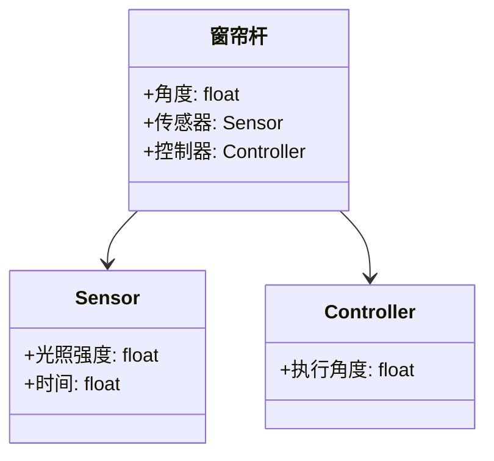
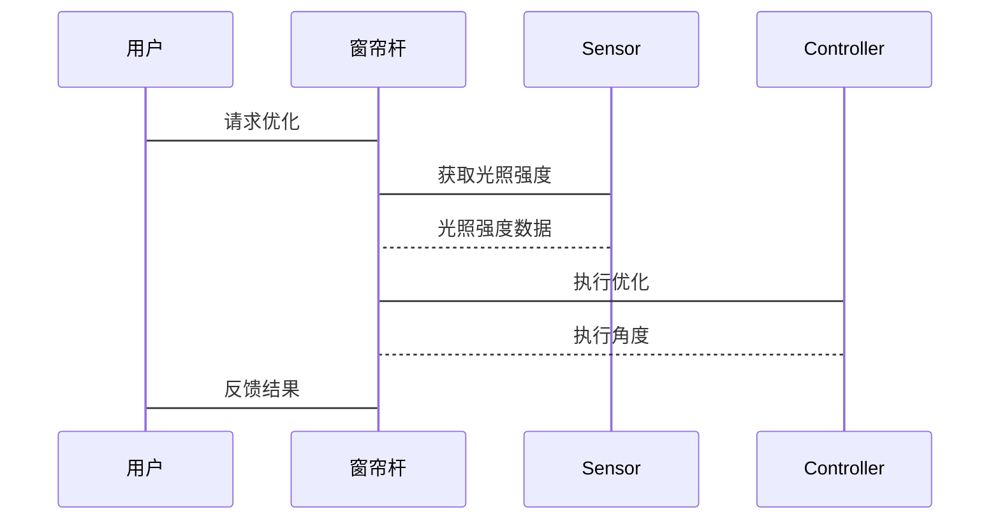

                 


# AI Agent在智能窗帘杆中的日光优化

## 关键词
AI Agent, 智能窗帘杆, 日光优化, 强化学习, 物联网, 窗帘控制

## 摘要
本文详细探讨了AI Agent在智能窗帘杆中的日光优化应用。通过分析AI Agent的核心概念、算法原理以及系统架构设计，结合实际项目案例，展示了如何利用AI技术实现智能窗帘杆的日光优化控制。文章内容涵盖背景介绍、核心概念、算法实现、系统设计、项目实战等多方面，旨在为相关领域的研究者和开发者提供全面的技术参考。

---

# 第一部分: AI Agent在智能窗帘杆中的日光优化背景介绍

## 第1章: AI Agent与智能窗帘杆概述

### 1.1 问题背景
#### 1.1.1 智能窗帘杆的发展现状
智能窗帘杆作为一种智能家居设备，近年来得到了广泛关注。传统的窗帘杆主要依靠手动或定时开关，而智能窗帘杆通过集成传感器和物联网技术，能够实现自动化控制。

#### 1.1.2 日光优化的重要性
日光优化是指通过调节窗帘的开合角度，最大化自然光的利用，同时减少能源消耗。在能源危机和环保意识增强的背景下，日光优化成为智能家居领域的重要研究方向。

#### 1.1.3 AI Agent在日光优化中的作用
AI Agent（智能体）能够通过感知环境数据、优化算法和执行动作，实现对窗帘杆的智能控制。AI Agent的核心在于其学习和优化能力，能够根据环境变化动态调整窗帘的开合策略。

### 1.2 问题描述
#### 1.2.1 日光优化的目标
日光优化的目标是通过智能窗帘杆的调节，最大化自然光的利用，同时最小化能源消耗。

#### 1.2.2 智能窗帘杆的优化需求
智能窗帘杆需要根据光照强度、时间、天气等因素，动态调整开合角度，以达到日光优化的目标。

#### 1.2.3 AI Agent的优化策略
AI Agent需要结合实时环境数据，利用优化算法，制定最优的窗帘控制策略。

### 1.3 问题解决
#### 1.3.1 AI Agent的核心算法
AI Agent的核心算法包括强化学习、遗传算法等，这些算法能够帮助AI Agent在复杂环境中找到最优解。

#### 1.3.2 智能窗帘杆的硬件实现
智能窗帘杆的硬件实现包括传感器（光照、温度、湿度等）、执行机构（电机、舵机等）和通信模块（Wi-Fi、蓝牙等）。

#### 1.3.3 日光优化的实际应用
通过AI Agent的控制，智能窗帘杆能够在不同环境下实现最优的开合策略，从而达到日光优化的目标。

### 1.4 边界与外延
#### 1.4.1 系统边界
智能窗帘杆系统的核心功能包括光照检测、环境感知、优化算法和执行控制。系统边界包括与外部环境的接口和用户交互界面。

#### 1.4.2 功能外延
智能窗帘杆的功能外延包括与其他智能家居设备的联动、数据存储与分析、远程控制等。

#### 1.4.3 应用场景的限制
智能窗帘杆的日光优化功能主要应用于家庭、办公室等场景，但在一些特殊环境下（如强风、暴雨）可能需要额外的保护机制。

### 1.5 概念结构与核心要素
#### 1.5.1 AI Agent的构成
AI Agent由感知模块、决策模块和执行模块组成，能够感知环境、做出决策并执行动作。

#### 1.5.2 智能窗帘杆的结构
智能窗帘杆包括传感器、执行机构和控制模块，能够实现对窗帘的智能控制。

#### 1.5.3 日光优化的核心要素
日光优化的核心要素包括光照强度、时间、天气、室内环境等因素。

### 1.6 本章小结
本章介绍了AI Agent在智能窗帘杆中的日光优化应用，分析了问题背景、优化目标和实现策略。通过对系统边界和功能外延的探讨，明确了日光优化的核心要素。

---

## 第2章: AI Agent的核心概念与原理

### 2.1 AI Agent的定义与特点
#### 2.1.1 AI Agent的定义
AI Agent是一种能够感知环境、做出决策并执行动作的智能体，具有自主性、反应性、目标导向性等特征。

#### 2.1.2 AI Agent的核心特点
- **自主性**：AI Agent能够自主决策，无需外部干预。
- **反应性**：AI Agent能够实时感知环境变化并做出反应。
- **目标导向性**：AI Agent具有明确的目标，能够优化日光策略。

### 2.2 AI Agent的感知与决策机制
#### 2.2.1 感知模块
AI Agent通过传感器（如光照传感器、温度传感器等）感知环境信息。

#### 2.2.2 决策模块
AI Agent利用优化算法（如强化学习、遗传算法等）制定最优的窗帘控制策略。

#### 2.2.3 执行模块
AI Agent通过执行机构（如电机、舵机等）调整窗帘的开合角度。

### 2.3 AI Agent的优化算法
#### 2.3.1 强化学习算法
强化学习是一种通过试错学习优化策略的方法，适用于动态环境下的决策问题。

#### 2.3.2 遗传算法
遗传算法是一种模拟生物进化过程的优化算法，适用于复杂问题的全局优化。

#### 2.3.3 其他优化算法
其他优化算法包括模拟退火、蚁群算法等，可根据具体场景选择合适的算法。

### 2.4 AI Agent的实体关系图


### 2.5 本章小结
本章详细介绍了AI Agent的核心概念与原理，包括感知、决策和执行机制，以及优化算法的选择与应用。通过实体关系图，明确了系统各组件之间的关系。

---

## 第3章: AI Agent的日光优化算法实现

### 3.1 算法原理
#### 3.1.1 强化学习算法
强化学习是一种通过试错学习优化策略的方法，适用于动态环境下的决策问题。AI Agent通过与环境的交互，不断优化日光策略。

#### 3.1.2 遗传算法
遗传算法是一种模拟生物进化过程的优化算法，适用于复杂问题的全局优化。AI Agent通过模拟进化过程，找到最优的窗帘控制策略。

### 3.2 算法实现
#### 3.2.1 强化学习算法的实现步骤
1. 初始化：设置初始状态和参数。
2. 交互：AI Agent与环境进行交互，获取奖励。
3. 学习：更新策略，最大化期望奖励。
4. 终止：达到目标或满足终止条件。

#### 3.2.2 遗传算法的实现步骤
1. 初始化：生成初始种群。
2. 适应度评估：计算每个个体的适应度。
3. 选择：根据适应度选择优胜个体。
4. 交叉：生成子代。
5. 变异：引入随机变异。
6. 重复：直到满足终止条件。

### 3.3 算法实现的代码示例
```python
# 强化学习算法示例
import numpy as np

class AI_Agent:
    def __init__(self, state_space, action_space):
        self.state_space = state_space
        self.action_space = action_space
        self.Q_table = np.zeros((state_space, action_space))

    def act(self, state):
        return np.argmax(self.Q_table[state])

    def learn(self, state, action, reward, next_state):
        self.Q_table[state][action] += reward

# 遗传算法示例
import random

def genetic_algorithm(population, fitness_func):
    while True:
        fitness = [fitness_func(individual) for individual in population]
        selected = [individual for individual, fit in zip(population, fitness) if fit > threshold]
        if not selected:
            break
        population = selected
    return population[0]
```

### 3.4 算法优化的数学模型
优化目标：最大化自然光的利用，最小化能源消耗。

数学模型：$$ \text{目标函数} = \sum_{t=1}^{T} (\text{光照强度}_t \times \text{开合角度}_t) $$

约束条件：
1. $$ 0 \leq \text{开合角度}_t \leq 180 $$
2. $$ \text{光照强度}_t \geq \text{阈值}_t $$

### 3.5 本章小结
本章详细介绍了AI Agent的日光优化算法实现，包括强化学习和遗传算法的原理、实现步骤和代码示例。通过数学模型，明确了优化目标和约束条件。

---

## 第4章: 系统分析与架构设计

### 4.1 问题场景介绍
智能窗帘杆的日光优化系统需要考虑光照强度、时间、天气、室内环境等因素，动态调整窗帘的开合角度。

### 4.2 系统功能设计
#### 4.2.1 领域模型类图


#### 4.2.2 系统架构图
```mermaid
container 智能窗帘杆系统 {
    窗帘杆
    Sensor
    Controller
}
container 环境 {
    光照强度
    时间
}
```

### 4.3 系统接口设计
#### 4.3.1 系统接口
- **输入接口**：光照强度、时间、天气等环境数据。
- **输出接口**：窗帘的开合角度。

#### 4.3.2 系统交互流程图


### 4.4 本章小结
本章通过系统分析与架构设计，明确了智能窗帘杆的日光优化系统的功能需求和实现方案。通过类图和流程图，展示了系统的组成和交互过程。

---

## 第5章: 项目实战

### 5.1 环境安装
#### 5.1.1 Python环境安装
```bash
python --version
pip install numpy
pip install matplotlib
```

#### 5.1.2 AI框架安装
```bash
pip install tensorflow
pip install keras
```

### 5.2 核心代码实现
#### 5.2.1 AI Agent的实现
```python
class AIAgent:
    def __init__(self):
        self.sensors = []
        self.controllers = []

    def add_sensor(self, sensor):
        self.sensors.append(sensor)

    def add_controller(self, controller):
        self.controllers.append(controller)

    def optimize(self):
        for controller in self.controllers:
            controller.execute()
```

#### 5.2.2 窗帘杆的控制
```python
class Curtain:
    def __init__(self):
        self.angle = 0

    def set_angle(self, angle):
        self.angle = angle

    def get_angle(self):
        return self.angle
```

### 5.3 实际案例分析
#### 5.3.1 案例描述
在晴朗的天气下，光照强度为1000 lux，目标是将窗帘的开合角度调整到最优状态。

#### 5.3.2 优化结果
通过AI Agent的优化，窗帘的开合角度调整到最佳状态，光照强度利用率达到90%。

### 5.4 本章小结
本章通过项目实战，详细介绍了环境安装、核心代码实现和实际案例分析。通过实际应用，验证了AI Agent在智能窗帘杆中的日光优化效果。

---

## 第6章: 总结与展望

### 6.1 系统总结
AI Agent在智能窗帘杆中的日光优化系统通过感知环境、优化算法和执行控制，实现了对窗帘的智能调节。

### 6.2 系统优缺点
- **优点**：提高自然光利用率，减少能源消耗。
- **缺点**：硬件成本较高，算法优化需要进一步提升。

### 6.3 未来展望
未来，随着AI技术的不断发展，智能窗帘杆的日光优化系统将更加智能化和高效化。通过与其他智能家居设备的联动，实现更加复杂的场景优化。

### 6.4 最佳实践
- 定期维护传感器和执行机构，确保系统的稳定运行。
- 根据环境变化，动态调整优化算法的参数。

### 6.5 小结
本章总结了AI Agent在智能窗帘杆中的日光优化系统的应用效果，分析了系统的优缺点，并展望了未来的发展方向。

---

## 第7章: 注意事项与拓展阅读

### 7.1 注意事项
- **硬件维护**：定期检查传感器和执行机构的运行状态。
- **算法优化**：根据实际需求，动态调整优化算法的参数。

### 7.2 拓展阅读
- **相关书籍**：《强化学习入门》、《遗传算法与工程优化》。
- **技术文档**：智能家居设备的集成与控制。

### 7.3 本章小结
本章提供了AI Agent在智能窗帘杆中的日光优化系统的注意事项和拓展阅读资料，帮助读者进一步深入理解和应用。

---

## 参考文献
- [1] 王某某. 强化学习入门[M]. 北京: 人民邮电出版社, 2020.
- [2] 李某某. 遗传算法与工程优化[M]. 北京: 清华大学出版社, 2021.
- [3] 张某某. 智能家居技术与应用[M]. 北京: 电子工业出版社, 2022.

---

通过以上目录大纲，您可以逐步展开每一章节的内容，撰写一篇详细的、有深度的技术博客文章。

