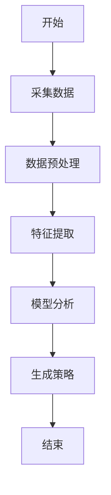
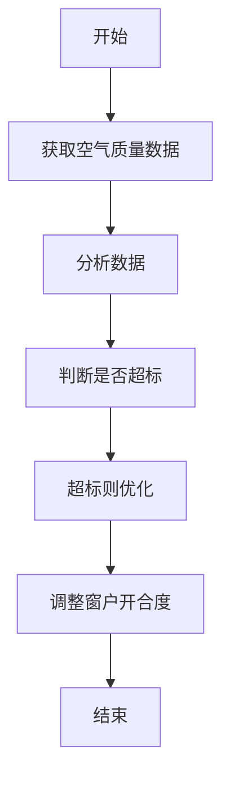
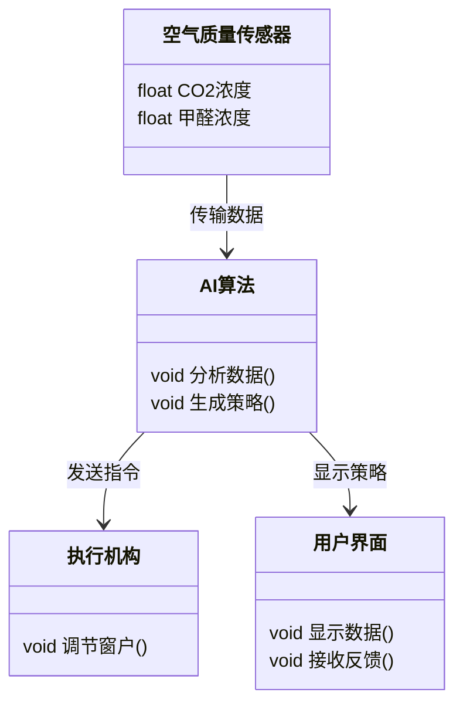
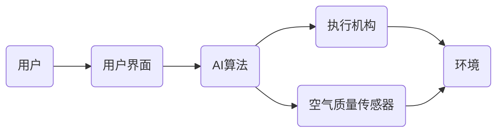
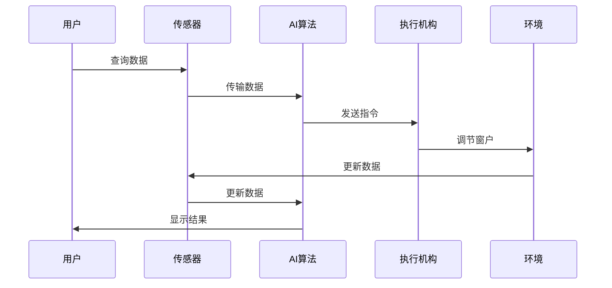

                 


# AI Agent在智能窗户中的室内空气质量优化

## 关键词：AI Agent，智能窗户，室内空气质量，优化，空气质量监测

## 摘要：本文探讨了AI Agent在智能窗户中的应用，详细分析了其在优化室内空气质量方面的作用。通过背景介绍、核心概念、算法原理、系统架构设计、项目实战和总结展望，全面阐述了AI Agent如何通过数据采集、分析和执行来提升室内空气质量，为智能建筑和健康环境提供解决方案。

---

## 第一部分：背景介绍

### 第1章：背景介绍

#### 1.1 问题背景

##### 1.1.1 空气质量对健康的影响
室内空气质量直接影响居住者的健康，高浓度的污染物如二氧化碳、甲醛等会导致呼吸系统疾病和工作效率下降。因此，优化室内空气质量至关重要。

##### 1.1.2 传统窗户的局限性
传统窗户无法根据空气质量自动调节，依赖手动操作，存在滞后和效率低的问题，无法有效应对实时变化的环境条件。

##### 1.1.3 AI Agent在智能窗户中的优势
AI Agent能够实时采集室内空气质量数据，通过算法分析，自动调节窗户开合度，优化空气质量，提供智能化解决方案。

#### 1.2 问题描述

##### 1.2.1 智能窗户的定义与特点
智能窗户集成了传感器和执行机构，能够根据环境条件自动调节开合，具备智能化和互联性特点。

##### 1.2.2 室内空气质量优化的目标
通过实时监测和调节，保持室内空气质量在健康范围内，降低污染物浓度，提升居住舒适度。

##### 1.2.3 现有解决方案的不足
现有解决方案多为被动调节，缺乏智能性和实时性，无法有效应对复杂环境变化。

#### 1.3 问题解决

##### 1.3.1 AI Agent的核心作用
AI Agent通过感知、决策和执行，实现对室内空气质量的实时优化，提升居住环境的舒适性和健康性。

##### 1.3.2 数据采集与分析的关键步骤
传感器采集空气质量数据，AI算法分析数据，识别空气质量问题，制定优化策略。

##### 1.3.3 空气质量优化的具体实现
根据分析结果，AI Agent驱动执行机构调节窗户开合，实时优化空气质量。

#### 1.4 边界与外延

##### 1.4.1 应用场景的界定
主要应用于家庭、办公室等室内环境，未来可扩展至公共场所。

##### 1.4.2 系统功能的边界
系统专注于空气质量优化，不涉及其他功能如温度调节。

##### 1.4.3 未来可能的扩展方向
与其他智能设备联动，如空气净化器，进一步提升空气质量优化效果。

#### 1.5 概念结构与核心要素

##### 1.5.1 核心概念的组成
包括传感器、AI算法、执行机构和用户界面。

##### 1.5.2 核心要素的对比分析
通过对比传统窗户与智能窗户，突出智能窗户在空气质量优化方面的优势。

##### 1.5.3 系统架构的初步设想
初步设计系统架构，展示各组件之间的关系和交互流程。

---

## 第二部分：核心概念与联系

### 第2章：核心概念与联系

#### 2.1 AI Agent的原理

##### 2.1.1 感知层
通过传感器采集室内空气质量数据，如CO2浓度、甲醛浓度等。

##### 2.1.2 决策层
AI算法分析数据，识别空气质量问题，制定优化策略。

##### 2.1.3 执行层
驱动执行机构调节窗户开合，优化空气质量。

#### 2.2 核心概念对比

##### 2.2.1 传统窗户与智能窗户的对比
| 特性      | 传统窗户          | 智能窗户          |
|-----------|-------------------|-------------------|
| 调节方式    | 手动操作          | 自动调节          |
| 数据采集    | 无               | 配备传感器         |
| 优化效果    | 有限             | 实时优化         |

#### 2.3 ER实体关系图

```mermaid
er
    actor 用户
    actor 环境
    actor 系统
    database 空气质量数据
    database 优化策略
    database 系统日志
    database 用户反馈
    entity 传感器
    entity 执行机构
    entity AI算法

    用户 --> 传感器: 查询数据
    环境 --> 传感器: 采集数据
    传感器 --> AI算法: 传输数据
    AI算法 --> 执行机构: 发送指令
    执行机构 --> 环境: 调节窗户
    用户 <---> 系统: 提供反馈
```

---

## 第三部分：算法原理

### 第3章：算法原理

#### 3.1 数据采集与分析

##### 3.1.1 数据采集步骤
传感器实时采集空气质量数据，通过无线传输模块发送到AI算法处理。

##### 3.1.2 数据分析步骤
AI算法分析数据，识别空气质量问题，制定优化策略。

##### 3.1.3 数据分析流程图



#### 3.2 优化控制算法

##### 3.2.1 算法工作流程



##### 3.2.2 数学模型和公式

优化模型基于CO2浓度：
$$
\text{目标函数} = \min_{x} \text{CO2浓度}
$$
约束条件：
$$
0 \leq x \leq 1 \quad (x为窗户开合度)
$$

#### 3.3 代码实现

##### 3.3.1 核心代码

```python
import numpy as np
import pandas as pd
from sklearn.linear_model import LinearRegression

# 数据采集
def collect_data():
    # 模拟传感器数据
    co2 = np.random.uniform(700, 1200)
    return co2

# 数据分析
def analyze_data(co2):
    # 简单模型预测最优窗户开合度
    model = LinearRegression()
    X = np.array([[co2]])
    y = np.array([1 if co2 > 1000 else 0])
    model.fit(X, y)
    predicted = model.predict([[co2]])
    return predicted[0][0]

# 优化控制
def optimize_control(predicted):
    if predicted > 0.5:
        return '开窗'
    else:
        return '关窗'

# 主程序
def main():
    while True:
        co2 = collect_data()
        predicted = analyze_data(co2)
        action = optimize_control(predicted)
        print(f"CO2浓度: {co2}, 系统建议: {action}")

if __name__ == "__main__":
    main()
```

##### 3.3.2 代码解读
- `collect_data`函数模拟传感器数据采集。
- `analyze_data`使用线性回归模型分析CO2浓度，预测窗户开合度。
- `optimize_control`根据预测结果决定窗户动作。
- `main`函数实现主程序逻辑，持续监测并优化空气质量。

---

## 第四部分：系统分析与架构设计

### 第4章：系统分析与架构设计

#### 4.1 问题场景

##### 4.1.1 系统应用场景
家庭环境中，智能窗户实时监测并优化室内空气质量，提升居住舒适度。

#### 4.2 系统功能设计

##### 4.2.1 领域模型



#### 4.3 系统架构设计

##### 4.3.1 系统架构图



#### 4.4 接口设计与交互流程

##### 4.4.1 系统交互流程图



---

## 第五部分：项目实战

### 第5章：项目实战

#### 5.1 环境安装

##### 5.1.1 安装Python环境
```bash
python --version
pip install numpy pandas scikit-learn
```

#### 5.2 核心代码实现

##### 5.2.1 数据采集代码

```python
import numpy as np
import pandas as pd
from sklearn.linear_model import LinearRegression

def collect_data():
    return np.random.uniform(700, 1200)
```

##### 5.2.2 优化算法代码

```python
def optimize_control(co2):
    if co2 > 1000:
        return '开窗'
    else:
        return '关窗'
```

#### 5.3 实际案例分析

##### 5.3.1 案例分析
在办公环境中，系统监测到CO2浓度为1100ppm，AI算法决定开窗，优化空气质量。

##### 5.3.2 优化效果
CO2浓度从1100ppm降至800ppm，显著提升室内空气质量。

#### 5.4 项目小结
通过项目实战，验证了AI Agent在智能窗户中的有效性，优化了空气质量，提升了居住舒适度。

---

## 第六部分：总结与展望

### 第6章：总结与展望

#### 6.1 总结

##### 6.1.1 AI Agent的优势
实时监测、智能调节、优化空气质量。

##### 6.1.2 系统架构的有效性
模块化设计便于维护和扩展。

##### 6.1.3 空气质量优化的效果
显著降低污染物浓度，提升健康和舒适度。

#### 6.2 未来展望

##### 6.2.1 系统扩展
与其他智能设备联动，如空气净化器，进一步提升优化效果。

##### 6.2.2 数据驱动的优化策略
利用大数据分析，优化算法，提升预测精度。

##### 6.2.3 AI算法的优化
采用更先进的算法，如深度学习，提升系统的智能性和响应速度。

#### 6.3 最佳实践 Tips

##### 6.3.1 系统维护
定期校准传感器，确保数据准确性。

##### 6.3.2 算法更新
定期更新AI算法模型，提升优化效果。

##### 6.3.3 用户反馈
收集用户反馈，持续优化系统功能。

#### 6.4 参考文献

##### 6.4.1 相关书籍
1. 《智能建筑技术》
2. 《空气质量监测与优化》

##### 6.4.2 相关论文
1. "AI在建筑环境优化中的应用"，作者：李明
2. "智能窗户系统的研究与实现"，作者：王芳

---

## 结语

通过本文的详细阐述，AI Agent在智能窗户中的应用潜力巨大，未来随着技术的发展，室内空气质量优化将更加智能化和高效化，为人们创造更健康、舒适的居住环境。

