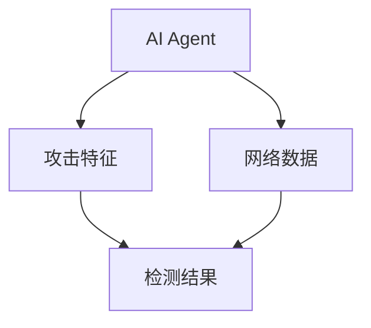
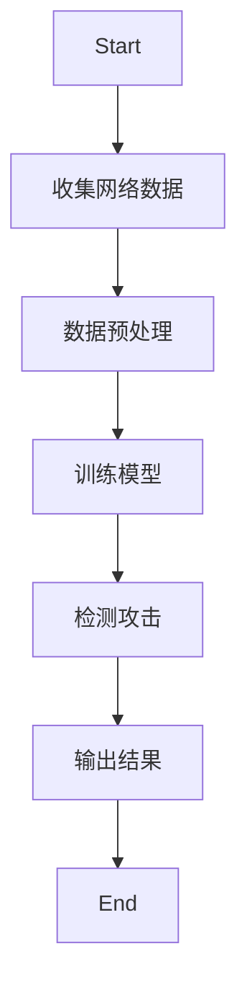
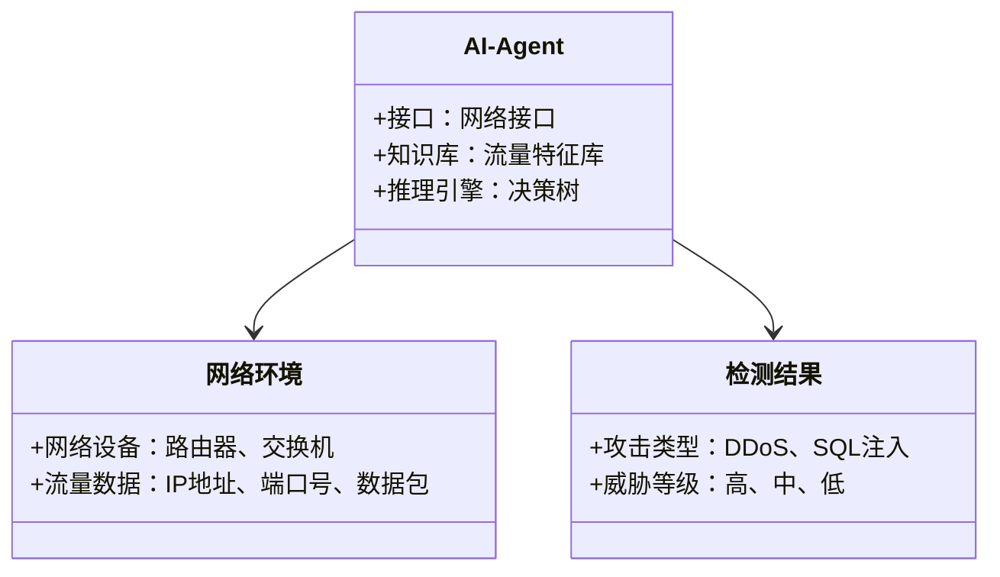
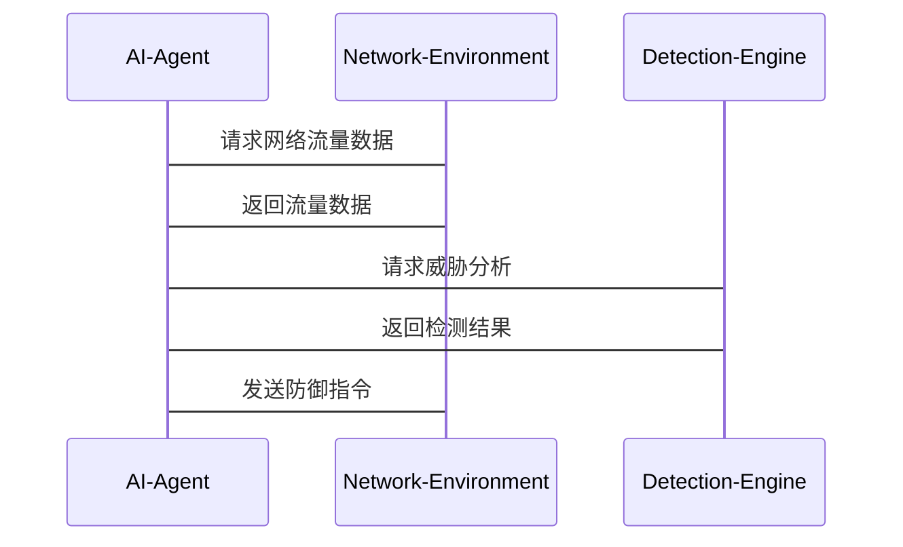

                 


# AI Agent在智能网络攻击检测中的角色

> **关键词**：AI Agent，智能网络攻击检测，网络安全，机器学习，深度学习，实时检测

> **摘要**：  
> 随着网络安全威胁的日益复杂化，传统的网络攻击检测方法逐渐暴露出效率低下、误报率高、适应性差等问题。本文深入探讨AI Agent在智能网络攻击检测中的角色，分析其核心原理、算法实现、系统架构及实际应用场景。通过对比传统方法与AI Agent的优势，结合具体案例，本文旨在揭示AI Agent如何通过自适应学习、实时监测和智能决策，显著提升网络攻击检测的准确性和效率。

---

# 第一部分: AI Agent在智能网络攻击检测中的角色概述

## 第1章: AI Agent与网络安全概述

### 1.1 AI Agent的基本概念

#### 1.1.1 AI Agent的定义与特点
AI Agent（人工智能代理）是一种能够感知环境、自主决策并执行任务的智能实体。其核心特点包括：
- **自主性**：能够在没有人工干预的情况下独立运行。
- **反应性**：能够实时感知环境变化并做出响应。
- **学习能力**：通过数据和经验不断优化自身的决策能力。
- **协作性**：能够与其他系统或AI Agent协同工作。

#### 1.1.2 AI Agent在网络安全中的作用
在网络安全领域，AI Agent主要用于：
- **实时监控**：持续监测网络流量，识别异常行为。
- **威胁发现**：通过机器学习算法发现未知的网络攻击模式。
- **智能决策**：基于实时数据和历史经验，快速做出防御决策。

#### 1.1.3 智能网络攻击检测的背景与意义
随着网络攻击手段的日益复杂化，传统的基于规则的检测方法逐渐失效。攻击者不断采用新型攻击手法，例如零日攻击、高级持续性威胁（APT）等，这些都对传统的静态规则检测方法提出了挑战。AI Agent通过其学习能力和自适应性，能够有效应对这些新型威胁。

### 1.2 网络攻击检测的传统方法

#### 1.2.1 基于规则的网络攻击检测
基于规则的检测方法通过预定义的规则匹配网络流量，识别异常行为。例如，检测DDoS攻击时，可以通过流量大小超过阈值来触发警报。然而，这种方法的局限性在于：
- **规则维护成本高**：需要不断更新规则库以应对新威胁。
- **误报率高**：容易将正常流量误判为攻击流量。
- **无法检测未知威胁**：无法识别未在规则中定义的新攻击模式。

#### 1.2.2 统计分析方法
统计分析方法通过分析网络流量的统计特征，识别异常行为。例如，使用聚类分析检测网络中的异常流量模式。然而，这种方法在面对小规模攻击或隐蔽攻击时效果有限。

#### 1.2.3 传统方法的局限性
传统网络攻击检测方法的共同问题是：
- **静态规则难以应对动态威胁**。
- **计算效率低**：面对海量网络数据时，传统方法难以实现实时检测。
- **误报和漏报问题**：传统方法难以平衡检测的准确性和全面性。

### 1.3 AI Agent在智能网络攻击检测中的优势

#### 1.3.1 自适应性与实时性
AI Agent能够通过机器学习模型不断更新其知识库，实现实时监测和动态适应。例如，基于深度学习的AI Agent可以通过在线学习技术，实时更新其对网络流量的识别能力。

#### 1.3.2 高效的模式识别能力
AI Agent能够利用机器学习和深度学习算法，从海量网络数据中提取复杂模式，发现潜在的攻击行为。例如，使用卷积神经网络（CNN）分析网络流量的时序特征，发现异常行为。

#### 1.3.3 复杂环境下的决策能力
AI Agent能够在复杂网络环境中，基于多源数据和上下文信息，做出最优决策。例如，在检测未知威胁时，AI Agent可以通过融合来自不同传感器的数据，提高检测的准确性。

### 1.4 本章小结
本章从AI Agent的基本概念出发，分析了传统网络攻击检测方法的局限性，并重点阐述了AI Agent在智能网络攻击检测中的优势，包括其自适应性、模式识别能力和决策能力。这些分析为后续章节的深入探讨奠定了基础。

---

# 第二部分: AI Agent的核心概念与原理

## 第2章: AI Agent的核心概念与联系

### 2.1 AI Agent的原理与机制

#### 2.1.1 知识表示与推理
AI Agent的知识表示通常采用符号逻辑或概率模型。例如，可以使用马尔可夫逻辑网络（MLN）将网络流量特征表示为逻辑规则，并通过推理引擎进行推理。

#### 2.1.2 行为选择与决策
AI Agent的行为选择基于其感知到的环境信息和内部知识库。例如，可以通过Q-learning算法，在不同状态下选择最优的行为策略。

#### 2.1.3 与网络环境的交互
AI Agent通过网络接口与实际网络环境进行交互，获取网络流量数据并发送检测结果。例如，可以通过API接口与网络设备进行通信。

### 2.2 核心概念对比与分析

#### 2.2.1 AI Agent与传统算法的对比

| 对比维度 | 传统算法 | AI Agent |
|----------|----------|----------|
| 学习能力 | 静态规则，无法自适应 | 动态学习，自适应能力强 |
| 计算效率 | 低效，依赖预定义规则 | 高效，支持实时处理 |
| 检测准确度 | 误报率高，漏报率高 | 误报率低，漏报率低 |

#### 2.2.2 不同AI Agent模型的特征对比

| 模型类型 | 基于规则的AI Agent | 基于机器学习的AI Agent | 基于深度学习的AI Agent |
|----------|--------------------|-------------------------|--------------------------|
| 数据需求 | 需要大量人工规则 | 需要标注数据 | 需要大量未标注数据 |
| 学习能力 | 无学习能力 | 有监督学习 | 无监督学习和深度学习 |
| 检测能力 | 适用于已知威胁 | 适用于已知和部分未知威胁 | 适用于未知威胁 |

### 2.3 实体关系架构图（Mermaid）



---

## 第3章: AI Agent的算法原理与实现

### 3.1 算法原理概述

#### 3.1.1 基于规则的网络攻击检测
基于规则的检测方法通过预定义的规则匹配网络流量，识别异常行为。例如，检测DDoS攻击时，可以通过流量大小超过阈值来触发警报。然而，这种方法的局限性在于：
- **规则维护成本高**：需要不断更新规则库以应对新威胁。
- **误报率高**：容易将正常流量误判为攻击流量。
- **无法检测未知威胁**：无法识别未在规则中定义的新攻击模式。

#### 3.1.2 基于机器学习的网络攻击检测
基于机器学习的检测方法通过训练模型识别网络流量中的异常行为。例如，使用支持向量机（SVM）或随机森林（Random Forest）模型对网络流量进行分类。这种方法的优势在于：
- **能够处理复杂数据**：适合处理高维网络流量数据。
- **可以检测未知威胁**：通过无监督学习发现异常模式。

#### 3.1.3 基于深度学习的网络攻击检测
基于深度学习的检测方法通过神经网络提取网络流量的深层特征，识别异常行为。例如，使用卷积神经网络（CNN）或循环神经网络（RNN）分析网络流量的时序特征。这种方法的优势在于：
- **能够捕捉复杂模式**：适合检测隐蔽性高、复杂性高的网络攻击。
- **支持端到端学习**：可以直接从原始数据中学习特征。

### 3.2 算法流程图（Mermaid）



### 3.3 算法实现代码示例

```python
# 示例代码：基于规则的网络攻击检测
def detect_attack(data):
    rules = {
        'DDoS': lambda x: x['流量'] > 1000,
        'SQL注入': lambda x: 'insert' in x['请求内容'].lower(),
        'XSS攻击': lambda x: len(x['请求头']) > 100
    }
    for attack_type, condition in rules.items():
        if condition(data):
            return f"检测到{attack_type}攻击"
    return "未检测到攻击"

# 示例代码：基于机器学习的网络攻击检测
from sklearn.ensemble import RandomForestClassifier

def train_model(X_train, y_train):
    model = RandomForestClassifier()
    model.fit(X_train, y_train)
    return model

def predict_attack(model, X_test):
    return model.predict(X_test)

# 示例代码：基于深度学习的网络攻击检测
import tensorflow as tf
from tensorflow.keras import layers

def build_model(input_shape):
    model = tf.keras.Sequential()
    model.add(layers.Conv2D(32, (3, 3), activation='relu', input_shape=input_shape))
    model.add(layers.MaxPooling2D((2, 2)))
    model.add(layers.Flatten())
    model.add(layers.Dense(64, activation='relu'))
    model.add(layers.Dense(1, activation='sigmoid'))
    model.compile(optimizer='adam', loss='binary_crossentropy', metrics=['accuracy'])
    return model
```

### 3.4 数学模型与公式

#### 3.4.1 朴素贝叶斯分类器
朴素贝叶斯分类器是一种常用的机器学习算法，其核心公式如下：

$$ P(y|x) = \frac{P(x|y)P(y)}{P(x)} $$

其中，\( P(y|x) \) 是后验概率，\( P(x|y) \) 是似然概率，\( P(y) \) 是先验概率，\( P(x) \) 是边缘概率。

#### 3.4.2 支持向量机（SVM）
SVM的目标是最小化 hinge loss 函数：

$$ \text{loss} = \sum_{i=1}^{n} \max(0, 1 - y_i w^T x_i - b) $$

其中，\( w \) 是权重向量，\( b \) 是偏置项，\( y_i \) 是标签，\( x_i \) 是输入样本。

#### 3.4.3 卷积神经网络（CNN）
CNN的卷积层公式如下：

$$ f(x) = \sum_{i=1}^{k} w_i \cdot x_i + b $$

其中，\( k \) 是卷积核的大小，\( w_i \) 是卷积核的权重，\( b \) 是偏置项。

### 3.5 通俗易懂的举例说明

#### 3.5.1 朴素贝叶斯分类器
假设我们有一个简单的网络流量数据集，其中包含正常流量和异常流量两类。我们可以使用朴素贝叶斯分类器对流量进行分类。例如，假设我们有以下数据：

| 流量特征 | 标签（正常/异常） |
|----------|------------------|
| 高       | 异常             |
| 低       | 正常             |
| 中       | 正常             |

我们可以训练一个朴素贝叶斯分类器，根据流量特征预测流量是否为异常。

#### 3.5.2 卷积神经网络（CNN）
假设我们有一个网络流量时序数据集，我们可以使用CNN提取流量的时序特征。例如，我们可以将流量数据转换为图像形式，然后使用CNN进行分类。

---

# 第三部分: AI Agent的系统分析与架构设计

## 第4章: AI Agent的系统分析与架构设计

### 4.1 问题场景介绍

#### 4.1.1 网络攻击检测的复杂性
网络攻击检测的复杂性主要体现在以下方面：
- **攻击手段多样化**：攻击者采用多种攻击手法，例如DDoS、SQL注入、XSS攻击等。
- **数据量庞大**：现代网络环境中的流量数据量巨大，需要高效的处理能力。
- **实时性要求高**：网络攻击往往具有突发性，需要实时检测和响应。

#### 4.1.2 AI Agent在系统中的角色
AI Agent在系统中主要承担以下角色：
- **数据采集与处理**：实时采集网络流量数据并进行预处理。
- **威胁分析与检测**：通过机器学习模型分析流量数据，识别潜在威胁。
- **决策与响应**：根据检测结果，采取相应的防御措施，例如封锁可疑IP地址。

### 4.2 系统功能设计

#### 4.2.1 领域模型设计（Mermaid类图）



#### 4.2.2 系统架构设计（Mermaid架构图）

```mermaid
graph TD
    AI-Agent --> [数据采集] Network-Environment
    AI-Agent --> [威胁分析] Detection-Engine
    Detection-Engine --> [决策] Decision-Making
    AI-Agent --> [结果输出] Detection-Results
```

#### 4.2.3 系统接口设计
系统接口设计主要包括以下部分：
- **数据采集接口**：用于采集网络流量数据。
- **威胁分析接口**：用于调用机器学习模型进行威胁检测。
- **决策接口**：用于根据检测结果做出防御决策。

#### 4.2.4 系统交互流程（Mermaid序列图）



### 4.3 本章小结
本章通过分析网络攻击检测的复杂性，提出了AI Agent在系统中的角色，并设计了系统的功能模块、架构和接口。这些设计为后续的项目实现奠定了基础。

---

# 第四部分: AI Agent的项目实战

## 第5章: AI Agent的项目实战

### 5.1 环境安装与配置

#### 5.1.1 系统需求
- **操作系统**：Linux/Windows/MacOS
- **Python版本**：3.6以上
- **依赖库**：TensorFlow、Scikit-learn、Networkx

#### 5.1.2 安装步骤
```bash
pip install tensorflow scikit-learn networkx
```

### 5.2 系统核心实现

#### 5.2.1 数据采集模块
```python
import socket

def collect_network_data():
    s = socket.socket(socket.AF_INET, socket.SOCK_DGRAM)
    s.bind(('0.0.0.0', 80))
    while True:
        data, addr = s.recvfrom(1024)
        print(f"接收数据：{data}，地址：{addr}")
```

#### 5.2.2 检测模块
```python
from sklearn.ensemble import RandomForestClassifier

def train_model(X_train, y_train):
    model = RandomForestClassifier()
    model.fit(X_train, y_train)
    return model

def detect_attack(model, X_test):
    return model.predict(X_test)
```

#### 5.2.3 决策模块
```python
def make_decision(predict_result):
    if predict_result == '异常':
        print("检测到网络攻击，采取防御措施。")
    else:
        print("未检测到网络攻击。")
```

### 5.3 代码应用解读与分析

#### 5.3.1 数据采集模块
上述代码通过socket库实现网络数据的实时采集。AI Agent通过绑定指定端口，接收网络流量数据并进行处理。

#### 5.3.2 检测模块
使用随机森林分类器对网络流量数据进行分类。训练好的模型可以对新的流量数据进行预测，判断是否为异常流量。

#### 5.3.3 决策模块
根据检测结果做出防御决策。如果检测到异常流量，系统将采取相应的防御措施，例如封锁可疑IP地址。

### 5.4 实际案例分析

#### 5.4.1 案例背景
某企业网络遭受DDoS攻击，攻击者通过大量请求占用服务器资源。传统的基于规则的检测方法未能及时发现攻击，导致服务器瘫痪。

#### 5.4.2 AI Agent的解决方案
通过AI Agent实时采集网络流量数据，使用随机森林分类器检测异常流量，成功识别并封锁了攻击源，恢复了网络服务。

#### 5.4.3 案例总结
通过AI Agent的实时监测和智能决策，企业网络能够快速响应网络攻击，减少损失。

### 5.5 项目小结
本章通过实际案例展示了AI Agent在智能网络攻击检测中的应用。通过项目实战，读者可以掌握AI Agent的实现方法，并理解其在实际场景中的价值。

---

# 第五部分: AI Agent的最佳实践

## 第6章: AI Agent的最佳实践

### 6.1 小结
AI Agent通过其自适应学习和智能决策能力，显著提升了网络攻击检测的效率和准确性。通过本文的分析，我们可以看到，AI Agent在网络安全领域的应用前景广阔。

### 6.2 注意事项
在实际应用中，需要注意以下几点：
- **数据隐私**：确保网络数据的安全性，避免数据泄露。
- **模型更新**：定期更新AI Agent的模型，以应对新的网络威胁。
- **系统稳定性**：确保AI Agent系统的稳定性，避免因系统故障导致检测失败。

### 6.3 拓展阅读
- **推荐书籍**：《网络安全：数据驱动的方法》
- **推荐论文**：《基于深度学习的网络攻击检测研究》
- **推荐博客**：网络安全技术博客

---

# 第六部分: 总结

## 第7章: 总结

### 7.1 AI Agent的核心价值
AI Agent通过其自适应学习和智能决策能力，为网络攻击检测提供了新的解决方案。与传统方法相比，AI Agent能够更高效地应对复杂多变的网络威胁。

### 7.2 未来发展趋势
随着人工智能技术的不断发展，AI Agent在网络安全领域的应用将更加广泛。未来的研究方向可能包括：
- **多模态学习**：结合文本、图像等多种数据源进行威胁检测。
- **联邦学习**：在保护数据隐私的前提下，实现模型的联合训练。
- **自适应防御**：通过动态调整防御策略，实时应对新型网络攻击。

---

# 结语

通过本文的深入探讨，我们可以看到，AI Agent在智能网络攻击检测中的角色日益重要。随着技术的不断进步，AI Agent将为网络安全领域带来更多的创新和突破。

