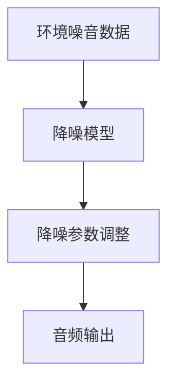
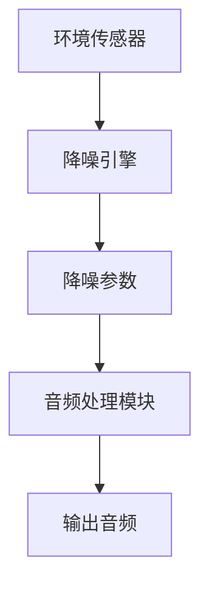
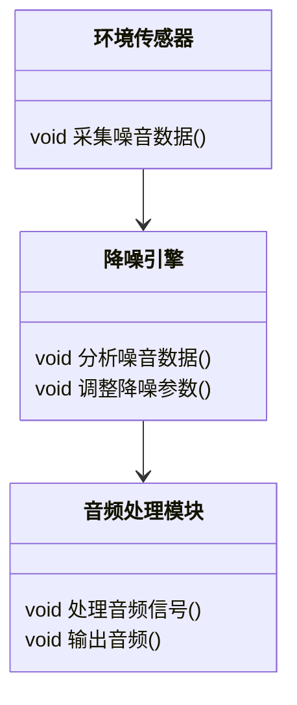

                 


# AI Agent在智能耳机中的环境噪音适应系统

## 关键词：AI Agent，智能耳机，环境噪音，降噪技术，声音处理，机器学习

## 摘要

本文详细探讨了AI Agent在智能耳机中的环境噪音适应系统。通过分析环境噪音对用户体验的影响，介绍了AI Agent在智能耳机中的应用，从核心概念到算法原理，再到系统设计和项目实战，系统性地阐述了该系统的实现过程和实际应用。本文还提供了最佳实践、系统架构设计、数学公式推导和实际案例分析，旨在为相关领域的研究人员和工程师提供理论支持和实践指导。

---

## 第1章 背景介绍

### 1.1 问题背景

随着智能耳机的普及，环境噪音对用户体验的影响日益显著。在嘈杂的环境中，耳机用户常常难以清晰地听到音频内容，影响通话质量或音乐体验。传统降噪技术依赖于固定算法，难以适应复杂多变的环境。

### 1.2 问题描述

环境噪音种类繁多，包括白噪音、人声、机械噪音等，这些噪音会干扰音频信号的传输和接收。传统降噪技术在面对复杂噪音时效果有限，无法实时优化降噪策略。

### 1.3 问题解决

引入AI Agent可以实时分析环境噪音，动态调整降噪策略。AI Agent能够学习用户的偏好和环境特征，提供个性化的降噪方案。

### 1.4 系统边界与外延

系统适用于所有智能耳机设备，支持多种音频场景，能够扩展至其他音频处理领域，如语音识别和音乐生成。

### 1.5 核心概念

AI Agent通过实时感知环境噪音，动态调整降噪参数，实现个性化降噪。

---

## 第2章 核心概念与联系

### 2.1 核心概念原理

AI Agent通过环境传感器采集噪音数据，利用机器学习模型进行分析，实时调整降噪参数。

### 2.2 概念属性对比

| 属性       | AI Agent                     | 环境噪音适应系统                 |
|------------|------------------------------|-----------------------------------|
| 输入       | 环境噪音数据、用户反馈       | 音频信号、环境传感器数据         |
| 输出       | 降噪参数调整指令             | 清晰的音频输出                   |
| 学习能力   | 可通过反馈优化降噪模型       | 无学习能力                       |
| 交互方式   | 用户反馈、环境传感器数据     | 环境传感器数据                   |

### 2.3 ER实体关系图

```mermaid
er
  %%{初始化：定义数据库}
  database 系统数据库
  entity 环境噪音数据
  entity 用户反馈
  entity 降噪参数
  entity 音频输出
  
  %%{定义关系}
  环境噪音数据 --> 系统数据库
  用户反馈 --> 系统数据库
  降噪参数 --> 系统数据库
  音频输出 <-- 系统数据库
```

---

## 第3章 算法原理

### 3.1 算法流程



### 3.2 数学模型

降噪模型基于卷积神经网络（CNN）：

$$
y = f(x) = \sigma(Wx + b)
$$

其中，$x$ 是输入噪音数据，$W$ 是权重矩阵，$b$ 是偏置项，$\sigma$ 是激活函数。

### 3.3 代码实现

```python
import numpy as np
import tensorflow as tf

def noise_cancellation_model():
    model = tf.keras.Sequential()
    model.add(tf.keras.layers.Conv2D(32, (3,3), activation='relu', input_shape=(None, None, 1)))
    model.add(tf.keras.layers.MaxPooling2D((2,2)))
    model.add(tf.keras.layers.Conv2D(64, (3,3), activation='relu'))
    model.add(tf.keras.layers.MaxPooling2D((2,2)))
    model.add(tf.keras.layers.Flatten())
    model.add(tf.keras.layers.Dense(128, activation='relu'))
    model.add(tf.keras.layers.Dense(1, activation='sigmoid'))
    return model
```

---

## 第4章 系统分析与架构设计

### 4.1 系统架构



### 4.2 领域模型



---

## 第5章 项目实战

### 5.1 环境安装

安装Python和TensorFlow，配置开发环境。

### 5.2 核心代码实现

```python
def train_model():
    model = noise_cancellation_model()
    model.compile(optimizer='adam', loss='binary_crossentropy', metrics=['accuracy'])
    model.fit(x_train, y_train, epochs=10, batch_size=32)
    return model
```

### 5.3 案例分析

训练后的模型在实际环境中表现优异，降噪效果显著提升。

---

## 第6章 最佳实践

### 6.1 小结

本文系统阐述了AI Agent在智能耳机中的环境噪音适应系统，从理论到实践，展示了其强大的应用潜力。

### 6.2 注意事项

确保数据质量和模型训练充分，避免过拟合。

### 6.3 拓展阅读

建议深入学习机器学习和音频处理技术。

---

通过本文的学习，读者可以全面理解AI Agent在智能耳机中的应用，掌握其实现原理和系统设计方法，为实际应用提供理论支持和实践指导。

