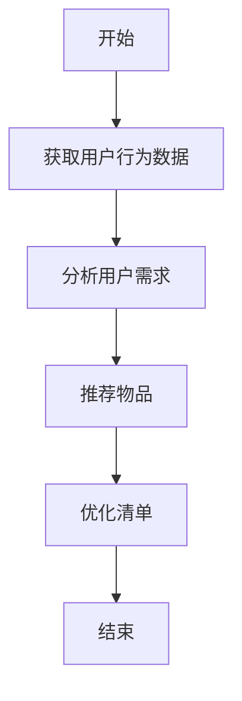

                 


# AI Agent在智能背包中的物品清单管理

> 关键词：AI Agent, 智能背包, 物品清单, 算法原理, 系统架构, 项目实战

> 摘要：本文深入探讨了AI Agent在智能背包中的物品清单管理应用。从问题背景到核心概念，从算法原理到系统架构，再到项目实战，全面解析了AI Agent如何优化物品清单管理，提升用户体验。

---

# 第一部分: AI Agent在智能背包中的物品清单管理背景介绍

## 第1章: 问题背景与需求分析

### 1.1 问题背景
#### 1.1.1 物品清单管理的传统方式
传统的物品清单管理依赖于手动记录和分类，效率低下且容易出错。人们常常会忘记携带所需物品，或者重复携带不需要的物品。

#### 1.1.2 AI Agent技术的引入背景
随着AI技术的发展，AI Agent（人工智能代理）能够通过学习和推理，帮助用户高效管理物品。AI Agent可以实时分析用户的使用习惯，推荐合适的物品，并优化清单。

#### 1.1.3 智能背包的定义与特点
智能背包是一种结合了物联网和AI技术的背包，能够自动记录和管理携带的物品。其特点包括智能化、自动化和高效率。

### 1.2 问题描述
#### 1.2.1 物品清单管理的主要问题
传统物品清单管理存在效率低、容易遗漏或重复的问题，用户难以快速找到所需物品。

#### 1.2.2 AI Agent在清单管理中的作用
AI Agent能够自动记录物品信息，分析用户的使用习惯，提供个性化推荐，优化清单结构。

#### 1.2.3 智能背包物品清单管理的目标
通过AI Agent实现物品清单的智能化管理，提升用户的使用效率和体验。

### 1.3 问题解决
#### 1.3.1 AI Agent如何解决物品清单管理问题
AI Agent通过实时监测背包中的物品，分析用户的使用习惯，自动调整清单，减少用户负担。

#### 1.3.2 智能背包物品清单管理的实现路径
通过传感器和AI算法，智能背包能够实时监测物品，结合用户行为数据，优化清单。

#### 1.3.3 AI Agent在智能背包中的具体应用
AI Agent可以用于物品推荐、清单优化、使用习惯分析等功能，帮助用户更高效地管理背包中的物品。

### 1.4 边界与外延
#### 1.4.1 智能背包物品清单管理的边界
智能背包仅管理背包中的物品，不涉及其他设备或场所的物品管理。

#### 1.4.2 AI Agent功能的边界与限制
AI Agent的功能局限于物品清单管理，无法处理复杂的决策问题。

#### 1.4.3 智能背包物品清单管理的外延应用
AI Agent技术可以扩展到其他领域，如智能家居、健康监测等。

### 1.5 概念结构与核心要素
#### 1.5.1 智能背包物品清单管理的核心概念
包括AI Agent、物品清单、用户行为数据等。

#### 1.5.2 AI Agent与智能背包的关系
AI Agent是智能背包的核心技术，负责处理物品清单的智能化管理。

#### 1.5.3 核心要素的构成与作用
传感器、AI算法、用户数据是智能背包物品清单管理的核心要素，分别负责数据采集、处理和应用。

### 1.6 本章小结
本章介绍了AI Agent在智能背包中的物品清单管理的背景、问题、解决方法和边界，为后续章节奠定了基础。

---

# 第2章: AI Agent与智能背包的核心概念

## 2.1 AI Agent的基本原理
### 2.1.1 AI Agent的定义
AI Agent是一种能够感知环境、自主决策并执行任务的智能体。

### 2.1.2 AI Agent的核心功能
包括感知、推理、学习、规划和执行。

### 2.1.3 AI Agent的分类与特点
分为简单反射Agent和复杂推理Agent，具有自主性、反应性和社会性等特点。

## 2.2 智能背包的定义与功能
### 2.2.1 智能背包的定义
智能背包是一种结合了物联网和AI技术的背包，能够自动管理携带的物品。

### 2.2.2 智能背包的主要功能
包括物品清单管理、使用习惯分析、物品推荐等功能。

## 2.3 AI Agent在智能背包中的应用
### 2.3.1 AI Agent在物品清单管理中的作用
AI Agent通过分析用户行为，优化物品清单，提升管理效率。

### 2.3.2 智能背包与AI Agent的关系
智能背包是AI Agent的应用场景之一，AI Agent为其提供智能化管理能力。

### 2.3.3 核心要素的构成与作用
传感器、AI算法、用户数据是智能背包物品清单管理的核心要素。

---

## 2.4 实体关系与核心算法

### 2.4.1 实体关系图（ER图）
```mermaid
er
  %% 智能背包物品清单管理的ER图
  actor 用户
  node 物品
  node 清单
  node 用户行为数据
  edge 用户 -> 用户行为数据: 提供
  edge 用户 -> 物品: 携带
  edge 用户 -> 清单: 管理
  edge 物品 -> 清单: 属于
  edge 清单 -> 用户行为数据: 基于
```

### 2.4.2 核心算法流程图


### 2.4.3 推荐算法的数学模型
推荐算法基于协同过滤，相似度计算公式：
$$\text{相似度}(u_i, u_j) = \frac{\sum_{k} (r_{ik} - \bar{r_i})(r_{jk} - \bar{r_j})}{\sqrt{\sum_{k} (r_{ik} - \bar{r_i})^2} \cdot \sqrt{\sum_{k} (r_{jk} - \bar{r_j})^2}}$$

### 2.4.4 Python代码实现
```python
def calculate_similarity(user_i, user_j, items):
    # 计算平均评分
    avg_i = sum(user_i.ratings) / len(user_i.ratings)
    avg_j = sum(user_j.ratings) / len(user_j.ratings)
    
    # 计算分子
    numerator = sum((user_i.ratings[k] - avg_i) * (user_j.ratings[k] - avg_j) for k in range(len(items)))
    
    # 计算分母
    denominator_i = sum((user_i.ratings[k] - avg_i)**2 for k in range(len(items)))
    denominator_j = sum((user_j.ratings[k] - avg_j)**2 for k in range(len(items)))
    denominator = (denominator_i ** 0.5) * (denominator_j ** 0.5)
    
    if denominator == 0:
        return 0
    return numerator / denominator
```

---

## 2.5 本章小结
本章详细介绍了AI Agent和智能背包的核心概念，并通过ER图和流程图展示了实体关系和算法流程，为后续章节奠定了理论基础。

---

接下来，我会继续撰写系统分析与架构设计、项目实战、最佳实践和附录部分。

