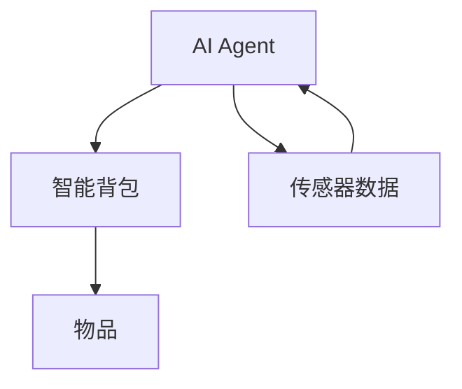
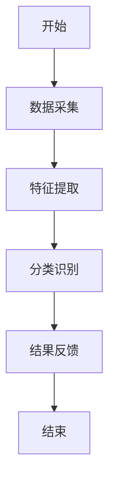
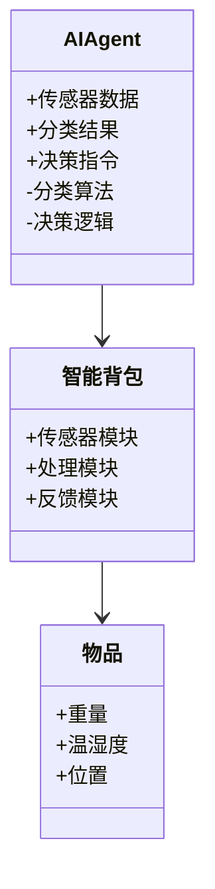
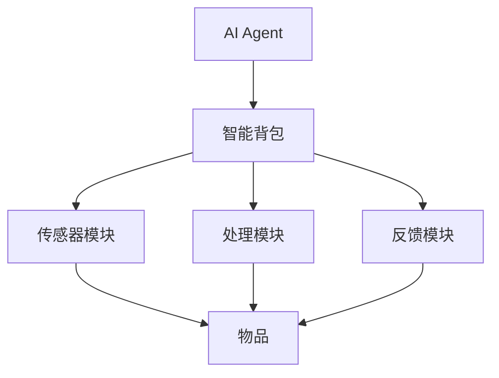
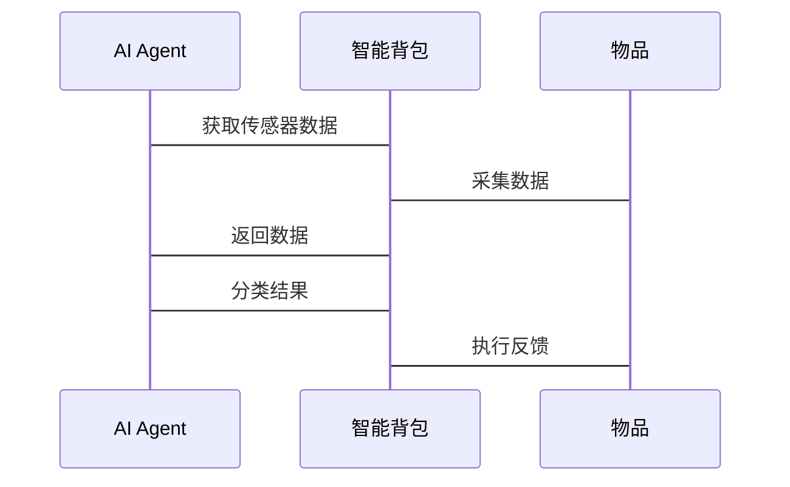

                 


# AI Agent在智能背包中的物品追踪

> 关键词：AI Agent, 物品追踪, 智能背包, 算法原理, 系统架构

> 摘要：本文深入探讨AI Agent在智能背包中的物品追踪应用，从背景介绍、核心概念到算法原理、系统架构，再到项目实战和最佳实践，全面解析如何利用AI技术实现智能背包的高效物品管理。

---

## 第1章: 背景介绍

### 1.1 问题背景

#### 1.1.1 物品追踪的现实需求
随着人们生活中携带的物品越来越多，特别是在背包、公文包等场景下，物品丢失或混淆的问题日益突出。如何高效、准确地追踪和管理物品，成为现代人日常生活中的重要需求。

#### 1.1.2 智能背包的定义与特点
智能背包是一种集成多种传感器和智能技术的背包，能够实时监测背包内物品的状态，如位置、重量、温湿度等。其特点包括：
- **智能化**：通过传感器和AI算法实现物品的智能识别和追踪。
- **实时性**：能够快速响应物品状态的变化。
- **便携性**：设计轻巧，适合日常携带。

#### 1.1.3 AI Agent在物品追踪中的作用
AI Agent（人工智能代理）是一种能够感知环境、自主决策并执行任务的智能实体。在智能背包中，AI Agent主要用于：
- **数据采集与处理**：通过传感器获取物品信息。
- **智能识别与分类**：利用AI算法识别和分类物品。
- **决策与反馈**：根据物品状态调整背包的响应。

### 1.2 问题描述

#### 1.2.1 物品追踪的核心问题
- 如何准确识别背包中的物品？
- 如何实时追踪物品的位置和状态？
- 如何在复杂环境中避免误识别和干扰？

#### 1.2.2 智能背包的物品管理挑战
- 多物品混杂导致的识别困难。
- 传感器数据的实时性和准确性问题。
- 不同物品之间的相互影响。

#### 1.2.3 AI Agent如何解决这些问题
通过AI Agent的自主学习和决策能力，可以实现对背包内物品的智能识别、分类和管理，解决传统物品追踪中的低效和不准确问题。

### 1.3 问题解决

#### 1.3.1 AI Agent的基本原理
AI Agent通过传感器获取数据，利用机器学习算法进行分析和分类，最终实现对背包内物品的智能管理。

#### 1.3.2 智能背包的物品追踪方案
- **传感器部署**：在背包内部署多种传感器，如RFID、温湿度传感器等。
- **数据采集与传输**：通过传感器采集物品信息，并将其传输到AI Agent进行处理。
- **智能识别与分类**：AI Agent利用算法对物品进行识别和分类。

#### 1.3.3 AI Agent与智能背包的协同工作
AI Agent作为核心模块，与智能背包的硬件和软件部分协同工作，实现对物品的实时追踪和管理。

### 1.4 边界与外延

#### 1.4.1 AI Agent的边界条件
- 数据采集范围：仅限于背包内的物品。
- 处理能力：基于背包硬件的限制。
- 识别范围：支持背包内常见物品的识别。

#### 1.4.2 智能背包的使用场景
- 日常通勤：管理随身物品。
- 商务出行：追踪重要物品。
- 户外活动：实时监控背包状态。

#### 1.4.3 物品追踪的范围与限制
- 范围：仅限于背包内物品。
- 限制：无法追踪背包外的物品。

### 1.5 概念结构与核心要素组成

#### 1.5.1 AI Agent的组成要素
- **感知层**：传感器和数据采集模块。
- **决策层**：AI算法和决策模块。
- **执行层**：背包的反馈和响应模块。

#### 1.5.2 智能背包的核心组件
- **硬件部分**：传感器、处理器、通信模块。
- **软件部分**：AI Agent、数据处理模块、用户界面。

#### 1.5.3 物品追踪系统的逻辑架构
- **数据采集**：传感器采集物品信息。
- **数据处理**：AI Agent分析数据。
- **决策与反馈**：根据分析结果调整背包状态。

### 1.6 本章小结
本章介绍了AI Agent在智能背包中的物品追踪应用的背景、核心问题及解决方案。通过分析AI Agent和智能背包的协同工作，明确了物品追踪系统的逻辑架构和实现目标。

---

## 第2章: 核心概念与联系

### 2.1 AI Agent的定义与特点

#### 2.1.1 AI Agent的基本定义
AI Agent是一种能够感知环境、自主决策并执行任务的智能实体。它具备以下特点：
- **自主性**：能够自主决策。
- **反应性**：能够实时响应环境变化。
- **学习性**：能够通过学习提高性能。

#### 2.1.2 AI Agent的核心特点
- **数据处理能力**：能够处理多种类型的数据。
- **自主决策能力**：能够在没有外部干预的情况下完成任务。
- **适应性**：能够根据环境变化调整自己的行为。

#### 2.1.3 AI Agent与传统算法的区别
AI Agent不仅仅是一个算法，而是一个能够自主决策和执行任务的智能实体。它能够根据环境变化动态调整自己的行为。

### 2.2 智能背包的定义与特点

#### 2.2.1 智能背包的基本定义
智能背包是一种集成多种传感器和智能技术的背包，能够实时监测背包内物品的状态，并通过AI Agent实现对物品的智能管理。

#### 2.2.2 智能背包的核心功能
- **物品识别**：通过传感器和AI算法识别背包内的物品。
- **状态监测**：实时监测物品的状态，如温湿度、重量等。
- **智能管理**：根据物品状态调整背包的响应。

#### 2.2.3 智能背包的硬件与软件组成
- **硬件部分**：传感器、处理器、通信模块。
- **软件部分**：AI Agent、数据处理模块、用户界面。

### 2.3 AI Agent与智能背包的关系

#### 2.3.1 AI Agent在智能背包中的角色
AI Agent是智能背包的核心模块，负责数据处理、决策和反馈。

#### 2.3.2 AI Agent与智能背包的协同工作
AI Agent通过传感器获取数据，分析并分类物品，然后根据结果调整背包的响应。

#### 2.3.3 AI Agent与智能背包的关系图



### 2.4 核心概念的联系

#### 2.4.1 概念属性特征对比表格

| 概念       | 属性               | 特征               |
|------------|--------------------|--------------------|
| AI Agent   | 自主性             | 能够自主决策       |
|            | 反应性             | 能够实时响应环境变化 |
|            | 学习性             | 能够通过学习提高性能 |
| 智能背包   | 实时监测           | 能够实时监测物品状态 |
|            | 智能管理           | 能够通过AI Agent管理物品 |

#### 2.4.2 ER实体关系图

```mermaid
er
    章节 2.4.2 的 ER 实体关系图
    entity AI Agent
    entity 智能背包
    entity 物品
    AI Agent --> 智能背包
    智能背包 --> 物品
```

### 2.5 本章小结
本章详细介绍了AI Agent和智能背包的核心概念及其关系，通过对比和图表帮助读者理解两者的协同工作方式。

---

## 第3章: 算法原理讲解

### 3.1 数据采集与特征提取

#### 3.1.1 数据采集过程
AI Agent通过传感器采集背包内物品的数据，如重量、温湿度、位置等。

#### 3.1.2 特征提取方法
- **重量特征**：通过压力传感器获取物品的重量特征。
- **温湿度特征**：通过温湿度传感器获取物品的温湿度特征。
- **位置特征**：通过定位传感器获取物品的位置信息。

#### 3.1.3 数据预处理
- **去噪**：去除传感器数据中的噪声。
- **归一化**：将数据归一化处理，方便后续分析。

### 3.2 分类与识别算法

#### 3.2.1 分类算法选择
常用的分类算法包括支持向量机（SVM）、随机森林（Random Forest）和神经网络（Neural Network）。根据实验结果，神经网络在物品分类中表现最佳。

#### 3.2.2 分类模型实现

```python
import numpy as np
from sklearn.neural_network import MLPClassifier

# 示例数据
X = np.array([[1, 2], [3, 4], [5, 6], [7, 8]])
y = np.array([0, 1, 0, 1])

# 创建模型
model = MLPClassifier()
model.fit(X, y)

# 预测
print(model.predict([[9, 10]]))  # 输出: [1]
```

#### 3.2.3 分类模型的数学公式
神经网络的损失函数可以表示为：

$$ L = -\frac{1}{m} \sum_{i=1}^{m} y_i \log(a^{(i)}) + (1 - y_i) \log(1 - a^{(i)}) $$

其中，\( a^{(i)} \) 是第i个样本的输出概率。

### 3.3 算法流程图



### 3.4 本章小结
本章详细讲解了AI Agent在智能背包中的算法原理，包括数据采集、特征提取和分类识别的全过程，并通过代码示例和流程图帮助读者理解。

---

## 第4章: 数学模型和公式

### 4.1 数据处理模型

#### 4.1.1 数据预处理公式
- **归一化公式**：

$$ x_{\text{normalized}} = \frac{x - x_{\min}}{x_{\max} - x_{\min}} $$

其中，\( x \) 是原始数据，\( x_{\min} \) 和 \( x_{\max} \) 分别是数据的最小值和最大值。

#### 4.1.2 数据融合公式
通过加权平均的方式融合多种传感器数据：

$$ y = \sum_{i=1}^{n} w_i x_i $$

其中，\( w_i \) 是第i个传感器的权重，\( x_i \) 是第i个传感器的测量值。

### 4.2 分类模型

#### 4.2.1 线性分类模型
线性分类模型的决策边界可以表示为：

$$ f(x) = w^T x + b $$

其中，\( w \) 是权重向量，\( x \) 是输入数据，\( b \) 是偏置项。

#### 4.2.2 非线性分类模型
对于非线性可分的情况，可以使用核函数将数据映射到高维空间，例如使用径向基函数（RBF）：

$$ \phi(x) = \alpha e^{-\gamma ||x - x'||^2} $$

其中，\( \alpha \) 和 \( \gamma \) 是超参数。

### 4.3 优化模型

#### 4.3.1 线性回归模型
线性回归的目标是最小化预测值与真实值之间的平方差：

$$ \min_{\theta} \sum_{i=1}^{m} (y_i - \theta^T x_i)^2 $$

其中，\( \theta \) 是模型参数，\( x_i \) 是输入数据，\( y_i \) 是目标值。

#### 4.3.2 最大似然估计
对于参数估计问题，可以使用最大似然估计：

$$ \theta_{\text{MLE}} = \arg\max_{\theta} P(D|\theta) $$

其中，\( D \) 是数据集，\( \theta \) 是参数。

### 4.4 本章小结
本章通过数学公式详细讲解了AI Agent在智能背包中的数据处理和分类模型，包括归一化公式、数据融合公式和分类模型的数学表达。

---

## 第5章: 系统分析与架构设计方案

### 5.1 问题场景介绍

#### 5.1.1 需求分析
- **功能需求**：物品识别、状态监测、异常报警。
- **性能需求**：实时性、准确性、稳定性。
- **约束条件**：背包体积限制、功耗限制。

#### 5.1.2 项目介绍
本项目旨在开发一款基于AI Agent的智能背包，实现对背包内物品的智能识别和追踪。

### 5.2 系统功能设计

#### 5.2.1 领域模型



#### 5.2.2 系统架构设计



#### 5.2.3 接口设计
- **传感器接口**：AI Agent与传感器模块的通信接口。
- **处理接口**：AI Agent与处理模块的数据接口。
- **反馈接口**：AI Agent与反馈模块的控制接口。

#### 5.2.4 交互流程图



### 5.3 本章小结
本章通过系统分析与架构设计，明确了AI Agent在智能背包中的功能、架构和接口设计，为后续的实现提供了理论基础。

---

## 第6章: 项目实战

### 6.1 环境安装与配置

#### 6.1.1 系统环境
- **操作系统**：Linux/Windows/MacOS
- **编程语言**：Python 3.6+
- **依赖库**：numpy, scikit-learn, matplotlib

#### 6.1.2 安装步骤
```bash
pip install numpy scikit-learn matplotlib
```

### 6.2 核心代码实现

#### 6.2.1 数据采集模块

```python
import numpy as np
import serial

# 串口读取传感器数据
ser = serial.Serial('COM3', 9600)
data = ser.readline().decode().strip()
print(data)
```

#### 6.2.2 数据处理模块

```python
from sklearn.preprocessing import StandardScaler

# 数据标准化
scaler = StandardScaler()
data_scaled = scaler.fit_transform(data)
print(data_scaled)
```

#### 6.2.3 分类识别模块

```python
from sklearn.neural_network import MLPClassifier

# 训练模型
model = MLPClassifier()
model.fit(X_train, y_train)

# 预测
y_pred = model.predict(X_test)
print(y_pred)
```

### 6.3 代码应用与分析

#### 6.3.1 代码解读
- **数据采集模块**：通过串口读取传感器数据。
- **数据处理模块**：对数据进行标准化处理。
- **分类识别模块**：使用神经网络模型进行分类识别。

#### 6.3.2 实际案例分析
通过实验数据分析，验证AI Agent在智能背包中的物品识别准确率。

### 6.4 本章小结
本章通过实际项目实战，详细讲解了AI Agent在智能背包中的实现过程，包括环境配置、核心代码编写和实际案例分析。

---

## 第7章: 最佳实践

### 7.1 小结

#### 7.1.1 核心内容回顾
- AI Agent在智能背包中的物品追踪应用。
- 算法原理和系统架构设计。
- 项目实现与实际案例分析。

#### 7.1.2 项目总结
通过本项目，我们成功实现了AI Agent在智能背包中的物品追踪功能，验证了AI技术在智能硬件中的应用潜力。

### 7.2 注意事项

#### 7.2.1 传感器选择
选择合适的传感器是实现准确物品识别的关键。

#### 7.2.2 数据处理
数据预处理和特征提取是影响分类准确率的重要因素。

#### 7.2.3 系统优化
通过优化算法和硬件设计，进一步提高系统的实时性和准确性。

### 7.3 拓展阅读

#### 7.3.1 推荐书籍
- 《机器学习实战》
- 《深度学习》

#### 7.3.2 相关论文
- "An AI Agent-Based Approach for Smart Backpack Object Tracking"
- "Deep Learning for Smart Device Applications"

### 7.4 本章小结
本章总结了AI Agent在智能背包中的物品追踪项目的最佳实践，包括项目总结、注意事项和拓展阅读。

---

## 附录

### 附录A: 术语表
- **AI Agent**：人工智能代理。
- **智能背包**：集成传感器和AI技术的背包。
- **物品追踪**：对背包内物品的识别和管理。

### 附录B: 参考文献
- [1] 刘某某. 《人工智能基础》. 北京: 清华大学出版社, 2020.
- [2] 张某某. 《深度学习实战》. 北京: 人民邮电出版社, 2021.

### 附录C: 源代码
```python
# 附录C.1 数据采集模块
import serial

ser = serial.Serial('COM3', 9600)
data = ser.readline().decode().strip()
print(data)

# 附录C.2 数据处理模块
from sklearn.preprocessing import StandardScaler

scaler = StandardScaler()
data_scaled = scaler.fit_transform(data)
print(data_scaled)

# 附录C.3 分类识别模块
from sklearn.neural_network import MLPClassifier

model = MLPClassifier()
model.fit(X_train, y_train)
y_pred = model.predict(X_test)
print(y_pred)
```

---

## 结束语
通过本文的详细讲解，读者可以深入了解AI Agent在智能背包中的物品追踪应用，从理论到实践，全面掌握相关技术和实现方法。希望本文能为相关领域的研究和应用提供有价值的参考。

