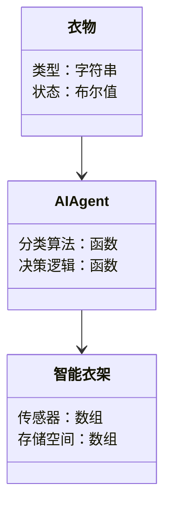
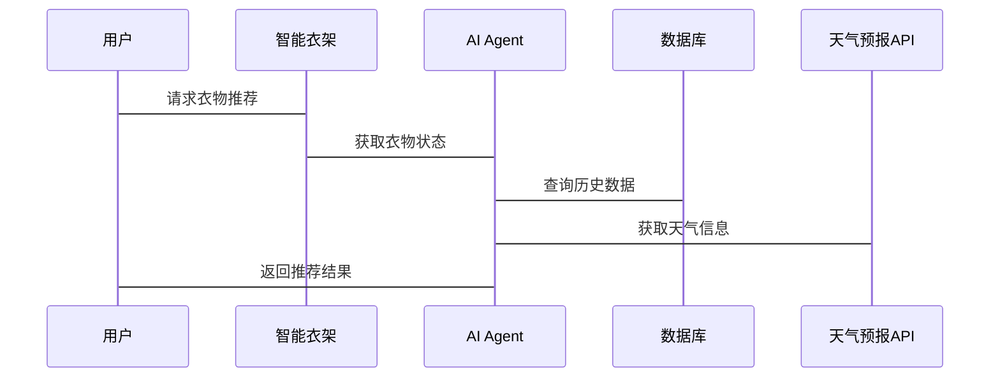

                 


# AI Agent在智能衣架中的季节性衣物管理

## 关键词：AI Agent，智能衣架，季节性衣物管理，物联网，智能系统，数据驱动

## 摘要：  
本文探讨AI Agent在智能衣架中的应用，重点分析其在季节性衣物管理中的作用。通过介绍AI Agent的基本概念、算法原理、系统架构和项目实现，详细阐述如何利用AI技术实现衣物的智能化分类、库存管理和推荐。本文旨在为智能衣架的设计和优化提供理论依据和技术指导，帮助用户更好地管理衣物，提升生活质量。

---

## 第一部分：引言

### 1.1 问题背景与目标

#### 1.1.1 季节性衣物管理的痛点  
现代生活中，季节性衣物的管理是一个常见问题。随着季节变化，用户需要频繁调整衣物的存储和使用，但传统衣架系统无法智能分类和推荐衣物，导致以下痛点：  
1. 衣物分类混乱，查找困难。  
2. 季节性变化无法预测，导致衣物存储效率低下。  
3. 无法根据天气或用户需求主动推荐衣物。  

#### 1.1.2 智能衣架的定义与目标  
智能衣架是一种结合物联网和人工智能技术的智能设备，通过传感器和AI算法实现衣物的智能分类、存储和推荐。其目标是帮助用户高效管理衣物，提升生活质量。  

#### 1.1.3 本书的结构与内容  
本书将从AI Agent的基本概念出发，逐步分析其在智能衣架中的应用，包括算法原理、系统设计和项目实现。通过理论与实践结合，为读者提供全面的技术指导。

---

## 第二部分：AI Agent与智能衣架的核心概念

### 2.1 AI Agent的核心概念

#### 2.1.1 AI Agent的定义与特点  
AI Agent（人工智能代理）是一种能够感知环境、自主决策并执行任务的智能系统。其特点包括：  
- **自主性**：无需人工干预，自主完成任务。  
- **反应性**：能够实时感知环境并做出反应。  
- **目标导向**：基于目标进行决策和优化。  

#### 2.1.2 智能衣架中的AI Agent角色  
在智能衣架中，AI Agent负责处理衣物分类、库存管理和推荐等任务。其核心作用是通过感知环境和用户需求，优化衣物的存储和使用效率。

---

### 2.2 季节性衣物管理的逻辑

#### 2.2.1 衣物分类与存储规则  
季节性衣物的分类基于气温、季节和用户需求。常见的分类规则包括：  
1. 根据气温分组：夏季、冬季等。  
2. 根据使用频率分组：常用和不常用。  

#### 2.2.2 季节性变化的预测方法  
AI Agent通过历史数据和天气预报预测季节性变化，从而优化衣物的存储和推荐。主要预测方法包括：  
- 基于时间序列的预测模型。  
- 基于天气数据的关联分析。  

---

## 第三部分：AI Agent的算法原理

### 3.1 状态识别与决策逻辑

#### 3.1.1 衣物状态的特征提取  
AI Agent通过传感器获取衣物的状态信息，包括：  
- 衣物类型（如衬衫、外套）。  
- 衣物状态（如折叠、悬挂）。  

#### 3.1.2 基于条件概率的决策模型  
AI Agent通过条件概率模型（如朴素贝叶斯）进行决策。其基本公式为：  
$$ P(A|B) = \frac{P(B|A) \cdot P(A)}{P(B)} $$  
其中，$A$为决策目标，$B$为输入条件。  

#### 3.1.3 算法实现流程  
1. 采集衣物状态数据。  
2. 特征提取与数据预处理。  
3. 基于条件概率模型进行分类和决策。  
4. 输出决策结果并执行操作。  

---

### 3.2 算法实现与代码示例

#### 3.2.1 状态识别的Python代码实现  
```python
import numpy as np
from sklearn.naive_bayes import GaussianNB

# 数据预处理
X = np.array([[1, 0], [0, 1], [1, 1]])
y = np.array([0, 1, 2])

# 训练模型
model = GaussianNB()
model.fit(X, y)

# 预测新样本
new_sample = np.array([[1, 0]])
predicted = model.predict(new_sample)
print(predicted)
```

#### 3.2.2 决策逻辑的数学模型与公式  
AI Agent的决策模型基于以下公式：  
$$ P(A|B) = \frac{P(B|A) \cdot P(A)}{P(B)} $$  
其中，$A$为决策目标，$B$为输入条件。

---

## 第四部分：系统分析与架构设计

### 4.1 项目场景与需求分析

#### 4.1.1 问题场景描述  
智能衣架系统需要实时感知衣物状态，根据季节变化优化衣物存储。主要需求包括：  
1. 实时监测衣物状态。  
2. 根据季节变化推荐衣物。  

#### 4.1.2 用户需求与系统目标  
用户需求：  
- 快速查找衣物。  
- 智能推荐衣物。  

系统目标：  
- 实现衣物的智能分类和存储。  
- 提供基于季节变化的衣物推荐服务。  

---

### 4.2 系统功能设计

#### 4.2.1 领域模型（Mermaid类图）  


#### 4.2.2 系统架构设计（Mermaid架构图）  


#### 4.2.3 接口与交互设计（Mermaid序列图）  


---

## 第五部分：项目实战与实现

### 5.1 环境搭建与开发工具

#### 5.1.1 开发环境安装  
- Python 3.8及以上版本  
- Anaconda或虚拟环境  
- 开发工具：VS Code或PyCharm  

#### 5.1.2 工具链配置  
- 数据库：SQLite或MySQL  
- 传感器：模拟传感器或第三方API  

---

### 5.2 核心功能实现

#### 5.2.1 环境安装代码  
```python
# 安装依赖
pip install numpy scikit-learn mermaid4jupyter
```

#### 5.2.2 核心功能代码实现  
```python
import numpy as np
from sklearn.naive_bayes import GaussianNB

# 数据预处理
X = np.array([[1, 0], [0, 1], [1, 1]])
y = np.array([0, 1, 2])

# 训练模型
model = GaussianNB()
model.fit(X, y)

# 预测新样本
new_sample = np.array([[1, 0]])
predicted = model.predict(new_sample)
print(predicted)
```

---

## 第六部分：总结与展望

### 6.1 小结  
AI Agent在智能衣架中的应用为季节性衣物管理提供了高效解决方案。通过实时感知环境和用户需求，AI Agent能够优化衣物的分类、存储和推荐。

### 6.2 注意事项  
- 确保传感器的准确性和稳定性。  
- 定期更新模型以适应用户需求的变化。  

### 6.3 拓展阅读  
- 《机器学习实战》  
- 《物联网开发指南》  

---

以上是《AI Agent在智能衣架中的季节性衣物管理》的完整目录和内容框架。

