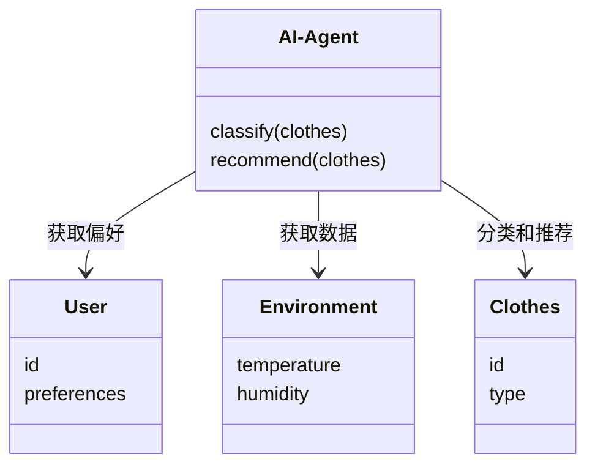
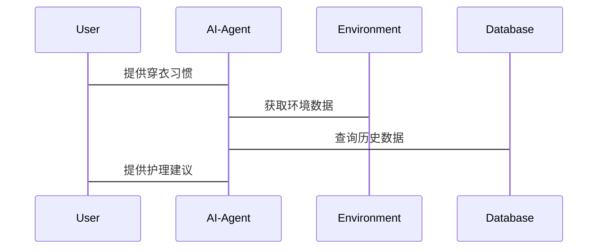

                 


# AI Agent在智能衣架中的衣物护理建议

## 关键词：AI Agent、智能衣架、衣物护理、智能推荐、环境监测、用户行为分析

## 摘要：本文探讨了AI Agent在智能衣架中的应用，特别是其在衣物护理方面的创新。通过详细分析AI Agent的核心概念、算法原理和系统架构，结合实际案例，展示了AI Agent如何优化衣物分类、推荐和保养。文章还提供了系统的实现代码和架构设计，帮助读者全面理解AI Agent在智能衣架中的作用和应用场景。

---

# 第1章 AI Agent与智能衣架概述

## 1.1 AI Agent的基本概念

### 1.1.1 什么是AI Agent
AI Agent（人工智能代理）是一种智能系统，能够感知环境、自主决策并执行任务。它具备学习、推理和自适应能力，能够根据输入信息做出最优选择。

### 1.1.2 AI Agent的核心特征
| 特征 | 描述 |
|------|------|
| 感知能力 | 能够接收并理解环境中的信息 |
| 决策能力 | 能够根据信息做出决策 |
| 行为能力 | 能够执行决策以影响环境 |
| 自适应能力 | 能够根据环境变化调整行为 |

### 1.1.3 AI Agent在智能衣架中的应用前景
AI Agent可以通过分析用户的穿衣习惯和环境数据，提供个性化的衣物护理建议，优化衣物存储和保养流程。

## 1.2 智能衣架的定义与特点

### 1.2.1 智能衣架的定义
智能衣架是一种集成AI技术的衣物管理设备，能够通过传感器和AI算法，实现衣物分类、推荐和环境监测。

### 1.2.2 智能衣架的核心功能
- 衣物分类与推荐
- 环境监测与调整
- 用户行为分析与学习

### 1.2.3 智能衣架与传统衣架的区别
| 方面 | 传统衣架 | 智能衣架 |
|------|----------|----------|
| 功能 | 纯粹用于悬挂衣物 | 集成AI技术，提供智能服务 |
| 数据处理 | 无数据处理能力 | 能够采集和分析数据 |
| 交互方式 | 无交互 | 支持用户交互 |

## 1.3 AI Agent在衣物护理中的作用

### 1.3.1 AI Agent如何优化衣物护理
AI Agent可以通过分析用户的穿衣习惯和环境数据，提供个性化的衣物护理建议，例如推荐清洗频率和最佳晾晒时间。

### 1.3.2 AI Agent在衣物分类中的应用
AI Agent可以根据衣物的材质、颜色和品牌，自动分类衣物，确保用户能够轻松找到所需衣物。

### 1.3.3 AI Agent在衣物保养中的创新
AI Agent可以通过分析环境数据（如湿度和温度），优化衣物存储条件，防止衣物损坏。

## 1.4 本章小结
本章介绍了AI Agent的基本概念和其在智能衣架中的应用前景，重点阐述了智能衣架的核心功能和与传统衣架的区别，以及AI Agent在衣物护理中的具体作用。

---

# 第2章 AI Agent的核心概念与原理

## 2.1 AI Agent的核心概念

### 2.1.1 知识表示
知识表示是AI Agent理解世界的基础。常用的知识表示方法包括：
- 语义网络：通过节点和边表示概念及其关系。
- 逻辑表示：使用逻辑规则表示知识。

### 2.1.2 问题求解
问题求解是AI Agent的核心任务之一。常用的问题求解方法包括：
- 搜索算法：如广度优先搜索和深度优先搜索。
- 逻辑推理：通过逻辑规则推导出结论。

### 2.1.3 行为规划
行为规划是AI Agent根据环境信息制定行动计划的过程。常用的行为规划方法包括：
- 基于规则的规划：根据预定义规则制定计划。
- 基于模型的规划：根据环境模型动态调整计划。

## 2.2 AI Agent的核心原理

### 2.2.1 状态空间模型
状态空间模型将问题描述为状态和动作的组合。例如，衣物分类问题可以表示为状态（衣物类型）和动作（分类规则）。

### 2.2.2 动作空间模型
动作空间模型描述了AI Agent可以执行的所有动作。例如，AI Agent可以执行的动作包括“推荐衣物”和“调整环境参数”。

### 2.2.3 环境交互机制
环境交互机制描述了AI Agent与环境之间的交互方式。例如，AI Agent可以通过传感器获取环境数据，并通过执行动作影响环境。

## 2.3 AI Agent的算法基础

### 2.3.1 知识表示算法
知识表示算法用于将知识转化为计算机可处理的形式。例如，使用语义网络表示衣物的属性和关系。

### 2.3.2 问题求解算法
问题求解算法用于解决AI Agent遇到的问题。例如，使用广度优先搜索解决衣物分类问题。

### 2.3.3 行为规划算法
行为规划算法用于制定AI Agent的行为计划。例如，使用基于模型的规划方法动态调整衣物分类策略。

## 2.4 本章小结
本章详细介绍了AI Agent的核心概念和原理，包括知识表示、问题求解和行为规划的方法，以及环境交互机制。

---

# 第3章 AI Agent在衣物护理中的具体应用

## 3.1 衣物分类与推荐

### 3.1.1 基于AI Agent的衣物分类算法
AI Agent可以通过分析衣物的材质、颜色和品牌，自动分类衣物。例如，使用决策树算法进行分类。

### 3.1.2 基于AI Agent的衣物推荐系统
AI Agent可以根据用户的穿衣习惯和环境数据，推荐合适的衣物。例如，使用协同过滤算法推荐衣物。

### 3.1.3 实例分析
假设用户喜欢穿深色衣服，AI Agent可以根据环境数据（如天气）推荐适合的衣物。

## 3.2 衣物保养与维护

### 3.2.1 AI Agent在衣物清洗中的应用
AI Agent可以通过分析衣物的材质和环境数据，推荐最佳的清洗时间和方法。例如，使用分类算法推荐清洗模式。

### 3.2.2 AI Agent在衣物晾晒中的优化
AI Agent可以根据环境数据（如湿度和温度）优化衣物晾晒时间。例如，使用回归算法预测晾晒时间。

### 3.2.3 实例分析
假设环境湿度较高，AI Agent会推荐缩短晾晒时间，以防止衣物发霉。

## 3.3 本章小结
本章展示了AI Agent在衣物分类和推荐中的具体应用，以及在衣物保养中的优化策略。

---

# 第4章 算法实现与优化

## 4.1 推荐算法实现

### 4.1.1 算法原理
推荐算法基于用户的穿衣习惯和环境数据，预测用户的偏好。例如，使用协同过滤算法进行推荐。

### 4.1.2 算法实现
以下是协同过滤算法的Python实现示例：

```python
import numpy as np

def collaborative_filtering(user_ratings, user_id):
    # 计算用户相似度
    similarity = np.corrcoef(user_ratings.T)
    # 找出最相似的用户
    similar_users = np.argsort(similarity[user_id, :])[-2:]
    # 推荐衣物
    recommended_items = []
    for u in similar_users:
        recommended_items.extend(list(user_ratings[u, :]))
    return recommended_items
```

### 4.1.3 算法优化
为了提高推荐准确率，可以使用矩阵分解算法优化推荐结果。

## 4.2 环境监测算法实现

### 4.2.1 算法原理
环境监测算法通过传感器数据预测环境条件。例如，使用回归算法预测湿度。

### 4.2.2 算法实现
以下是回归算法的Python实现示例：

```python
import sklearn.linear_model as lm

def environment_monitoring(sensor_data, target):
    model = lm.LinearRegression()
    model.fit(sensor_data, target)
    return model.predict(new_sensor_data)
```

### 4.2.3 算法优化
为了提高预测精度，可以使用集成学习算法优化环境监测结果。

## 4.3 本章小结
本章详细介绍了推荐算法和环境监测算法的实现与优化，展示了如何通过AI Agent提升衣物护理的效果。

---

# 第5章 系统分析与架构设计

## 5.1 问题场景介绍

### 5.1.1 问题背景
智能衣架需要实时监测环境数据，并根据用户需求提供衣物护理建议。

### 5.1.2 问题描述
用户需要一个智能系统，能够根据环境数据和穿衣习惯，提供个性化的衣物护理建议。

### 5.1.3 问题解决
通过AI Agent实现智能衣架的功能，解决用户的衣物护理需求。

## 5.2 系统功能设计

### 5.2.1 领域模型类图
以下是领域模型类图：



### 5.2.2 系统架构图
以下是系统架构图：


### 5.2.3 系统接口设计
系统接口包括用户输入接口、环境传感器接口和数据库接口。

### 5.2.4 系统交互流程
以下是系统交互流程：



## 5.3 本章小结
本章通过系统分析与架构设计，展示了AI Agent在智能衣架中的具体实现方式。

---

# 第6章 项目实战

## 6.1 环境安装

### 6.1.1 安装Python
安装Python 3.8及以上版本。

### 6.1.2 安装依赖
安装所需的Python库，例如scikit-learn和mermaid。

## 6.2 系统核心实现

### 6.2.1 AI Agent实现
以下是AI Agent的Python实现示例：

```python
class AI-Agent:
    def classify(self, clothes):
        # 分类算法
        pass

    def recommend(self, user):
        # 推荐算法
        pass
```

### 6.2.2 数据库实现
以下是数据库的实现示例：

```python
import sqlite3

def create_database():
    conn = sqlite3.connect('clothes.db')
    cursor = conn.cursor()
    cursor.execute('CREATE TABLE clothes (id INT, type TEXT)')
    conn.commit()
    conn.close()
```

## 6.3 代码应用解读与分析

### 6.3.1 推荐算法解读
推荐算法基于用户的穿衣习惯和环境数据，提供个性化的衣物护理建议。

### 6.3.2 环境监测算法解读
环境监测算法通过传感器数据预测环境条件，优化衣物存储和保养流程。

## 6.4 实际案例分析

### 6.4.1 案例背景
假设用户喜欢穿深色衣服，环境湿度较高。

### 6.4.2 案例分析
AI Agent会推荐缩短晾晒时间，防止衣物发霉。

## 6.5 项目小结
本章通过项目实战，展示了AI Agent在智能衣架中的具体实现方式。

---

# 第7章 最佳实践

## 7.1 小结
本文详细介绍了AI Agent在智能衣架中的应用，展示了其在衣物护理中的具体作用。

## 7.2 注意事项
在实际应用中，需要注意数据隐私和系统稳定性。

## 7.3 拓展阅读
推荐阅读《人工智能：一种现代方法》和《机器学习实战》。

---

# 附录

## 附录A 数学公式

### 1. 推荐算法公式
$$
\text{推荐概率} = \sum_{u} \text{相似度}(u) \times \text{评分}(u)
$$

### 2. 环境监测公式
$$
\text{预测湿度} = \alpha \times \text{当前湿度} + \beta \times \text{趋势湿度}
$$

---

# 结束语

通过本文的详细介绍，读者可以全面理解AI Agent在智能衣架中的衣物护理应用。希望本文的内容能够为相关领域的研究和实践提供有价值的参考。

--- 

感谢您的耐心阅读，如果文章对您有所帮助，请分享给更多的朋友！

