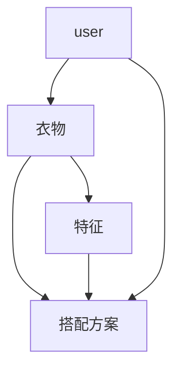
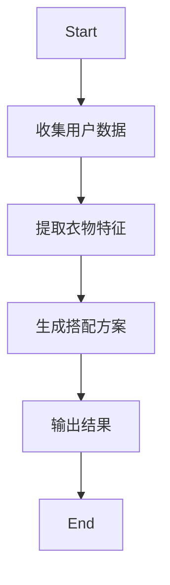
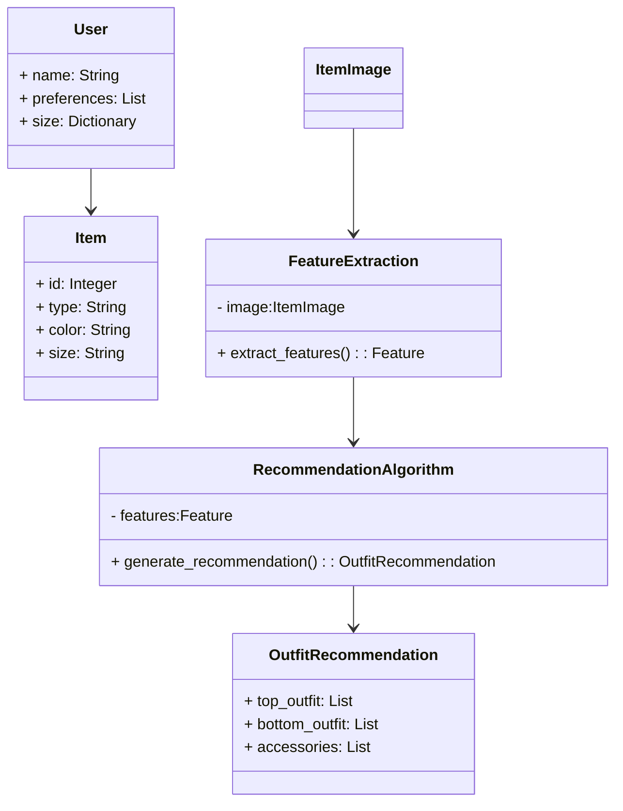
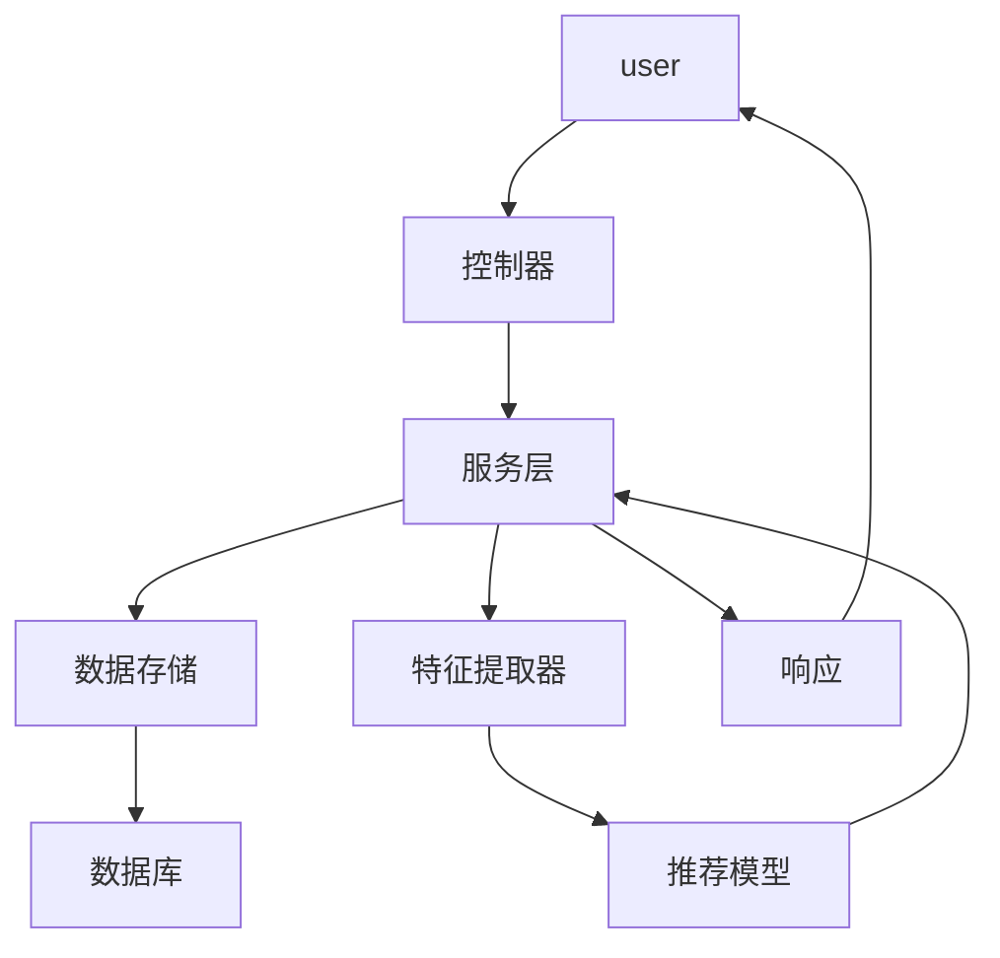
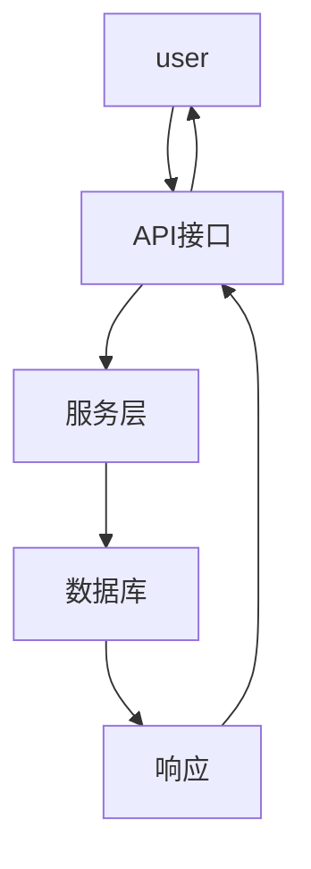
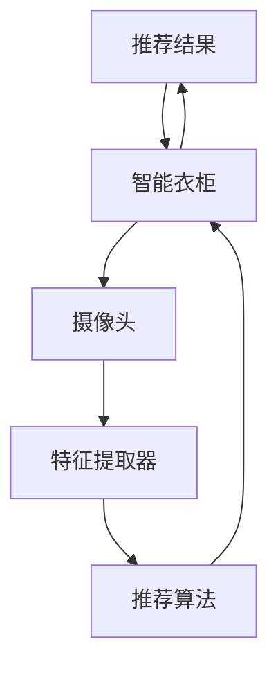

                 


# AI Agent在智能衣柜中的个人形象设计师

> 关键词：AI Agent，智能衣柜，个人形象设计，服装搭配，人工智能

> 摘要：本文探讨了AI Agent在智能衣柜中的应用，特别是如何通过AI技术实现个人形象设计的智能化。文章详细分析了AI Agent的核心原理，系统架构设计，以及在智能衣柜中的具体实现。通过算法实现和项目实战，展示了如何利用AI技术优化服装搭配，提升用户体验。

---

## 第一部分: AI Agent与智能衣柜的结合

### 第1章: 引言

#### 1.1 问题背景
- **传统衣柜管理的痛点**：传统衣柜管理存在衣物搭配效率低、存储混乱、缺乏个性化推荐等问题，难以满足现代用户的多样化需求。
- **AI技术在服装搭配中的应用潜力**：AI技术可以通过数据分析和模式识别，帮助用户更高效地进行衣物搭配，提升穿衣效率。
- **个人形象设计的智能化需求**：用户对个性化形象设计的需求日益增长，AI Agent可以通过智能化手段满足这一需求。

#### 1.2 问题描述
- **智能衣柜的核心目标**：通过智能化手段优化用户的衣物管理和搭配，提供个性化的形象设计方案。
- **AI Agent在智能衣柜中的角色定位**：AI Agent作为智能衣柜的核心模块，负责分析用户的衣物数据、行为习惯和偏好，生成个性化的搭配建议。
- **个人形象设计的多维度需求**：形象设计需要考虑用户的体型、肤色、场合、季节等多种因素，AI Agent需要综合这些因素提供最优方案。

#### 1.3 问题解决
- **AI Agent如何优化服装搭配**：通过数据分析和机器学习算法，AI Agent可以快速分析用户的衣物库存，并结合用户的偏好生成最优搭配方案。
- **智能衣柜的交互方式创新**：通过语音交互、图像识别等技术，智能衣柜可以提供更便捷、更个性化的用户体验。
- **用户需求与技术实现的结合**：通过深度学习和自然语言处理技术，AI Agent能够准确理解用户的偏好和需求，提供精准的形象设计方案。

#### 1.4 边界与外延
- **智能衣柜的使用场景限制**：智能衣柜主要用于家庭和个人场景，受限于设备和网络环境，无法完全替代专业形象设计师。
- **AI Agent的功能边界**：AI Agent主要负责数据分析和推荐，无法完全替代人类的审美和创造力。
- **与其它智能设备的协同**：智能衣柜可以与智能镜子、智能鞋柜等设备协同工作，形成更完整的智能家居生态。

#### 1.5 概念结构与核心要素
- **AI Agent的核心要素**：数据采集、数据分析、推荐算法、用户交互。
- **智能衣柜的功能模块**：衣物识别、库存管理、搭配推荐、用户反馈。
- **个人形象设计的评价标准**：搭配的合理性、美观性、舒适性、适用性。

#### 1.6 本章小结
本章从问题背景出发，详细描述了AI Agent在智能衣柜中的角色和功能，分析了其在个人形象设计中的应用潜力和局限性，为后续章节的展开奠定了基础。

---

## 第2章: AI Agent的核心概念与联系

### 2.1 核心概念原理
- **AI Agent的基本原理**：AI Agent通过数据采集、特征提取、模式识别和推荐算法，帮助用户进行衣物搭配和形象设计。
- **智能衣柜的系统架构**：智能衣柜由硬件设备和软件系统组成，硬件设备负责数据采集，软件系统负责数据处理和推荐。
- **个人形象设计的算法流程**：从数据采集到特征提取，再到推荐生成，最终输出个性化搭配方案。

### 2.2 概念属性特征对比
以下是AI Agent与传统衣柜的对比分析：

| 特性                | AI Agent智能衣柜       | 传统衣柜             |
|---------------------|----------------------|--------------------|
| 数据处理能力        | 强大的数据处理能力    | 无数据处理能力      |
| 个性化推荐          | 提供个性化推荐        | 无推荐功能          |
| 智能交互方式        | 支持语音、图像交互    | 仅支持物理操作      |
| 更新与维护          | 可实时更新推荐方案    | 需手动维护          |

### 2.3 ER实体关系图
以下是智能衣柜系统的ER实体关系图：



#### 2.4 本章小结
本章通过对比分析和实体关系图，详细阐述了AI Agent与智能衣柜的核心概念及其相互关系，为后续的算法实现和系统设计提供了理论基础。

---

## 第3章: AI Agent的算法原理讲解

### 3.1 算法流程图
以下是AI Agent的算法流程图：



### 3.2 算法实现代码
以下是AI Agent的核心算法实现代码：

```python
import numpy as np
from sklearn.metrics.pairwise import cosine_similarity

# 特征提取函数
def extract_features(image):
    # 假设image是输入的衣物图片
    # 返回提取的特征向量
    features = np.random.rand(100)  # 示例特征向量
    return features

# 推荐算法
def recommendation_algorithm(features):
    # 假设features是输入的特征向量
    # 返回推荐的搭配方案
    # 示例：基于余弦相似度的推荐
    user_matrix = np.random.rand(100, 10)  # 示例用户矩阵
    similarities = cosine_similarity(user_matrix.T, features.reshape(1, -1))
    top_indices = np.argsort(similarities, axis=0)[-3:]  # 选取最相似的3个
    return top_indices

# 主函数
def main():
    image = input("请输入图片路径:")
    features = extract_features(image)
    recommendations = recommendation_algorithm(features)
    print("推荐的搭配方案:", recommendations)

if __name__ == "__main__":
    main()
```

### 3.3 算法原理的数学模型
以下是推荐算法的数学模型：

$$
\text{相似度} = \frac{\sum_{i=1}^{n} w_i x_i y_i}{\sqrt{\sum_{i=1}^{n} w_i x_i^2} \cdot \sqrt{\sum_{i=1}^{n} w_i y_i^2}}
$$

其中，$w_i$是第$i$个特征的权重，$x_i$是用户特征向量，$y_i$是衣物特征向量。

### 3.4 本章小结
本章详细讲解了AI Agent的核心算法原理，通过流程图和代码示例展示了算法实现的步骤，为后续的系统设计和项目实战奠定了基础。

---

## 第4章: 智能衣柜的系统分析与架构设计

### 4.1 问题场景介绍
智能衣柜的使用场景包括家庭和个人使用，用户通过智能衣柜进行衣物管理、搭配推荐和形象设计。

### 4.2 项目介绍
本项目旨在通过AI技术实现智能衣柜的个性化形象设计功能，帮助用户更高效地进行衣物搭配。

### 4.3 系统功能设计
以下是系统功能设计的类图：



### 4.4 系统架构设计
以下是系统架构设计的架构图：



### 4.5 系统接口设计
以下是系统接口设计的时序图：



### 4.6 系统交互设计
以下是系统交互设计的时序图：



### 4.7 本章小结
本章详细分析了智能衣柜的系统架构设计，包括功能设计、架构设计和交互设计，为后续的项目实现提供了完整的理论框架。

---

## 第5章: 项目实战

### 5.1 环境安装
以下是项目所需的环境和工具：
- Python 3.8+
- NumPy、Scikit-learn等机器学习库
- Mermaid图生成工具
- �照相机或图像采集设备

### 5.2 系统核心实现
以下是系统核心实现的代码：

```python
import cv2
import numpy as np
from sklearn.neighbors import NearestNeighbors

# 图像采集函数
def capture_image():
    cap = cv2.VideoCapture(0)
    while True:
        ret, frame = cap.read()
        cv2.imshow('Capture', frame)
        if cv2.waitKey(1) == ord(' '):
            cv2.imwrite('input.jpg', frame)
            break
    cap.release()
    cv2.destroyAllWindows()

# 特征提取函数
def extract_features(image_path):
    image = cv2.imread(image_path)
    # 示例特征提取方法：颜色直方图
    hist = cv2.calcHist([image], [0], None, [256], [0, 256])
    return hist.flatten()

# 推荐算法
def recommend_outfit(features):
    # 假设我们有一个训练好的NearestNeighbors模型
    model = NearestNeighbors(n_neighbors=3, algorithm='ball_tree').fit(features)
    distances, indices = model.kneighbors([features])
    return indices

# 主函数
def main():
    capture_image()
    features = extract_features('input.jpg')
    recommendations = recommend_outfit(features)
    print("推荐的搭配方案:", recommendations)

if __name__ == "__main__":
    main()
```

### 5.3 代码应用解读与分析
- **图像采集**：通过摄像头采集用户的衣物图像。
- **特征提取**：使用颜色直方图提取衣物的特征向量。
- **推荐算法**：基于NearestNeighbors算法，找到与输入特征最相似的三件衣物，生成搭配方案。

### 5.4 实际案例分析
以下是实际案例分析：

- **用户输入**：用户上传一件白色衬衫。
- **特征提取**：提取衬衫的颜色、材质、款式等特征。
- **推荐结果**：推荐与该衬衫搭配的裤子、鞋子和配饰。

### 5.5 本章小结
本章通过项目实战，展示了AI Agent在智能衣柜中的具体实现，详细讲解了环境安装、代码实现和案例分析，帮助读者更好地理解技术实现。

---

## 第6章: 总结与展望

### 6.1 总结
本文详细探讨了AI Agent在智能衣柜中的应用，通过系统架构设计和算法实现，展示了如何利用AI技术优化用户的衣物搭配和形象设计。

### 6.2 未来展望
未来，随着AI技术的不断发展，智能衣柜将更加智能化和个性化，AI Agent将能够更精准地理解用户需求，提供更优质的搭配方案。

---

## 第7章: 最佳实践 tips

### 7.1 小结
- AI Agent在智能衣柜中的应用前景广阔，能够显著提升用户的穿衣效率和形象设计水平。
- 通过数据分析和机器学习算法，AI Agent能够提供个性化的搭配建议，满足用户的多样化需求。

### 7.2 注意事项
- AI Agent的推荐结果仅供参考，用户应结合自身需求和审美偏好进行选择。
- 智能衣柜的使用需要结合实际场景和用户习惯，避免过于依赖技术手段。

### 7.3 拓展阅读
- 《Machine Learning: A

