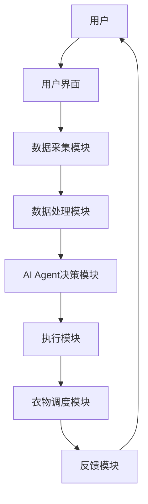
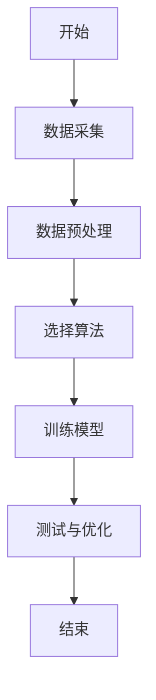
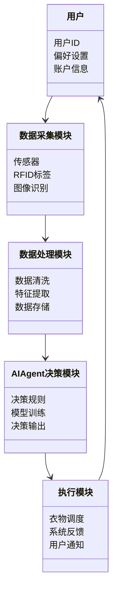
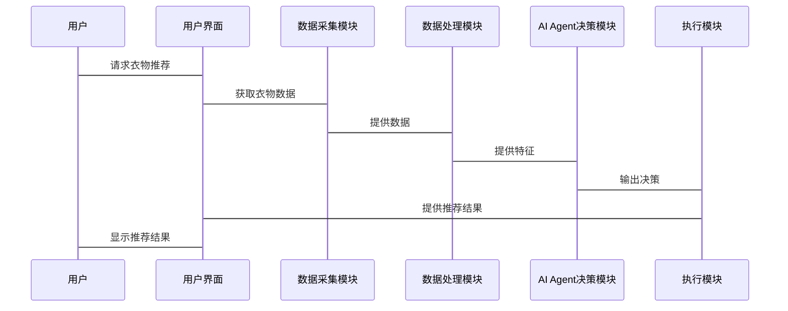

                 


# AI Agent在智能衣柜中的衣物循环使用建议

---

## 关键词

- AI Agent
- 智能衣柜
- 衣物循环使用
- 资源优化
- 可持续发展

---

## 摘要

在现代生活中，衣物资源浪费问题日益严重，而智能衣柜通过结合AI Agent技术，能够实现衣物的智能管理与循环使用。本文从AI Agent的基本原理出发，结合衣物循环使用的实际需求，系统地分析了智能衣柜的核心功能、算法实现、系统架构及实际应用场景。通过详细的技术分析与案例解读，本文提出了基于AI Agent的衣物循环使用优化方案，为智能衣柜的未来发展提供了理论支持与实践指导。

---

# 第一部分: AI Agent在智能衣柜中的背景与概念

## 第1章: AI Agent与智能衣柜的背景介绍

### 1.1 问题背景与描述

#### 1.1.1 衣物资源浪费的现状分析
- 衣物过量购买与闲置问题
- 衣物快速淘汰带来的资源浪费
- 衣物管理效率低下导致的浪费

#### 1.1.2 智能衣柜的定义与特点
- 智能衣柜的定义
- 智能衣柜的核心功能：数据采集、智能推荐、智能调度
- 智能衣柜的优势：高效管理、节能减排、可持续发展

#### 1.1.3 AI Agent在衣物管理中的作用
- AI Agent的定义与核心功能
- AI Agent在衣物管理中的具体应用
- AI Agent如何优化衣物循环使用

### 1.2 问题解决与边界

#### 1.2.1 衣物循环使用的核心问题
- 衣物使用效率低下的原因
- 衣物管理中的资源浪费问题
- 如何通过AI技术优化衣物循环使用

#### 1.2.2 AI Agent的边界与外延
- AI Agent在衣物管理中的功能边界
- AI Agent与其他智能设备的协同边界
- 衣物循环使用的边界条件

#### 1.2.3 智能衣柜系统的功能边界
- 系统功能的范围与限制
- 用户需求与系统功能的匹配
- 边界外的功能处理方式

## 第2章: AI Agent的核心概念与原理

### 2.1 AI Agent的基本原理

#### 2.1.1 AI Agent的定义与分类
- AI Agent的定义
- AI Agent的分类：基于智能水平、应用场景等
- 不同类型AI Agent的特点对比

#### 2.1.2 AI Agent的感知、决策与执行过程
- 感知阶段：数据采集与分析
- 决策阶段：算法选择与优化
- 执行阶段：系统操作与反馈

#### 2.1.3 AI Agent在智能衣柜中的应用场景
- 衣物分类与推荐
- 衣物使用计划的制定
- 衣物维护与保养建议

### 2.2 核心概念对比分析

#### 2.2.1 AI Agent与传统衣柜管理系统的对比
- 功能对比：传统系统与AI Agent系统的差异
- 效率对比：AI Agent带来的效率提升
- 用户体验对比：AI Agent系统的优势

#### 2.2.2 不同AI技术在衣物管理中的应用对比
- 机器学习与深度学习的应用对比
- 自然语言处理与图像识别的应用对比
- 强化学习与其他算法的对比

#### 2.2.3 衣物循环使用的核心概念对比表格
- 表格内容：概念、定义、应用场景、优势对比

## 第3章: 智能衣柜系统的核心要素

### 3.1 系统核心要素组成

#### 3.1.1 用户需求分析
- 用户需求的分类：基本需求、个性化需求
- 用户需求的提取方法：数据采集与分析
- 用户需求的匹配策略

#### 3.1.2 衣物数据采集与处理
- 数据采集方式：传感器、RFID、图像识别
- 数据处理流程：清洗、分类、建模
- 数据存储与管理：数据库设计与优化

#### 3.1.3 AI Agent的决策机制
- 决策规则的制定：基于用户需求、衣物状态、环境因素
- 决策模型的选择：机器学习、规则引擎、混合模型
- 决策结果的优化：动态调整与反馈机制

### 3.2 系统架构与功能模块

#### 3.2.1 系统整体架构图（Mermaid流程图）


#### 3.2.2 功能模块的实体关系图（Mermaid ER图）
```mermaid
erDiagram
    用户 <--- 用户需求 > 用户界面
    数据采集模块 <..> 数据处理模块
    数据处理模块 <..> AI Agent决策模块
    AI Agent决策模块 <..> 执行模块
    执行模块 <..> 衣物调度模块
    衣物调度模块 <--- 反馈 > 用户
```

---

# 第二部分: AI Agent的算法与实现

## 第4章: AI Agent的算法原理

### 4.1 算法原理概述

#### 4.1.1 AI Agent的核心算法选择
- 机器学习算法：随机森林、支持向量机
- 深度学习算法：卷积神经网络、循环神经网络
- 强化学习算法：Q-learning、Deep Q-Network

#### 4.1.2 算法的数学模型与公式
- 机器学习模型：线性回归、逻辑回归
- 强化学习模型：马尔可夫决策过程（MDP）
- 深度学习模型：神经网络的前向传播

#### 4.1.3 算法的实现步骤与流程图（Mermaid）


### 4.2 算法实现代码

#### 4.2.1 环境安装与配置
```bash
pip install numpy scikit-learn
```

#### 4.2.2 核心算法实现（Python代码示例）
```python
import numpy as np
from sklearn.ensemble import RandomForestClassifier

# 数据预处理
X = np.array([...])  # 特征向量
y = np.array([...])  # 标签

# 训练模型
model = RandomForestClassifier()
model.fit(X, y)

# 预测
new_X = np.array([...])
prediction = model.predict(new_X)
print("预测结果:", prediction)
```

#### 4.2.3 代码解读与优化建议
- 代码功能解读
- 优化建议：参数调整、特征选择、模型融合

## 第5章: 数学模型与公式详解

### 5.1 数学模型构建

#### 5.1.1 AI Agent决策模型的构建
- 线性回归模型
  $$ y = \beta_0 + \beta_1 x + \epsilon $$
- 逻辑回归模型
  $$ P(y=1|x) = \frac{e^{\beta_0 + \beta_1 x}}{1 + e^{\beta_0 + \beta_1 x}} $$
- 马尔可夫决策过程（MDP）
  $$ V(s) = \max_a Q(s, a) $$

#### 5.1.2 衣物推荐算法的数学公式（Latex格式）
- 基于协同过滤的推荐公式
  $$ \hat{r}_{u,i} = \bar{r} + \sum_{k=1}^{K} \alpha_k (r_{u,k} - \bar{r}_k) $$
- 基于内容的推荐公式
  $$ sim(i,j) = \frac{\sum_{k=1}^{n} w_k x_{i,k} x_{j,k}}{\sqrt{\sum_{k=1}^{n} w_k^2 x_{i,k}^2} \cdot \sqrt{\sum_{k=1}^{n} w_k^2 x_{j,k}^2}} } $$

#### 5.1.3 算法优化的数学推导
- 梯度下降法
  $$ \theta := \theta - \eta \nabla J(\theta) $$
- 正则化优化
  $$ J(\theta) = \frac{1}{2m} \sum_{i=1}^{m} (y_i - \theta^T x_i)^2 + \lambda \|\theta\|^2 $$

---

# 第三部分: 智能衣柜系统的分析与设计

## 第6章: 智能衣柜系统分析

### 6.1 问题场景介绍

#### 6.1.1 系统应用场景
- 日常衣物管理
- 衣物循环使用优化
- 特殊场景下的衣物调度（如紧急需求）

#### 6.1.2 项目介绍
- 项目目标：优化衣物使用效率，减少资源浪费
- 项目范围：智能衣柜的功能设计与实现
- 项目约束：硬件限制、数据隐私、用户体验

## 第7章: 系统架构设计

### 7.1 系统功能设计（领域模型Mermaid类图）



### 7.2 系统架构设计（Mermaid架构图）


### 7.3 系统接口设计

#### 7.3.1 接口定义
- 用户界面与数据采集模块的接口
- 数据处理模块与AI Agent决策模块的接口
- 执行模块与衣物调度模块的接口

#### 7.3.2 接口实现
- 数据格式与通信协议
- 接口调用与返回机制
- 接口安全性设计

### 7.4 系统交互设计（Mermaid序列图）



---

# 第四部分: 项目实战

## 第8章: 项目实战

### 8.1 环境安装与配置

#### 8.1.1 环境安装
```bash
pip install numpy scikit-learn pandas
```

#### 8.1.2 数据集准备
- 数据来源：用户衣物数据、环境数据
- 数据格式：CSV、JSON
- 数据预处理：清洗、归一化

### 8.2 核心代码实现

#### 8.2.1 数据采集与处理代码
```python
import pandas as pd

# 数据加载
data = pd.read_csv('clothes_data.csv')

# 数据清洗
data.dropna(inplace=True)
data = data[~data.duplicated()]

# 特征提取
features = data[['color', 'size', 'material']]
labels = data['user_preference']
```

#### 8.2.2 AI Agent决策代码
```python
from sklearn.model import RandomForestClassifier

# 模型训练
model = RandomForestClassifier()
model.fit(features, labels)

# 决策输出
new_features = pd.DataFrame([[...]])  # 新衣物特征
prediction = model.predict(new_features)
print("推荐结果:", prediction)
```

#### 8.2.3 系统交互代码
```python
# 用户界面与AI Agent的交互
def get_recommendation(user_input):
    features = preprocess(user_input)
    recommendation = model.predict(features)
    return recommendation

user_input = input("请输入衣物需求：")
recommendation = get_recommendation(user_input)
print("推荐结果：", recommendation)
```

### 8.3 代码解读与优化

#### 8.3.1 代码功能解读
- 数据处理模块的功能
- AI Agent决策模块的实现
- 系统交互模块的逻辑

#### 8.3.2 优化建议
- 数据预处理的优化：特征选择、降维
- 模型优化：超参数调整、模型融合
- 系统性能优化：并行计算、缓存优化

### 8.4 实际案例分析

#### 8.4.1 案例背景
- 用户需求：寻找适合参加重要会议的西装
- 系统响应：基于用户偏好和库存推荐合适的西装

#### 8.4.2 系统实现与分析
- 数据采集：用户需求分析与衣物库存检查
- AI Agent决策：基于机器学习模型的推荐
- 系统输出：推荐结果与用户反馈

### 8.5 项目小结

#### 8.5.1 项目总结
- 项目目标的实现情况
- 项目中的关键点总结
- 项目成果与经验教训

#### 8.5.2 项目优化方向
- 系统功能的扩展
- 算法的优化与改进
- 系统性能的提升

---

# 第五部分: 总结与展望

## 第9章: 总结与展望

### 9.1 系统总结

#### 9.1.1 系统实现总结
- 系统的整体实现情况
- 系统功能的优缺点
- 系统性能的评估

#### 9.1.2 系统创新点总结
- AI Agent技术的应用创新
- 衣物循环使用的新思路
- 系统架构的新设计

### 9.2 未来展望

#### 9.2.1 技术发展展望
- 新型AI技术的应用前景
- 多智能体协同优化的可能性
- 智能衣柜的未来发展

#### 9.2.2 衣物循环使用的新趋势
- 循环经济的新模式
- 环保理念的进一步深化
- 智能衣柜的生态化发展

---

## 最佳实践 tips

- 在AI Agent的训练过程中，建议使用高质量的数据集，并进行充分的交叉验证。
- 系统设计时，建议优先考虑模块化设计，便于后续的功能扩展与维护。
- 项目实现中，建议结合实际情况选择合适的算法，并进行充分的优化与调测。

---

## 小结

通过本文的系统分析与实践，我们全面探讨了AI Agent在智能衣柜中的衣物循环使用优化问题，提出了基于AI技术的解决方案，并通过实际案例验证了系统的可行性和有效性。未来，随着AI技术的不断发展，智能衣柜将在衣物循环使用方面发挥更大的作用，为可持续发展做出重要贡献。

---

## 注意事项

- 在实际应用中，需注意数据隐私保护，确保用户数据的安全性。
- 系统设计时，应充分考虑用户体验，避免功能过于复杂影响使用便捷性。
- 系统维护中，需定期更新模型与算法，确保系统的持续优化与提升。

---

## 拓展阅读

- 《机器学习实战》
- 《深度学习入门：基于Python的理论与实践》
- 《人工智能：一种现代的方法》
- 《智能系统设计与实现》

--- 

通过以上目录大纲，我们可以系统地学习和理解AI Agent在智能衣柜中的衣物循环使用优化问题，并为智能衣柜的未来发展提供理论支持与实践指导。

