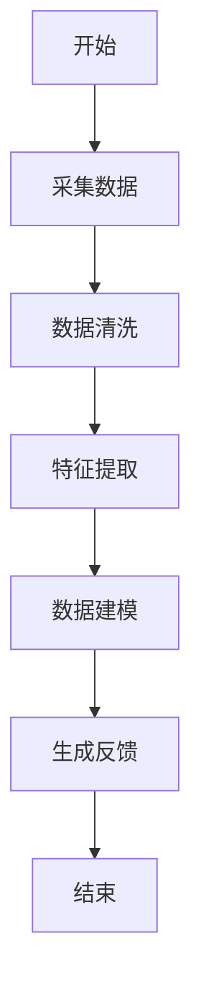

                 


# AI Agent在智能跳绳中的运动数据追踪

## 关键词
- AI Agent
- 智能跳绳
- 运动数据追踪
- 数据采集
- 数据分析
- 个性化反馈

## 摘要
本文详细探讨AI Agent在智能跳绳运动数据追踪中的应用。通过背景介绍、核心概念分析、算法原理讲解、系统设计与实现、项目实战案例及最佳实践，系统性地阐述了如何利用AI技术提升运动数据追踪的准确性和智能化水平，为智能跳绳的设计与优化提供了理论依据和实践指导。

---

# 第1章 背景介绍

## 1.1 问题背景
### 1.1.1 智能跳绳的发展现状
智能跳绳作为一种结合了物联网和人工智能技术的运动设备，近年来发展迅速。它不仅能够记录跳绳次数，还能通过传感器捕捉用户的运动数据，如心率、动作幅度等，为用户提供个性化的运动建议。

### 1.1.2 运动数据追踪的重要性
运动数据追踪是提升运动效果的关键。通过实时捕捉用户的运动数据，AI Agent能够分析用户的运动状态，及时调整训练计划，帮助用户更高效地达成运动目标。

### 1.1.3 AI Agent在运动数据追踪中的作用
AI Agent作为智能跳绳的核心技术，能够实时处理和分析运动数据，提供精准的运动反馈。它不仅能够识别用户的动作，还能预测用户的运动趋势，优化运动计划。

### 1.1.4 概念结构与核心要素组成
智能跳绳系统由硬件和软件两部分组成。硬件包括跳绳、传感器和数据采集模块，软件包括数据处理模块、AI分析模块和用户反馈模块。AI Agent负责协调各模块的工作，实现运动数据的实时追踪和分析。

---

# 第2章 核心概念与联系

## 2.1 AI Agent的原理
### 2.1.1 AI Agent的定义
AI Agent是一种能够感知环境、自主决策并执行任务的智能体。在智能跳绳中，AI Agent通过传感器数据实时感知用户的运动状态，并根据预设算法做出反馈。

### 2.1.2 AI Agent的核心算法
AI Agent的核心算法包括数据采集、数据处理和数据分析三个部分。数据采集算法负责从传感器获取原始数据，数据处理算法对数据进行清洗和特征提取，数据分析算法利用机器学习模型对数据进行建模和预测。

### 2.1.3 AI Agent与运动数据的关系
AI Agent通过处理运动数据，能够识别用户的运动模式，预测运动趋势，并提供个性化的运动建议。运动数据是AI Agent决策的基础，AI Agent则是运动数据追踪的核心驱动力。

## 2.2 运动数据追踪的原理
### 2.2.1 数据采集技术
数据采集技术包括传感器技术和图像识别技术。传感器技术通过加速度计、陀螺仪等设备捕捉用户的运动数据，图像识别技术则通过摄像头捕捉用户的动作细节。

### 2.2.2 数据处理与分析
数据处理包括数据清洗、特征提取和数据转换。数据分析则利用统计分析和机器学习模型，对数据进行建模和预测，生成用户的运动报告。

### 2.2.3 数据可视化与反馈
数据可视化通过图表和图形展示用户的运动数据，用户可以通过可视化界面实时查看运动状态，并根据反馈调整运动计划。

## 2.3 核心概念对比表格
| 对比内容          | AI Agent                     | 传统算法                     |
|-------------------|------------------------------|------------------------------|
| 数据处理能力      | 强，支持实时反馈             | 弱，依赖人工干预             |
| 可扩展性          | 高，支持多种场景             | 低，仅适用于特定场景         |
| 决策能力          | 强，能够自主决策             | 弱，依赖预设规则             |

## 2.4 ER实体关系图
```mermaid
er
  actor: 用户
  smart_rope: 智能跳绳
  sensor_data: 传感器数据
  action_feedback: 运动反馈
  action_pattern: 动作模式
  user_profile: 用户档案

  actor --> smart_rope: 使用
  smart_rope --> sensor_data: 采集
  sensor_data --> action_pattern: 分析
  action_pattern --> action_feedback: 生成
  action_feedback --> user_profile: 更新
```

---

# 第3章 算法原理讲解

## 3.1 算法原理
### 3.1.1 数据采集算法
数据采集算法负责从传感器获取原始数据，并将其传输到数据处理模块。传感器数据包括加速度、角速度、心率等。

### 3.1.2 数据处理算法
数据处理算法对原始数据进行清洗、特征提取和数据转换。清洗过程包括去除噪声和异常值，特征提取则通过傅里叶变换提取频域特征。

### 3.1.3 数据分析算法
数据分析算法利用机器学习模型对数据进行建模和预测。常用算法包括K-近邻、支持向量机和随机森林等。

## 3.2 算法流程图


## 3.3 算法实现代码
```python
import numpy as np
from sklearn.svm import SVC

# 数据采集
def collect_data(sensor):
    return sensor.read_data()

# 数据处理
def process_data(raw_data):
    cleaned_data = raw_data.dropna()
    return cleaned_data

# 数据分析
def analyze_data(cleaned_data):
    model = SVC()
    model.fit(cleaned_data, labels)
    return model.predict(new_data)
```

## 3.4 数学模型与公式
### 3.4.1 数据采集模型
$$ y = f(x) $$
其中，x是原始数据，y是处理后的数据。

### 3.4.2 数据分析模型
$$ P(y|x) = \sum_{i} P(y|x, z_i) P(z_i) $$
其中，z_i是隐变量，表示不同的动作模式。

---

# 第4章 系统分析与架构设计

## 4.1 问题场景介绍
### 4.1.1 智能跳绳的使用场景
用户在使用智能跳绳时，可以通过手机APP实时查看运动数据和反馈。

### 4.1.2 运动数据追踪的场景
AI Agent实时分析用户的运动数据，生成个性化的运动报告。

### 4.1.3 AI Agent的应用场景
AI Agent不仅应用于智能跳绳，还可以扩展到其他运动设备和健康监测领域。

## 4.2 系统功能设计
### 4.2.1 功能模块划分
系统功能模块包括数据采集模块、数据处理模块、数据分析模块和用户反馈模块。

### 4.2.2 功能模块的交互流程
用户开始运动，智能跳绳采集数据，数据传输到处理模块，处理后传输到分析模块，生成反馈并传输到用户端。

## 4.3 系统架构设计
```mermaid
graph TD
    Client --> Broker: 发送数据
    Broker --> Worker1: 处理数据
    Broker --> Worker2: 分析数据
    Worker1 --> Database: 存储数据
    Worker2 --> Output: 生成反馈
```

---

# 第5章 项目实战

## 5.1 环境安装
- 安装Python和必要的库：numpy、pandas、scikit-learn、mermaid。

## 5.2 系统核心实现
### 5.2.1 数据采集代码
```python
import sensor

def main():
    data = collect_data(sensor)
    print("数据采集完成，开始处理...")
    process_data(data)
    print("数据处理完成，开始分析...")
    analyze_data(data)
    print("分析完成，生成反馈...")
```

### 5.2.2 代码解读
- `collect_data`函数负责从传感器获取数据。
- `process_data`函数对数据进行清洗和特征提取。
- `analyze_data`函数利用机器学习模型对数据进行建模和预测。

## 5.3 案例分析
以一个用户为例，记录其跳绳数据，分析其动作模式，并生成个性化的运动反馈。

---

# 第6章 最佳实践、小结、注意事项、拓展阅读

## 6.1 最佳实践
- 定期校准传感器，确保数据准确性。
- 根据用户反馈不断优化算法，提升用户体验。

## 6.2 小结
本文详细探讨了AI Agent在智能跳绳中的应用，从背景、原理到实现，全面介绍了运动数据追踪的技术细节。

## 6.3 注意事项
- 数据安全是关键，确保用户数据不被泄露。
- 系统优化是持续过程，需要根据用户反馈不断改进。

## 6.4 拓展阅读
- 推荐阅读《机器学习实战》和《深入浅出人工智能》等书籍，进一步了解AI技术的应用。

---

通过以上目录，读者可以系统地了解AI Agent在智能跳绳中的应用，从理论到实践，全面掌握运动数据追踪的技术细节。

