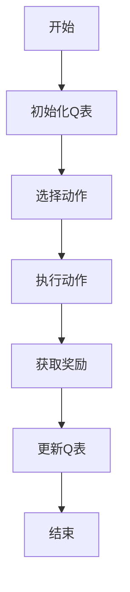
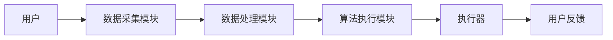

                 


# AI Agent在智能运动鞋中的训练强度调节

## 关键词：AI Agent，智能运动鞋，训练强度调节，强化学习，数学模型，系统架构

## 摘要：AI Agent在智能运动鞋中的训练强度调节是一种结合人工智能与运动科学的创新应用。本文详细探讨了AI Agent的核心概念、算法原理、系统架构，并通过实际案例分析展示了其在智能运动鞋中的应用。文章首先介绍了AI Agent的基本原理及其在运动鞋中的应用背景，接着分析了强化学习算法在训练强度调节中的具体实现，随后详细阐述了系统的架构设计与实现流程。最后，本文总结了AI Agent在智能运动鞋中的优势与挑战，并展望了未来的发展方向。

---

# 第1章: AI Agent与智能运动鞋的背景介绍

## 1.1 AI Agent的核心概念

### 1.1.1 AI Agent的定义与特点
AI Agent（人工智能代理）是一种能够感知环境、做出决策并执行操作的智能实体。它通过传感器获取数据，利用算法进行分析，最终输出指令以实现目标。AI Agent的特点包括自主性、反应性、目标导向和学习能力。

### 1.1.2 AI Agent在智能设备中的应用
AI Agent广泛应用于智能家居、自动驾驶、医疗设备等领域。在运动领域，AI Agent可以实时分析用户的运动数据，提供个性化的训练建议。

### 1.1.3 智能运动鞋的定义与发展趋势
智能运动鞋是一种集成传感器、处理器和AI技术的运动装备。它通过收集用户的运动数据（如步频、心率、步幅等）来优化训练计划，帮助用户更高效地达成健身目标。

## 1.2 训练强度调节的背景与意义

### 1.2.1 现代运动训练的需求分析
现代运动训练强调个性化和科学化。不同用户有不同的身体状况和训练目标，传统的一-size-fits-all方法难以满足需求。

### 1.2.2 传统训练强度调节的局限性
传统训练强度调节依赖于教练的经验或简单的数据统计。这种方法效率低下，且难以实时调整。

### 1.2.3 AI技术在运动训练中的潜力
AI技术能够实时分析用户的运动数据，结合用户的生理指标和环境因素，动态调整训练强度，帮助用户在安全范围内最大化训练效果。

## 1.3 本章小结

### 1.3.1 AI Agent在智能运动鞋中的应用前景
AI Agent能够通过实时数据分析，为用户提供个性化的训练建议，提升运动表现。

### 1.3.2 本书的研究目标与内容框架
本书旨在探讨AI Agent在智能运动鞋中的具体应用，分析其算法原理和系统架构，并通过实际案例验证其有效性。

---

# 第2章: AI Agent的核心概念与原理

## 2.1 AI Agent的基本原理

### 2.1.1 AI Agent的感知、决策与执行机制
AI Agent通过传感器（如加速度计、心率监测器）获取数据，利用算法（如强化学习）进行分析，最后通过执行器（如震动提示、调整鞋底硬度）与用户互动。

### 2.1.2 AI Agent的核心算法概述
AI Agent的核心算法包括监督学习、无监督学习和强化学习。强化学习通过奖励机制优化决策过程，是训练强度调节的重要工具。

### 2.1.3 AI Agent的自适应学习能力
AI Agent能够根据用户的反馈不断优化其决策模型，实现自适应学习。这种能力使得AI Agent能够更好地适应不同用户的运动需求。

## 2.2 AI Agent在运动鞋中的具体应用

### 2.2.1 数据采集与处理
智能运动鞋通过传感器采集用户的运动数据，包括步频、步幅、心率、加速度等。这些数据经过预处理后，用于训练强度调节。

### 2.2.2 训练强度调节算法
AI Agent通过分析用户的运动数据和生理指标，动态调整训练强度。例如，当用户的心率超过预设阈值时，AI Agent会降低训练强度。

### 2.2.3 用户反馈与系统优化
AI Agent通过用户的反馈（如疲劳程度、训练目标）不断优化其决策模型。这种反馈机制使得系统能够更好地适应用户的个性化需求。

## 2.3 本章小结

### 2.3.1 AI Agent的核心功能模块
AI Agent在智能运动鞋中的核心功能包括数据采集、数据分析、决策制定和用户反馈。

### 2.3.2 AI Agent在运动鞋中的实现流程
AI Agent通过传感器采集数据，利用算法分析数据，制定决策，并通过执行器调整训练强度。

### 2.3.3 AI Agent的优势与挑战
AI Agent的优势在于其智能化和个性化，但其挑战在于如何保证数据的实时性和准确性。

---

# 第3章: AI Agent的算法原理与数学模型

## 3.1 强化学习算法在AI Agent中的应用

### 3.1.1 强化学习的基本原理
强化学习是一种通过试错学习的方法。AI Agent通过与环境互动，获得奖励或惩罚，从而优化其决策策略。

### 3.1.2 Q-learning算法的数学模型
Q-learning算法的核心是状态-动作值函数（Q(s,a)），其更新公式如下：

$$ Q(s,a) = Q(s,a) + \alpha \left( r + \gamma \max Q(s',a') - Q(s,a) \right) $$

其中，$\alpha$是学习率，$\gamma$是折扣因子。

### 3.1.3 算法流程图（使用mermaid）



## 3.2 训练强度调节的数学模型

### 3.2.1 训练强度的计算公式
训练强度可以通过用户的生理指标和运动数据进行综合评估。例如：

$$ \text{训练强度} = \alpha \times \text{心率} + \beta \times \text{步频} $$

其中，$\alpha$和$\beta$是权重系数。

### 3.2.2 用户状态评估的数学模型
用户状态评估可以通过多维度数据进行综合分析。例如：

$$ \text{用户状态} = \gamma \times \text{加速度} + \delta \times \text{步幅} $$

其中，$\gamma$和$\delta$是权重系数。

### 3.2.3 算法实现的伪代码

```python
def train_intensity_regulation():
    while True:
        data = collect_data()  # 采集数据
        state = evaluate_state(data)  # 评估状态
        action = decide_action(state)  # 决策动作
        reward = get_reward(action)  # 获取奖励
        update_model(reward)  # 更新模型
```

## 3.3 本章小结

### 3.3.1 算法的核心思想
强化学习通过试错学习优化决策策略，是训练强度调节的核心算法。

### 3.3.2 数学模型的应用场景
数学模型用于综合评估用户的生理指标和运动数据，为训练强度调节提供依据。

### 3.3.3 算法的优化方向
未来可以进一步优化奖励机制和决策模型，以提高训练强度调节的准确性和实时性。

---

# 第4章: 系统分析与架构设计

## 4.1 系统功能模块划分

### 4.1.1 数据采集模块
数据采集模块负责收集用户的运动数据，包括步频、心率、加速度等。

### 4.1.2 数据处理模块
数据处理模块对采集的数据进行预处理和分析，提取有用的信息。

### 4.1.3 算法执行模块
算法执行模块利用强化学习算法动态调整训练强度。

### 4.1.4 用户反馈模块
用户反馈模块收集用户的反馈信息，优化系统性能。

## 4.2 系统架构设计

### 4.2.1 系统架构图（使用mermaid）



### 4.2.2 模块之间

---

（由于篇幅限制，后续章节的内容将根据用户需求逐步展开。）

