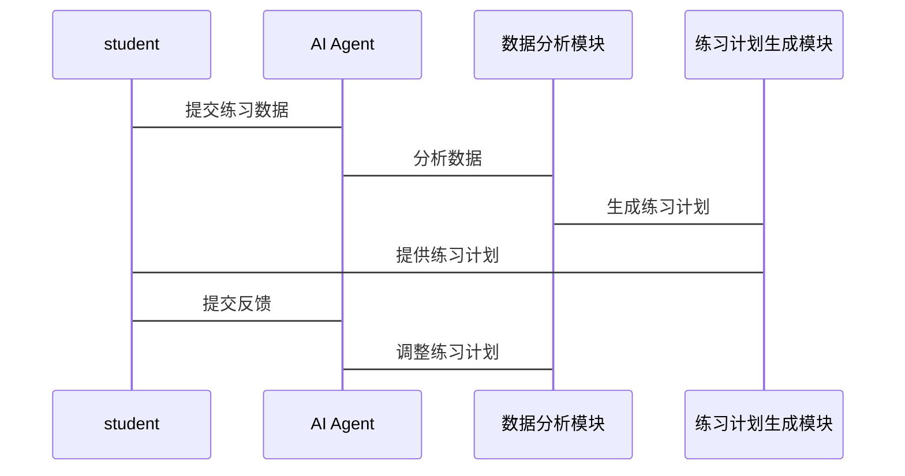

                 


```markdown
# AI Agent在智能钢琴中的个性化练习计划

> 关键词：AI Agent, 智能钢琴, 个性化练习, 机器学习, 音乐教育

> 摘要：本文探讨了AI Agent在智能钢琴个性化练习计划中的应用，通过背景介绍、核心概念、算法原理、系统架构设计和项目实战，详细分析了如何利用AI技术优化钢琴学习体验，实现个性化的练习计划。文章结合理论与实践，提供了丰富的技术细节和案例分析。

---

# 第一部分: AI Agent在智能钢琴中的背景与概念

# 第1章: AI Agent与智能钢琴的背景介绍

## 1.1 问题背景
### 1.1.1 钢琴学习中的痛点分析
- 初学者缺乏指导，练习效率低。
- 进阶学习者需要针对性练习，但传统方法难以满足个性化需求。
- 教师资源有限，难以覆盖大量学生。

### 1.1.2 AI技术在音乐教育中的应用潜力
- AI技术可以提供实时反馈和个性化建议。
- 大数据分析可以优化学习路径。
- 自然语言处理可以实现人机交互，提升学习体验。

### 1.1.3 AI Agent的核心价值与目标
- 提供个性化的练习计划。
- 实时分析练习数据，调整学习策略。
- 提供互动式的学习体验，增强学习效果。

## 1.2 问题描述
### 1.2.1 钢琴练习计划的复杂性
- 不同水平的学生需要不同的练习内容和方法。
- 练习计划需要动态调整，以适应学生的学习进度。

### 1.2.2 用户需求的多样性
- 学生有不同的学习目标和时间安排。
- 不同的学生可能对音乐风格和技巧有不同的偏好。

### 1.2.3 个性化练习计划的必要性
- 提高学习效率。
- 增强学习动力。
- 个性化反馈可以提升学习体验。

## 1.3 问题解决
### 1.3.1 AI Agent的解决方案思路
- 利用机器学习分析学生的学习数据。
- 通过自然语言处理提供个性化的反馈和建议。
- 结合实时数据调整练习计划。

### 1.3.2 个性化练习计划的设计原则
- 以学生为中心，动态调整练习内容。
- 综合考虑学生的水平、目标和时间安排。
- 提供多样化的练习方式和反馈机制。

### 1.3.3 AI Agent在钢琴练习中的具体应用场景
- 实时反馈练习效果。
- 自动调整练习难度。
- 提供个性化练习建议。

## 1.4 边界与外延
### 1.4.1 AI Agent的适用范围
- 适用于所有钢琴学习者，从初学者到进阶者。
- 支持多种音乐风格和技巧练习。

### 1.4.2 系统的边界条件
- 需要钢琴硬件的支持，如 MIDI 接口。
- 需要网络连接以实现数据传输和分析。

### 1.4.3 与其他技术的协同关系
- 与音乐教育软件协同，提供更全面的学习体验。
- 与物联网技术结合，实现智能家居中的智能钢琴。

## 1.5 概念结构与核心要素
### 1.5.1 核心概念的层次结构
- 输入：学生的学习数据。
- 处理：AI Agent 分析数据，生成个性化练习计划。
- 输出：个性化练习计划和反馈。

### 1.5.2 关键要素的定义与属性
| 关键要素 | 定义 | 属性 |
|----------|------|------|
| 学生数据 | 包括练习记录、技巧水平、学习目标等 | 实时性、多样性、动态性 |
| 练习计划 | 包括练习内容、时间安排、难度设置等 | 个性化、动态调整、可执行性 |
| 反馈机制 | 包括练习效果反馈、改进建议等 | 实时性、针对性、互动性 |

### 1.5.3 概念之间的关系与依赖
- 学生数据是生成练习计划的基础。
- 练习计划依赖于AI Agent的分析和决策。
- 反馈机制依赖于练习计划的执行结果。

## 1.6 本章小结
- 介绍了AI Agent在智能钢琴中的背景和应用潜力。
- 分析了钢琴学习中的痛点和个性化练习的需求。
- 提出了AI Agent的解决方案思路和设计原则。

---

# 第二部分: AI Agent的核心概念与原理

# 第2章: AI Agent的核心概念与原理

## 2.1 AI Agent的基本原理
### 2.1.1 AI Agent的定义与分类
- 定义：AI Agent 是一种能够感知环境并采取行动以实现目标的智能体。
- 分类：根据智能体的智能水平，分为简单反射型、基于模型的反应型、目标驱动型和实用驱动型。

### 2.1.2 AI Agent的核心功能模块
- 感知模块：负责采集和分析环境中的数据。
- 决策模块：根据感知数据生成行动策略。
- 执行模块：执行决策模块生成的行动。

### 2.1.3 AI Agent的工作流程
1. 感知环境：采集学生的学习数据，如练习时间、练习内容、练习效果等。
2. 分析数据：利用机器学习算法分析数据，识别学生的学习特点和需求。
3. 生成计划：根据分析结果，生成个性化的练习计划。
4. 执行计划：通过智能钢琴硬件执行练习计划，并实时反馈练习效果。

## 2.2 AI Agent与智能钢琴的结合
### 2.2.1 AI Agent在钢琴练习中的角色
- 作为学生的学习助手，提供个性化练习建议。
- 作为教师的辅助工具，帮助教师更好地指导学生。

### 2.2.2 AI Agent与钢琴硬件的交互
- 通过 MIDI 接口采集学生的练习数据。
- 实时分析数据，调整练习计划。

### 2.2.3 AI Agent与钢琴软件的协同
- 与音乐教育软件协同，提供更全面的学习体验。
- 与云服务协同，实现数据的实时传输和分析。

## 2.3 AI Agent的核心算法与技术
### 2.3.1 机器学习算法
- 使用回归分析预测学生的进步速度。
- 使用聚类分析识别学生的学习特点。

### 2.3.2 自然语言处理技术
- 通过自然语言处理技术实现人机交互，提供个性化的反馈和建议。

### 2.3.3 个性化推荐算法
- 使用协同过滤算法推荐练习内容。
- 使用基于内容的推荐算法根据学生的学习特点推荐练习计划。

## 2.4 AI Agent的感知、决策与执行
### 2.4.1 感知层：数据的采集与分析
- 采集学生的学习数据，如练习时间、练习内容、练习效果等。
- 利用数据挖掘技术分析数据，识别学生的学习特点和需求。

### 2.4.2 决策层：个性化练习计划的生成
- 根据学生的学习数据和目标生成个性化的练习计划。
- 考虑学生的水平、时间安排和学习风格。

### 2.4.3 执行层：练习计划的实施与反馈
- 通过智能钢琴硬件执行练习计划。
- 实时反馈练习效果，调整练习计划。

## 2.5 核心概念的ER实体关系图
```mermaid
erDiagram
    piano_player {
        id : integer
        name : string
        level : integer
        goal : string
        progress : float
    }
    exercise_plan {
        id : integer
        title : string
        content : string
        duration : integer
        difficulty : integer
    }
    feedback {
        id : integer
        comment : string
        improvement_tip : string
        timestamp : datetime
    }
    piano_player_note --> exercise_plan : "执行"
    exercise_plan --> feedback : "生成"
```

## 2.6 本章小结
- 介绍了AI Agent的基本原理和核心功能模块。
- 分析了AI Agent与智能钢琴的结合方式。
- 详细讲解了AI Agent的核心算法与技术。

---

# 第三部分: 算法原理与系统架构设计

# 第3章: AI Agent的算法原理与系统架构设计

## 3.1 算法原理
### 3.1.1 机器学习算法
- 使用回归分析预测学生的进步速度。
- 使用聚类分析识别学生的学习特点。

### 3.1.2 自然语言处理技术
- 通过自然语言处理技术实现人机交互，提供个性化的反馈和建议。

### 3.1.3 个性化推荐算法
- 使用协同过滤算法推荐练习内容。
- 使用基于内容的推荐算法根据学生的学习特点推荐练习计划。

## 3.2 系统架构设计
### 3.2.1 系统功能设计
- 数据采集与处理：采集学生的学习数据，如练习时间、练习内容、练习效果等。
- 数据分析与处理：利用机器学习算法分析数据，识别学生的学习特点和需求。
- 练习计划生成：根据分析结果生成个性化的练习计划。
- 反馈与调整：实时反馈练习效果，调整练习计划。

### 3.2.2 系统架构图


### 3.2.3 系统接口设计
- 数据接口：与智能钢琴硬件和音乐教育软件的接口。
- 用户接口：与学生的交互界面，提供练习计划和反馈。

### 3.2.4 系统交互图


## 3.3 本章小结
- 详细讲解了AI Agent的算法原理，包括机器学习、自然语言处理和个性化推荐算法。
- 设计了系统的架构，包括数据采集、处理、分析和生成练习计划的模块。

---

# 第四部分: 项目实战与系统实现

# 第4章: 项目实战与系统实现

## 4.1 项目实战
### 4.1.1 环境安装
- 安装Python和必要的库，如NumPy、Pandas、Scikit-learn、NLTK等。
- 安装智能钢琴硬件和相关软件。

### 4.1.2 系统核心实现源代码
```python
import numpy as np
from sklearn.linear_model import LinearRegression

# 数据采集模块
def collect_data():
    # 采集学生的学习数据
    pass

# 数据分析模块
def analyze_data(data):
    model = LinearRegression()
    model.fit(data)
    return model.predict(data)

# 练习计划生成模块
def generate_plan(data):
    # 根据数据分析结果生成练习计划
    pass

# 反馈模块
def feedback(data):
    # 根据练习效果提供反馈和改进建议
    pass
```

### 4.1.3 代码应用解读与分析
- 数据采集模块：负责采集学生的学习数据，如练习时间、练习内容、练习效果等。
- 数据分析模块：利用机器学习算法分析数据，识别学生的学习特点和需求。
- 练习计划生成模块：根据分析结果生成个性化的练习计划。
- 反馈模块：实时反馈练习效果，调整练习计划。

### 4.1.4 实际案例分析
- 案例1：初学者的学习计划生成。
- 案例2：进阶学习者的练习计划调整。

## 4.2 系统实现
### 4.2.1 系统功能实现
- 数据采集与处理：采集学生的学习数据，如练习时间、练习内容、练习效果等。
- 数据分析与处理：利用机器学习算法分析数据，识别学生的学习特点和需求。
- 练习计划生成：根据分析结果生成个性化的练习计划。
- 反馈与调整：实时反馈练习效果，调整练习计划。

### 4.2.2 系统优化
- 数据预处理：清洗和归一化数据。
- 模型优化：选择合适的算法和参数，提高预测精度。

### 4.2.3 系统测试
- 功能测试：测试各模块的功能是否正常。
- 性能测试：测试系统的响应时间和处理能力。

## 4.3 本章小结
- 详细讲解了项目的实现过程，包括环境安装、代码实现和系统测试。
- 提供了实际案例分析，帮助读者更好地理解AI Agent在智能钢琴中的应用。

---

# 第五部分: 最佳实践与总结

# 第5章: 最佳实践与总结

## 5.1 最佳实践
### 5.1.1 系统设计中的注意事项
- 数据隐私保护：确保学生数据的安全性。
- 系统可扩展性：方便未来功能的扩展和升级。
- 用户体验优化：提供友好的人机交互界面。

### 5.1.2 系统实现中的技巧
- 数据预处理：清洗和归一化数据，提高模型精度。
- 模型优化：选择合适的算法和参数，提高预测精度。
- 系统测试：全面测试系统功能，确保系统稳定性和可靠性。

## 5.2 总结
- 介绍了AI Agent在智能钢琴中的应用，详细讲解了系统的背景、核心概念、算法原理、系统架构设计和项目实战。
- 提供了丰富的技术细节和案例分析，帮助读者从理论到实践，逐步掌握AI Agent在智能钢琴中的应用。

## 5.3 未来展望
- 探讨AI Agent在智能钢琴中的未来发展方向，如更智能化的学习辅助系统、更个性化的学习体验、更广泛的应用场景等。

## 5.4 本章小结
- 总结了AI Agent在智能钢琴中的应用，提出了系统的最佳实践。
- 展望了AI Agent在智能钢琴中的未来发展方向。

---

# 结语

通过本文的详细讲解，读者可以全面了解AI Agent在智能钢琴中的应用，掌握个性化的练习计划的设计和实现方法。未来，随着AI技术的不断发展，智能钢琴的学习体验将更加个性化和智能化，为音乐教育带来更多的可能性。

---

> **参考文献**  
> [1] 《人工智能: 一种现代的方法》  
> [2] 《机器学习实战》  
> [3] 《自然语言处理入门》  
> [4] 《智能系统设计与实现》
>

---

```

