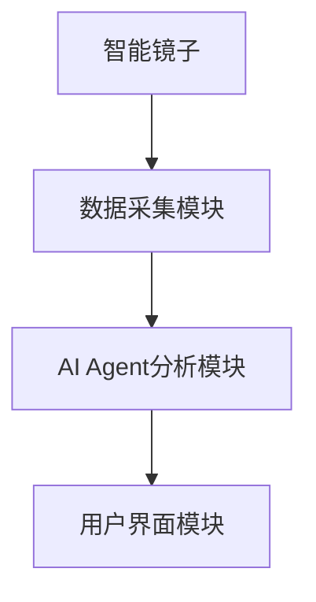
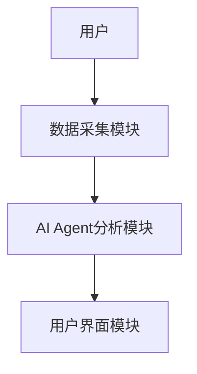

                 


# AI Agent在智能镜子中的每日健康检查系统

> 关键词：AI Agent, 智能镜子, 健康检查, 智能家居, 人工智能

> 摘要：本文详细探讨了AI Agent在智能镜子中的应用，特别是在每日健康检查系统中的实现。通过分析AI Agent的核心原理、算法流程、系统架构以及实际案例，本文为读者提供了一套完整的解决方案，展示了如何利用AI技术提升智能家居中的健康监测能力。

---

# 第一部分: AI Agent在智能镜子中的每日健康检查系统背景介绍

## 第1章: 问题背景与描述

### 1.1 问题背景
#### 1.1.1 当前健康监测技术的发展现状
随着智能设备的普及，健康监测技术逐渐成为人们关注的焦点。传统的健康监测设备多为独立的传感器或手持设备，难以实现全天候的实时监测和智能分析。

#### 1.1.2 智能镜子的市场应用前景
智能镜子作为一种新兴的智能家居设备，结合了显示、语音交互和传感器等多种技术，为用户提供了一种全新的交互方式，同时也为健康监测提供了新的载体。

#### 1.1.3 用户健康数据管理的痛点
用户在日常生活中产生的健康数据分散在不同的设备中，缺乏统一的管理平台，导致数据难以整合和分析，用户也无法获得个性化的健康建议。

### 1.2 问题描述
#### 1.2.1 智能镜子的功能需求
智能镜子需要具备实时监测用户的健康数据（如心率、体温、皮肤状态等）的能力，并通过AI Agent进行数据分析，提供个性化的健康建议。

#### 1.2.2 用户健康数据的实时监测与反馈
用户希望智能镜子能够实时监测健康数据，并通过AI Agent快速反馈健康状况，帮助用户及时调整生活习惯。

#### 1.2.3 系统的边界与外延
系统的边界包括智能镜子的硬件设备、AI Agent的算法模块以及云端数据存储与分析。系统的外延则包括与智能家居其他设备的联动，如智能灯、空调等。

### 1.3 问题解决思路
#### 1.3.1 引入AI Agent的核心原因
AI Agent能够实时分析健康数据，提供智能化的健康建议，同时具备自我学习能力，能够不断优化健康监测的准确性。

#### 1.3.2 AI Agent在智能镜子中的角色定位
AI Agent作为智能镜子的核心模块，负责接收和处理健康数据，分析用户的健康状况，并通过智能镜子的界面向用户反馈结果。

#### 1.3.3 系统的整体解决方案
通过AI Agent与智能镜子的结合，实现用户的健康数据实时监测、智能分析和个性化反馈，同时结合智能家居设备，提供全方位的健康解决方案。

### 1.4 概念结构与核心要素
#### 1.4.1 系统的核心组成模块
- 用户健康数据采集模块：包括心率、体温、皮肤状态等传感器。
- AI Agent分析模块：负责数据的分析和健康评估。
- 智能镜子显示模块：向用户反馈健康状况和建议。

#### 1.4.2 各模块之间的关系与依赖
- 用户健康数据采集模块将数据传输给AI Agent分析模块。
- AI Agent分析模块根据数据生成健康评估报告，并将结果传递给智能镜子显示模块。
- 智能镜子显示模块通过语音或界面的形式向用户反馈健康状况。

#### 1.4.3 系统的输入输出定义
- 输入：用户的健康数据（如心率、体温等）。
- 输出：健康评估报告和个性化健康建议。

### 1.5 本章小结
通过本章的介绍，读者可以了解AI Agent在智能镜子中的应用背景、核心问题以及解决思路，为后续的技术实现奠定基础。

---

# 第二部分: AI Agent与智能镜子的核心原理

## 第2章: AI Agent的基本原理

### 2.1 AI Agent的定义与分类
#### 2.1.1 AI Agent的定义
AI Agent是一种能够感知环境、执行任务并做出决策的智能实体，能够在特定场景下为用户提供智能化服务。

#### 2.1.2 AI Agent的分类
- 简单反射型AI Agent：根据预设规则做出反应。
- 计划推理型AI Agent：具备目标规划和推理能力。
- 学习进化型AI Agent：能够通过学习优化自身行为。

### 2.2 AI Agent的核心算法
#### 2.2.1 机器学习算法
- 监督学习：用于健康数据的分类和预测。
- 无监督学习：用于发现数据中的潜在模式。

#### 2.2.2 自然语言处理技术
- 用于智能镜子与用户之间的语音交互。

#### 2.2.3 视觉识别技术
- 用于分析用户的面部表情和皮肤状态。

### 2.3 AI Agent与智能镜子的结合
#### 2.3.1 数据采集
智能镜子通过内置的传感器采集用户的健康数据，如心率、体温等。

#### 2.3.2 数据分析
AI Agent对采集到的数据进行分析，结合历史数据和用户健康档案，生成健康评估报告。

#### 2.3.3 个性化反馈
AI Agent根据分析结果，通过智能镜子向用户反馈健康建议，如提醒用户喝水、调整作息等。

---

## 第3章: AI Agent与智能镜子的核心原理

### 3.1 AI Agent与智能镜子的交互方式
#### 3.1.1 用户健康数据的采集与传输
智能镜子通过传感器采集用户的健康数据，并通过Wi-Fi或蓝牙传输到AI Agent进行分析。

#### 3.1.2 AI Agent的分析与反馈
AI Agent对健康数据进行分析，生成健康评估报告，并通过智能镜子的语音或界面向用户反馈。

#### 3.1.3 个性化健康建议的生成
AI Agent根据用户的健康数据和生活习惯，生成个性化的健康建议，如运动计划、饮食建议等。

### 3.2 AI Agent在健康数据分析中的优势
#### 3.2.1 数据处理能力
AI Agent能够快速处理大量健康数据，并通过机器学习算法进行预测和分类。

#### 3.2.2 自适应能力
AI Agent能够根据用户的行为和反馈不断优化健康数据分析模型，提供更精准的健康建议。

---

## 第4章: AI Agent在智能镜子中的实现细节

### 4.1 系统架构设计
#### 4.1.1 分层架构
- 数据采集层：负责采集用户的健康数据。
- 数据分析层：AI Agent对数据进行分析和处理。
- 用户界面层：通过智能镜子向用户展示健康评估结果。

#### 4.1.2 模块划分
- 数据采集模块：包括心率传感器、温度传感器等。
- 数据分析模块：AI Agent负责数据的分析和处理。
- 用户界面模块：通过智能镜子的屏幕或语音向用户展示健康建议。

### 4.2 实现流程
#### 4.2.1 数据采集
智能镜子通过内置的传感器采集用户的健康数据，如心率、体温等。

#### 4.2.2 数据分析
AI Agent对采集到的数据进行分析，结合用户的历史健康数据，生成健康评估报告。

#### 4.2.3 用户反馈
通过智能镜子的界面或语音，向用户反馈健康评估结果和个性化建议。

---

## 第5章: AI Agent与智能镜子的结合实现

### 5.1 系统功能设计
#### 5.1.1 健康数据采集
- 心率监测
- 体温监测
- 皮肤状态监测

#### 5.1.2 健康数据分析
- 数据分类与预测
- 健康风险评估

#### 5.1.3 个性化健康建议
- 运动建议
- 饮食建议
- 睡眠建议

### 5.2 系统架构设计
#### 5.2.1 硬件架构
- 智能镜子：包括显示屏、传感器、摄像头等。
- AI Agent：负责数据的分析和处理。

#### 5.2.2 软件架构
- 数据采集模块：负责采集健康数据。
- 数据分析模块：AI Agent对数据进行分析。
- 用户界面模块：通过智能镜子向用户展示结果。

---

## 第6章: AI Agent在智能镜子中的实际应用

### 6.1 实际案例分析
#### 6.1.1 用户A的健康监测
- 用户A的心率数据异常，AI Agent分析后建议用户减少咖啡因摄入。

#### 6.1.2 用户B的健康监测
- 用户B的体温偏高，AI Agent建议用户多喝水并休息。

### 6.2 系统优化建议
#### 6.2.1 数据采集的准确性
- 提高传感器的精度和灵敏度。

#### 6.2.2 系统的稳定性
- 增强AI Agent的自适应能力，确保系统的稳定性。

#### 6.2.3 用户体验的优化
- 提供更直观的用户界面和更自然的语音交互。

---

## 第7章: 总结与展望

### 7.1 项目总结
通过本文的介绍，读者可以全面了解AI Agent在智能镜子中的应用，特别是在每日健康检查系统中的实现。

### 7.2 项目经验与教训
在实际开发过程中，我们发现数据采集的准确性对系统的性能影响较大，因此需要不断优化传感器的精度和算法的准确性。

### 7.3 未来展望
随着AI技术的不断发展，智能镜子的功能将更加智能化和个性化，未来的健康监测系统将更加精准和高效。

---

# 附录

## 附录A: 系统设计图

### A.1 系统架构图


### A.2 数据流图


## 附录B: 关键技术实现

### B.1 机器学习算法
- 使用监督学习算法对健康数据进行分类和预测。

### B.2 自然语言处理技术
- 通过NLP技术实现智能镜子与用户的自然交互。

---

## 附录C: 项目源代码

### C.1 数据采集模块
```python
import sensors

def collect_data():
    heart_rate = sensors.get_heart_rate()
    temperature = sensors.get_temperature()
    return heart_rate, temperature
```

### C.2 数据分析模块
```python
from ml_model import AI_Agent

def analyze_data(data):
    agent = AI_Agent()
    result = agent.predict(data)
    return result
```

### C.3 用户界面模块
```python
def display_result(result):
    print("Your health status:", result)
```

---

通过以上内容，本文详细介绍了AI Agent在智能镜子中的每日健康检查系统的实现，从背景介绍到实际应用，为读者提供了一个全面的解决方案。

